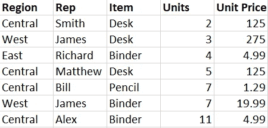
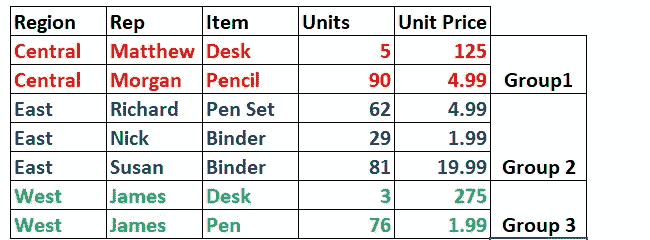
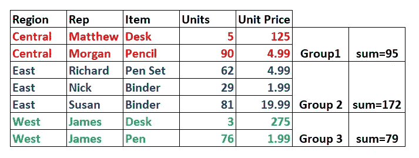
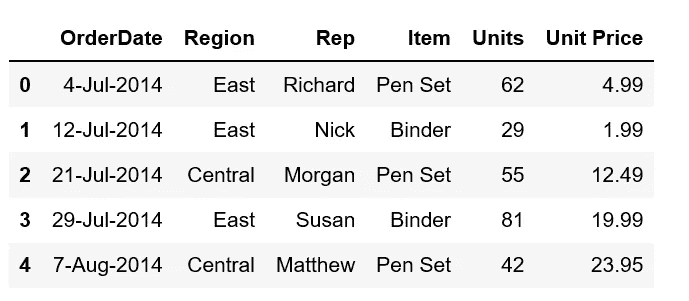
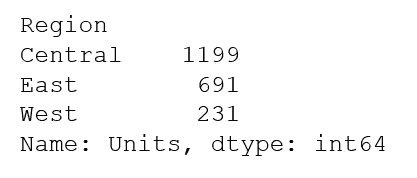
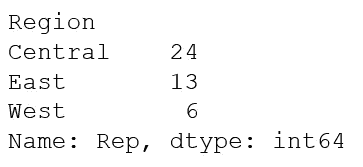

# 探索 Pandas groupby()函数

> 原文：<https://medium.com/analytics-vidhya/exploring-the-pandas-groupby-function-b8c75404fe29?source=collection_archive---------25----------------------->

在真实业务用例的帮助下


亚当·诺瓦克斯基在 [Unsplash](https://unsplash.com?utm_source=medium&utm_medium=referral) 上的照片

当你收到任何新的数据时，你都要尽可能多地做出推论。

> 如果您的数据有性别、年龄组、教育水平等类别，如果您能够分别提取每个类别的见解，这将非常有用。

这样做可以回答如下问题:

1.  学历高工资高吗？
2.  小城镇的房子比城市的便宜吗？
3.  在所有零售商店中，表现最好的商店是哪家？

这就是 GroupBy 增加巨大价值的地方。

Groupby 并不是熊猫独有的。由于它是一个重要的分析工具，它存在于:

1.  MS-Excel:数据透视表形式
2.  r:[*group _ by*](https://www.rdocumentation.org/packages/dplyr/versions/0.7.8/topics/group_by)*函数*
3.  *SQL: group by 子句*

*好了，现在我们清楚了它的重要性，让我们来学习 Groupby 的机制。*

*办公用品公司是一家很受欢迎的文具店，在美国有 11 个销售代表。*

*该区域分为三个区域: ***中部、*** 东部和 ***西部。****

*我们的数据集包含所有三个地区一天内销售的文具产品的信息。*

**

*办公用品数据集*

## ***重要参数***

****by*** :该参数告诉类别将作为不同组的列。*

*在我们的例子中，由于我们是基于地区来探索销售，我们将把参数赋值为*

**by= 'Region'**

## ***机制***

*Groupby 将按以下方式运行:*

1.  ***Split** :首先将数据帧分割成多个类别，如下图:*

**

*分组依据-插图*

*2.**应用:**对每个组应用一个函数。假设我们想计算每个地区的总销售量。在这种情况下，我们将使用 sum()函数。*

*这是后端将发生的情况:*

**

*分组依据-插图*

*正如你所看到的，对于每一组，一个单位的总和是分开的*

*3.**合并:**该步骤将最终输出合并成一个数据帧。*

*是时候深入研究数据集了。打开你的 Jupyter 笔记本，跟着做吧！*

# *入门指南*

*让我们从检查数据样本开始*

```
*import pandas as pd
data=pd.read_csv('OfficeSupplies.csv')
data.head()*
```

**

*让我们找出销售额最高的地区:*

*因为我们只关心售出的单位数量，所以我们将只选择“单位”列:*

```
*data.groupby(by='Region')['Units'].sum()*
```

**

*输出*

*正如我们所看到的，就售出的单位数量而言，**中部**地区的表现优于其他地区。*

***介意深入探究一下为什么吗？***

*让我们看看地区销售人员的数量…*

```
*data.groupby(by='Region')['Rep'].count()*
```

**

*结果*

**有趣的是，报告的最高销售额来自拥有最多销售人员的同一地区。**

*为什么会这样？*

*这是可以解释的。我的假设是，与东部和西部地区相比，中部地区的面积要大得多。*

*。各地区的销售人员比例为 1:2:4*

*。巧合的是，售出的单位也是同样的比例*

*你自己试试！*

*链接到数据集:[https://www.kaggle.com/fmendes/office-supply-sales](https://www.kaggle.com/fmendes/office-supply-sales)*