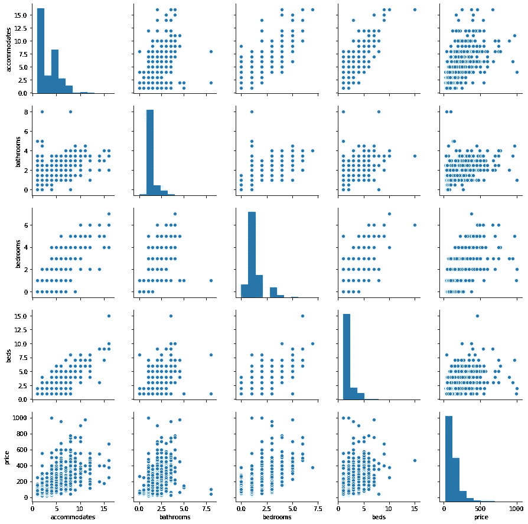

# 探索西雅图 AirBnB 数据集

> 原文：<https://medium.com/analytics-vidhya/exploring-the-seattle-airbnb-dataset-3cb0df7699d3?source=collection_archive---------3----------------------->


在这篇文章中，我将对 Kaggle 上的[西雅图 AirBnb 开放数据做一些探索性的数据分析。](https://www.kaggle.com/airbnb/seattle/kernels)

首先，让我们看看数据集的上下文。根据 Kaggle 数据部分的描述:

> **语境**
> 
> 自 2008 年以来，客人和主人都使用 Airbnb 以一种更独特、更个性化的方式旅行。作为 Airbnb Inside 计划的一部分，该数据集描述了华盛顿州西雅图的寄宿家庭的列表活动。
> 
> **内容**
> 
> 以下 Airbnb 活动包含在西雅图数据集中:*列表，包括完整描述和平均评论分数*评论，包括每个评论者的唯一 id 和详细评论*日历，包括列表 id 和当天的价格和可用性

出于本文的目的，我将专门关注清单数据。

我一直对一个城市如何被分解成不同的街区感兴趣，是什么让这些街区相对于彼此而言是独一无二的。社区将是这篇文章的中心。这是我们分析的 3 个指导性问题:

1.  挂牌价按街坊分布有哪些？
2.  就房产类型而言，这些社区的差异有多大？
3.  我们能多好地预测上市价格？

**挂牌价分配**

首先，让我们看看整个数据集的分布列表价格。


在高端有一些异常值。价格从 20 美元到 1000 美元不等，平均值约为 127.98 美元，标准差为 90.25 美元

```
count    3818.000000
mean      127.976166
std        90.250022
min        20.000000
25%        75.000000
50%       100.000000
75%       150.000000
max      1000.000000
```

这有助于给我们一个整体的前景，但并没有描绘出一幅按社区排列的清单。幸运的是，数据集中有一个“neighbourhood _ cleansed”变量。

我按社区对数据进行了分组，并决定将我的分析重点放在按平均价格衡量的前 10 个最昂贵的社区。我还计算了标准差，以显示价格列表在各自地区的分布情况。


平均价格排名前十的社区

我们看到，东南木兰花和波蒂奇湾是最昂贵的社区，平均上市超过 200 美元。

这些邻域的标准差也很高。数字文本不足以真正建立直觉，所以我用每个邻域的方框图来可视化数据的分布。


这种可视化有助于显示数据中的异常值以及中值标价方面的邻域差异。这让我想知道其他变量，比如房产类型，是如何影响挂牌价格的。我们接下来会看到这一点。

**物业类型如何影响邻近地区的挂牌价格？**

我感兴趣的是如何将房产细节融入到我所发现的社区和标价中。

我想看看我们刚刚分析过的街区的房产类型有多不同。

我们先来看看十大最贵街区不同房产类型的流行程度。


从上面的堆积条形图来看,“房子”和“公寓”房产类型是大多数房源，也最能代表市场上的房源。

我最初的直觉是，一般来说，房子会比公寓贵。正如下面的热图所示，情况确实如此。


h/t to [Alexander Hipp](/datadriveninvestor/a-closer-look-into-the-data-of-seattles-airbnb-market-d9812ea863f5) 获取热图灵感

这种差距在最昂贵的社区——东南方的木兰花和波蒂奇湾——最为明显。这是意料之中的，尽管与其他邻域相比，标准偏差相对较大。

**使用线性回归预测价格**

如果我是一个主机，那么我们的分析到目前为止只帮助给出现有分布的描述。如果我们想要一些更具可操作性的东西，比如确定我们自己的房产应该列在什么清单上，那该怎么办？

转到本次分析的最后一个问题，我们将超越邻居的观点和描述性统计的范围来预测上市价格。

我的模型包括与主机相关的变量，如列表数、评论数和评论评级。


使用[的 pair plot Seaborn](https://seaborn.pydata.org/generated/seaborn.pairplot.html)

如果一个评论者每月有很多评论，那么价格往往会更低。得分最低的主机也在列表价格的低端。

我还拥有更全面的物业详细信息组合，其中包含床的数量、浴室和物业可以容纳的人数等变量。



我很惊讶在价格和这些变量之间看不到更多的线性关系。其他变量之间的共线性比上市价格之间的共线性更强。

继续构建模型，我将数据集分成训练和测试子集，然后创建一个线性模型来预测标价。

一位 [Kaggle 用户](https://www.kaggle.com/yifanma/predicting-listing-prices)分享了一个有趣的数据可视化，描述了针对训练和测试数据的模型结果，所以我复制了它用于我的分析。


我惊讶地发现，就 r 平方得分而言，我的模型在测试数据上的表现比训练数据稍好。这可能是因为异常值在训练数据集中表现得更多。我回头看了一下训练/测试分割，发现数据集中的最大值，一个 1000 美元的列表，确实在训练分割中。可以探索其他选项，如[交叉验证](https://machinelearningmastery.com/k-fold-cross-validation/)。


我的线性模型在测试数据上的 r 平方得分在 1146 个值上约为 0.59。

该模型的均方根误差为 3，446.62，与 r 平方值一起表明该模型可以改进，而不一定导致过度拟合。

这种改进可以通过纳入其他未分析的变量或对现有变量进行一些额外的数据争论来实现。

**结论**

希望你喜欢这个西雅图社区和 Airbnb 列表的数据漫游！

如果你想更深入地了解我是如何得出这些发现的，那么你可以前往我的 [Github](https://github.com/taylorplumer/seattle-airbnb) 。