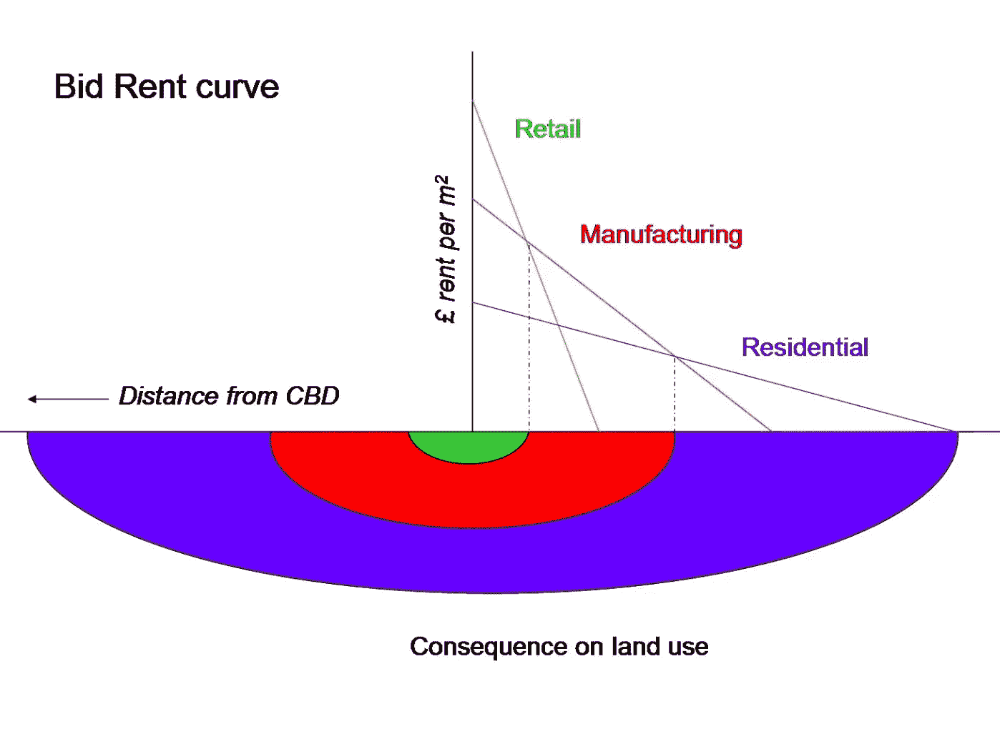
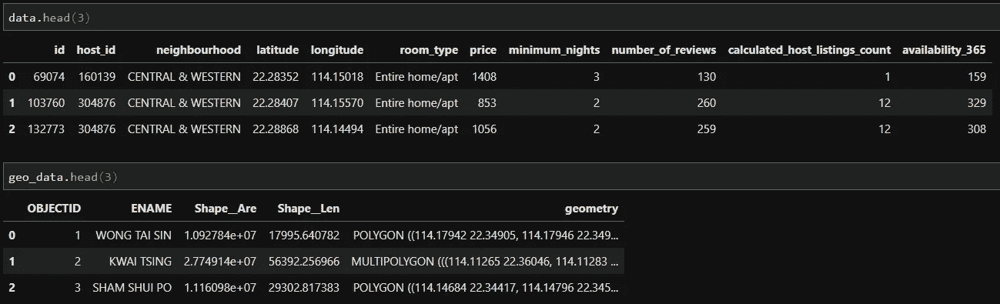
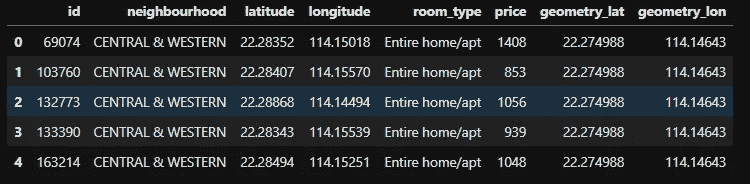
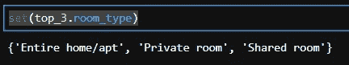
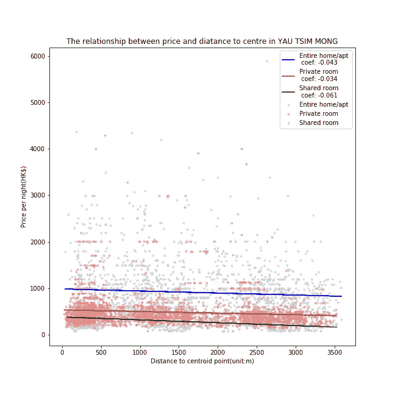

# 探索香港 Airbnb 房源的空间分布，第二部分

> 原文：<https://medium.com/analytics-vidhya/exploring-the-spatial-distribution-of-airbnb-listings-in-hong-kong-5e10e1b8fe30?source=collection_archive---------21----------------------->

第 2 条:从 Airbnb 房源的角度来审视竞价租金理论



投标租金曲线

# 介绍

如前述文章所述，城市土地利用学科的标志性研究案例之一——竞租理论，是由 William Alonso 设计并于 1964 年发表的，基本上解释了当与假设的中央商务区(CBD)的距离发生变化时，价格与土地需求之间的关系，竞租理论的原理是，离城市中心区越远，土地租金越低，这是基于 von Thunen 城市土地利用模型(Alonso，1964)的扩展。

为了检验竞租理论，本文从共享经济住宿的角度出发，对数据进行预处理，建立模型，然后试图找出房价与离研究区域中心点的距离之间的关系，验证竞租理论建立并给出的假设。

# Dara 预处理

在将数据拟合到模型中之前，必须处理数据，为下一步保留有用的数据部分。

```
# import the libraries need to be used
import pandas as pd
import numpy as np
import matplotlib
import matplotlib.pyplot as plt
import seaborn as sns
import geopandas as gpd
%matplotlib inline
```

然后，根据上一篇文章的结果，由于油尖旺、中西区和湾仔区可提供超过 2000 个宿位，为我们的研究提供了足够大的样本，因此，我们检索了这三个区的数据。

```
# import the data processed and used by last article
data = pd.read_csv("HK/top3.csv").drop('Unnamed: 0', axis = 1)geo_data  = gpd.read_file("HK/Hong_Kong_18_Districts/Hong_Kong_18_Districts.shp").drop('TCNAME', axis = 1)
```

使用`head()`查看导入的数据。



我们在数据中发现了一些不必要的列，并删除了价格的极值，所以删除它们:

```
# Filter out extremely high price and drop some useless columns
data = data[data.price <= 	     6000].drop(['host_id','minimum_nights','number_of_reviews'                ,'calculated_host_listings_count','availability_365'], axis = 1)geo_data = geo_data.drop(['OBJECTID','Shape__Are','Shape__Len'], axis = 1)
```

> 现在，我们应该做两件事，首先是定位每个区域的中心点，其次是计算每个主机与其对应中心点之间的距离:

> **各区中心点:**

对于中心点，在这里，根据我的经验，我将假设半岛酒店、中环广场和汇丰银行大厦分别是 YAU TSIM 旺角、湾仔和中西区的中心点，因此从谷歌地图获得质心坐标。

```
geo_data.loc[geo_data.ENAME == 'YAU TSIM MONG',"geometry_lat"] = 22.295062
geo_data.loc[geo_data.ENAME == 'YAU TSIM MONG',"geometry_lon"] = 114.171865
geo_data.loc[geo_data.ENAME == 'WAN CHAI',"geometry_lat"] = 22.280025 
geo_data.loc[geo_data.ENAME == 'WAN CHAI',"geometry_lon"] = 114.173477
geo_data.loc[geo_data.ENAME == 'CENTRAL & WESTERN',"geometry_lat"] = 22.280641
geo_data.loc[geo_data.ENAME == 'CENTRAL & WESTERN',"geometry_lon"] = 114.159040
```

> **主机到中心点的距离:**

在我们计算两个纬度/经度坐标之间的距离之前，我们必须将数据与 geo_data 合并在一起，结合主机位置和中心点。

```
# Merge two data frames into one data frame
top_3 = pd.merge(data, geo_data, how='inner', left_on='neighbourhood', right_on='ENAME').drop(['ENAME',], axis = 1).drop(['geometry'], axis=1)
top_3.head()
```



合并数据的标题行

然后，我们导入`geopy`库来计算距离:

```
import geopy.distance
```

这里需要注意的是，计算距离的算法通常有两种:大圆法和测地线法，对于大圆，它是基于球面计算大圆距离，而测地线是基于椭球面计算距离。

一般来说，测地距离的算法比大圆算法更精确，因为地球表面实际上是一个椭球体，而不是人类期望的球体。然而，在我们的案例中，由于我们研究区域的尺度，使用不同距离算法的差异并不重要，因此，在这里，我将展示两种方法的解决方案，但仅使用测地线距离来表示距离。

```
# Using two different algorithm to calculate distance
top_3['distance_geodesic'] = top_3.apply(
    (lambda row: geopy.distance.geodesic(
        (row['latitude'], row['longitude']),
        (row['geometry_lat'], row['geometry_lon'])
    ).m),
    axis=1
)top_3['distance_great_circle'] = top_3.apply(
    (lambda row: geopy.distance.great_circle(
        (row['latitude'], row['longitude']),
        (row['geometry_lat'], row['geometry_lon'])
    ).m),
    axis=1
)
```

# **线性模型**

首先，我们导入我们需要的库:

```
# Import the libraries of linear regression
from sklearn.linear_model import LinearRegression
from sklearn import metrics
```

因为 Airbnb 住宿的类型不同可能会影响价格，所以我们要针对自己的房型进行数据的划分和拟合。提取所有房间类型:

```
# Find out all unique values of room_type
set(top_3.room_type)
```



显然，整个家庭/公寓总共有三种房间类型，私人房间和共用房间。

为了拟合线性模型并得出关系，这里，我将使用 YAU TSIM 旺区作为示范，该区包含最大的人口 4698 个实例:

```
# Extract the data of YAU TSIM MONG
yau = top_3[top_3.neighbourhood == 'YAU TSIM MONG']# Divide the data by their room types
yau_en = yau[yau.room_type == 'Entire home/apt']
yau_pr = yau[yau.room_type == 'Private room']
yau_sh = yau[yau.room_type == 'Shared room']
```

这里，我们以 YAU TSIM 蒙的整个住宅/公寓为例:

```
# Define the X and Y, and then fit them into linear model
x1 = yau_en[['distance_geodesic']]
y1 = yau_en[['price']]
model = LinearRegression()
model.fit(x1,y1)# Get the predicted y from trained model
yau_en_pred = model.predict(x1)
```

对其他房间类型以及其他两个区域重复上述代码。

YAU TSIM 蒙的包房:

```
x2 = yau_pr[['distance_geodesic']]
y2 = yau_pr[['price']]
model = LinearRegression()
model.fit(x2,y2)yau_pr_pred = model.predict(x2)
```

YAU TSIM 蒙合租房间:

```
x3 = yau_sh[['distance_geodesic']]
y3 = yau_sh[['price']]
model = LinearRegression()
model.fit(x3,y3)yau_sh_pred = model.predict(x3)
```

最后，绘制所有数据点以及通过线性回归拟合的直线:

```
# Plot outputs
plt.figure(figsize=(9,9))plt.scatter(yau_en.distance_geodesic, yau_en.price, marker = '.', color = 'lightsteelblue', alpha = 0.5 ,label = 'Entire home/apt')
plt.scatter(yau_pr.distance_geodesic, yau_pr.price, marker = '.', color = 'lightcoral', alpha = 0.5, label ='Private room')
plt.scatter(yau_sh.distance_geodesic, yau_sh.price, marker = '.', color = 'lightgreen', alpha = 0.5, label ='Shared room')plt.plot(x1, yau_en_pred, color = 'blue', label ='Entire home/apt \n coef: 0.118')
plt.plot(x2, yau_pr_pred, color = 'red', label ='Private room \n coef: -0.026')
plt.plot(x3, yau_sh_pred, color = 'darkgreen', label ='Shared room \n coef: 0.070')plt.gca().set_xlabel('Distance to centroid point(unit:m)')
plt.gca().set_ylabel('Price per night(HK$)')
plt.legend()
plt.title('The relationship between price and diatance to centre in YAU TSIM MONG')
plt.show()
```



价格与中心距离关系的折线图和散点图

# 分析和讨论

参考上面显示的图，我们可以发现一些有趣的事情，例如，关于整个住宅/公寓的类型以及蓝色线和浅蓝色数据点，很明显整个住宅/公寓的价格高于其他两种类型的房间，符合我们的预期。

对于分别具有红色和绿色线和点的私人房间和共享房间，它们之间的差异与整个住宅/公寓的差异相比较小，这表明这些类型的房间可能是住宿花费较少的低收入游客的优先选择，尤其是共享房间。

总的来说，在这种情况下，我们可以看到所有 Airbnb 住宿的价格都随着到中心点的距离而下降，呈现出略负的趋势，符合 Bid-Rent 理论的假设。此外，在该图中，该线相当平滑，因此我们可以说价格以系数-0.043、-0.034 和-0.061 缓慢下降，这告诉我们距离可能对价格只有微小的影响。其实影响房价的因素是多方面的，包括附近的基础设施、公共交通、服务、点评、装修等等。

# 结论

为了验证竞租理论，本文通过一个简单的线性回归模型揭示了房源价格与其到主观中心点的距离之间的关系，从竞租模型的角度论证了共享经济的住宿价格也可能遵循住宅价格的模式。

然而，到中心点的距离并不是影响价格的唯一因素，其他因素也可能对 Airbnb 的价格设定产生巨大影响，训练模型的 R 平方值非常小，因此只有很小一部分价格可以通过距离，即输入数据来解释。

参考:

w .阿隆索(1964)。位置和土地使用。走向地租的一般理论。*位置和土地用途。走向地租的一般理论。*

> 我之前的文章:

[](/@zidongyu26/exploring-the-spatial-distribution-of-airbnb-listings-in-hong-kong-816a3f56aa2c) [## 探索香港 Airbnb 房源的空间分布

### 第 1 篇:基本的探索性数据分析

medium.com](/@zidongyu26/exploring-the-spatial-distribution-of-airbnb-listings-in-hong-kong-816a3f56aa2c) 

> 对于下一篇文章:

老实说，我现在有点忙，所以下一篇文章可能会在一月下旬开始。