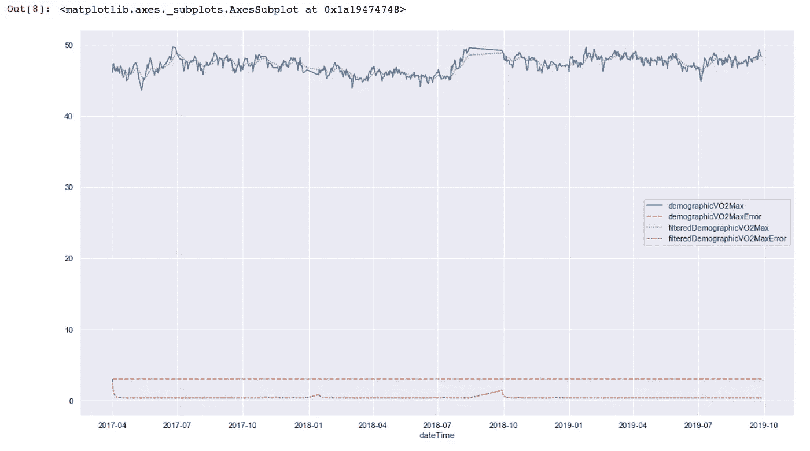

# 探索 FitBit 心脏健康数据的趋势

> 原文：<https://medium.com/analytics-vidhya/exploring-trending-with-fitbit-heart-health-data-5765768110a9?source=collection_archive---------17----------------------->

> 这是在 Jupyter Notebook 中用 Python、Pandas 和 Seaborn 探索您的 [FitBit 睡眠数据的继续，该书介绍了 FitBit 数据存档的整体情况以及将其放入绘图的基本知识。如果你想从头开始，就从那里开始。我还会指出我在那篇文章中讨论过的地方。](/analytics-vidhya/exploring-your-fitbit-sleep-data-with-python-pandas-and-seaborn-in-jupyter-notebook-a997f17c3a42)

# 介绍

对于这篇文章，我们的目标是拟合 FitBit 所谓的“心脏健康”数据。FitBit 所谓的“心脏健康”实际上是 FitBit 对 [VO2 max](https://en.wikipedia.org/wiki/VO2_max) 的最佳猜测——一种对身体吸收氧气能力的测量。我认为这个数字真的很酷，因为它基本上是一个在任何给定时间我的健身制度有多有效的代理测量。

FitBit 应用程序静态显示这个数字，没有任何历史或趋势。我想看看这个数字是如何随着时间的推移而变化的，以及它是呈上升趋势还是下降趋势。这可以给我预警，告诉我什么时候该离开沙发，或者只是提供一些额外的动力来保持活跃。不管是哪种方式，看看它们之间的关系，并与其他健康指标进行比较，都是很酷的事情。

# 加载并处理数据帧

第一步是确定正确的数据，并将其放入数据框架中。我们感兴趣的数据存在于归档导出的两种文件中:

*   人口统计 _vo2_max-yyyy-mm-dd.json
*   run_vo2_max-yyyy-mm-dd.json

run_vo2_max 比 demographic_vo2_max 更准确，但它只在你用 FitBit 记录跑步时才会被记录下来——我不常这样做。demographic_vo2_max 不太准确，但它是在您每天佩戴 FitBit 时计算的，与您的活动无关。我将使用 demographic_v2_max 获得更可靠的数据集。如果你定期记录跑步，无论如何，使用 run_vo2_max。

首先，将这些文件放到它们自己的文件夹中，这样我们就可以很容易地将它们连接成一个数据帧。

```
!mkdir vo2_max_data
!cp LoganHennessy/user-site-export/demographic_vo2_max* vo2_max_data/
```

和前面的分析一样，一旦数据进入它自己的文件夹，我们可以使用简单的 for-loop 和 Pandas `concat()`函数加载数据。

```
import os
import pandas as pddfs = []
for file in os.listdir("vo2_max_data"):
    dfs.append(pd.read_json(f"vo2_max_data/{file}"))
df = pd.concat(dfs)
```

我们感兴趣的数据又一次被加载为 JSON 对象，这使得我们很难访问我们想要的字段。

首先看一下第一个值，理解 JSON 对象是如何构造的。我们感兴趣的数据存储在一个统称为`value`的列中。

```
In [2]: df.iloc[0].value
Out[2]: {'demographicVO2Max': 47.60661,
         'demographicVO2MaxError': 3.0,
         'filteredDemographicVO2Max': 47.08661000000001,
         'filteredDemographicVO2MaxError': 0.36310000000000003}
```

只有四个字段，让我们将它们解析到各自的列中。

```
df["demographicVO2Max"] = df.value.apply(lambda val: val["demographicVO2Max"])
df["demographicVO2MaxError"] = df.value.apply(lambda val: val["demographicVO2MaxError"])
df["filteredDemographicVO2Max"] = df.value.apply(lambda val: val["filteredDemographicVO2Max"])
df["filteredDemographicVO2MaxError"] = df.value.apply(lambda val: val["filteredDemographicVO2MaxError"])
```

放弃现在无用的`value`专栏。

```
df.drop(columns=["value"], inplace=True)
```

标准的日期索引操作。

```
df.dateTime = pd.to_datetime(df.dateTime)
df.set_index("dateTime", drop=True, inplace=True)
df.sort_index(inplace=True)
```

看看你的数据框，我们已经对它做了一些手术。

```
df.head()
```

此时，我们已经有了一个日期时间索引，其中的数据从最早的到最新的排序，所有感兴趣的数据都在它自己的专用列中。现在是时候想象了。

# 绘图和可视化

最简单的绘图方法之一是将整个数据帧传递给 Seaborn 的“lineplot”方法。

```
import matplotlib.pyplot as plt
import seaborn as sns
from pandas.plotting import register_matplotlib_converters%matplotlib inlineregister_matplotlib_converters()
sns.set()fig, ax = plt.subplots(figsize=(18,10))
sns.lineplot(ax=ax, data=df)
```



使用 sns.lineplot()的简单绘图

这对于在图表上快速获取我们的数据非常有用。我们可以看到`demographicVO2Max`和`filteredDemographicVO2Max`都在 45–50 的范围内徘徊，而`demographicVO2MaxError`和`filteredDemographicVO2MaxError`列或多或少都是小于 5 的常量值。

但这并不是非常有用，因为我们实际上想对我们的数据做些什么，比如说，趋势分析。

要做到这一点，我们需要放大一点，更好地理解这些值是如何随时间变化的。

由于错误列基本上是常量，我不确定“过滤”值是什么意思，让我们放大`demographicVO2Max`数据，看看我们会发现什么。

```
sns.lineplot(df.index, df.demographicVO2Max)
```


SNS . line plot()on just demographicvo 2 max

好吧，这看起来更有趣了。在这一水平上，我们能够对大约 2.5 年期间的数据变化有所了解。

我们使用了一个`lineplot`来绘制这个图表，但实际上这并不多，事实上，它在某种程度上隐藏了大量蓝色“墨水”背后的潜在数据——如果你愿意的话。

Seaborn 的`scatterplot`去掉了这些线条。

```
sns.scatterplot(df.index, df.demographicVO2Max)
```


demographicVO2Max 的 sns.scatterplot()

哇哦。那里发生了什么事？为什么我们所有的数据都挤在图表的右边？

这里的技巧与 matplotlib 的`scatter`方法有关。在幕后，Seaborn 调用这个方法来绘制传递给`scatterplot`的数据。默认情况下，该方法不能很好地处理日期。你可以在这里阅读更多关于这个[的内容](https://github.com/mwaskom/seaborn/issues/1641)。

总之，我们需要从 Seaborn 转到 matplotlib 的`plot_date`方法来适当地处理这个问题。

```
fig, ax = plt.subplots(figsize=(18,10))
ax.plot_date(df.index, df.demographicVO2Max)
```


matplotlib 在 demographicVO2Max 上的 plot_date()方法

看起来好多了。现在我们可以开始看看这些数据告诉我们什么。下一步:趋势！

# 趋势

趋势是一个巨大的话题。我的时间有限，你们的注意力也有限，所以在这篇文章中，我将只关注一种趋势数据的方法。

一般来说，对数据集进行“趋势分析”是将数据集拟合为直线或曲线的过程，目的是为了进行预测或获得数据的一般意义。我们的目标是后者。

## 线性回归

本质上，线性回归是将数据集缩减(回归)到一条简单直线的过程。

> 附注:线性回归可能不是该数据集的最佳模型，因为序列点是自相关的。然而，因为我们不打算用它来预测，所以它仍然是一种有效的方法来得到一条线来绘制我们的数据。

从代数上回忆一下，一条线可以表示为:*y*=*MX*+*b .*其中 *m* 为斜率， *b* 为*y*-截距*。*一旦确定了 *m* 和 *b* ，我们就可以得到一个 *y* 给我们传入*的任意一个 *x* 。*

用于线性回归的最流行的 Python 库是`sklearn`。要在我们的心脏健康数据上生成 *m* 和 *b* ，运行:

```
import numpy as np
from sklearn import linear_modelreg = linear_model.LinearRegression()
X = np.array(list(range(len(df.index.values)))).reshape(-1,1)
y = df.demographicVO2Max.values.reshape(-1,1)
reg.fit(X, y)
```

运行`reg.fit(X, y)`后。`reg`对象包含了我们要寻找的 *m* 和 *b* 值。 *m* 简称`coef`，因为是 *y-* 截距，所以在 *x 的系数中，b* 简称`intercept`。这些变量都有尾随下划线，如下所示:

```
print(reg.coef_)
print(reg.intercept_)[[0.00139158]]
[46.58244957]
```

为了了解这条线的样子，我们可以使用下面的函数创建一条简单的线来绘制。

```
def make_line(slope, intercept, start_x, end_x):
    x_vals = np.array((start_x, end_x))
    y_vals = intercept + slope * x_vals
    return x_vals, y_valsline = make_line(reg.coef_[0][0], reg.intercept_[0], 0, 834)
```

“线”只是两组数组，我们现在可以将它们传递给 matplotlib 进行绘制。为什么是 834？这就是我的心脏健康数据中有多少个数据点，0 偏移减 1。你可以看到你的有多少。

```
df.shape
```

对我来说，这给出了`(835, 4)`，因为我的数据帧中有 835 行和 4 列。不是这样，虽然我们的原始数据集有 835 行，但是我们传递给`plt.plot`的数组只有两个元素，分别代表行的左下和右上。

```
plt.plot(*line)
```


我们的趋势线

回想一下，我们的数据分散在~44 和~50 之间，并且似乎有略微上升的趋势。这个情节反映了这一点。我们的数据已经“回归”到一条简单的直线上。

最后，让我们在分散的数据旁边画一条线。我们已经知道如何让我们分散的数据显示出来，我们可以单独绘制我们的线。

为了沿着分散的数据绘图，我们需要获得一个与分散的数据具有相同形状和类型的序列。在这种情况下，这意味着我们需要一个形状为`835,1`的时间戳 X 轴和一个形状相同的 Y 轴值。为了获得 Y 轴的值，我们将直线公式应用于我们之前为线性回归创建的 X 系列中的每个点。

```
Y_vals = reg.intercept_[0] + (reg.coef_[0][0] * np.array(X))
```

为了绘图，我们使用和以前一样的`plot_date`，但是增加了一个额外的`ax.plot`，传入了`df.index`和`Y_vals`。

```
fig, ax = plt.subplots(figsize=(18,10))
ax.plot_date(df.index, df.demographicVO2Max)
ax.plot(df.index, Y_vals)
```


现在平坦的区域发生了什么？最引人注目的是 2018 年 8-10 月左右的现货。当然，我也有不戴 FitBit 的时候。我的数据是从 2017 年 4 月 1 日到 2019 年 9 月 28 日。要找出数据跨度有多少天，可以使用这个简单的公式。

```
(df.index[-1] - df.index[0]).days
```

对我来说，这就是 910。回想一下，我的数据帧有 835 个数据点。所以我的数据集中有 75 天不见了。绘制时，这些间隙用一条简单的线连接在一起。对于较大的间隙，这导致一条平坦的线。

暂时就这样吧！