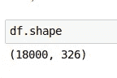

# 使用 Python 进行自然语言处理和情感分析的介绍

> 原文：<https://medium.com/analytics-vidhya/exploring-twitter-data-using-python-af1287ee65f1?source=collection_archive---------1----------------------->


萨拉·库菲在 [Unsplash](https://unsplash.com?utm_source=medium&utm_medium=referral) 上拍摄的照片

在本系列的[第一部分中，我们已经了解了接入 Twitter APIs 所需的设置，如何搜索关于某个主题的推文(鉴于铺天盖地的媒体报道，我们选择了英国退出欧盟)以及如何预处理数据以获得表格形式。](/@cnstlungu/exploring-twitter-data-using-python-part-i-setting-up-and-getting-the-data-e1cc2d13b7f4)

在这篇文章中，我们将在这项工作的基础上做进一步的数据处理和特征提取。我们还将介绍自然语言处理的概念，并展示情感分析工具的概念证明。

同样，如果您希望继续学习，请参考 Github 资源库，其中包含本系列的完整的 [Jupyter 笔记本。](https://github.com/cnstlungu/incubator/tree/master/Python/Exploring%20Twitter%20Data%20using%20Python)

## 处理数据

首先，让我们看一下上一部分我们停止的地方。也就是说，让我们仔细看看我们的文本。


因为我们正在查看推文，推文的*文本*属性——推文的实际信息——是我们数据集中最重要的属性之一。我们现在可以发现数据中的几个问题:

*   不能保证我们看到的是独特的推文(关于它们的*文本*)。病毒消息可能会被转发几十次。
*   对推文的意义没有增加价值的元素:标点符号和特殊字符、超链接、twitter 句柄、*停用词*、元数据(比如“RT”代表转发)

让我们首先删除重复的。我们将它们视为与其他推文相同的推文，例如同一条原始推文的多次转发。

```
df.drop_duplicates(subset='text',inplace=True)
```

让我们通过删除重复项来检查我们删除了多少行。因此，从随机构建的 18000 条推文中，我们得到了 6389 条独特的推文。



以前


在...之后

让我们继续处理文本。我们将逐一应用以下步骤:

*   将 tweet 文本转换成小写
*   移除 twitter 句柄
*   删除超链接
*   删除非字母数字字符，如标点符号
*   删除空白

下一步是删除停用词——可以忽略的助词。我们将使用一个预定义的停用词列表和一些作品，比如 retweet(“rt”)。

```
from nltk.corpus import stopwords
additional  = ['rt','rts','retweet']
swords = set().union(stopwords.words('english'),additional)
```

以下是我们排除的单词的预览:


一共 182 个字

```
df['processed_text'] = df['text'].str.lower()\
          .str.replace('(@[a-z0-9]+)\w+',' ')\
          .str.replace('(http\S+)', ' ')\
          .str.replace('([^0-9a-z \t])',' ')\
          .str.replace(' +',' ')\
          .apply(lambda x: [i for i in x.split() if not i in swords])
```

让我们应用下面的转换从处理过的文本中删除停用词。

另一个转变可能是词干。想想'玩'，'玩过'，'玩'，'玩'。既然都代表同一个想法，那就把它们简化成同一个概念，一起算就好了。

```
from nltk.stem import PorterStemmer
ps = PorterStemmer()
df['stemmed'] = df['processed_text'].apply(lambda x: [ps.stem(i) for i in x if i != ''])
```


我们通过原始推文文本转换及其词干分析获得的列将允许我们分析所使用的词汇，查看重复出现的主题，并确定最常用的单词。

我们现在将简要地分析这些推文的情绪。

## 情感分析

显然，考虑到大量的推文，人们不可能通读它们来了解公众的普遍感受。因此，我们需要一种更自动化的方式来判断一条给定的推文是正面还是负面地谈论我们感兴趣的话题。一个简单的分析器可能如下所示:

*   创建一个单词字典，表示各种情绪或观点
*   相应地给他们打分:消极的给消极的，积极的给积极的。说*可怕的*是-5，*可怕的*是-3，*坏的*是-1 而*好的*是+1，*伟大的* +3 和*杰出的* + 5。
*   对于一个给定的短语，把分数加起来，看看你得到了多少分。

这是一个基本的情感分析器。幸运的是，这些工具已经存在于 Python 生态系统中，我们可以用它们来为我们做这件事。也就是说，我们将使用维德情绪强度分析仪。

```
import nltk.sentiment.vader as vd
from nltk import download
download('vader_lexicon')
sia = vd.SentimentIntensityAnalyzer()
```

我们还将使用一个单词分词器，它将把我们的单词一个接一个地输入情感分析器。

```
from nltk.tokenize import word_tokenize
df['sentiment_score'] = df['processed_text'].apply(lambda x: sum([ sia.polarity_scores(i)['compound'] for i in word_tokenize( ' '.join(x) )]) )
```


当然，我们应该详细检查数据，看看我们是否对极性评分为我们的推文分配情感的方式感到满意。

现在，我们将尝试可视化归因情绪之间的分裂。正如我们所看到的，这个词是相当矛盾的，负面情绪略有优势。


不幸的是，一些更负面的意见(

## A closer look at our features

So by now we know some of the transformations we can apply to our text and how to get a feel on what the sentiment of the texts are. But we could still mine more data from any of the 320+ attributes we have apart the tweet text itself.

For example, from the **user . followers _ count**table)我们可以了解我们的哪些推文属于拥有低、中或高 twitter 受众的用户。我们将用户分为三类:少于 300 个追随者，300 到 10.000 个追随者和超过 10.000 个追随者。有了更大的样本量，这也可以让我们了解信息到达的受众的规模。

```
df['user_audience_category'] = pd.cut(df['user.followers_count'],[0,300,10000,999999999],include_lowest=True,labels=['small','medium','wide'])
```


## 结论

本系列的这一部分介绍了我们如何转换从 Twitter 上检索到的文本，执行基本的情感分析，以及根据我们已经拥有的数据构建新的简单功能。

在本系列的[后续部分，我们将探讨分析这些数据并向感兴趣的群体展示的方法。感谢您的阅读，敬请关注下一篇文章。](/@cnstlungu/exploring-twitter-data-using-python-part-iii-analyzing-the-data-e883aa340dff?sk=2958fbb608e2b76f71694d081606ca74)

[在这里继续阅读第三部](/@cnstlungu/exploring-twitter-data-using-python-part-iii-analyzing-the-data-e883aa340dff?source=friends_link&sk=2958fbb608e2b76f71694d081606ca74)