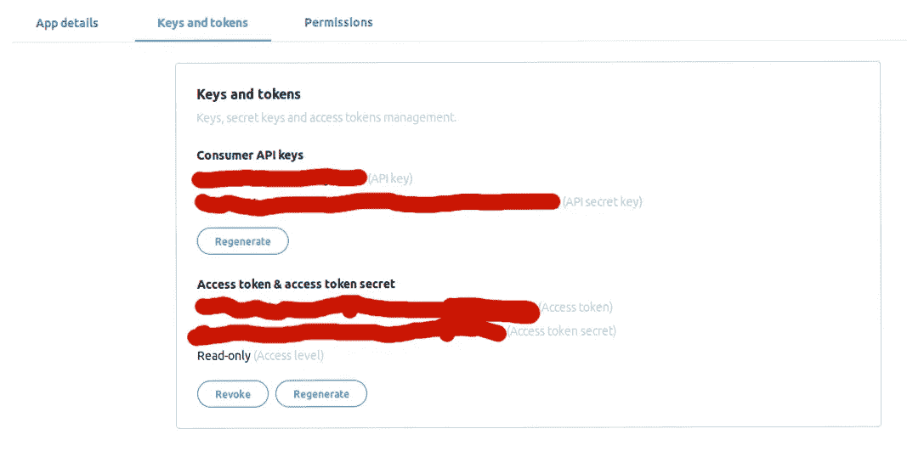
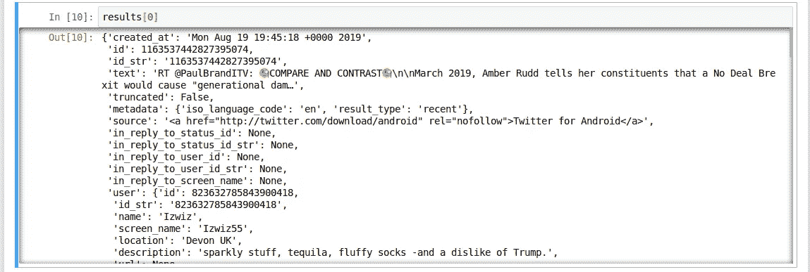
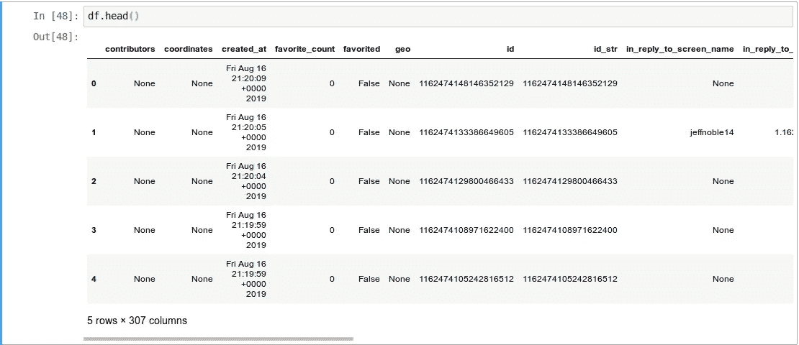
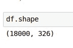
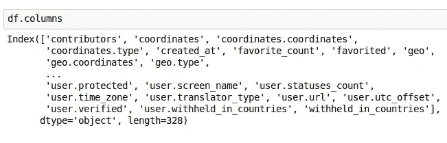
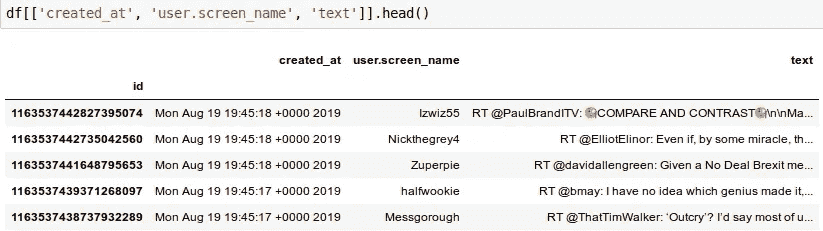

# 使用 Python 探索 Twitter 数据

> 原文：<https://medium.com/analytics-vidhya/exploring-twitter-data-using-python-part-i-setting-up-and-getting-the-data-e1cc2d13b7f4?source=collection_archive---------1----------------------->

# 介绍

Twitter 是目前使用最广泛的社交网络之一-在 2019 年的 Q1，每月有 3.3 亿人使用它。它可能没有几年前的爆炸式增长，但它肯定是一个企业和公众人物与受众互动的地方，重要信息以近乎实时的方式分享，正如最近的事件所显示的那样，甚至政治也是如此。

企业和其他参与者早就明白 Twitter 数据的力量。我们能想到的一个典型例子是贸易公司。鉴于分享信息的快节奏和简洁格式，这是一个很好的工具，可以用来收集可能影响股票市场的信号。首席执行官推荐一种产品或服务？一种伙伴关系可能正在形成。用户多次抱怨新设备的构建问题？对于硬件供应商来说，这是个坏消息。所以 Twitter 数据确实有一个商业用例。

在这个由三部分组成的系列中，我们将研究提取、转换和理解与特定主题相关的 Twitter 数据的概念证明。

如果您想继续学习，请参考 Github 资源库，其中包含本系列的全部 [Jupyter 笔记本。](https://github.com/cnstlungu/incubator/tree/master/Python/Exploring%20Twitter%20Data%20using%20Python)

# 设置

我们将使用 Python 3.7 和一些专门的库来完成这项工作。

但是首先，我们需要从 Twitter 获得必要的凭证。这是在[这里](https://developer.twitter.com/en/apps)完成的。填写适当的信息后，我们应该有以下内容:



一旦我们有了 *API 密钥*、 *API 秘密密钥*、*访问令牌*和*访问令牌秘密*，我们就可以从 Twitter 中提取数据。我们将使用 Twitter 搜索 API 来获取我们的数据。

在我们继续之前，还有一件事我们应该记住。这是 Twitter 提供的一个接口，有[多层](https://developer.twitter.com/en/docs/tweets/search/overview)，包括我们将要使用的(免费)标准接口。在撰写本文时，其局限性描述如下:

> 这个搜索 API 搜索过去 7 天发布的推文样本。“公共”API 集的一部分。

然而，这对我们的目的来说应该足够了。

# 获取 Twitter 数据

接下来，我们可以决定是直接调用 API，还是使用一个库来完成。鉴于 Python 生态系统给了我们大量的选择，我们将使用 [TwitterSearch](https://pypi.org/project/TwitterSearch/) ，这将有助于我们更快地行动。

安装 TwitterSearch 之后，我们就可以开始了。

```
pip install TwitterSearch
```

让我们导入必要的对象，并使用 Twitter 为我们设置的凭证实例化 TwitterSearch 对象。在这种情况下，我建立了一个文件来存储它们。

我们现在需要根据上面定义的搜索对象创建一个搜索顺序。

在这种情况下，我们决定分析有关英国即将退出欧盟(俗称英国退出欧盟)的消息。我们将分析英语推文。

现在我们有了一个推文列表，如下所示。



我们可以看到，我们有一个嵌套的类似字典的结构，包含其他字典和列表。这需要展平，以便我们可以更有效地分析数据。熊猫图书馆将为此提供便利。

这里我们导入了 pandas，并使用 *json_normalize* 方法将我们的结果列表转换成 pandas*data frame——一种二维表格数据结构。*

此外，这是我们数据的快速视图:



为了给每行一个比当前使用的自动生成的行号更有意义的标识符，我们将使用惟一的 tweet id 列。我们还将删除 *id_str* 列，因为它是相同 tweet id 的字符串表示，因此是多余的。

此外，让我们看看我们有多少数据。这将返回(行数(tweets)，列数(features/variables))。因此，我们目前正在研究 18000 条推文，我们可以分析 326 个属性。



列子集的视图在这里会很有用。让我们看看推文的创建日期、用户屏幕名称和推文的文本。这些只是数百个可用专栏中的 3 个。



## 包扎

在本系列的第一篇文章中，我们已经了解了如何设置我们的 Twitter 开发者证书，使用了 *TwitterSearch* Python 包来提取关于英国退出欧盟的推文，还使用了 *pandas* 库来展平(解压)我们的结果。

在[第二部分](/@cnstlungu/exploring-twitter-data-using-python-af1287ee65f1)中，我们将对提取的数据做进一步的转换，并触及自然语言处理和情感分析的概念。

[在此继续阅读第二部分](/@cnstlungu/exploring-twitter-data-using-python-af1287ee65f1)