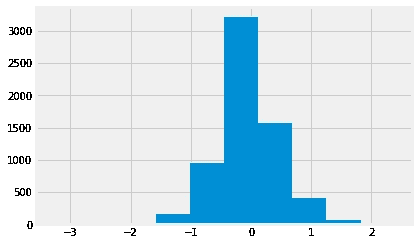

# 使用 Python 分析 Twitter 数据

> 原文：<https://medium.com/analytics-vidhya/exploring-twitter-data-using-python-part-iii-analyzing-the-data-e883aa340dff?source=collection_archive---------2----------------------->

在本系列的第二部分[中，我们将重点放在处理获得的数据和提取特征上。我们还简要地谈到了与自然语言处理相关的话题，并试图从推文中获得情感。](/@cnstlungu/exploring-twitter-data-using-python-af1287ee65f1)

我们现在要看看分析和呈现我们提取的数据的方法。这篇文章将结束我们关于使用 Python 探索 Twitter 数据的系列文章。

# 使用位置对推文进行地理定位

查看推文的第一个有趣的方法是更好地理解产生推文的受众。朝着这个方向迈出的一步是确定它们来自什么地方。现在，我们可以使用的数据集中的一列是用户声明的位置。让我们回顾一下它包含的内容。

我们正在查看数据集的 50 个最常见的已声明用户位置。显然，它需要先做一点映射练习。


在我们的数据集中出现至少 10 次的位置

我们将映射这些条目，以便将相似的条目分组在一起。


我们创建的映射字典

我们将使用映射条目替换位置:

```
df['user.location'] =  df['user.location'].apply(lambda x: mapping[x] if x in mapping.keys() else x )
```

这是这些地点现在的样子。


加工后的位置

这就是*地理定位器*的用武之地。*地理定位器*？是的。这是一个给定位置(无论是完整地址还是城市名称)的工具，可以识别真实世界的位置，并提供一些额外的细节，如纬度和经度，这将是我们稍后的地图练习所需要的。我们将使用 Nominatim 包，它将允许我们获得上述城市的坐标。

```
from geopy.geocoders import Nominatim
geolocator = Nominatim(user_agent='twitter-analysis-cl')#note that user_agent is a random namelocs = list(locs.index) #keep only the city names
```

我们将使用 geolocate 函数返回每个提供地点的位置。

```
geolocated = list(map(lambda x: [x,geolocator.geocode(x)[1] if geolocator.geocode(x) else None],locs))
geolocated = pd.DataFrame(geolocated)
geolocated.columns = ['locat','latlong']
geolocated['lat'] = geolocated.latlong.apply(lambda x: x[0])
geolocated['lon'] = geolocated.latlong.apply(lambda x: x[1])
geolocated.drop('latlong',axis=1, inplace=True)
```

这是输出的样子。我们将把它用作查找表。


# 在地图上绘图

假设我们现在有一个查找表用于查找位置及其坐标，让我们将它与我们的数据连接起来。让我们也按位置分组，并再次获得出现次数。

```
mapdata = pd.merge(df,geolocated, how='inner', left_on='user.location', right_on='locat')locations = mapdata.groupby(by=['locat','lat','lon'])\
       .count()['created_at']\
       .sort_values(ascending=False)
```


地图时间到了。我们将使用 [Matplotlib](https://matplotlib.org/) 和 [Cartopy](https://scitools.org.uk/cartopy/docs/v0.16/) 来显示我们的数据。在这个简单的例子中，我们将绘制各个位置(可以在地图上看到红点)，以及半径根据来自该特定位置的推文数量而变化的蓝色圆圈。

我们还设置了一个辅助函数来计算圆应该有多大——想法是让圆的大小增加得比它想要表示的数字慢得多，否则较小的条目根本看不到。

首先，设置 Matplotlib 的常规设置。

```
import matplotlib.pyplot as pltplt.style.use('fivethirtyeight')
plt.rcParams.update({'font.size': 20})
plt.rcParams['figure.figsize'] = (20, 10)
```

现在，生成地图。

```
import cartopy.crs as ccrs
from matplotlib.patches import Circleax = plt.axes(projection=ccrs.PlateCarree())
ax.stock_img()# plot individual locations                                                                                                       
ax.plot(mapdata.lon, mapdata.lat, 'ro', transform=ccrs.PlateCarree())# add coastlines for reference                                                                                                
ax.coastlines(resolution='50m')
ax.set_global()
ax.set_extent([20, -20, 45,60])def get_radius(freq):
    if freq < 50:
        return 0.5
    elif freq < 200:
        return 1.2
    elif freq < 1000:
        return 1.8# plot count of tweets per location
for i,x in locations.iteritems():
    ax.add_patch(Circle(xy=[i[2], i[1]], radius=get_radius(x), color='blue', alpha=0.6, transform=ccrs.PlateCarree()))plt.show()
```


我们代码的输出。显然，英国退出欧盟是一个非常以英国为中心的问题。

# 使用图表进行进一步分析

让我们继续使用 Matplotlib 的强大功能来探索我们的数据。还记得我们计算的情感分数吗？我们来画一下。



我们看到的推文中的情绪倾向于负面

假设我们想以一种更友好的方式展示它。我们现在将它转换成一个分类变量。这将把我们的数据分成四个数据仓，具有更友好的值(分类变量的级别)。

```
sent_clasification = pd.cut(df['sentiment_score'],\
          [-3,-1.2, 0, 1.2 , 3],\
          right=True,\
          include_lowest=True,\
          labels=['strongly negative', 'negative', 'positive', 'strongly positive'])
```


结果


让我们试着再画一次——同样的信息，但是从不同的角度。

查看这些数据的另一种方式是最容易识别(也最讨厌)的数据表示方式之一:饼图。我自己不太喜欢它，但是让我们试一试。

```
plt.figure(figsize=(10,7)) #make it smaller this time
sent_clasification.value_counts().plot(kind='pie')
plt.grid(False)
plt.tight_layout()
```


## 词云

一字云呢？它能在一张图片中描绘出英国退出欧盟的混乱吗？

```
from wordcloud import WordCloud, STOPWORDS
bigstring = df['processed_text'].apply(lambda x: ' '.join(x)).str.cat(sep=' ')plt.figure(figsize=(12,12))
wordcloud = WordCloud(stopwords=STOPWORDS,
                          background_color='white',
                          collocations=False,
                          width=1200,
                          height=1000
                         ).generate(bigstring)
plt.axis('off')
plt.imshow(wordcloud)
```


我们的单词云成果

## 哈希标签

对前 10 个散列标签感兴趣吗？我们将使用正则表达式来提取它们，然后计算出现的次数。

```
import re
hashtags = df['text'].apply(lambda x: pd.value_counts(re.findall('(#\w+)', x.lower() )))\
                     .sum(axis=0)\
                     .to_frame()
                     .reset_index()\
                     .sort_values(by=0,ascending=False)
hashtags.columns = ['hashtag','occurences']
```


```
hashtags[:10].plot(kind='bar',y='occurences',x='hashtag')
plt.tight_layout()
plt.grid(False)
plt.suptitle('Top 10 Hashtags for keyword: Brexit, language: English', fontsize=14)
```


## 提到的用户

让我们对推文中提到的用户做同样的事情。他们很容易被@符号发现。

```
plt.grid(False)
plt.tight_layout()
plt.suptitle('Top 10 Users for keyword: BREXIT, locale: EN', fontsize=14)df['text'].str\
          .findall('(@[A-Za-z0-9]+)')\
          .apply(lambda x: pd.value_counts(x))\
          .sum(axis=0)\
          .sort_values(ascending=False)[:10]\
          .plot(kind='bar')
```


真的没什么好惊讶的

## 热门词汇

现在让我们来看看最常用的 10 个单词。动作顺序如下:

*   删除没有数据的行
*   使用正则表达式提取单词
*   统计单词使用量，并对它们求和
*   分类

```
import re
words = df['processed_text'].dropna()\
                            .apply(lambda y: pd.value_counts(re.findall('([\s]\w+[\s])',' '.join(y))))\
                            .sum(axis=0)\
                            .to_frame()\
                            .reset_index()\
                            .sort_values(by=0,ascending=False)
words.columns = ['word','occurences']
```


使用最多的 10 个单词

## 二元模型

我们应该关注的另一件事是二元模型——通常一起出现的两个单词的序列。如果你问的话，还有三元组(三个单词的序列)。

```
from nltk import bigrams
bigramseries = pd.Series([word for sublist in df['processed_text'].dropna()\
                    .apply(lambda x: [i for i in bigrams(x)])\
                    .tolist() for word in sublist])\
                    .value_counts()
```


```
plt.suptitle('Top 10 Bigrams for keyword: BREXIT, locale: EN', fontsize=18)
bigramseries[:10].plot(kind='bar')
```


# 结论

这篇文章总结了我们用 Python 探索 Twitter 数据的系列。虽然它不应该是您可以用它做什么的详尽列表，但它旨在让读者一瞥 Python 工具包在提取、处理和呈现数据方面提供的纯粹可能性。这很简单，有据可查，非常有趣。这个系列的完整 Jupyter 笔记本可以在[这里](https://github.com/cnstlungu/incubator/tree/master/Python/Exploring%20Twitter%20Data%20using%20Python)找到。

感谢您的阅读，并随时分享一些您自己的例子。