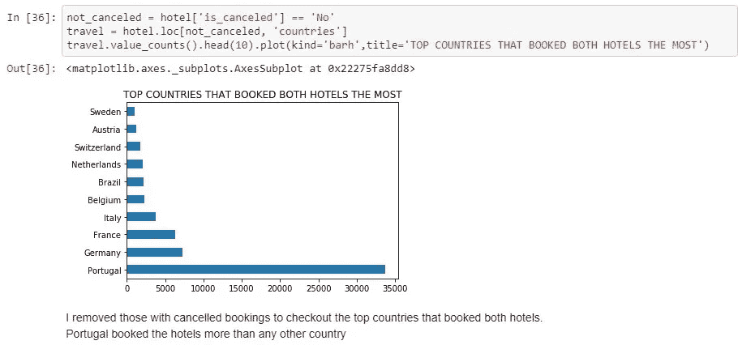
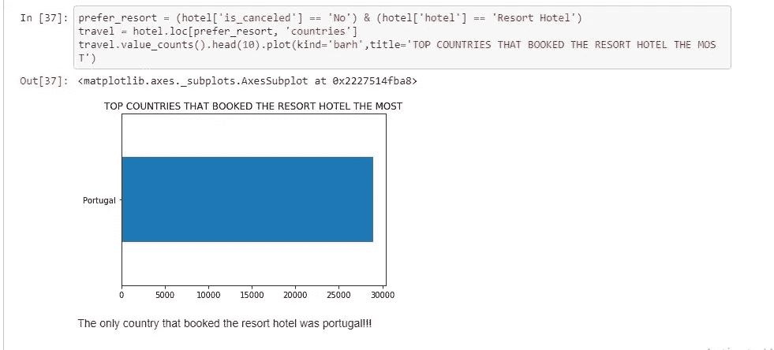
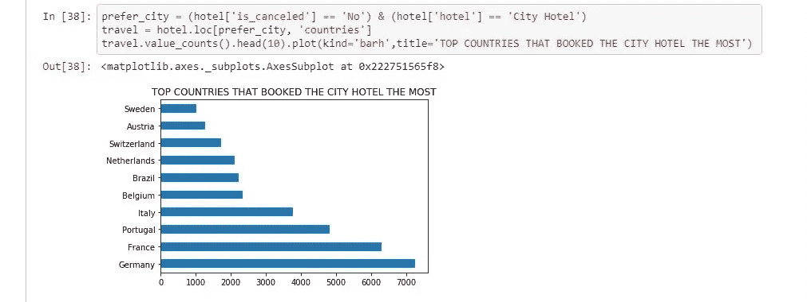
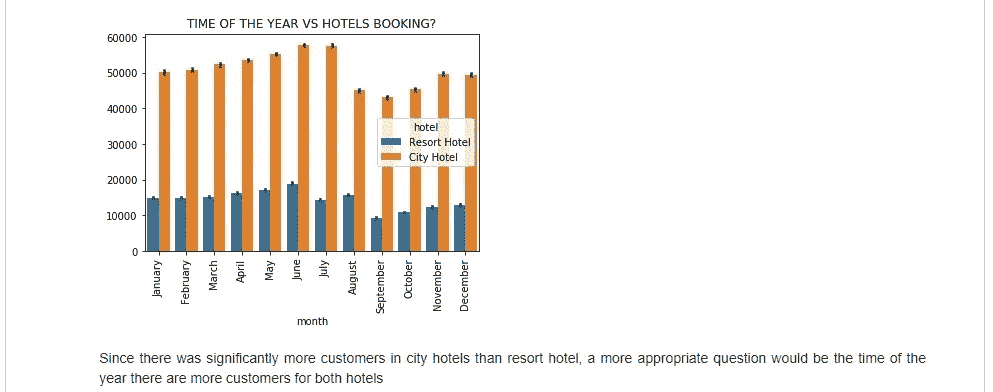
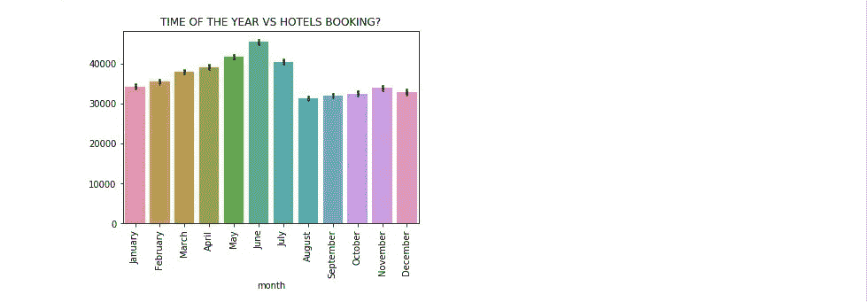
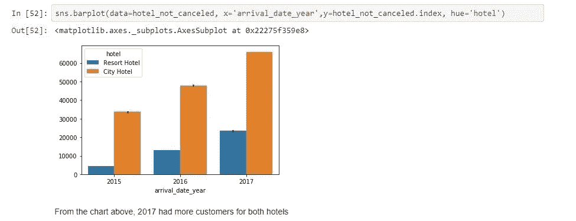
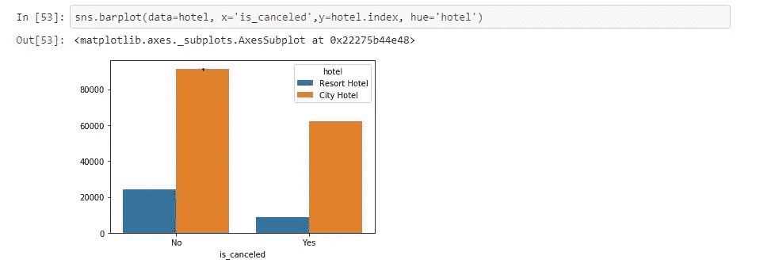

# 探索两个酒店预订数据集

> 原文：<https://medium.com/analytics-vidhya/exploring-two-hotel-booking-datasets-6a80f93fe94a?source=collection_archive---------12----------------------->

我分析了一个关于两家酒店的数据集:来自 Kaggle 的一家度假酒店和一家城市酒店。让我们一起来看看我从数据集里得到的发现。

# 我从数据集中回答的问题

## 顶级国家世卫组织预订了两家酒店

从数据集中，我发现了预订两家酒店的人来自哪些国家。

预订两家酒店最多的国家

预订两家酒店最多的前五个国家显然是葡萄牙、德国、法国、意大利和比利时。此外，除了来自南美洲的巴西，我们应该注意到所有这些国家都来自欧洲。所以这些酒店很有可能是以欧洲为基地的。现在，我们将寻找预订酒店最多的前五个国家。

预订度假酒店最多的国家

唯一预订度假酒店的国家是葡萄牙。根据我的研究，度假酒店是基本上为度假而预订的家庭型酒店。只有预订这家酒店的葡萄牙人可能暗示两家酒店都位于葡萄牙。

预订城市酒店最多的国家

预订城市酒店最多的前五个国家分别是德国、法国、葡萄牙、意大利和比利时。由于我们假设两家酒店都位于葡萄牙，因此我们可以得出结论，葡萄牙的顶级游客和投资者来自德国、法国、意大利和比利时。这是因为，根据我的研究，游客和商人最常光顾城市酒店。

## 一段时间内的酒店预订

首先，我们会检查每个月的预订情况并进行扣除。接下来，我们将检查三年(2015 年至 2017 年)每年的预订情况。

每月的酒店预订量

对于两家酒店来说，预订量最高的月份是 6 月。此外，城市酒店的预订价格远远高于度假酒店。为了重申两家酒店预订量最高的月份是 6 月，我们将制作另一个可视化图形。

每月的酒店预订量

现在我们可以确定六月的预订量最高。也有可能是因为葡萄牙的夏季是从 6 月中旬开始的，所以酒店的预订是在暑假进行的。

三年的酒店预订

由于度假酒店和城市酒店的预订量每年都在增加，我们可以得出结论，酒店每年都在吸引更多的客人。

## 取消和未取消的酒店预订

取消和未取消的酒店预订

未取消的酒店预订比取消的多。此外，城市酒店比度假酒店有更多的取消和未取消的预订。这可能是因为城市酒店比度假酒店便宜。这也可能是因为城市酒店没有度假酒店那么偏远。

## 快速回顾我们的发现:

*   预订两家酒店的前五个国家分别是葡萄牙、德国、法国、意大利和比利时。
*   预订度假酒店的人来自唯一的国家是葡萄牙。
*   预订城市酒店最多的前五个国家是德国、法国、葡萄牙、意大利和比利时。
*   我们假设两家酒店都位于葡萄牙。
*   对于两家酒店来说，预订量最高的月份是 6 月。
*   每年，度假酒店和城市酒店的预订量都在增加。
*   未取消的酒店预订比取消的多。
*   城市酒店比度假酒店有更多的取消和未取消的预订。

点击阅读完整代码[。](https://github.com/ToluwaniAdebowale/EXPLORING-HOTEL-BOOKING-DATA/blob/master/hotel_booking.ipynb)