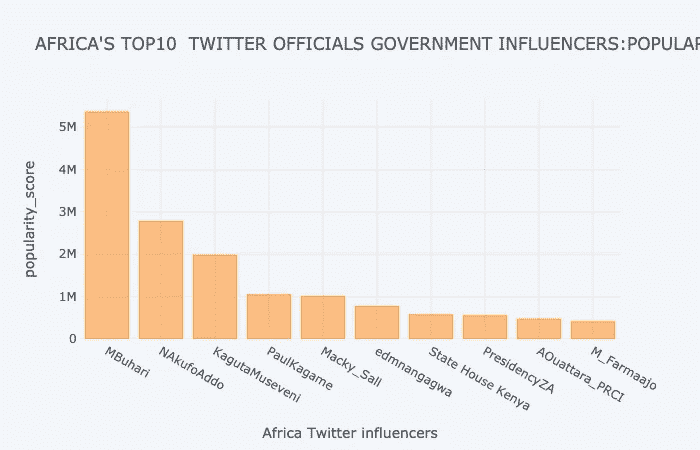

# 使用 twitter API 探索 Twitter 中的用户数据。

> 原文：<https://medium.com/analytics-vidhya/exploring-users-data-in-twitter-using-twitter-api-612584d0c123?source=collection_archive---------13----------------------->

**衡量非洲用户在 twitter 中的影响力。**


这是我关于数据科学的第一篇文章，也是我作为数据科学家的旅程中的重要一步。我要感谢 10 所学院，因为它们确实使我比昨天好了 10 倍。接下来三个月的每个星期，我的技能都会在每周的挑战中不断提高。

在阅读了[百万追随者谬误文档](http://twitter.mpi-sws.org/icwsm2010_fallacy.pdf)之后，我开始明白研究影响力如何帮助我们理解为什么某些趋势和创新比其他趋势和创新被更快地采用，以及我们如何帮助广告商和营销人员设计更有效的数字活动。基于这一点，我决定缩小到非洲，衡量一些非洲有影响力的人和非洲政府官员的影响力。以下是对分析的解释。

# 通过网络搜集获取数据

第一步是获得非洲推特用户和被认为有影响力的政府高级官员的名单。这是通过以下两个 python 包实现的:

*   用于处理所有 HTML 处理的 BeautifulSoup 包
*   用于执行 HTTPs 请求的请求包

我收集数据的两个网站是:

*   [非洲 100 名最有影响力的推特用户](https://africafreak.com/100-most-influential-twitter-users-in-africa)
*   [非洲领导人在推特上回应冠状病毒](https://www.atlanticcouncil.org/blogs/africasource/african-leaders-respond-to-coronavirus-on-twitter/#east-africa)

这些网站推荐了非洲最具影响力的人物，我们将使用 twitter 上的数据，通过比较不同的影响力指标来验证这份名单。理解了前进的方向后，我必须安装我将使用的库。

```
#Getting the content from the url by making a requestsurl="[https://www.atlanticcouncil.org/blogs/africasource/african-leaders-respond-to-coronavirus-on-twitter/#southern-africa](https://www.atlanticcouncil.org/blogs/africasource/african-leaders-respond-to-coronavirus-on-twitter/#southern-africa)"
r=requests.get(url)
soup=BeautifulSoup(r.content)
links=soup.find_all('blockquote') #block quote is the tag that contains the information we need.
```

在上面的代码中，在请求包的帮助下，我们通过传递 url 获取内容，然后使用 BeautifulSoup 对其进行转换。通过浏览网站，我们找到了我们需要的列表中的相似性，在这种情况下，我们需要的所有 twitter 句柄都嵌入在

> 标签中。使用 BeautifulSoup，我找到了标签中的所有内容，并将其转换为一个列表字符串。使用 python 字符串操作，我对数据进行了清理，并获得了 twitter 句柄。我对另一个网站做了同样的事情，得到了非洲有影响力的人的名单。

# 访问 Twitter API

我首先安装了 Tweepy——一个用于与 twitter API 交互的 python 包装器。

```
***!pip install tweepy***
```

接下来，我创建了一个身份验证对象，以便能够从 twitter 访问数据。

```
# Creating the authentication object
auth = tweepy.OAuthHandler(Consumer key, Consumer secret)
# Setting your access token and secret
auth.set_access_token(Access token, Access token_secret)
# Creating the API object while passing in auth information
api = tweepy.API(auth, wait_on_rate_limit=True,
                     wait_on_rate_limit_notify=True)
```

专注于一个人带领其他人参与某些行为的潜力，我对 twitter 中的“人际”活动很感兴趣。我有兴趣获得:

*   用户的追随者数量
*   用户的朋友数量
*   用户的转发次数
*   喜欢的数量
*   提及次数

接下来使用用户对象方法，我能够获得列表中所有用户的 followers_count 和 friends_count。

```
#getting followers_count of users
followers = []
for screen_name in names:
    u=api.get_user(screen_name)
    followers.append(u.followers_count)#getting friends_count of the users
friends = []
for screen_name in names:
    u=api.get_user(screen_name)
    friends.append(u.friends_count)
```

接下来，我编写了一个函数，将转发次数作为 retweet_count，将喜欢次数作为 favorite_count。该函数获取用户的 tweet 以及每个 tweet 的 retweet_count 和 favorite_count。该函数还为每个用户将数据写入 csv 文件。

```
def get_tweets(screen_name):#initialize a list to hold all the tweepy Tweets
    alltweets = []#make initial request for most recent tweets (200 is the maximum allowed count)
    new_tweets = api.user_timeline(screen_name = screen_name, count=200)#save most recent tweets
    alltweets.extend(new_tweets)#save the id of the oldest tweet minus one
    oldest = alltweets[-1].id - 1#keep grabbing tweets until there are no tweets left to grab. 
    # Limit set to around 3k tweets, can be edited to preferred number.
    while len(new_tweets) > 0:
        print("getting tweets before %s" % (oldest))#all subsiquent requests use the max_id arg to prevent duplicates
        new_tweets = api.user_timeline(screen_name = screen_name,count=200, max_id=oldest)#save most recent tweets
        alltweets.extend(new_tweets)#update the id of the oldest tweet less one
        oldest = alltweets[-1].id - 1print("...%s tweets downloaded so far" % (len(alltweets)))#transform the tweets into a 2D array that will populate the csv 
    outtweets = [[tweet.id_str, tweet.created_at,tweet.retweet_count,tweet.favorite_count, tweet.text.encode("utf-8")] for tweet in alltweets]#write the csv  
    with open('%s_tweets.csv' % screen_name, 'w') as f:
        writer = csv.writer(f)
        writer.writerow(["id","created_at","retweet_count","favorite_count","text"])
        writer.writerows(outtweets)pass
```

现在我需要得到提及；用户在其他推文中被提及的次数。为了避免运行时可能由于一些用户名不可操作而导致的代码中断，我们使用 try 异常来传递 tweepy.error。

```
#collecting mentions for the users#list100 is a list where i stored the twitter handles. 
mentions = [] 
for influencer in list100: 
  try:
    for status in tweepy.Cursor(api.user_timeline, id=influencer).items():
      if hasattr(status, "entities"):
        entities = status.entities
        if "user_mentions" in entities:
          for ent in entities["user_mentions"]:
            if ent is not None:
              if "screen_name" in ent:
                name = ent["screen_name"]
                if name is not None:
                  mentions.append(name)
  except Exception:
            pass
```

获得了所有需要的用户信息后，我高兴地开始进行分析。恭喜我们刚刚完成了 60%的项目。

# 分析推特数据

因为很难确定很少发推文的用户的影响力，所以我把注意力集中在那些有最低活跃水平的用户身上，那些发推文超过 50 条的用户。我还删除了那些 screen_names 无效的人的名字，因为这些信息对于确定一个用户被其他人提及或转发的次数非常重要。

从用户在 twitter 上的活动中，我们可以获得三种类型的影响，如前面提到的文档中所概述的；百万追随者谬论，这些是:

*   Indegree 影响力(Reach_score)，用户的关注者数量，表示用户的受众。我是通过从追随者中减去以下内容来计算的。
*   转发影响力(popularity_score)，我是通过把转发数和赞数相加来衡量的。这表明用户生成具有传递值的内容的能力。
*   提及影响力(relevance_score)，我们通过包含一个人名字的提及次数来衡量。这表明用户在对话中吸引他人的能力。

```
#Calculating the popularity_score and storing the results in a new column
data2["popularity_score"]=data2["retweet_count"]+data2["favorite_count"]#Calculating the reach score
data2["reach_score"]=data2["No.of followers"]+data2["friends_count"]
```

微笑，因为我们现在有了全部的数据，但是我们仍然没有回答我们的问题。我们现在将使用不同的影响力指标对我们的数据进行分类，并得出见解和尝试回答，影响力是否取决于一个人拥有的追随者数量？

我们先将数据按人气评分排序，根据转发影响力得出前 10 名。然后我用 plotly 软件包绘制了数据，这是曲线图。

```
#sorting data according to popularity score
data3.sort_values(by=['popularity_score'], ascending=False).head(10)
```



其次，我们根据 reach_score 对列表进行了排序，得到了前 10 名影响者，然后使用 plotly 包绘制了一个条形图。

```
#sorting data according to reach_score
data3.sort_values(by=['reach_score'], ascending=False).head(10)
```


最后，我根据提及次数对数据进行了分类，以确定提及影响力的前 10 名。

```
#sorting data according to mention_count
data3.sort_values(by=['mention_count'], ascending=False).head(10)
```

分析之后，我从操作中得出不同的见解，以下是见解。

# 结论

在这个项目中，我分析了 twitter 在非洲的影响力，我采用了三种不同的方法来捕捉不同的视角。这些是调查结果:

*   indegree 影响力代表用户的受欢迎程度，但它与其他重要指标(如吸引观众，即转发和提及)无关，因此不足以得出用户通过关注者或朋友数量受受受欢迎程度影响的结论。
*   转发是由推文的内容价值驱动的，而提及是由用户的名字价值驱动的。因此，建议普通用户发布丰富而有创意的内容来获得影响力。
*   前 10 名影响者在“受欢迎程度分数”、“可及程度分数”和“相关性分数”上几乎没有重叠，这表明仅“不同意”、“转发”或“提及”影响力很少揭示影响者。

这不同意许多人持有的跟随者谬论。

在我的 [github 库](https://github.com/Davidelvis/10academyprojects)中找到整个项目和材料

***跨越话题和时间的影响力动态呢？影响力是自发获得的还是偶然获得的？***

这将成为我下次文章的一部分。如果你发现这个足智多谋，别忘了与朋友分享。

# 参考

我在练习中发现的一些丰富的材料。

1.  [python 中 web 报废的实用介绍](https://realpython.com/python-web-scraping-practical-introduction/)
2.  [https://Africa freak . com/100-非洲最具影响力的推特用户](https://africafreak.com/100-most-influential-twitter-users-in-africa)
3.  博客:[如何计算 Twitter 浏览量并达到](https://www.tweetbinder.com/blog/twitter-impressions/)