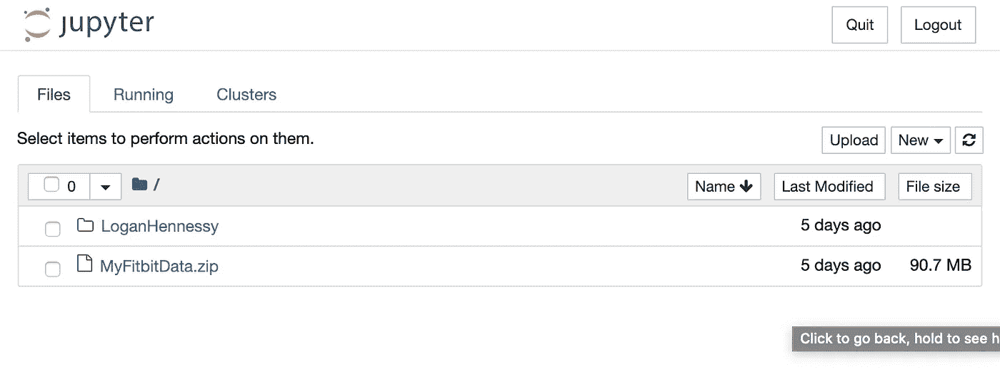
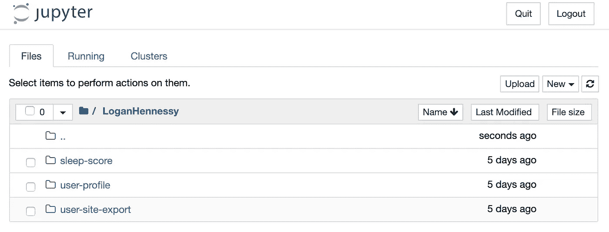
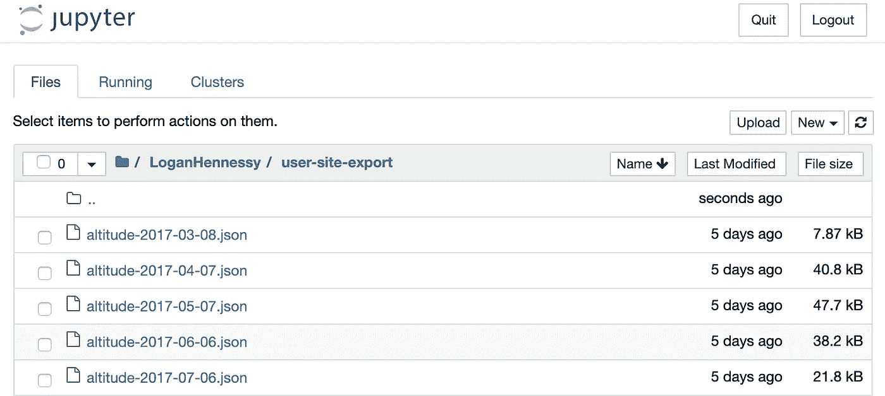
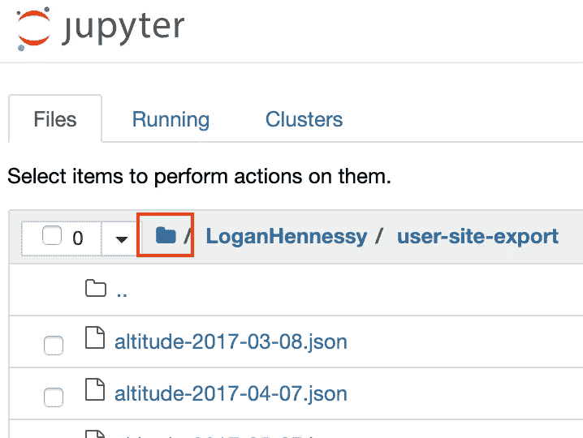
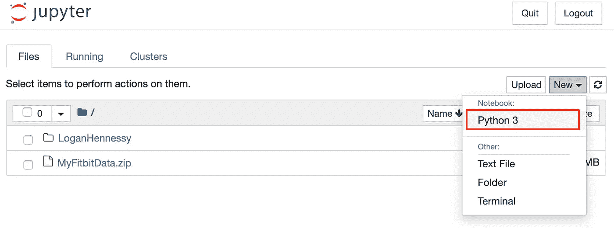
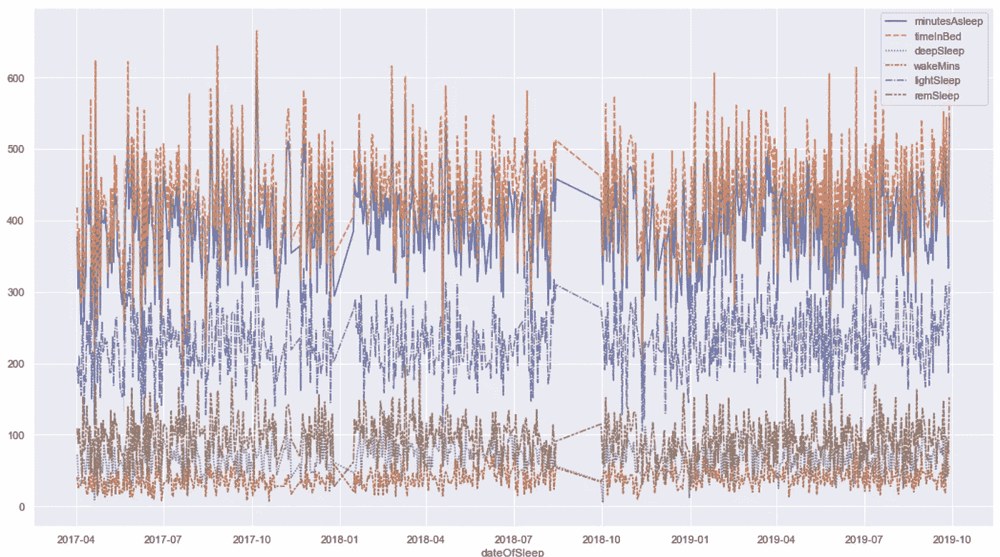
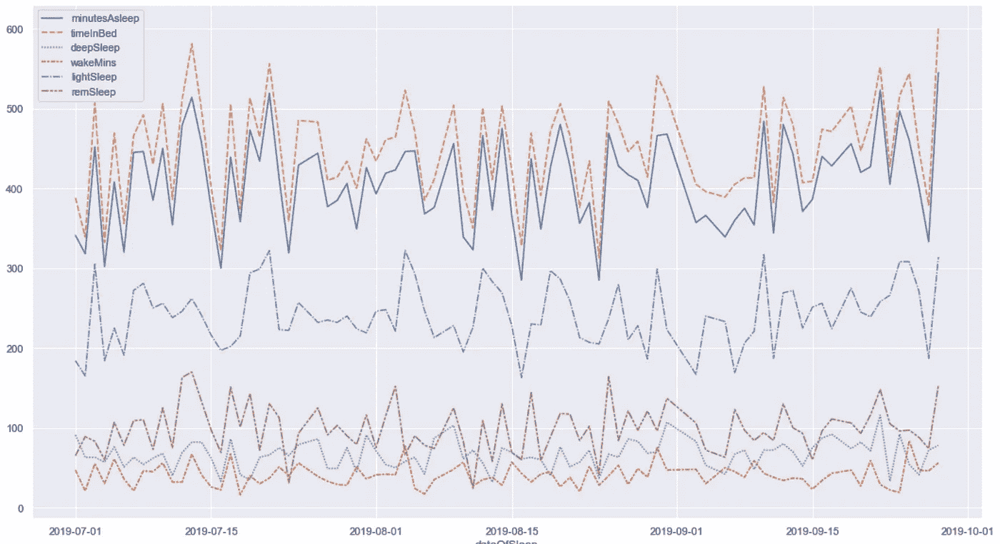

# 在 Jupyter 笔记本中使用 Python、Pandas 和 Seaborn 探索您的 FitBit 睡眠数据

> 原文：<https://medium.com/analytics-vidhya/exploring-your-fitbit-sleep-data-with-python-pandas-and-seaborn-in-jupyter-notebook-a997f17c3a42?source=collection_archive---------4----------------------->


由[安德烈斯·乌雷纳](https://unsplash.com/@andresurena?utm_source=medium&utm_medium=referral)在 [Unsplash](https://unsplash.com?utm_source=medium&utm_medium=referral) 上拍摄的照片

# 在本文中，我将介绍…

*   如何以及在哪里从 FitBit 下载您的数据
*   探索和识别导出的数据
*   将您的数据加载到熊猫数据框架中
*   Seaborn 的一些基本绘图

> TL；DR；如果你只是想得到好东西，跳到我在 GitHub 上发布的 Jupyter 笔记本。

# 介绍

自从几年前我有了 FitBit Flex，我就成了健身追踪的忠实粉丝。在几周或几个月的时间里，你通过查看关于自己的数据而获得的动力是无价的。当你试图找出什么样的惯例或习惯最适合你时，这很有帮助。另外，如果你像我一样是个数据怪胎，看着就很有趣！

但是，当你有合适的工具和一点好奇心时，你在 FitBit 应用程序或仪表盘中看到的只是这些数据的皮毛。

## 先决条件

你需要在你的机器上安装 Anaconda [来启动 Jupyter 笔记本。关于 Anaconda 的伟大之处在于，只要您有了那个设置，您就可以开始工作了。](https://docs.conda.io/projects/conda/en/latest/user-guide/install/macos.html)

我也喜欢从命令行运行，所以指令就是这么写的。你不需要成为一个黑客级别的命令行向导，但是你需要知道如何到达你的终端，以及如何运行我提供的命令。

> 注意:如果你在 windows 机器上，用`*dir*`替换任何`*ls*`命令。这只是将“ls — list”命令与“dir — directory”命令交换，这两个命令都列出了当前目录的内容。

# 下载您的 FitBit 数据

FitBit 在这方面有一个非常直接的帮助文档，所以从点击下面的链接开始，按照步骤请求完整导出您的所有数据。

[](https://help.fitbit.com/articles/en_US/Help_article/1133) [## 如何导出我的 Fitbit 帐户数据？

### 文章正文使用 fitbit.com 仪表板导出您的 GPS 数据、社区数据或您的帐户数据档案…

help.fitbit.com](https://help.fitbit.com/articles/en_US/Help_article/1133) 

从我确认我的请求开始，大约 25 分钟后我的数据就可以下载了。作为参考，我有 2015 年的数据。我预计导出时间会稍微多一点或少一点，这取决于您的数据回溯到多远。

# 探索和识别导出的数据

## 设置您的环境

首先为您的探索性数据分析创建一个文件夹。从您想要存储此项目的任何文件夹中，运行以下命令:

```
mkdir fitbit-eda
cd fitbit-eda
```

接下来，您将需要一个虚拟环境，这样它就不会干扰您的计算机上可能存在的任何其他出色的项目。要运行，请执行以下操作:

```
conda create -n env python=3.7 anaconda
```

这告诉 Anaconda 用 Python 3.7 建立一个名为`env`的新 Python 虚拟环境。如果不指定版本，Anaconda 将选择您的默认 Python 安装。由于这很可能是 Python 2，我建议显式地设置要使用的 Python 版本。

现在，使用以下命令激活环境:

```
conda activate env
```

## 下载并解压缩

继续下载并将下载的`MyFitbitdata.zip`文件移动到新创建的文件夹中。

接下来，解压缩下载的文件。您可以通过您的文件资源管理器，或者在命令行中使用:

```
unzip MyFitbitData.zip
```

这将创建一个以你的名字命名的文件夹(例如在我的例子中是 LoganHennessy)。

从这里开始，启动 Jupyter Notebook，充分发挥 Python、Pandas、Matplotlib/Seaborn 等工具的威力。

```
jupyter notebook
```

默认情况下，Jupyter 将在 localhost:8888 启动 host a notebook。单击终端中的链接，您应该会看到类似这样的内容。



Jupyter 笔记本

酷毙了。现在让我们稍微探索一下。

看看那个解压缩的文件夹，上面有你的名字。



数据档案

`user-profile`有一些关于我的数据，这不是很有趣(我向你保证)。FitBit 刚刚增加了一个睡眠评分，这很有趣，但我对原始数据更感兴趣。`user-site-export`是我们想要的。这是我有史以来所有的原始数据。

导航到`user-site-export`。根据你拥有 FitBit 的时间长短，你可能会看到一个巨大的文件列表。我的档案有 2139 个文件。



用户网站导出文件

虽然一开始让人不知所措，但看起来 FitBit 对这些文件有一个很好的、一致的命名约定。似乎有几种不同类型的数据文件有它们自己独特的名字，并且每个文件都有日期戳。格式如下所示:

```
{underscored_type}-{hyphenated-date}
```

这很好，因为有了这样一种可预测的格式，我们可以使用 Python 来识别所有独特的文件类型。

导航回到您启动 Jupyter 的根目录。



现在，在右上角的 New -> Notebook 下，点击“Python 3”。



这将打开一个 Python 3 Jupyter 笔记本。在第一个单元格中，复制并粘贴以下代码片段，确保用您的真实姓名替换`{Firstname}{Lastname}`。

```
import osfilenames = os.listdir("LoganHennessy/user-site-export")print(f"Parsing {len(filenames)} files for unique types.")
unique_filenames = set()for f in filenames:
    unique_filenames.add(f.split("-")[0])print(f"Found {len(unique_filenames)} unique types.")
for name in sorted(unique_filenames):
    print(name)
```

花一分钟回顾并理解这段代码。这很简单。它首先收集您的`user-site-export`目录中的文件列表，然后遍历它们，只分离出文件名的第一部分，并将其添加到 Python `set`中。集合在这里很有用，因为它只允许不存在的新对象。因此，在遍历所有文件名后，我们将拥有一个不同数据类型的唯一列表。

从这里你可以按下笔记本顶部的“运行”按钮，或者按下 Shift+Enter 运行(我的首选方式)。

这将打印出以下列表。

```
Parsing 2139 files for unique types.
Found 21 unique types.
altitude
badge.json
calories
demographic_vo2_max
distance
exercise
food_logs
heart_rate
height
lightly_active_minutes
moderately_active_minutes
resting_heart_rate
run_vo2_max
sedentary_minutes
sleep
steps
swim_lengths_data
time_in_heart_rate_zones
very_active_minutes
water_logs
weight
```

我们的脚本找到了 21 种不同类型的数据。我们可以看到其中一个叫做`sleep`。看起来那就是我们想要的。

# 将您的数据加载到熊猫数据框架中

首先，将睡眠数据复制到一个`data`文件夹中。

```
!mkdir data
!cp LoganHennessy/user-site-export/sleep* data/
```

在朱庇特的笔记本中，一行开头的`!`告诉朱庇特呼叫外壳。

现在列出`data`目录的内容。

```
!ls data
```

你会看到一个列表，里面只有你的睡眠数据文件。这就是我们想要的。

Panda 有一个内置的方法`pd.read_json`，它将接受一个文件路径作为一个字符串，并将它在那个位置找到的 JSON 文件读入一个数据帧。然而，我们有很多很多的睡眠文件，我们需要它们都在同一个数据帧中。

要将所有睡眠文件加载到同一个数据帧中，通过循环遍历目录中的每个文件，创建一个数据帧列表，然后使用 T8 将列表中的数据帧连接成一个数据帧。

```
import pandas as pddfs = []
for file in os.listdir("data"):
    dfs.append(pd.read_json(f"data/{file}"))
df = pd.concat(dfs)
```

查看数据框的前 5 行。

```
df.head()
```

不是`levels`，看起来那个列没有正确解析，因为那个列本身包含了*嵌套的* JSON。这种形式的嵌套 JSON 很难处理，也不容易绘制或分析。

那我们该怎么办？

我们需要做的是通过将单个字段作为新列显示在数据帧中来“扁平化”。

首先，看一下这个字段的示例单元格。

```
df.iloc[0].levels['summary']
```

这会打印出类似。

```
{'deep': {'count': 2, 'minutes': 50, 'thirtyDayAvgMinutes': 59},
 'wake': {'count': 6, 'minutes': 51, 'thirtyDayAvgMinutes': 57},
 'light': {'count': 11, 'minutes': 210, 'thirtyDayAvgMinutes': 213},
 'rem': {'count': 4, 'minutes': 83, 'thirtyDayAvgMinutes': 101}}
```

好的。所以看起来像是`levels`数据本身包含了 4 个嵌套的 JSON 对象，每个对象都有关于睡眠的特定阶段的数据。幸运的是，这些对象都是一致的，都有一个`count`、`minutes`和`thirtyDayAvgMinutes`字段。

对于要出图的东西，我最感兴趣的是`minutes`领域。

为了从睡眠的每个阶段提取这个字段，我们需要使用`df.{columnName}.apply()`方法。这个方法本质上相当于一个`map`函数，它*将一个函数*映射到数据帧中特定列的每一行。

给定`levels`列的结构，为了提取必要的`minutes`字段，我们将需要类似这样的东西。

```
def get_minutes(levels, sleep_phase):
    if not levels.get('summary'):
        return None
    if not levels.get('summary').get(sleep_phase):
        return None
    if not levels.get('summary').get(sleep_phase).get('minutes'):
        return None
    return levels['summary'][sleep_phase]['minutes']
```

由于我有 2015 年的数据，而且我过去的跟踪器不够健壮，所以不是每一行都一定有有效数据，所以我需要检查以确保每个字段在尝试访问之前都包含数据。多级`if not levels.get(...`执行此检查。

将此函数应用于四个睡眠阶段中的每一个。

```
df['deepSleep'] = df.levels.apply(get_minutes, args=('deep',))
df['wakeMins'] = df.levels.apply(get_minutes, args=('wake',))
df['lightSleep'] = df.levels.apply(get_minutes, args=('light',))
df['remSleep'] = df.levels.apply(get_minutes, args=('rem',))
```

运行另一个`df.head()`来查看 dataframe 是如何形成的，您应该会看到四个新列，每个列包含特定行的特定睡眠阶段的分钟数(您可能需要滚动到最右侧才能看到它们)。

# Seaborn 的一些基本绘图

为了结束本教程，我们将使用 Seaborn 生成一个简单的图表。

到目前为止，我们有一个数据帧，其中一行代表每天，一列代表睡眠的每个阶段所花的分钟数，所有默认列都来自 FitBit 的每个数据点。

为了更容易绘制，我们将对我们的数据帧进行一些处理，使其成为符合 Seaborn 和 Matplotlib 的格式。我们的步骤将是:

1.  在我们的数据框架上设置一个基于时间的索引
2.  删除我们不需要/不想要的列
3.  绘制剩余的列

## 在熊猫数据帧上设置基于时间的索引

运行以下命令:

```
df.dateOfSleep = pd.to_datetime(df.dateOfSleep)
df.set_index("dateOfSleep", drop=True, inplace=True)
df.sort_index(inplace=True)
```

在这 3 行中，实际上有很多东西需要解开。

首先，我们使用`pd.to_datetime()`将`dateOfSleep`列转换成日期时间。这是必要的，因为在此之前，Pandas 只是将`dateOfSleep`列作为一般的`object`来处理，而 Seaborn 不知道将该列作为日期时间来处理。

其次，我们将 dataframe 的索引设置为我们刚刚转换的列，`dateOfSleep`。两个额外的参数告诉 Pandas(a)删除原来的`dateOfSleep`(或者 Pandas 会将该列复制到索引中)，以及(b)完成这个操作`inplace`，这样我们就不必返回并保存一个新的 dataframe。

最后，我们将在新创建的索引上对该数据帧进行排序，以便按时间顺序排序。默认情况下，这是按照升序排序，这就是我们想要的。

使用`df.info()`查看我们的数据框的列。这将打印出如下内容:

```
<class 'pandas.core.frame.DataFrame'>
DatetimeIndex: 921 entries, 2015-07-18 to 2019-09-28
Data columns (total 18 columns):
duration               921 non-null int64
efficiency             921 non-null int64
endTime                921 non-null object
infoCode               921 non-null int64
levels                 921 non-null object
logId                  921 non-null int64
mainSleep              921 non-null bool
minutesAfterWakeup     921 non-null int64
minutesAsleep          921 non-null int64
minutesAwake           921 non-null int64
minutesToFallAsleep    921 non-null int64
startTime              921 non-null object
timeInBed              921 non-null int64
type                   921 non-null object
deepSleep              766 non-null float64
wakeMins               766 non-null float64
lightSleep             766 non-null float64
remSleep               766 non-null float64
dtypes: bool(1), float64(4), int64(9), object(4)
memory usage: 130.4+ KB
```

注意顶部的`DatetimeIndex`标注，它甚至包括我们的日期范围。相当酷！

现在，这个数据框架中有很多我们不一定要画出来的东西。我最感兴趣的是我们之前创建的 4 个列，加上`minutesAsleep`和`timeInBed`。

为了使绘图更容易，让我们删除所有不需要的列。运行:

```
df.drop(columns=([
    "logId", 
    "startTime", 
    "endTime", 
    "duration", 
    "minutesToFallAsleep", 
    "minutesAwake", 
    "minutesAfterWakeup", 
    "efficiency",
    "type",
    "infoCode",
    "levels",
    "mainSleep"
]), inplace=True)
```

删除所有未使用的列。

最后，但并非最不重要的是，我的特定数据集有一些空值(或 N/A ),因为我记录的夜晚并没有记录所有的睡眠阶段。我*只*想绘制有全套数据的夜晚，所以运行:

```
df.dropna(inplace=True)
```

> 注意:您可能不总是希望删除空数据。处理这些行的另一种方法可能是用 0 填充空值。参见熊猫的`fillna`方法来获得更多关于如何做的信息。

有了这些，我们就可以开始绘图了。

使用以下内容进行绘图。

```
import matplotlib.pyplot as plt
import seaborn as sns
from pandas.plotting import register_matplotlib_converters%matplotlib inlineregister_matplotlib_converters()
sns.set()fig, ax = plt.subplots(figsize=(18,10))
sns.lineplot(ax=ax, data=df)
```

在使用 Pandas、Jupyter Notebook 和 Matplotlib/Seaborn 时，大多数都是标准的样板文件。例如，`%matplotlib inline`告诉 Jupyter Notebook 在生成 Matplotlib 图后显示它们。

有一句台词是我们特有的。因为我们传入了一个 dataframe，该 data frame 将一个列转换为 Panda 表示的日期时间，所以我们只使用`register_matplotlib_converters()`显式注册这个数据类型。

运行上面的所有内容应该会返回如下内容:



我的睡眠数据——一直如此

作为最后一个练习，请注意上面的图表有点拥挤。试图将两年多的数据塞进一张图表有点过了。为了使其更具可读性，并缩小特定的日期范围，请使用以下代码:

```
fig, ax = plt.subplots(figsize=(18,10))
sns.lineplot(ax=ax, data=df[df.index >= '2019-07-01'])
```

由于我们的索引是我们的日期范围，我们可以很容易地将数据过滤到特定的日期范围。将我的数据限制到大约 3 个月，我得到了一个可读性更强的图表，如下所示。



我从 7 月 1 日开始的睡眠数据

# 结论

我们已经介绍了如何克服以下方面的一些常见挑战:

*   将多个 JSON 文件数据导入单个数据帧
*   通过将嵌套的 JSON 数据解包到专用列中来格式化数据帧
*   使用 Seaborn 绘制数据框架

这仅仅触及了您可以利用 FitBit 数据归档中的可用数据做些什么的皮毛。请继续关注我的探索和分享。我的数据探索路线图包括:

*   检测时间序列数据的过去趋势和预测未来趋势
*   分析数据集中方差的统计显著性

感谢阅读和快乐的黑客！:)