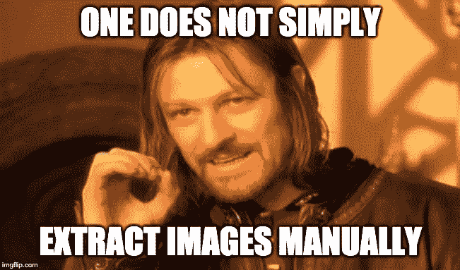
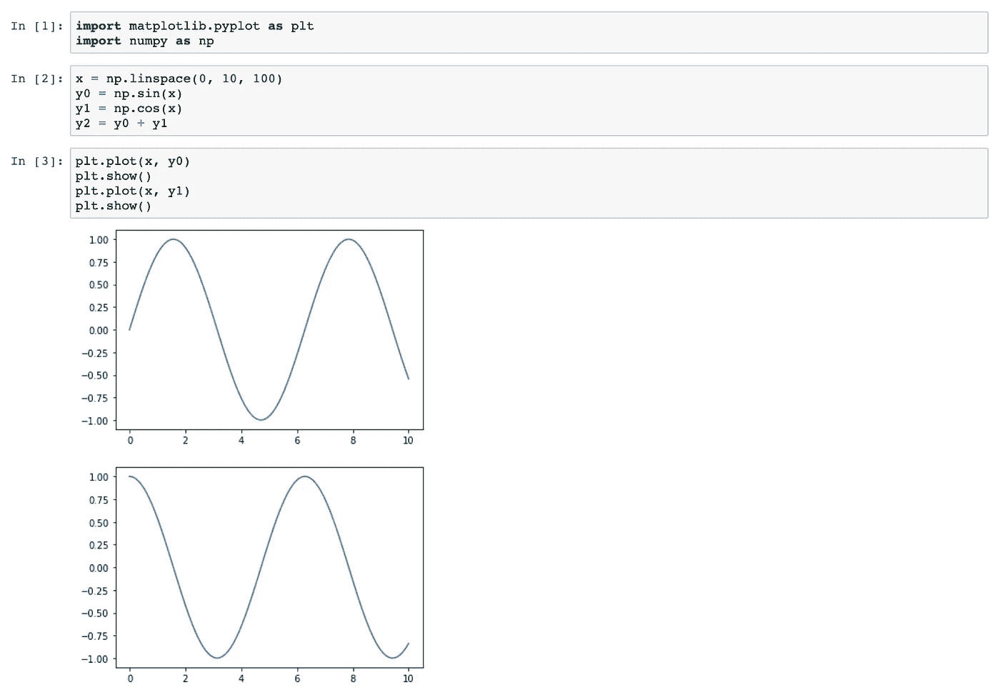

# 使用 Junix 的单一命令行从 Jupyter 笔记本中导出图像

> 原文：<https://medium.com/analytics-vidhya/export-images-from-jupyter-notebook-with-a-single-command-422db2b66e92?source=collection_archive---------1----------------------->

# 问题是

我在 Jupyter Notebook 上做了很多 EDAs，并且经常用 matplotlib 和 seaborn 之类的包通过这个过程生成很多图像。我偶尔需要导出这些情节，以便将它们包含在我的演示文稿或文档中。

我使用的导出方法非常手动:

*   **选项 1** :以编程方式保存数字(如 matplotlib 的 fig.savefig)
*   **选项 2** :右键点击图像，“图像另存为”
*   **选项三**:截图！

当我处理少量图像时，上面的这些方法工作得很好。但是，对于大量的图像，如果每天都这样做，这个过程会变得非常乏味…

当我做一些研究来寻找更自动化的解决方案时，我没有为我的用例找到任何令人满意的解决方案。

由于我不想在“将图像另存为”上浪费宝贵的时间，我决定想出自己的解决办法，并最终编写了一个名为 **Junix** 的小软件包，它可以自动完成这个过程。

下面是我在构建这个包时遵循的快速浏览过程。希望你会觉得很有见地！

如果你没有时间，你可以直接跳到回购，看看它是否适合你的用例。在[https://github . com/Damien marlier 51/JupyterNotebookImageExporter](https://github.com/damienmarlier51/JupyterNotebookImageExporter)查看



# 解决方案

# 步骤 1:查看 Jupyter 笔记本文件结构

首先，重要的是更好地理解什么是*。ipynb* 文件从内部看起来像。让我们考虑一个包含以下内容的笔记本:

```
# [cell 1] 
import matplotlib.pyplot as plt\n
import numpy as np# [cell 2]
x = np.linspace(0, 10, 100)
y0 = np.sin(x)
y1 = np.cos(x)# [cell 3]
plt.plot(x, y0)
plt.show()
plt.plot(x, y1)
plt.show()
```

代码非常简单。
它得到一个 0 到 10 之间的 100 个数字的列表。计算每个数字的正弦值和余弦值。然后使用 *matplotlib* 可视化库绘制并显示这些点。



这是它从外面看起来的样子

如果您用文本编辑器打开此笔记本，您将看到它的内部外观:

```
{
 "cells": [
  {
   "cell_type": "code",
   "execution_count": 1,
   "metadata": {
    "collapsed": true
   },
   "outputs": [],
   "source": [
    "import matplotlib.pyplot as plt\n",
    "import numpy as np"
   ]
  },
  {
   "cell_type": "code",
   "execution_count": 2,
   "metadata": {
    "collapsed": true
   },
   "outputs": [],
   "source": [
    "x = np.linspace(0, 10, 100)\n",
    "y0 = np.sin(x)\n",
    "y1 = np.cos(x)"
   ]
  },
  {
   "cell_type": "code",
   "execution_count": 3,
   "metadata": {},
   "outputs": [
    {
     "data": {
      "image/png": "iVBORw0...",
      "text/plain": [
       "<Figure size 432x288 with 1 Axes>"
      ]
     },    {
     "data": {
      "image/png": "iVBORw0...",
      "text/plain": [
       "<Figure size 432x288 with 1 Axes>"
      ]
     },
     "metadata": {},
     "output_type": "display_data"
    }
   ],
   "source": [
    "plt.plot(x, y0)\n",
    "plt.show()\n",
    "plt.plot(x, y1)\n",
    "plt.show()"
   ]
  },
  ........
}
```

嗯，没有那么可怕！

我们可以看到该文件的结构是 JSON。此外，我们可以注意到，绘制的图像是 base64 编码的，并且直接嵌入到 JSON 中，相关的关键字是“image/png”。

因此，我们的问题的快速解决方案似乎是解析笔记本文件并检索编码图像。好吧！我们走吧！

# 步骤 2:用 python 解析

为了解决我们的问题，我们需要我们的代码做以下事情:

*   将笔记本文件转换为嵌套的 python 字典
*   定位编码图像在字典中的位置
*   从字典中提取编码图像
*   将编码图像作为图像文件保存在所需文件夹中

跳过所有细节，下面是最终文件( *exporter.py)* 的样子:

[https://gist . github . com/b 722 af 3d 65 D2 af 9137 f 796145 f 0 a3 C5 e . git](https://gist.github.com/b722af3d65d2af9137f796145f0a3c5e.git)

# 第三步:打包时间！

太好了！我们现在已经准备好了一些 python 代码。
然而，如果可能的话，我不想在我的笔记本上添加额外的代码。如果我能使用命令行直接从终端导出我的图像，那就太好了。类似于下面的内容:

```
my_command -f my_notebook_filepath -o my_output_directory
```

让我们一起努力吧！

第一件事是创建一个 *setup.py* 文件。我们需要给我们的命令取一个名字。暂且称之为 **junix** (用于 JUpyter 笔记本图片导出器)。丑陋的名字，但…短。

为了让我们的 python 代码可以从命令行调用，我们需要指定一个入口点。这个入口点是一个简单的 python 函数 *main* ，它将调用我们在上面的 *exporter.py* 中的 export_images()函数。

这是我们的 *setup.py* 的样子:

```
from setuptools import setup 
setup(
    name=”junix”, 
    version=”0.1.4", 
    author=”Damien Marlier”,
    author_email=”damien.marlier@hotmail.fr”, 
    description=”Utils to export images from Jupyter notebook”,
    packages=[“junix”], 
    entry_points={
        “console_scripts”: [
            “junix = junix.cli:export_images”
        ]
    }, 
    install_requires=[ “click”, ],
)
```

这就是我们的入口点( *cli.py* )的样子:

[https://gist . github . com/Damien marlier 51/6b 820d 95043 c 52 c 20 e 807 e 314 DC 14 e 64](https://gist.github.com/damienmarlier51/6b820d95043c52c20e807e314dc14e64)

最后，下面是我们最终代码的结构:

```
.gitignore
README.md
setup.py
junix/
    - cli.py
    - junix.py
```

而且……导出可以这样执行:

```
junix -f /path/to/my/notebook.ipynb -o /path/to/folder
```

就是这样！你可以在 Github 上找到完整的代码:[https://Github . com/Damien marlier 51/JupyterNotebookImageExporter](https://github.com/damienmarlier51/JupyterNotebookImageExporter)

我花了一段时间来写这个包，但它绝对是值得的，节省了我相当多的时间！