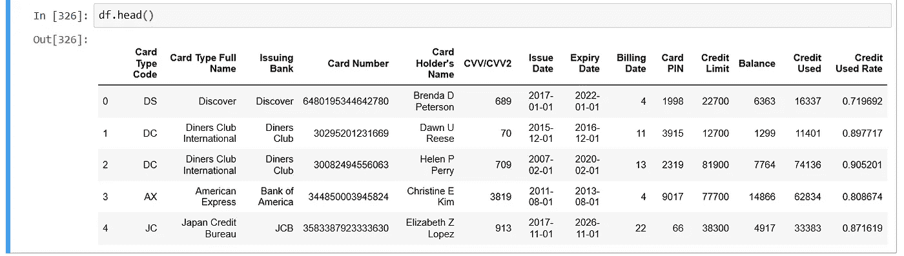

# 将数据框导出到自定义格式的 Excel

> 原文：<https://medium.com/analytics-vidhya/exporting-a-data-frame-to-custom-formatted-excel-a82a35116e92?source=collection_archive---------3----------------------->

# 介绍

你可能已经熟悉了熊猫。使用 Pandas，将数据框导出到 excel 文件非常容易。然而，这个导出的文件在外观上非常简单。

在这篇文章中，我们将尝试在格式上做一些改变，并尝试使它在视觉上更有趣。

对于这项工作，我们将主要使用熊猫。我要用的数据集是一些随机的信用卡数据。你可以在这里找到同样的。为了更好地理解，我将在下面的数据集中添加一些新列。


先从进口熊猫和 numpy 开始吧。

```
import pandas as pd
import numpy as np
```

读取文件:

“loc”变量包含数据集文件所在文件夹的名称。您可以直接将数据集文件名和位置放在一个变量中。我个人喜欢串联。正如您在下面看到的，目前该文件有 100 行和 11 列

```
loc = “Y:\\test\\”df = pd.read_excel(loc+”test_records.xlsx”)
df.shape
*#(100, 11)*
```

让我们再增加三栏——“余额”、“已用信贷”和“已用信贷率”。为了生成平衡，我们将使用 numpy 的 *random.randint* 。对于其余的两个专栏，我们可以使用简单的数学公式。

```
df["Balance"]= np.random.randint(500,15000,df.shape[0])
df["Credit Used"]= df["Credit Limit"] - df["Balance"]
df["Credit Used Rate"] = (df["Credit Used"]/ df["Credit Limit"])
df.head()
```



如果你注意到，信贷使用率是数字，但它应该是百分比格式。事后我们会改的。现在让我们将上面的数据框保存到一个 excel 文件中，而不改变任何格式。ExcelWriter 是一个将数据框写入 excel 表格的类。你可以在这里找到更多关于它的信息。

```
writer_1 = pd.ExcelWriter(loc+”test_Records_modified.xlsx”,engine = ‘xlsxwriter’)
df.to_excel(writer_1 , index=False, sheet_name= “Report”)
writer_1.save()
```


test_Records_modified.xlsx

让我们创建另一个 writer 来保存格式化的输出文件。这里我们使用 *to_excel* 函数来创建工作簿

```
writer_2= pd.ExcelWriter(loc+”test_Records_modified_2.xlsx”, engine= “xlsxwriter”)
df.to_excel(writer_2, index=False, sheet_name= “Report”)workbook_2 = writer_2.book
worksheet_2 = writer_2.sheets[“Report”]
```

现在，让我们开始格式化。我们将对上面创建的工作表进行所有更改。

首先，我们将定义格式变量，这样我们就可以在代码中需要的地方使用它们。对于这个任务，我们将使用 *add_format。*

```
*# Adding simple number format.* fmt_number = workbook_2.add_format({
 “num_format” : “0”
})*# Adding currency format* fmt_currency = workbook_2.add_format({
 “num_format” : “$#,##0.00” ,”bold” :False
 })*# Adding percentage format.* fmt_rate = workbook_2.add_format({
 “num_format” : “%0.0” , “bold” : False
})*# Adding formats for header row.* fmt_header = workbook_2.add_format({
 ‘bold’: True,
 ‘text_wrap’: True,
 ‘valign’: ‘top’,
 ‘fg_color’: ‘#5DADE2’,
 ‘font_color’: ‘#FFFFFF’,
 ‘border’: 1})#Setting the zoom
worksheet_2.set_zoom(80)
```

现在，我们将使用 *set_column 在工作表中使用上面定义的格式变量。*

```
worksheet_2.set_column("A:N", 20)
worksheet_2.set_column("K:M", 10, fmt_currency)
worksheet_2.set_column("D:D",20,fmt_number)
worksheet_2.set_column("N:N",10,fmt_rate)
```

是时候改变标题格式了。下面代码中的零表示第 0 行，这基本上是最上面的一行(标题行)。

```
for col , value in enumerate(df.columns.values):
 worksheet_2.write(0, col, value, fmt_header)
```

让我们显示某些数字列的总和，如“Balance”。

```
for col in (“Balance”, “Credit Limit”, “Credit Used”):
 position_tot = pd.Index(list(df)).get_loc(col)
 worksheet_2.write(df.shape[0]+1,position_tot,df[col].sum(axis=0))
```

拯救作家

```
writer_2.save()
```

最终的输出文件如下所示。您可以看到一些列的格式发生了变化。标题格式也不同，看起来也不一样


格式化

现在，您可以自己更改格式。