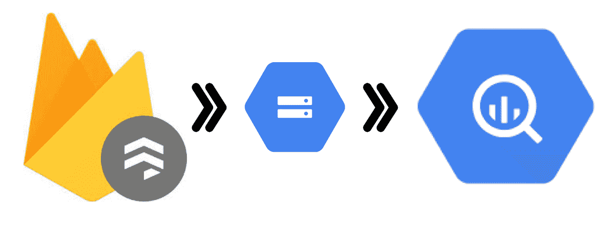

# 将集合和子集合从 Firestore 导出到 BigQuery

> 原文：<https://medium.com/analytics-vidhya/exporting-collections-and-subcollections-from-firestore-to-bigquery-a82a4b52f602?source=collection_archive---------10----------------------->



第一步是选择您的项目，如果没有选择。这里，我的项目 id 是 bigquery-sandbox-281102，项目 id 中突出显示的黄色文本表明它已经被选中。如果未激活，您必须通过键入以下内容来选择项目 id:

```
gcloud config set project [project_id]
```