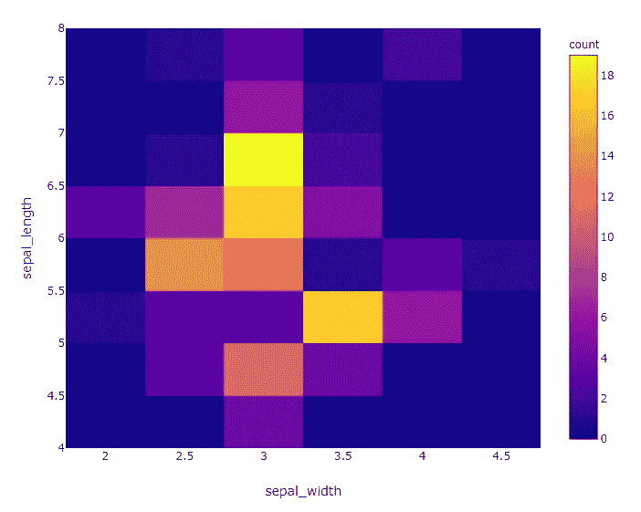

# 用 Python 实现可视化的快捷方式

> 原文：<https://medium.com/analytics-vidhya/express-way-to-do-visualization-in-python-b9bc01143553?source=collection_archive---------7----------------------->

**Plotly Express** ，一个高级 Python 可视化库，提供了一种超级快捷的方式来做数据可视化。
“Plotly Express”实际上是 Plotly 的一个高级包装器，它提供了一个更简单的语法来快速绘制复杂的图表。

只需一行代码，我们就能得到一个相当不错的图表

**注意** :
Plotly Express 以前是作为它自己单独安装的 *plotly_express* 包提供的，但现在是 Plotly 的一部分！

让我们以一种快速的方式做一些可视化的工作:
首先让我打印出我正在使用的软件和软件包的版本

```
import sys
sys.version
**Output:** 
'3.6.9|Anaconda custom (64-bit) # I am using Anaconda, python 3.6.9import plotly
plotly.__version__
**Output:** 
'4.1.0'   # I have installed plotly version 4.1.0**import plotly.express as px** # Import plotly.express
```

**散点图**

```
**# Using tips dataset.**
tips **=** px.data.tips()px.scatter(tips, x='total_bill', y='tip')
```


```
**# Lets break it down by smoker-non smoker**
px.scatter(tips, x=”total_bill”, y=”tip”, color=”smoker”)
```


```
**# Lets add facets to plot based on smoker  or non-smoker**px.scatter(tips, x=”total_bill”, y=”tip”, 
color=”sex”, facet_col=”smoker”)
```


```
**# Lets add trend lines also**px.scatter(tips, x='total_bill', y='tip', color='sex', trendline='ols', facet_col='smoker')
```


```
**# Lets explore 'day' wise how is turn out**px.scatter(tips, x='total_bill', y='tip', facet_col='day', facet_row='time', category_orders={'day':['Thur', 'Fri', 'Sat', 'Sun']})
```


```
**# Lets explore 'day' wise how is turn out using bar chart**px.bar(tips, x='day', y='total_bill', category_orders={'day':['Thur', 'Fri', 'Sat', 'Sun']})
```


```
**# Lets explore distribution of tip**px.histogram(tips, x='tip', marginal='rug')
```


```
**# Lets explore distribution of tip based on smoking habit**px.box(tips, x="smoker", y="tip", color="smoker")
```


**散布矩阵:**

```
**# We use another dataset , called as iris .**iris = px.data.iris()px.scatter_matrix(iris, dimensions=["sepal_width", "sepal_length", "petal_width", "petal_length"],color="species")
```


```
**# We use another dataset , called as gapminder.**gapminder = px.data.gapminder()
gapminder_2007 = gapminder.query("year==2007")px.scatter(gapminder_2007, x="gdpPercap", y="lifeExp", size="pop", color="continent", hover_name="country", log_x=True, size_max=60)
```


**热图:**

```
px.density_heatmap(iris, x="sepal_width", y="sepal_length")
```



**地图框:**

```
px.set_mapbox_access_token(open(".mapbox_token").read())
# token is saved in file .mapbox_token to access mapbox# Lets read a dataset carshare
df = px.data.carshare()px.scatter_mapbox(df, lat="centroid_lat", lon="centroid_lon",     color="peak_hour", size="car_hours",
color_continuous_scale=px.colors.cyclical.IceFire, 
size_max=15, zoom=10)
```


**Choropleth:** 动画图表

```
# Using gapminder datasetpx.choropleth(gapminder, locations="iso_alpha", color="lifeExp", hover_name="country", animation_frame="year", range_color=[20, 80])
```

