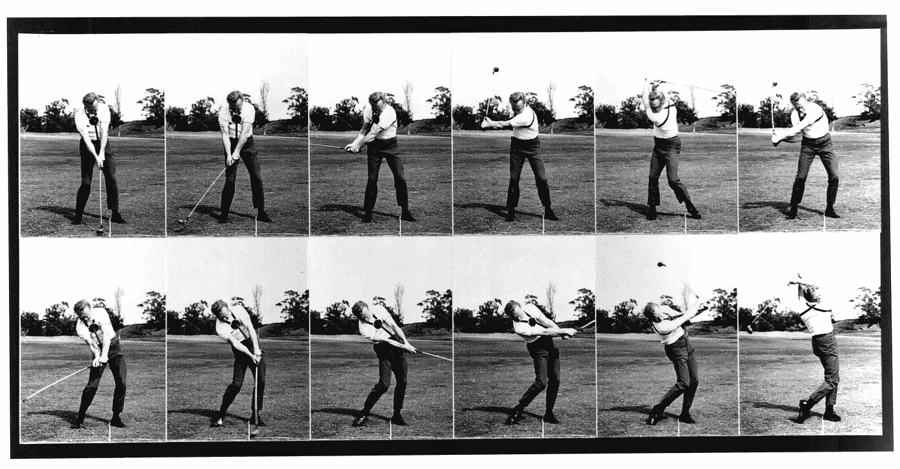
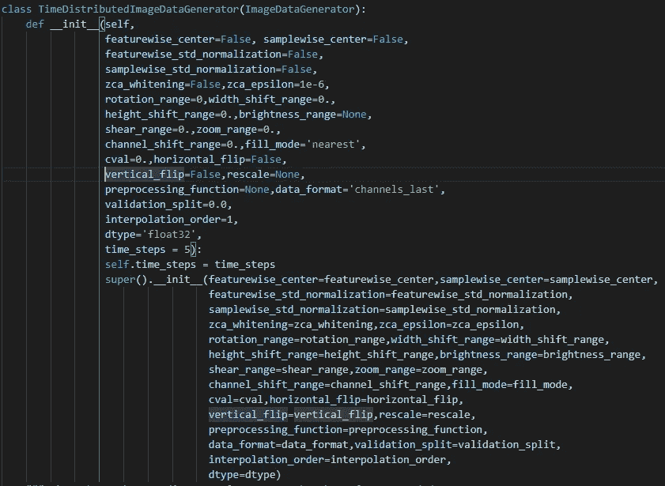
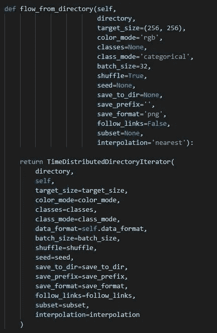

# 为时间分布层扩展 Keras 的 ImageDataGenerator

> 原文：<https://medium.com/analytics-vidhya/extending-kerass-imagedatagenerator-for-timedistributed-layer-3d5008fe10df?source=collection_archive---------12----------------------->



向 CNN 传送图像序列

**目标:**

如果您遇到以下类型的错误

> 检查输入时出错:time_distributed_1_input 应为 5 维，但得到的数组形状为(48，256，256，3)

你在正确的地方找到了答案。本文将通过扩展 Keras 优秀的[**imagedata generator**](https://keras.io/preprocessing/image/)**类在[**time distributed**](https://keras.io/layers/wrappers/)**层的使用，帮助你使用它。****

******前提:******

****我不想解释来自深度学习框架 **Keras** 的 **TimeDistributed** 层的用法。简而言之，假设您有一系列图像(视频),您希望在这些图像上构建深度网络来预测“行动”,您通常会使用这一层让 CNN 处理图像序列，然后其 o/p 将被顺序馈送到 LSTM 层。对于普通的 CNN，在图像数据的上下文中， **ImageDataGenerator** 类是为训练网络提供数据的极好方法。该生成器通常以下列格式提供数据:(BatchSize，ImageDimension)例如。(32,256,256,3).但是如果你使用**时间分布**层作为输入，数据需要以如下格式输入:(Batch，TimeSteps，ImageDimension)例如。(32,5,256,256,3).在接下来的文章中，你将会发现如何扩展 ImageDataGenerator 类来达到这个目的。****

# ******“我就是想用一下”:******

*******步骤一:*******

```
**pip install TimeDistributedImageDataGenerator**
```

*******第二步:*******

****不使用 **ImageDataGenerator** 类，而是使用**TimeDistributedImageDataGenerator******

```
**datagen = TimeDistributedImageDataGenerator.TimeDistributedImageDataGenerator(validation_split=0.2, time_steps = 5)**
```

*******第三步:*******

****下面是上面创建的 datagen 对象的用法示例****

```
**train_generator = datagen.flow_from_directory('/content/images',batch_size=48,subset='training')val_generator = datagen.flow_from_directory('/content/images',batch_size=48,subset='validation')np.shape(train_generator.next()[0])O/P : (48, 5, 256, 256, 3) -> (BatchSize,TimeSteps,ImageSize)**
```

****现在，fit 方法可以使用该数据，例如将图像序列馈送到时间分布层。****

> ****声明:这个 pip 包目前只支持 flow_from_directory()方法。****

# ******“我自己怎么做”:******

****理解如何轻松扩展 Keras 类是值得的。****

******ImageDataGenerator 的** flow_from_directory()函数基本上是返回类 **DirectoryIterator** 的对象。这个类有 method _ get _ batches _ of _ transformed _ samples()，它读取并返回一批图像。此方法需要进行调整，以返回指定图像序列的批次(time_steps)。这是通过创建 **ImageDataGenerator** 的新子类来实现的，该子类不返回**目录操作符**，而是返回**目录操作符**的新子类，其中 _ get _ batches _ of _ transformed _ samples()方法被覆盖。在下一节中，将对此进行描述。****

*******第一步:*******

****子类化原始的 **ImageDataGenerator** ，并添加 *time_steps* 作为新的参数来创建名为**timedistributedimagedata generator**()的新类****

********

****ImageDataGenerator 的子类****

*******第二步:*******

****原始的 **ImageDataGenerator** 类有我们想要重用的方法 **flow_from_directory** 。该方法返回类**director iterator**的对象，我们将在下一步中将其子类化为**time distributed director iterator**。新的**TimeDistributedImageDataGenerator**类将包含方法 flow_from_directory，该方法采用与之前完全相同的参数，但返回类**TimeDistributedDirectoryIterator 的对象。******

********

****增强的流自目录****

*******第三步:*******

****创建名为 T**imeDistributedDirectoryIterator**的新子类，继承自原始的**目录运算符**。在这个新类中，original _ get _ batches _ of _ transformed _ samples 函数得到了增强，以支持 time_steps。查看以下链接中的**时间分布指示符******

****[https://github . com/kivijoshi/TimeDistributedImageDataGenerator/blob/master/TimeDistributedImageDataGenerator/TimeDistributedImageDataGenerator . py](https://github.com/kivijoshi/TimeDistributedImageDataGenerator/blob/master/TimeDistributedImageDataGenerator/TimeDistributedImageDataGenerator.py)****

# ****结束了****

****这就是你如何覆盖原始 keras 的 **ImageDataGenerator** 来为 time_distributed 层重新使用它。****

****完整的代码请看这里****

****[](https://github.com/kivijoshi/TimeDistributedImageDataGenerator/tree/master/TimeDistributedImageDataGenerator) [## kivijoshi/TimeDistributedImageDataGenerator

### 此时您不能执行该操作。您已使用另一个标签页或窗口登录。您已在另一个选项卡中注销，或者…

github.com](https://github.com/kivijoshi/TimeDistributedImageDataGenerator/tree/master/TimeDistributedImageDataGenerator) 

感谢阅读！！****