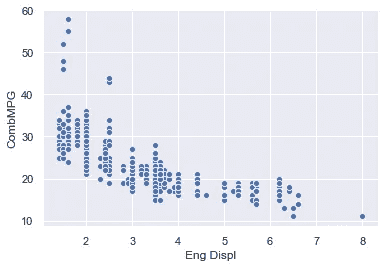

# 使用 Seaborn 绘图的广泛指南

> 原文：<https://medium.com/analytics-vidhya/extensive-guide-for-plotting-with-seaborn-cb27ce4f2c90?source=collection_archive---------8----------------------->


通过将数据表示为易于理解、探索和掌握的图表，可以将数据可视化。为了使用 Python 分析一组数据，我们使用了 Matplotlib，这是一个广泛实现的 2D 绘图库。Seaborn 基本上是一个可视化库，位于 Matplotlib 之上，它所做的只是让它看起来更漂亮一点。

Seaborn 是一个开源软件，它提供了使用 Python 编程语言可视化数据的高级 API。它还有一堆独特的图表和图形，是我们在 Matplotlib 中没有的。

**进口方面的海博**

*   用于可视化单变量和双变量分布的函数。
*   一种绘制统计时间序列数据的功能，具有灵活的估计和估计不确定性的表示。
*   可视化数据矩阵并使用聚类算法来发现这些矩阵中的结构的函数。
*   用于构建绘图网格的高级抽象，使您可以轻松构建复杂的可视化。
*   用于选择调色板的工具，以生成显示数据中模式的美丽绘图。
*   用于设计 Matplotlib 图形样式的几个内置主题

# 安装 Seaborn

要安装 Seaborn 的最新版本，可以使用`pip`:

```
pip install seaborn
```

也可以使用`conda`安装发布版本:

```
conda install seaborn
```

或者，你可以使用`pip`直接从 GitHub 安装开发版:

```
pip install git+https://github.com/mwaskom/seaborn.git
```

另一个选择是克隆 [GitHub 库](https://github.com/mwaskom/seaborn)并从您的本地副本安装:

```
pip install
```

# 进口海鲜

让我们导入 Matplotlib 库，它帮助我们定制我们的绘图。

```
# Matplotlib for additional customization
from matplotlib import pyplot as plt
```

我们将使用以下命令导入 Seaborn 库

```
import seaborn as sb
```

# 操纵图形美学

Matplotlib 是高度可定制的，但他们同时会使它变得复杂，因为很难知道调整什么设置才能获得好看的绘图。

让我们看看它是如何工作的:

```
#matplotlib inline
import numpy as np
import matplotlib as mpl
import matplotlib.pyplot as plt
import seaborn as snsnp.random.seed(sum(map(ord, "aesthetics")))#Define a simple plot function, to plot offset sine waves
def sinplot(flip=1):
    x = np.linspace(0, 14, 100)
    for i in range(1, 7):
        plt.plot(x, np.sin(x + i * .5) * (7 - i) * flip)
sinplot()
```

这是 Matplotlib 默认情况下的绘图:


如果你想切换到 Seaborn 默认值，调用它的' set '函数:

```
sns.set()
sinplot()
```

输出:


# Seaborn 人物造型

Seaborn 提供了五种预设主题:

1.  白色网格
2.  深色网格
3.  怀特（姓氏）
4.  黑暗
5.  一会儿

**深色网格**是默认的。白色网格主题与此类似，但更适合具有大量数据元素的绘图，以切换到白色网格:

```
sns.set_style("whitegrid")
data = np.random.normal(size=(20, 6)) + np.arange(6) / 2
sns.boxplot(data=data)
```

输出:


## **移除网格**

对于许多地块，网格是不太必要的。通过添加以下代码片段来删除它:

```
sns.set_style("dark")
sinplot()
```

输出:


或者试试白色背景:

```
sns.set_style("white")
sinplot()
```

输出:


## **结构化图**

有时给情节一点额外的结构，这就是记号派上用场的地方:

```
sns.set_style("ticks")
sinplot()
```

输出:


## **移除轴棘**

您可以调用`despine`函数来删除它们:

```
sinplot()
sns.despine()
```

输出:


当记号没有覆盖轴的整个范围时，修剪参数将限制幸存脊椎的范围:

```
f, ax = plt.subplots()
sns.violinplot(data=data)
sns.despine(offset=10, trim=True)
```

输出:


您还可以控制它删除哪些带有附加参数的棘点以 *despine* :

```
sns.set_style("whitegrid")
sns.boxplot(data=data, palette="deep")
sns.despine(left=True)
```

输出:


## **暂时设置图形样式**

`axes_style()`当需要设置图样式时，临时会有帮助:

```
with sns.axes_style("darkgrid"):
   plt.subplot(211)
   sinplot()
plt.subplot(212)
sinplot(-1)
```

输出:


## **覆盖样式元素**

可以将一个参数字典传递给`axes_style()`和`set_style()`的`rc`参数，以便自定义图形。

*注意:通过这个方法，我只能覆盖样式定义中的参数。对于其他的，使用* `*set()*` *，因为它需要所有的参数。*

然后，您可以设置这些参数的唯一版本:

```
sns.set_style("darkgrid", {"axes.facecolor": ".9"})
sinplot()
```

输出:


## **缩放绘图元素**

让我们试着操纵情节的尺度。我们可以通过调用 set()来重置默认参数:

```
sns.set()
```

四个预设的上下文是—纸张、笔记本、谈话和海报。笔记本样式是默认样式，用于上面的图中:

```
sns.set_context("paper")
sinplot()
```

输出:


```
sns.set_context("talk")
sinplot()
```

输出:


# **从绘图开始**

可视化数据是一个步骤，进一步使可视化数据更令人愉快是另一个步骤。

可视化是一种以有效和最简单的方式表示数据的艺术。美学意味着一套关于美的原则，尤其是在艺术中。

让我们首先加载一个关于 2019 年车型年车辆的真实数据集，并使用 Matplotlib 绘制一个直方图，以查看几个档位的分布。

```
 %matplotlib inlineimport pandas as pd#Dataset import
df = pd.read_csv(“[http://media.sundog-soft.com/SelfDriving/FuelEfficiency.csv](http://media.sundog-soft.com/SelfDriving/FuelEfficiency.csv)")gear_counts = df[‘# Gears’].value_counts()gear_counts.plot(kind=’bar’)
```

输出:


图 1:使用 Matplotlib

我们可以加载 Seaborn，只需对它调用 set()就可以将 Matplotlib 的默认设置更改为更具视觉效果的设置。

```
import seaborn as sns
sns.set()
```

现在，如果我们做同样的情节命令，它看起来更现代一点。我们将 Matplotlib 建立在 Matplot 的基础上，它的可视化默认值坦率地显示了它们的年龄。

```
gear_counts.plot(kind**=**'bar')
```

输出:


图 2:使用 Seaborn

此外，我们将看到各种类型的绘图，这将让您清楚地了解如何在需要时实施:

## 1.显示

Seaborn 包括 Matplotlib 没有提供的许多类型的情节。例如，*“distplot”*可以绘制直方图以及覆盖在其上直方图的平滑分布。让我们以此数据库中车辆的 MPG 值分布为例:

```
sns.distplot(df[‘CombMPG’])
```

输出:


## **2。配对图**

你经常遇到的是 Seaborn 的“结对情节”。这使您可以将各种属性的每种组合的图可视化，因此您可以在特征之间寻找有趣的模式。

作为一个例子，让我们根据发动机中有多少个气缸对汽车进行分类，并寻找气缸、城市 MPG 等级、公路 MPG 等级和综合 MPG 等级之间的关系。

```
df2 = df[['Cylinders', 'CityMPG', 'HwyMPG', 'CombMPG']]
sns.pairplot(df2, height=2.5);  
#Seaborn currently has a bug with the hue parameter so we've omitted it
```

输出:


通过研究上述结果，您可以看到气缸数量和 MPG 之间存在一定的关系，但 4 缸车辆的 MPG 范围非常广，并且呈现出良好的线性关系。

## **3。散点图**

Seaborn 1.9 还包括了“散点图”，听起来确实如此。它绘制了您选择的两个轴上的单个数据点，因此您可以看到数据在这些维度上的分布情况。

```
sns.scatterplot(x=”Eng Displ”, y=”CombMPG”, data=df)
```

输出:



## **4。接合图**

Seaborn 还提供了一个“jointplot ”,它结合了散点图和两个轴上的直方图。这使您可以同时看到单个数据点和两个维度上的分布。

```
sns.jointplot(x=”Eng Displ”, y=”CombMPG”, data=df)
```

输出:


## **5。内爆**

“lmplot”是一个散点图，但是计算出一条线性回归线并叠加到数据上。

```
sns.lmplot(x=”Eng Displ”, y=”CombMPG”, data=df)
```

输出:


## **6。箱线图**

接下来，我们来看一个“盒状图”。，这对于可视化某个类别的典型值很有用，不会被异常值分散注意力。

每个方框代表数据的第一个和第三个四分位数之间的范围，一条线代表中值。从框中延伸出来的“胡须”代表其余数据的分布，除了清晰的异常值，这些异常值被绘制为胡须外部的单个点。

例如，让我们看看每个汽车制造商的箱线图，可视化他们生产的汽车的每加仑英里数。这让我们可以看到每个制造商提供的所有车辆的 MPG 评级的分布情况。

```
sns.set(rc={'figure.figsize':(15,5)})
ax=sns.boxplot(x='Mfr Name', y='CombMPG', data=df)
ax.set_xticklabels(ax.get_xticklabels(),rotation=45)
```

有很多制造商，所以为了使结果图可读，我们将增加 Seaborn 的默认图形大小，并使用 *set_xticklabels* 将标签旋转 45 度。

输出:


## **7。群集图**

另一种可视化相同数据的方法是“群体图”它绘制的不是方框和触须，而是每一个单独的数据点——但这样做的方式是根据它们的分布将它们组合在一起。

```
ax=sns.swarmplot(x='Mfr Name', y='CombMPG', data=df)
ax.set_xticklabels(ax.get_xticklabels(),rotation=45)
```

输出:


## **8。计数图**

另一个工具是“计数图”这和直方图基本上是一样的，只是针对分类数据。它可以让你计算 X 轴上每个给定类别在数据中出现的次数，并绘制图表。例如，我们可以看到通用汽车公司提供的车型比其他任何公司都多，宝马紧随其后。

```
ax=sns.countplot(x='Mfr Name', data=df)
ax.set_xticklabels(ax.get_xticklabels(),rotation=45)
```

输出:


## **9。热图**

让我们来看看锡伯恩的热图。热点图允许您绘制某种表格形式的 2D 数据，用颜色表示 2D 表每个单元格中的单个值。

在本例中，我们将从原始数据框创建一个数据透视表，以创建一个 2D 表，其中包含几个气缸和发动机排量的每种组合的平均 MPG 评级。

生成的热图显示了沿 X 轴的所有发动机排量值和沿 Y 轴的所有气缸排量值。

对于表中的每个单元格，我们不是用数字来表示气缸和发动机排量组合的实际平均 MPG 等级，而是用一种颜色来表示，颜色范围从深色表示小数值，浅色表示大数值。

```
df2 = df.pivot_table(index='Cylinders', columns='Eng Displ', values='CombMPG', aggfunc='mean')
sns.heatmap(df2)
```

这可以让您直观地看到一个清晰的趋势，当我们从图表的左上移到右下时，情况会逐渐变暗。这是有道理的。我们将较高的 MPG 等级与较低的气缸数量和较低的发动机排量值联系起来。

当我们使用 8 升 16 缸发动机时，平均每加仑汽油行驶里程最差，约为 12 英里，用黑色表示。

这个图表有很多缺失的数据，但是热图很好地处理了这些数据。3 缸 8 升发动机是不存在的！

输出:


# 结论

在这一课中，我们已经看到了 [Seaborn](https://seaborn.pydata.org/) 使得操纵原始图表变得容易。我们已经看到了缩放和改变上下文的例子。

Seaborn 使数据可视化更容易，更容易阅读和理解。希望本指南能帮助你更好地控制自己的数据，并以漂亮的方式可视化图表。

[1]https://sundog-education.com/datascience/

[2]https://seaborn.pydata.org