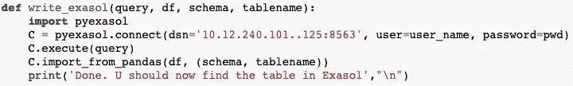

# 使用 Python 从数据库云服务器数据库中提取和写入数据

> 原文：<https://medium.com/analytics-vidhya/extract-and-write-data-from-exasol-database-with-python-6f353d208ac6?source=collection_archive---------3----------------------->

## 从 Exasol 数据库中读取表格，并将其用作 pandas 数据框架。将 python 数据帧写入 Exasol 表。

# 介绍

无论是数据科学家、数据分析师还是数据工程师，都需要访问来自多个来源的大量数据。需要提取、组合和分析这些数据来创造价值。这个博客有助于提供从您的 jupyter 笔记本(或您想在其中使用它的任何其他 IDE)对 Exasol 数据源的访问。

# Exasol

连接到 Exasol 非常简单→有一个名为 **Pyexasol** 的专用包可以为我们完成大部分工作。我们需要做的就是导入并使用它。

# **数据提取**

用于连接 Exasol 数据库的函数

命令行语法可以在 python notebook 中编写，只需添加符号“！”在行首。*由此行之！pip install pyexasol"* 简单安装 pyexasol 包。

> 函数 connect_exasol 将 SQL 查询作为输入，并以 pandas 数据帧的形式返回查询的输出表。用户名(代替用户名)和密码(代替密码)等身份验证细节必须在函数中设置一次。还要确保数据源名称(dsn)字符串是正确的。

***用法举例***

可以从数据库中提取的示例查询

# **从 pandas 向 Exasol 写入数据**

将数据从 pandas 数据框架写入数据库云服务器的功能

函数 write_exasol 在

> 创建新的空表的 SQL 查询、需要插入到表中的数据帧、要插入数据的模式以及要插入数据的表名

确保新创建的表和 dataframe 的维度相同。

***用法*举例**

一旦创建了上述函数，就可以重用它来创建 exasol 表，如下所示。

**步骤 1** :作为将表写入 exasol 的第一步，需要在 Exasol 中创建一个空表。务必确保创建的列数和列的数据类型与需要推入表中的数据相匹配。

**第二步**:执行 write_exasol 函数。在下面的示例中,“jobrole”是一个需要在 Exasol 中保存为表格的 python 数据帧。最后两个参数分别是模式名和表名(确保这与新创建的空表匹配)。

将数据从 pandas 数据框架写入数据库云服务器

# **结论**

这种连接可用于自动执行任务，通过数据库和 python 之间的轻松数据交换，我们可以释放 python 及其各种库的功能，并使用它来执行大数据的多种分析。