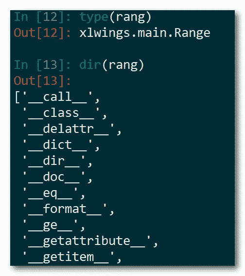
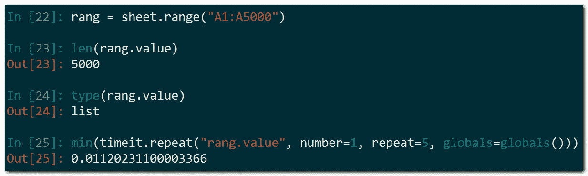
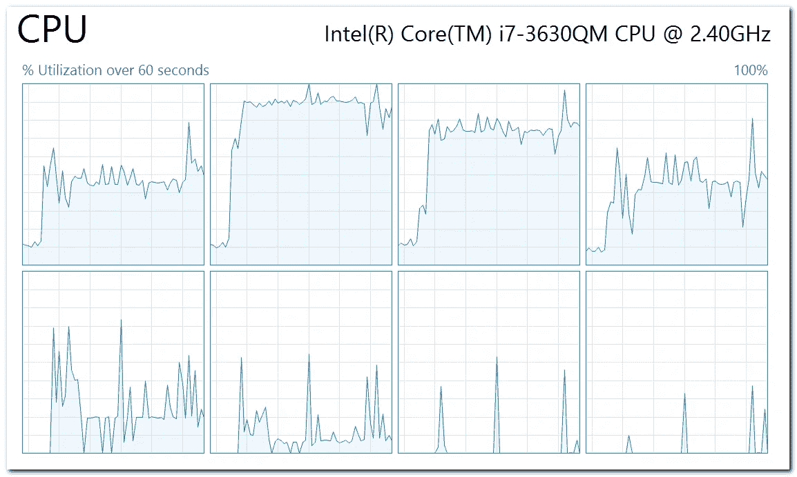

# 并行提取 Excel 数据

> 原文：<https://medium.com/analytics-vidhya/extract-excel-data-in-parallel-181838c4ed37?source=collection_archive---------7----------------------->


尽管有些人因为 Excel 的[限制](https://support.office.com/en-us/article/excel-specifications-and-limits-1672b34d-7043-467e-8e27-269d656771c3)以及[未记录的限制](https://stackoverflow.com/a/3681908/1860314)而不喜欢 Excel，但是这个程序却[无处可去](/@hypergiant/why-are-you-still-using-excel-fef6c3821a7b)。在大数据和 AI 越来越普遍的情况下，这有些违背直觉。

然而，在我的工作中，有时我必须处理复杂的 Excel 文件，例如> 7000 行、> 100 列和> 30 张表格。有一种需求，给定一个 Excel 文件一年，你有另一个另一年；并且必须比较这两个文件以查明差异(如果有的话)。毫无疑问，手动做这个是*劳动密集、枯燥且容易出错的*。我自然会想到通过编程来实现这些任务的自动化。

在 Python world(我最喜欢的编程语言和生态系统)里，我找到了几个库:`xlwings`、`openpyxl`；这里优雅地描述了他们的不同之处[。需要注意的一点是，微软 Office 格式，尤其是 Excel，是](https://stackoverflow.com/questions/58328776/differences-between-xlwings-vs-openpyxl-reading-excel-workbooks)[标准化的](https://en.wikipedia.org/wiki/Office_Open_XML)。该文件实际上是一个压缩文件夹，里面包含许多 XML 文件，如果您确切地知道如何在底层利用该格式，就可以超级高效地提取 Excel 属性。在我的例子中，`xlwings`被选中是因为它包含了微软的库；从而使其功能全面(像 VBA 一样强大)。然而，因为它是羽翼丰满，预计开销和缓慢。

# 我们开始吧

在 Excel 文件中提取数据的示例源代码在我的 [GitHub](https://github.com/ThachNgocTran/ExtractExcelDataInParallel) 上。希望它能帮助人们快速解决 Excel 数据- *提取的问题。*

在微软的函数库上运行需要预先在机器上安装 Office 应用程序。根据*特定用例*，提取单元格值、单元格公式、单元格背景颜色，甚至单元格缩进级别。在不知道调用哪个(Python 的`xlwings`)范围属性的情况下，`dir(rang)`喜欢下面的快速技巧，然后参考官方文档[2]。



探索产品系列的功能

常用属性，如值、公式，可以快速获取，即使`Range`覆盖了许多单元格。返回的结果格式合理。也就是说，如果调用`Range("A1").value`，则返回浮点型、字符串型或日期时间型的*单值*；如果`Range("A1:A2")`，返回一个 2 元列表；如果`Range("A1:B2")`，返回一个列表列表，代表行和列。

即使`Range`跨越> 1000 个单元，其*值*也能闪电般暴露。问题是当涉及到非内置属性时，比如条件格式中的`IndentLevel`或`Color`，其中*低级*单元格必须通过`xlwings` ) `rang.api`，具体是`rang.api.Cells(1, 1).DisplayFormat.Interior.Color`来访问。这种低水平使得计算成本很高:一个细胞需要几毫秒。对于一个小区来说不算多，但是成千上万个小区将导致实质性的延迟。


调用低级功能

让我们尝试用两种方法提取 1000 个细胞:直接通过`rang.value`和通过`rang.api.Cells(row_idx, col_idx).value`:



直接获取单元格数值数组

****

**逐个获取单元格值的数组**

****外卖* : 1150 倍*慢*。***

***时间不是唯一要浪费的东西。CPU 也是。在逐个获取单元值的过程中，许多 CPU 内核会持续使用。***

******

***这就是如果考虑到`[multiprocessing](https://docs.python.org/3.8/library/multiprocessing.html)`的话，我希望进一步提速的原因。相关技术有[并发](https://docs.python.org/3/library/asyncio.html)和[多线程](https://docs.python.org/3/library/threading.html)。然而，它们更适合于受 *I/O 限制的*任务，例如访问网络或硬盘。像我们正在做的提取细胞很可能会受到 CPU 的限制。正因如此，Python 的`multiprocessing`更合适。***

***假设必须挖掘单元的`Locked`状态，l *低级*访问`Cell`是必须的。如图所示，预计需要更多的时间和 CPU 但是，我们还是尽力了:***

```
*pool = **Pool**(specified_cpu_count, initialize, ())  
cell_values = list(map(lambda request: (request, extract_func), requests))
results = pool.**starmap**(extracting_data, cell_values)*
```

***在处理数千个复杂的 Excel 文件的情况下，执行速度会变得难以忍受*对单元格的低级访问是必须的(这一点怎么强调都不为过！).幸运的是，*直接*挖掘深埋在上述 *raw* zipped-xml-folder 格式中的那些信息可能是一个有前途的替代选择。我认为最完美的解决方案是最能满足我们特定需求的方案——这是我从《企业世界》中学到的一课。****

# ****实验****

****在 [GitHub](https://github.com/ThachNgocTran/ExtractExcelDataInParallel) 上，给定`requests.txt`，指定一个*感兴趣区域*的列表。它的结构不言自明。我在两种模式下运行脚本。****

****一个用于一次性提取单元格值:****

```
**python main_program -num_core 4 -cell_mode value_fast
-----------------------------------------
**2019-12-03 20:27:23 INFO     Start processing Excel files.
2019-12-03 20:27:26 INFO     Finish processing Excel files.**
2019-12-03 20:27:26 INFO     Collected Dataframe: (5001, 2).
**2019-12-03 20:27:26 INFO     First row: [Central America and the Caribbean Antigua and Barbuda |]**
2019-12-03 20:27:26 INFO     Collected Dataframe: (5001, 2).
2019-12-03 20:27:26 INFO     First row: [Baby Food|Online]
2019-12-03 20:27:26 INFO     Collected Dataframe: (5001, 2).
2019-12-03 20:27:26 INFO     First row: [M|12/20/2013]
2019-12-03 20:27:26 INFO     Collected Dataframe: (5001, 2).
2019-12-03 20:27:26 INFO     First row: [957081544|01/11/2014]
2019-12-03 20:27:26 INFO     Done**
```

****另一个是一个接一个地做:****

```
**python main_program -num_core 4 -cell_mode value_aggressive
-----------------------------------------
**2019-12-03 20:17:35 INFO     Start processing Excel files.
2019-12-03 20:21:50 INFO     Finish processing Excel files.**
2019-12-03 20:21:50 INFO     Collected Dataframe: (5001, 2).
**2019-12-03 20:21:50 INFO     First row: [Central America and the Caribbean Antigua and Barbuda |Central America and the Caribbean Antigua and Barbuda ]**
2019-12-03 20:21:50 INFO     Collected Dataframe: (5001, 2).
2019-12-03 20:21:50 INFO     First row: [Baby Food|Online]
2019-12-03 20:21:50 INFO     Collected Dataframe: (5001, 2).
2019-12-03 20:21:50 INFO     First row: [M|12/20/2013]
2019-12-03 20:21:50 INFO     Collected Dataframe: (5001, 2).
2019-12-03 20:21:50 INFO     First row: [957081544|01/11/2014]
2019-12-03 20:21:50 INFO     Done**
```

****除了在执行时间方面的巨大差异(3 英寸对 4 英寸 15 英寸)，一个微妙的差异是主动模式可以提取单元格`B1`，它是由*合并*和`A1`。这只能通过*低级*访问来实现。****

****`multiprocessing`的代价是需要更多内存。在代码中，每个进程都有其*自己的*Excel 实例，为*提供一个给定的文件路径*！为了进一步提高效率，人们可以重写代码，以利用每个进程的单个 Excel 实例*来打开许多 Excel 文件；或者使用某种缓存机制在一段时间后关闭未使用的工作簿。*****

# ****结论****

****其中，`xlwings`允许我们*提取 Excel 文件中的*数据。它的优点(全功能/类似 VBA，开发时间快)和缺点(在某些任务上很慢，依赖于微软)也被讨论。但是我们通过利用 Python 的`multiprocessing.Pool`缓解了速度慢的问题。与主要由*构建* Excel 文件的开发人员相比，主要由*提取* Excel 数据的开发人员可能有不同的偏好。****

****如果`multiprocessing`仍然不够，分布式计算是下一个考虑。参见[3]。****

****我花在学习`xlwings`上的时间并不显著；结果，我可能漏掉了一些要点。欢迎你的建议。祝编码愉快！****

# ****参考****

****[1][https://docs . XL wings . org/en/stable/threading _ and _ multi processing . html](https://docs.xlwings.org/en/stable/threading_and_multiprocessing.html)****

****[2][https://docs.xlwings.org/en/stable/api.html](https://docs.xlwings.org/en/stable/api.html)****

****[3][https://rise . cs . Berkeley . edu/blog/modern-parallel-and-distributed-python-a-quick-tutorial-on-ray/](https://rise.cs.berkeley.edu/blog/modern-parallel-and-distributed-python-a-quick-tutorial-on-ray/)****