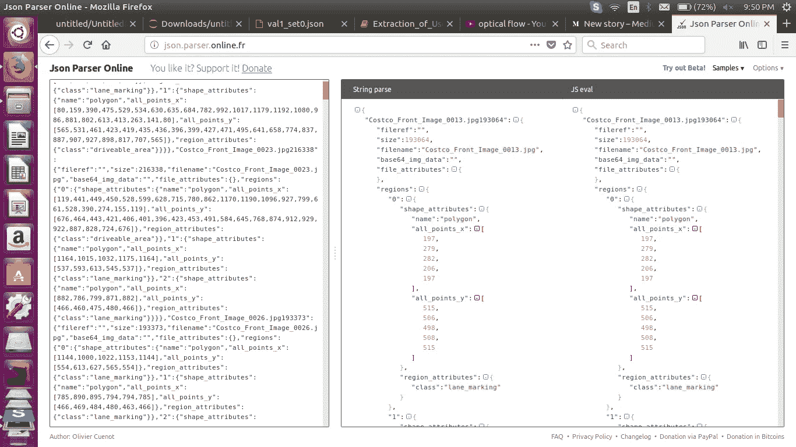
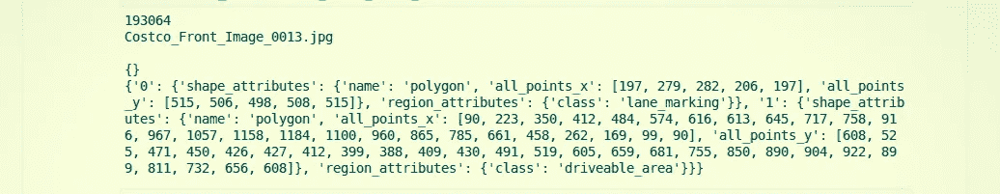
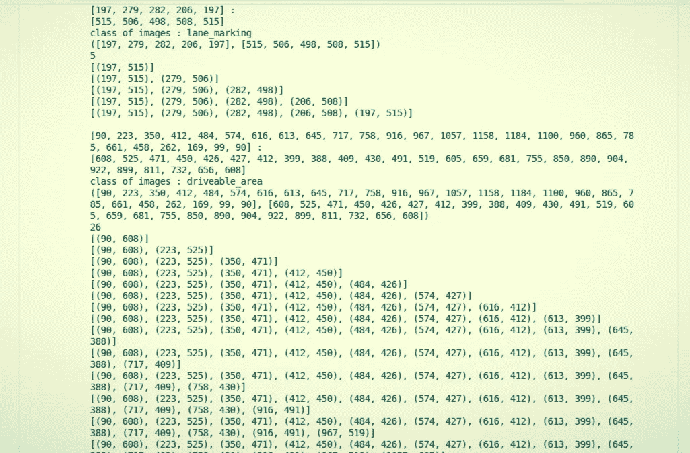
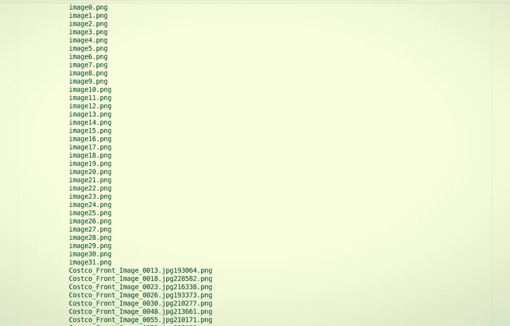

# 从 JSON 文件中提取对机器学习有用的数据

> 原文：<https://medium.com/analytics-vidhya/extract-the-useful-data-from-jason-file-for-data-sceince-34ed5ae0b350?source=collection_archive---------0----------------------->


使用-JSON-Data-in-Python _ waterwed . JPEG

在开始解析和提取之前，您需要做以下事情:

1.  [***杰森文件***](https://github.com/ankitAMD/untitled/blob/master/val1_set0.json) ***。*(下载文件)**
2.  [***Jupyter 笔记本***](http://jupyter.org/) ***。***
3.  ***一些重要的模块命名为 Numpy，Matplotlib 等等。***
4.  [***Jason 解析器***](http://json.parser.online.fr/) ***(了解 Jason 文件的数据，以便提取有用的数据)。***



**图 1** : **JSON 解析器在线解析**

5. [***GitHub 账号***](https://github.com) ***(存储你当前的项目)。***

**6。*代码开始—***

*   操作系统模块提供的功能允许您与运行 Python 的底层操作系统进行交互——无论是 Windows、Mac 还是 Linux。

[https://gist . github . com/anki tamd/e1d 2285 c 0558 bd1c 1732 a 7 B4 df 97 f 984](https://gist.github.com/ankitAMD/e1d2285c0558bd1c1732a7b4df97f984)

NumPy 包用于执行不同的操作，而 Matplotlib 是 Python 编程语言及其数字数学扩展 NumPy 的绘图库。

[https://gist . github . com/anki tamd/b65b 985497 eedd 7 fc 6 EAC 48d 96 f 07 beb](https://gist.github.com/ankitAMD/b65b985497eedd7fc6eac48d96f07beb)

*   导入以下包:

[https://gist . github . com/anki tamd/633 e 54 ab 7a 9167075d 689 b 06207271 DD](https://gist.github.com/ankitAMD/633e54ab7a9167075d689b06207271dd)

[https://gist . github . com/anki tamd/E1 e 557208976120 fc 89 c 74 BD 0 b 69 DD 41](https://gist.github.com/ankitAMD/e1e557208976120fc89c74bd0b69dd41)



**图 2:上述代码的输出** / **尝试逐行运行代码，以便更直观。**



图 3:上面代码的输出。



图 4:上面代码的输出。

在代码中……..

```
fill ="yellow"           **# Use for Colour**
```

在代码中……..

```
draw.polygon((points), fill = “green”) **#Use for draw the Polygon .**
```

在代码中……

```
image.show()             **#Use for show the image .**
```

在代码中……..

```
image.save(kk)           **#Use for saving the image .**
```

………………………………………………………………………………….

**分析代码，逐行执行#Code#。**

**也可以去我的** [**github**](https://github.com/ankitAMD/Optical-Flow_JASOn-extraction) **个人资料获取更多更好的代码直觉。**

感谢您的阅读。

更多轻松有趣的文章，请鼓掌关注。

[](/analytics-vidhya/what-and-why-opencv-3b807ade73a0) [## OpenCV 是什么，为什么这么受欢迎？

### OpenCV 是用于实时计算机视觉的编程函数库。它还支持深度…

medium.com](/analytics-vidhya/what-and-why-opencv-3b807ade73a0) [](https://github.com/ankitAMD/Optical-Flow_JASOn-extraction) [## anki tamd/光流 _ JASOn-提取

### JASOn_Extraction_Points 并使用这些点在视频上绘制多边形，只有那些区域显示光流。…

github.com](https://github.com/ankitAMD/Optical-Flow_JASOn-extraction) [](https://www.instagram.com/ankit974/) [## Ankit (@ankit974) * Instagram 照片和视频

### 73 个关注者，88 个关注者，5 个帖子-见来自 Ankit (@ankit974)的 Instagram 照片和视频

www.instagram.com](https://www.instagram.com/ankit974/)