# 提取转换负载(ETL)以供图书抓取

> 原文：<https://medium.com/analytics-vidhya/extract-transform-load-etl-for-books-to-scrape-b0ff5f83095d?source=collection_archive---------6----------------------->

使用 Python 库从网站上抓取图书信息。

# 使用 Python 进行 Web 抓取

# 什么是网页抓取？

网络抓取是从网站提取数据的过程。所有的工作都是由一段叫做“刮刀”的代码来完成的。首先，它向特定网站发送“GET”查询。然后，它根据收到的结果解析 HTML 文档。完成后，scraper 会在文档中搜索您需要的数据，并最终将其转换为指定的格式。

# 什么是 ETL？

ETL 是当今数据驱动营销的基础，即使它是一个你不太听说的缩写。它本质上将分析部分与之前的所有东西分开。

它代表提取、转换和加载，本质上描述了一个三步过程。

## **提取**

提取数据是指从特定来源获取数据，并以收集所有相关数据的方式进行。为了 ETL 能够很好地工作，数据需要直接来自源，并且是以最原始的形式。

本教程使用的网站是 Books to scrap(【http://books.toscrape.com/】T2)。这是一个合法进行网络抓取的网站。

在我们开始收集数据之前，我们需要确定哪些数据需要收集。网站上提供了以下信息:

*   书名
*   价格
*   有效性
*   图像
*   种类
*   等级

我们仅采用选定的信息来执行收集过程，这些信息包括:

*   书名
*   价格
*   有效性
*   种类
*   等级

**在主页上查找图书网址。**

第一步:获取主页的内容

第二步:在主页上找到图书的网址

第 3 步:通过添加其他子标签在树中更深入地挖掘

步骤 4:通过相加得到“href”值。get("href ' ')到上一步

步骤 5:使用 findAll()函数一次性收集主网页上所有产品的 URL。

**在主页上查找图书类别的网址。**

尝试检索不同产品类别对应的 URL:

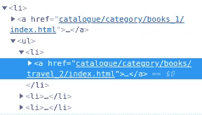

检查 HTML 代码

通过检查，我们可以看到 HTML 代码遵循相同的 URL 模式，即“目录/类别/书籍”。

我们可以使用 BeautifulSoup 来匹配包含此模式的 URL，以便更容易地检索类别 URL。

**刮去所有书籍数据**

我们知道如何在给定的页面中找到书籍的链接。如果所有的书都显示在同一页上，就很容易进行刮擦。然而，这个网站在多个页面上展示产品。我们可以在主页的底部看到，有 50 个产品页面和一个按钮“下一步”进入下一页。

主页的结尾

在接下来的页面上，还有一个“上一页”按钮，可以返回到上一个产品页面。

第二页结束

**获取所有页面的网址**

为了获取所有产品的网址，我们需要能够通过所有的网页。为此，我们可以反复查看所有“下一步”按钮。

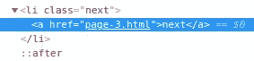

检查 HTML 代码

如果我们在匹配“页面”时有两个结果，我们应该采用第二个结果，因为它将对应于下一页。对于第一页和最后一页，我们将只有一个结果，因为我们将有“下一页”按钮或“上一页”按钮。

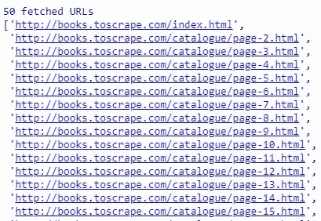

成功管理的 URL 的一些例子

我们成功地获得了 50 页的网址。有趣的是，这些页面的 URL 是高度可预测的。我们可以通过将“page-X.html”递增到 50 来创建这个列表。

这个解决方案在这个例子中是可行的，但是如果页面数量发生变化(例如，如果网站决定在每页上打印更多的产品，或者如果目录发生变化)，这个解决方案就不再可行了。

一种解决方案是增加这个值，直到我们得到一个 404 页面。

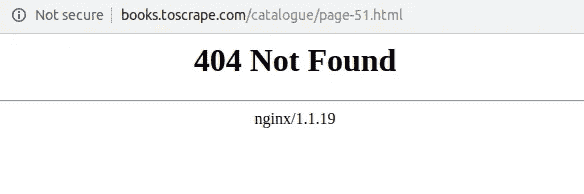

显示 404 错误页面的页面

这里我们可以看到，试图转到第 51 页实际上会导致 404 错误。

幸运的是，请求的结果有一个非常有用的属性，可以向我们显示 HTML 请求的返回状态。

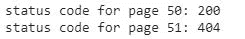

状态代码的示例

代码 200 表示没有错误。404 代码告诉我们没有找到该页面。

我们可以使用这些信息来获取所有页面的 URL:我们应该迭代直到得到 404 代码。

现在让我们试试这个方法:

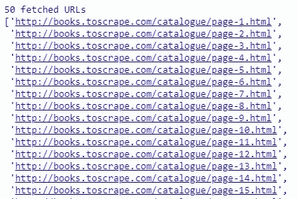

使用另一种方法成功管理的 URL 的一些示例

我们设法使用这个更简单的方法获得相同的 URL。

**获取所有产品的网址**

现在，下一步是获取每个页面的所有产品 URL。这一步非常简单，因为我们已经有了所有页面的列表和从页面获取产品 URL 的功能。

让我们遍历页面并应用我们的函数:

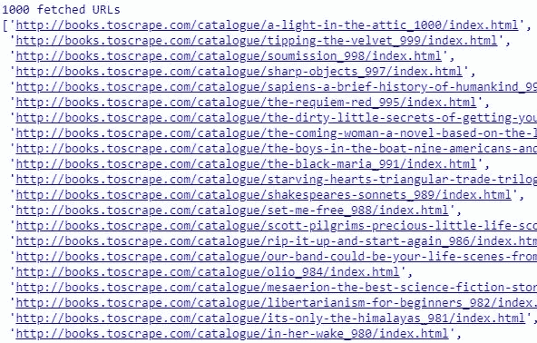

产品 URL 的一些例子

我们终于得到了 1000 本书的网址。这对应于网站上显示的号码。

**获取产品数据**

最后一步是收集每个产品的数据。让我们先来看看产品页面上的信息是如何组织的:

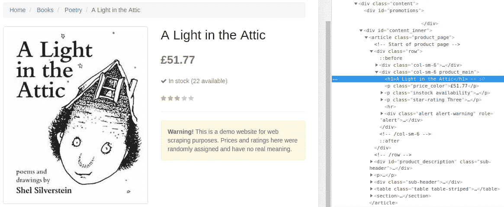

产品页面

我们可以很容易地检索到每本书的大量信息:

*   书名
*   价格
*   种类
*   等级
*   有效性

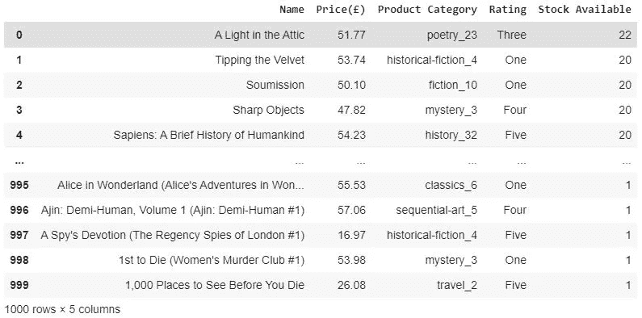

结果数据框架

## **变换**

转换数据需要剥离数据的各种格式，进行清理和协调。换句话说，它需要变得易于最终用户阅读。在此过程中，确保尽可能高的数据质量至关重要，包括检测和删除重复数据，并将数据分类到相关的预定类别中。

**书名**

对于书名信息，我们抓取产品名称的数据，并存储在带有命名名称的列表中。本节中应用的数据处理是将书名改为大写。

书名的数据框架

**价格**

而对于价格，我们抓取价格并将数据存储在价格中。在列表中，我们只能存储字符串的数据类型，这意味着我们可以在列表中进行计算。我们已经将 prices 中的数据类型从 string 改为 float，并将其存储在名为 new_price_list 的新列表中。创建了一个名为 currency 的列表，它是 new_price_list 列表的副本，以便我们可以进行计算。本节中应用的将英镑( )转换为马来西亚林吉特(RM)的数据处理过程。数据将存储在 currency_RM 列表中。

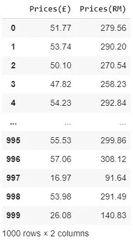

价格数据框架

**产品类别**

对于产品类别的信息，我们将其抓取并存储在名为 categories 的列表中。我们发现产品类别已经重复。在这一部分，我们通过删除重复的产品类别并将其存储在名为 new_categories 的列表中来进行数据处理。

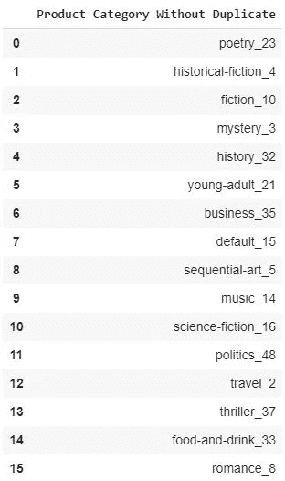

没有重复的数据框架产品类别的一些示例

我们还应用了另一种数据处理方法，即删除产品类别中的数字，并按字母顺序存储列表。

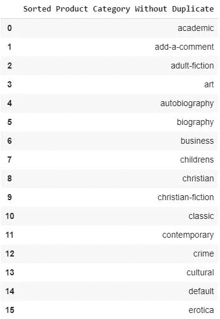

无重复的数据框架排序产品类别的一些示例

**评级**

在 rating 部分，我们抓取数据并存储在名为 ratings 的列表中。评级列表将数据类型更改为字符串，并将数据保存在名为 string_ratings 的列表中。number_ratings 列表是通过 copy()方法创建的。创建一个名为 new_number_ratings 的列表，将评级转换为数值。

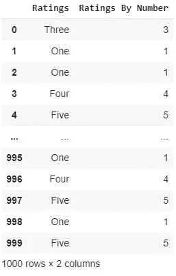

按数字排列的评级数据框架

**可用库存**

对于可用的库存信息，我们抓取数据并存储在名为 nb_in_stock 的列表中。

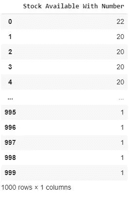

数据框库存可用，带编号

我们将数据类型从 string 更改为 int，并将其存储在一个名为 new_stock 的新列表中。使用 copy()方法创建了一个名为 stock_ava 的列表，以便于数据处理。

创建一个名为 stock_available 的列表来存储库存可用性数据。本节中应用的数据处理是，如果可用库存数量大于 1，它将显示“可用库存”。如果可用库存数量等于 1，将显示“最后一个库存”。

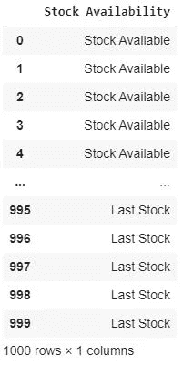

数据框库存可用性

**使用饼图**进行库存可用性的数据可视化

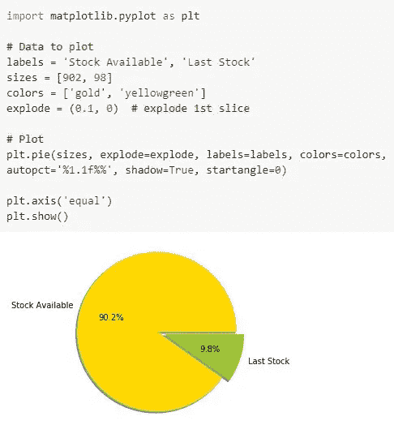

## 负荷

最后，您的 ETL 工具将帮助协调您的数据并将其加载到目标位置，这本质上是一个商业智能(BI)或数据库工具的选择。您可以在那里找到它，为您的分析做好准备。

在完成所有的数据处理和数据清理后，将其保存在数据帧中，因为它很容易进行分析和由 Python 库(pandas)读取。

用来保存数据帧的命令的一个例子。csv 格式:

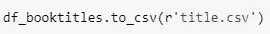

用于保存书名数据帧的命令。逗号分隔值（csv）文件格式

此刮擦中使用的代码