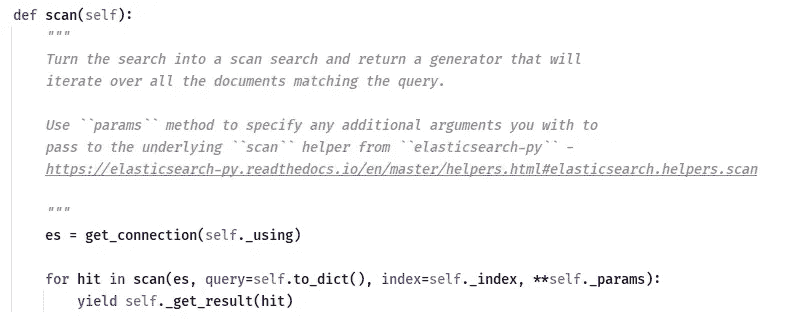
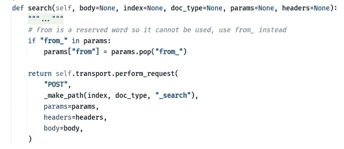
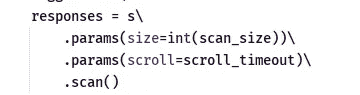
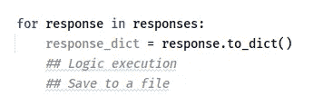
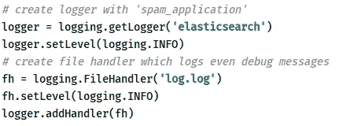
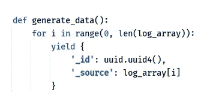
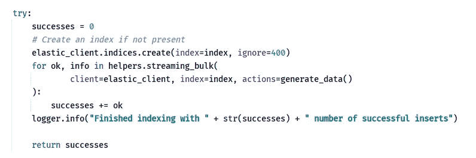
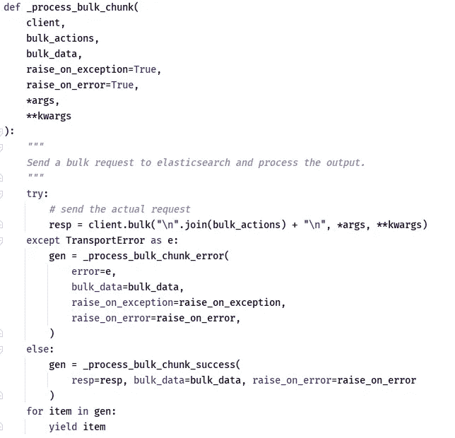
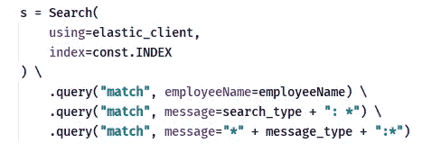
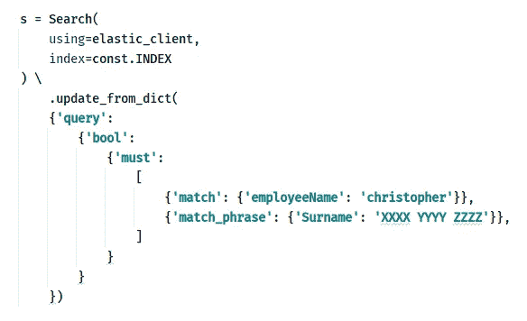

# Elasticsearch 和 Python 中的提取-转换-加载

> 原文：<https://medium.com/analytics-vidhya/extract-transform-load-in-elasticsearch-and-python-11cd4acb225e?source=collection_archive---------4----------------------->

连接和使用 Elasticsearch-Python 接口处理 ETL 过程中的高数据量的关键要点。

来源:[https://towards data science . com/getting-started-with-elastic search-in-python-c 3598 e 718380](https://towardsdatascience.com/getting-started-with-elasticsearch-in-python-c3598e718380)

W 当我们设计企业级解决方案时，我们会记下数据层。现在有大量的数据事务发生，并且有大量的数据层技术可用。像 MySQL、Oracle 和 PostgreSQL 这样的数据库被归类为“关系型”。其他数据库，比如 MongoDB，被归类为“非关系型”,也就是说，持久化的数据在数据库引擎中没有维护它们之间的固有关系。还有其他一些我们称之为“图数据库”的数据库比如 Neo4j，可以处理“高度连接的数据”。Elasticsearch 属于第二类。

Elasticsearch 专门用于在数据之间没有太多修改(或“更新”)的情况下快速插入和快速检索的情况。像快速推拉动作这样的例子可以使用弹性搜索引擎作为中间存储系统来存储某些数据，比如日志。例如，如果我们考虑一个 API Hub，它的主要工作是作为一个完整的系统提供用户需要的终端。本质上，它所做的是将用户的请求定向到 apt 端点，并为正确的用户提供正确的响应。因为它是一个*集成平台*，许多用户可以连接到它，产生大量的流量，使得几乎不可能持续监控系统的 TPS(每秒事务数)的变化等指标。此外，当产生大量流量时，错误计数等洞察以及请求-响应趋势(随时间增加/减少)等智能洞察更难挖掘，因为跟踪流量很麻烦。Elasticsearch 在这类场景中表现良好，具有流畅高效的事务日志插入和检索速度。例如，我们可以即时记录请求-响应周期的各个部分(根据使用屏蔽等技术的隐私场景；特别是在你受到 GDPR 约束的情况下)，将它们编入 Elasticsearch，并使用为高效数据检索技术开发的 Lucene 查询来挖掘它们。

# 弹性搜索连接器

在 MySQL 等数据库中，我们有用不同语言编写的独立驱动程序(如 Java、Python 等)。)与数据库进行交互。默认情况下，Elasticsearch 有一个 REST 接口与之交互，它充当数据存储和业务逻辑之间的通用接口，与语言无关。本质上，您要做的就是用您喜欢的任何语言调用请求模块(HTTP request *clients* ),并使用带有正确消息体(和头)和路径参数的正确端点。然而，我们在此之上被提供了抽象层，并且有提供这些抽象的“驱动程序”(它们是库，用您的首选语言调用 HTTP 客户端)。使用这些库，您可以与 Elasticsearch 节点进行交互，而无需自己编写 REST 请求，库会将您的方法调用转换为 Elasticsearch 查询，这与普通的数据库驱动程序非常相似。

对于 python，有两个主要的 Elasticsearch 库，您可以从中受益，而无需自己编写查询。然而，在某些复杂的场景中，这些库允许您沿着抽象的阶梯向下爬，自己编写 Elasticsearch 查询。

1.  `elasticsearch-py` : [这个库](https://elasticsearch-py.readthedocs.io/en/7.10.0/)用来初始化你的业务层(业务逻辑)和数据层(Elasticsearch)之间的连接。它非常类似于您用来启动与数据库的连接的连接池。它允许打开一个套接字，发送查询并检索请求查询的响应。
2.  `elasticsearch-dsl` : [这个](https://elasticsearch-dsl.readthedocs.io/en/latest/)是建立在第一个库`elasticsearch-py`之上的抽象，用来“*为 Python 中所有与 Elasticsearch 相关的代码*提供公共基础”。这有点类似于处理关系数据库时使用的 ORM(但不完全相同)。它允许您使用方法参数和其他几个特定于 Python 的编程语用学来减轻来自 Elasticsearch 的查询。它使用`elasticsearch-py`来启动连接，并根据发送到 Elasticsearch 的`elasticsearch-py` 来翻译您的查询。

# 案例研究

让我们考虑一下上面讨论过的场景:将处理过的日志索引到 Elasticsearch 中。[网飞在他们的技术平台](https://netflixtechblog.com/lessons-from-building-observability-tools-at-netflix-7cfafed6ab17)上做了同样的事情来开发“观察工具”。谷歌有自己的服务来大规模处理日志。同样，这种现象已经变得普遍，并在大规模[中使用，坚持几种不同的做法](https://digitalguardian.com/blog/what-log-analysis-use-cases-best-practices-and-more)。

本质上，我们可以通过两种方式完成任务:

1.  动态执行弹性搜索的处理部分和索引。
2.  稍后作为调度作业运行处理部分，而不会干扰请求-响应循环。

第一个场景明显影响了我们的 TPS(每秒事务数)指标，因为它动态地处理消息。也就是说，当数据量较高时，它会消耗一些 CPU 周期并需要大量内存，这会影响并降低我们每秒可以处理的事务数量。我们可以想出一些办法来解决这个问题。我们可以使用具有多个消息队列的分布式架构在几个其他机器之间分配处理工作，以便在每个机器之间进行通信，并最终将结果和索引归入 Elasticsearch(例如 Map-Reduce)。然而，这种解决方案需要几个额外的资源，这最终会导致要求更高的成本(计算成本，因此是金钱成本)。因此，一个消耗较少资源的替代方法是在分布中使用较少的资源，并在已经索引的原始日志序列上运行相同的处理。也就是说，我们避开了请求-响应循环中的处理步骤，只将原始日志索引到 Elasticsearch 中，稍后再进行处理。这些日志由一个预定的消费者作业取出(查询)，放入一个临时作业队列，进行处理，并索引回 Elasticsearch。

尽管这是一种对资源要求低得多的替代方法，但它会导致消耗已处理日志的系统预期并呈现低刷新率。与动态场景不同，除非计划的作业以非常高的频率运行(这最终会导致更高的成本)，否则索引不会频繁更新已处理的消息。然而，这种低刷新率可以适应某些场景，例如生成每日、每周或每月报告，以便挖掘诸如趋势和其他基于机器学习的信息的模式。它总是成本和用例之间的平衡，并且总是有机会成本被放弃。

# 处理大量数据

数据处理发生在业务逻辑层，它剥离、转换模式并将其转换成不同的格式，以便索引到 Elasticsearch 中。现在，在我上面提到的案例研究中，数据量可能非常大，特别是在给定时间段内有大量数据交易发生时。这使得 ETL(**Extract Transform Load**)过程在所有极端情况下都更加困难:提取大量数据是困难的，因为它消耗大量带宽，转换会由于资源的内存和速度限制而变得困难，并且在转换过程可能扩展之后，加载会由于消息的大小而再次变得困难。因此，我们必须小心地从业务逻辑层处理 ETL 过程，使用首选语言:在本例中是 Python。

对我来说，选择 python 的唯一原因是[熊猫](https://pandas.pydata.org/)中`DataFrame`的概念。我已经习惯了它，并且我认为它是一个操作数据的简单而直观的工具。一个`DataFrame`本质上是一个二维矩阵(像一个表一样),包括一个标题，它给我们一个更简单的抽象来选择(一个接一个或者作为一个可迭代的),更新和删除数据点。我发现的另一个非常有用的功能是它可以序列化成不同的格式:比如`JSON`、`CSV`、`XLSX` 等等。人们可以将`DataFrame`的概念想象成关系架构(如 SQL)中`Table`的抽象。它允许您查询，从而读取和更新数据。利用`DataFrame`抽象的优势，我们可以将我们遇到的大量问题减少到一个非常小的集合中。当它与 Python 固有的工具如`Generators`一起使用时，似乎有可能避开我们原本会面临的一大堆问题。

## 解决萃取问题(E)

`elasticsearch-py`库在从 Elasticsearch 检索数据时使用 Python 的*生成器*的概念，这取决于您使用的搜索类型。如果您希望使用有限结果的搜索，也就是说，您希望指定一个限制并只检索有限数量的结果，那么您可以使用 Elasticsearch 提供的默认搜索 API。然而，如果您想要检索特定查询的所有数据，您需要通过一个名为 Scan 或 Scroll 的 API 来浏览 Elasticsearch 提供的分页。现在，如果你看看这两个在`elasticsearch-py`中是如何实现的，你会发现一个显著的不同。

`elasticsearch-py`扫描 API 的实现。深入研究一下，您会注意到一个简洁的实现:在检索完成后，卷轴被清理。

`elasticsearch-py`搜索 API 的实现

如何调用 **scan( )**

`scan()`使用 Python 中的生成器，而`search()`没有。这在很大程度上是由于两个场景中预期的结果数量:扫描 API 比搜索 API 预期更多的结果，因此它使用 Python 的 iterable 技术来优化其执行。Python 生成器有这个固有的属性，只有当你遍历它时，它才提供数据*。在连续的调用之间，它的执行状态会被专门记在内存中，这使得它成为遍历大量数据的理想选择。这在 Python Wiki 中通过使用两个简单的调用`sum(range(1000000))`和`sum(xrange(1000000))`来解释。`range()`先在内存中建立一个数字列表，并将其馈送给`sum()`，而`xrange()`逐个建立数字，并将其馈送给`sum()`，后者占用的内存较少。*

> 另一方面，当我们使用`xrange`时，我们不会产生在内存中构建 1，000，000 个元素列表的成本。由`xrange`创建的生成器将生成每个数字，该数字将消耗累加和。— Python Wiki

调用生成器产生的结果

注意，Scan API 的实现对`scan()`中的每个结果使用了一个`foreach`循环。这个`scan()`方法调用典型的`search()`方法，返回预定数量的消息。一个页面的默认大小是 1000(即每次搜索检索 1000)，但是您可以将它调整到您在 Elasticsearch 实例中配置的限制。所以，每次迭代会产生 1000 个结果(如果你设置`size`为 1000)。将它调整到 Elasticsearch 提供的默认值(每次搜索 10，000)会减少检索时间，但会增加转换的内存占用。

通过遍历 iterable 调用生成器生成的响应。现在，我们必须注意，只有在遍历一次即*时，才使用生成器。只有当我们不打算多次使用该组生成的值时，生成器才会提供性能优势。*”，如 Python Wiki 所述。因此，我们将进行迭代，进行必要的处理，并将它们附加到一个 JSON(或一个等效物)中。在不需要这一步的地方，也就是说，一个简单的预处理步骤就足够了，不需要将它与其他结果合并，不需要持久化它们。您可以直接将 iterable 的结果用于转换步骤。

## 用转型解决问题(T)

在这一步中，我们面临的第一个问题是加载和处理大量数据。执行转换步骤的明显方法是在循环中遍历生成器响应，因为生成器的工作方式会占用较少的内存。

然而，琐碎而直接的转换在复杂的场景中很少见，比如从弹性搜索消息(比如日志)中生成更复杂的见解。我们需要从多个索引中查询，合并结果并提供有用的结果。在这种情况下，你不能简单地使用迭代器而不被发现。您需要在迭代器中进行初步预处理，将预处理的结果保存在某个地方(例如文件系统)，并使用保存的结果将它们进一步转换成有价值的信息。

这就是熊猫的概念变得非常方便的地方。如果您已经指定了`chunksize`参数，Pandas `read_csv()`再次提供了一个生成器来进行迭代。`chunksize`指定了每次迭代需要检索多少数据点，与完全加载整个预处理文件相比，这大大减少了每次迭代的内存占用。

此外，我们可以对熊猫数据帧使用[琐碎操作。](https://pandas.pydata.org/pandas-docs/stable/user_guide/basics.html)我用过的最有用的是[过滤操作、](https://cmdlinetips.com/2018/02/how-to-subset-pandas-dataframe-based-on-values-of-a-column/) [合并/连接操作](https://pandas.pydata.org/pandas-docs/stable/user_guide/merging.html)、[重复相关操作](https://thispointer.com/pandas-find-duplicate-rows-in-a-dataframe-based-on-all-or-selected-columns-using-dataframe-duplicated-in-python/)和[应用操作](https://pandas.pydata.org/pandas-docs/stable/reference/api/pandas.DataFrame.apply.html)。

Pandas 针对大数据量下的使用进行了优化。但是，在某些操作(如合并操作)中，如果使用非常大的输入数据量，可能会发生内存溢出。例如，合并操作所需的空间受到两个输入数据集的大小和最终合并数据集的大小的限制。如果输入数据集非常大，则可以假设产生的输出也很大，这会导致更大的内存占用量(内部连接的情况除外，在这种情况下只有非常少量的公共元素)。必须小心处理这类场景，使用贪婪的方法，比如使用特定于您的业务案例的逻辑来分割输入数据空间。例如，如果您使用地理数据，您可以使用现有的层次结构(例如，在地理信息的情况下，您可以使用国家→城市等层次结构。)或创建逻辑层次结构，以便在执行合并/连接等内存密集型操作之前减少输入数据空间。此外，除了熊猫还有其他的库，比如`[Dask](https://dask.org/)` [库](https://dask.org/)有非常好的基准。

我们必须考虑的另一个方面是**资源使用与时间消耗**。对于一个特定的转换作业，我们必须断言资源(磁盘、内存、CPU 周期和网络)的使用量以及完成一个作业所需的时间。很多时候，为了满足另一个，你不得不放弃一个。例如，如果您正在一个行资源集群上运行，您必须放弃快速的处理速度。另一方面，如果您想要一个更快的处理管道，您将不得不拥有一个资源丰富的机器集群来为您完成这项工作。这总是你需要寻找的平衡，取决于你所处的环境。[有一些工具](https://www.elastic.co/guide/en/elasticsearch/plugins/current/mapper-size.html)可以用来断言，比如说， Elasticsearch 中每个文档*的大小(在文档被索引之后)。此外，通过使用 Python 中的活动监视器和[监视器，我们可以使用它们来对我们的资源消耗情况进行下降估计。为了监控日志记录方面的情况，我们可以使用`elasticsearch-py`库的默认日志记录器和一个附加的文件处理程序，如下所示。](https://docs.python.org/3/library/resource.html)*

elasticsearch-py 的默认记录器名为 **elasticsearch** ，附加的文件在这里作为 **log.log** 给出

## 解决装载问题(1)

使用`elasticsearch-py`提供的[批量插入助手](https://elasticsearch-py.readthedocs.io/en/7.9.1/helpers.html)可以将转换后的消息加载到 Elasticsearch 的另一个索引中。bulk helper 需要另一个生成器来生成要插入的数据。

批量生成器示例。

我通常使用这个生成器向消息添加一个惟一的 ID 字段，并生成一个类似文档的结构(在 Python 中是一个字典),然后保存在 Elasticsearch 中。

Elasticsearch 的插入示例，它返回成功插入的次数

向 elasticsearch-py 库中的 Elasticsearch 发送批量数据

在`streaming_bulk()`函数中调用`_process_bulk_chunk()`函数，该函数向 Elasticsearch 提供的批量 API 发起批量请求(通过 HTTP)。它处理错误和成功，你可以返回最终结果，就像我用变量`successes`做的那样。理想情况下，成功消息插入的数量应该等于变量`successes`的值。断言这一点，再加上使用`elasticsearch-py`日志，我们可以得出关于批量插入的良好结论。

插入一整批和插入多批有其不同之处。例如，插入一整批数据会耗费时间和带宽。另一方面，插入大量数据会重复查询 Elasticsearch 实例。这在某种程度上相当于一组重复的插入查询，而不是 SQL 中的批量插入。正如 lukaseder 在本文的[中指出的，批量/批量更新显然是这场 SQL 插入之战的赢家。在 Elasticsearch 中，对于每个插入，您需要建立一个 HTTP 连接(在应用层)，这转化为在传输层建立一个 TCP 套接字。这导致了传输层的高成本(想象一下用 HTTP 而不是 WebSockets 进行实时通信)。此外，Elasticsearch 需要为您发送的每个插入请求调用解析器，如果您向 Elasticsearch 发送多个插入请求，而不是使用批量 API，这将意味着它调用大量解析，并且特定请求的总往返时间(请求-响应时间)将显著增加，从而导致整个插入的效率和吞吐量下降。因此，在大容量数据插入中，应该首选批量 API。](https://blog.jooq.org/2018/04/19/the-performance-difference-between-sql-row-by-row-updating-batch-updating-and-bulk-updating/)

# 备注和结论

我没有在上面的章节中留下关于 Elasticsearch 查询的注释，因为如果你使用的是`elasticsearch-dsl`，它们会非常直观。该库将每个查询转换成一个方法调用，将查询术语作为变量传递。例如，检查下面的查询。

搜索将 **employeeName** 作为字段并且其值等于 employeeName 变量的消息，以及满足 **search_type** 和 **message_type** 值的字段 **message**

该库使用`Search`对象启动搜索，并使用`execute()`调用搜索 API，使用`scan()`调用扫描 API。

Elasticsearch 的文档结构主要是 JSON。因此，您需要在业务逻辑层中以类似的结构来表示您的对象。在像 Java 这样的语言中，这是使用映射结构来完成的，而在 Python 中，这是使用字典来完成的。字典可以通过使用 Pandas 和`json`库进行序列化和反序列化。在有用的情况下，我两者都用。更多的时候，我用熊猫的`read_json()`搭配`orient='records'`和`to_json()`来完成前面提到的任务。此外，当处理诸如 epoch 时间戳之类的情况时，我在通过`read_json()`反序列化 JSON 对象时使用`keep_default_dates=False`,因为这个函数似乎将时间戳对象转换为 pandas-native 形式，而这些形式使用`json`库的`dump()`方法是无法序列化的。如果你要一起使用它们，最好坚持这些实践。否则，最好在整个项目执行过程中使用一个库，为此，我更喜欢 Pandas，因为它包含了许多`json`库不希望有的功能。`json`仅仅是一个从字典到 json 的序列化和反序列化库，反之亦然。

当你在`elasticsearch-dsl`中使用`Search`对象时，另一种非常微妙的方式是使用`update_from_dict()`方法。

**update_from_dict( )** 方法

这种方法提供了灵活性，在我们需要从 Elasticsearch 进行低级查询的情况下，`elasticsearch-py`提供了使用定制的类似字典的查询。

总之，使用 Elasticsearch 和 Python 进行 ETL 过程的难易程度取决于您的用例。然而，当你使用 Python 时，编写内容的容易程度是非常高的，因为它包含了数据抽象，例如`DataFrames`。然而，必须始终记住，当我们评估流程的效率时，要注意资源消耗和时间之间的权衡。

> 注意:本文使用的几乎所有代码片段都来自于`elasticsearch-py`库，这是一个开源库，可以从 Elastic 的[官方 Github 链接](https://github.com/elastic/elasticsearch-py)到资源库中找到。其中一些是普通的代码片段，不是任何企业项目的一部分。