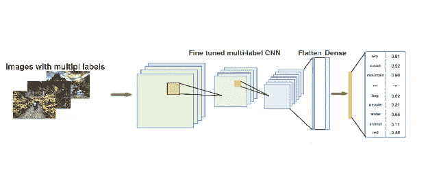
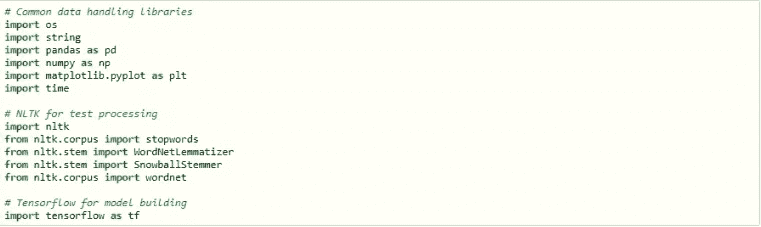
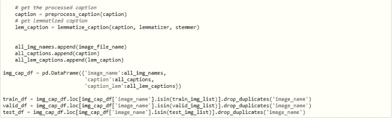

# 使用基于假设的多标签分类从图像中提取属性-CNN-Pooling (HCP)

> 原文：<https://medium.com/analytics-vidhya/extracting-attributes-from-image-using-multi-label-classification-based-on-hypotheses-cnn-pooling-e2f9ce80461?source=collection_archive---------3----------------------->

**简介:**

从图像中自动提取属性在计算机视觉中是一项划时代的任务，因为它不仅需要精确预测对象，还需要精确预测它们的属性和活动。这可以看作是一个多标签分类问题，因为它需要从给定的图像中预测属性。在本文中，我们将使用 Hypotheses-CNN-Pooling(HCP)网络来学习产生图像可能包含的每个属性的概率分数的属性，并将排名最高的属性作为预测属性。

为了简单起见，我们将使用“Flickr8K”数据集来构建“图像的属性提取模型”，以揭示图像的属性。

我们开始吧！

**进口包装:**

本文中使用的核心包是 NLTK 和 Tensorflow 2.0 Keras。除此之外，我们还使用 Pandas、Numpy 和 Matplotlib 进行数据处理和可视化。

**数据理解:**

你可以从这里下载“Flickr8k”数据集[https://machinelingmastery . com/develop-a-deep-learning-caption-generation-model-in-python/](https://machinelearningmastery.com/develop-a-deep-learning-caption-generation-model-in-python/)。

从下载的数据集中提取 zip 文件后，您会发现下面的文件夹。

*   **Flickr8k_Dataset:** 总共包含了 8092 张 JPEG 格式的图片，形状大小不一。其中 6000 个用于训练，1000 个用于验证，1000 个用于测试数据集。
*   **Flickr8k_text:** 包含描述 train_set、test_set 和 dev_set 的文本文件。 **Flickr8k.token.txt** 包含每张图片的 5 个标题，即总共 40460 个标题。

**数据加载:**

现在，您从 Flickr8k.token.txt 文件中加载图像 id 和标题，并按如下方式准备数据集。

首先，我们加载包含用于训练、验证和测试数据集的图像 id 的文件，并分别准备图像 id 列表。下面定义了 getImageList()函数，该函数返回给定数据集文件的图像 id 列表。

接下来，我们遍历图像描述列表。每个图像 id 都有一个唯一的标识符，每个标识符包含五个描述。我们将添加图像的完整路径，并将其存储在一个列表中。接下来，我们需要清理描述文本，如下面的预处理部分所示。

**数据预处理:**

现在我们将描述中的所有单词转换成小写。然后我们从文本中删除所有的标点符号。最后，我们删除文本中出现的任何数字，并返回干净的描述文本。

一旦描述文本被清理，我们就可以应用描述文本的词干化和词汇化。现在让我们看一下词汇化和词干化过程。

*   *:*

*词汇化是将单词简化为属于该语言的词根形式的过程。因为变元化返回语言的实际单词，所以在需要获得有效单词的地方使用变元化。我们使用 Wordnet 词条分类器，它使用 Wordnet 数据库来查找单词的词条。以确保它所属的词根正确，并过滤仅包含特定词类标签(如名词、ADJ、动词和副词)的单词。然后，我们将单词的相应词类标签以及描述文本提供给 lemmatizer 函数。*

*   ****词干*** :*

*最后，一旦描述文本被词汇化，我们就在它上面应用词干来产生词干。我们使用雪球斯特梅尔，它有效地提供了后缀剥离器语法。*

*理想情况下，我们需要足够相关和紧凑的词汇表来表示属性列表。*

**

*让我们先睹为快处理过的数据集。结果数据集包含三列，如*

*   *image_name，表示带有完整文件路径的图像文件名*
*   *标题代表相应的描述文本(仅供参考)*
*   *caption_lem 表示来自描述的属性。*

**

***准备记号赋予器:***

*因为给定语料库的属性词汇表很大，所以我们只使用训练数据集中前 1000 个最常见的属性。我们使用 NLTK 的 FreqDist()函数来获取训练数据集中前 1000 个最常见的属性，并使用这些过滤后的属性来初始化标记器，以对文本进行编码并将其传递给模型。*

**

*到目前为止，我们已经使用数据集中可用的描述文本提取了每个图像的属性。接下来，我们将看到如何处理图像，并用提取的属性训练深度学习模型。*

***模型构建:***

*我们将使用 Tensorflow-Keras 中提供的用于图像处理的预训练 **Inception-V3** 模型和基于**假设的**多标签分类**-CNN-Pooling(HCP)**网络来学习属性。*

***盗梦空间第三版:***

> *“Inception-v3 是一种广泛使用的图像识别模型，已被证明在 ImageNet 数据集上获得了超过 78.1%的准确率。该模型是多年来多名研究人员开发的许多想法的结晶。它基于原始论文:[“重新思考计算机视觉的初始架构”](https://arxiv.org/abs/1512.00567)，作者 Szegedy 等人。艾尔。该模型本身由对称和非对称构建块组成，包括卷积、平均池、最大池、连接、丢弃和完全连接层。Batchnorm 在整个模型中广泛使用，并应用于激活输入。损失通过 Softmax 计算。”*
> 
> *该模型的高级图表如下所示:*

**

*资料来源:cloud.google.com*

***假设-CNN-汇集(HCP)***

> *hypothesis-CNN-Pooling 是一种灵活的深度 CNN 基础设施，其中任意数量的对象段假设被作为输入，然后共享的 CNN 与每个假设相连接，最后，来自不同假设的 CNN 输出结果通过 max-pooling 进行聚合，以产生最终的多标签预测。更多详细信息，请参考原论文:《[多标签图像分类的灵活 CNN 框架](https://www.researchgate.net/publication/283323775_HCP_A_Flexible_CNN_Framework_for_Multi-label_Image_Classification)》，作者:魏等。艾尔。*

*现在，我们将介绍构建模型所涉及的步骤。*

*我们可以修改 Inception-V3 模型来满足我们的需求。我们将删除 softmax 层，并附上下面的层。*

*   *0.5%的辍学层*
*   *批量标准化*
*   *具有属性词汇大小单位的 Sigmoid 激活层*

*值得注意的是，对于多标签分类问题，我们使用“Sigmoid”作为输出层的激活函数，而不是“Softmax”函数，以便每个类别的概率将独立于其他类别概率，从而使用阈值(0.5)来获得多个标签作为结果，并使用“binary_crossentropy”作为损失函数来估计模型的损失。另一方面，对于多类分类问题，我们使用“Softmax”作为输出层的激活函数，使用“categorical _ crossentropy”作为模型的损失函数。*

*您可以尝试各种其他层、单元和激活功能的组合，以微调模型的性能。*

**

***准备数据生成器:***

*既然我们已经构建并编译了模型，我们将继续准备数据生成器，将数据成批地输入到模型中。*

*首先，我们从属性列表中获得编码的属性向量。下面定义了函数 get _ attribute _ vector _ from _ caption()，该函数读取属性(caption_lem)并使用标记器的 *texts_to_matrix()* 函数返回编码的属性向量。*

*接下来，我们使用 tf.data.Dataset 的 from_tensor_slices()函数为训练和验证数据集准备数据生成器。下面定义了 *load_image_attribute()* 函数，该函数使用 TensorFlow 图像模块的函数来加载和解码图像，并使用目标大小(299，299，3)来调整图像的大小。然后使用 TensorFlow Keras inception_v3 的 preprocess_input 函数，处理和准备图像张量以将其加载到预训练的 Inception-V3 模型中。*

****

***模特培训:***

*现在，让我们使用批大小为 100 的 10 个时期的训练和验证数据集来训练模型。为了训练模型，我们使用模型检查点回调来自动保存最佳模型的模型权重。然后，当连续 5 个时期的确认损失没有改善时，我们使用早期停止回调来停止模型训练，当连续 2 个时期的确认损失没有改善时，我们使用 ReduceLROnPlateau 回调来自动降低学习率。*

**

*最后，我们绘制了每个时期模型的损失和准确性的结果。*

**

***模型预测:***

*现在模型已经定型，我们将进行一些预测并评估结果。首先，我们使用 *load_image()* 函数预处理并获取给定图像文件的图像张量。然后我们预测给定图像张量的属性。根据预测，我们考虑具有前 10 个概率的属性并打印结果。*

**

*我们来看看预测的结果，用地面真实属性来评价。*

****

*从上面的结果中，我们可以看到预测几乎是准确的，并且还可以从图像中预测更深入的属性。*

***概要:***

*在本文中，我们发现了从图像中提取属性所涉及的步骤，以及如何使用图像标题数据集来构建基于假设-CNN-Pooling 方法的多标签分类模型。具体来说，我们对图像描述文本进行了词法分析和词干分析，以获取属性。然后，我们定制了预训练的 Inception-V3 模型，并训练该模型来检测给定图像的属性。最后，我们看到了如何预测给定图像的属性并评估结果。*

*这就把我们带到了本文的结尾。*

*要获得完整的代码，你可以从[这里](https://github.com/jsaikmr/Attribute_Extraction_for_Images_using_Hypotheses_CNN_Pooling)下载 ipython 笔记本。*

*干杯！！！*