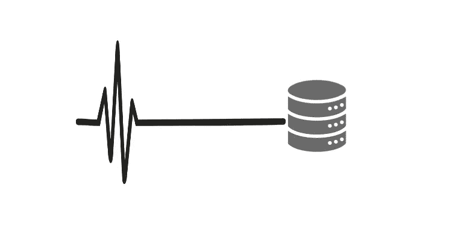

# 从 API 中提取音频文件并将其存储在 NoSQL 数据库中

> 原文：<https://medium.com/analytics-vidhya/extracting-audio-files-from-api-storing-it-on-a-nosql-database-789c12311a48?source=collection_archive---------4----------------------->

存储和提取音频文件的最简单方法(。wav/API)



请按照以下步骤使用 PyMongo 在 MongoDB 数据库中存储和提取音频文件。那我们开始吧。

# 步骤 1:导入所有重要的库

```
from pymongo import MongoClient
import requests…
```