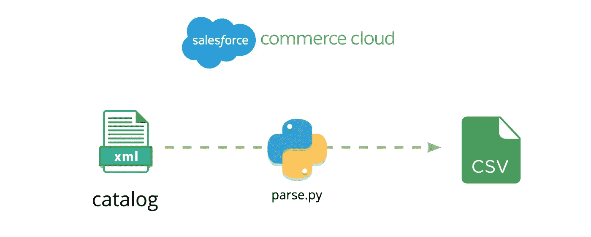
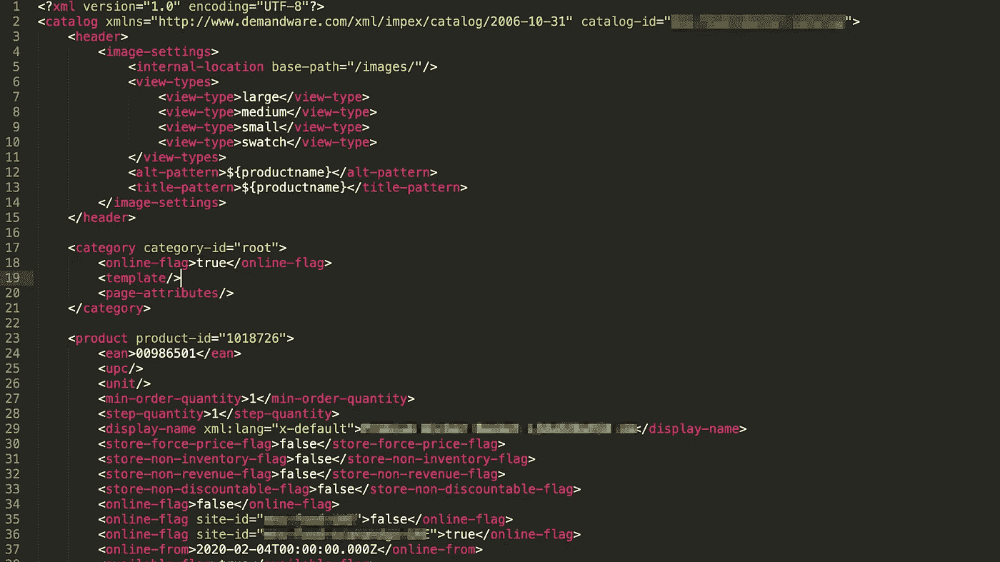
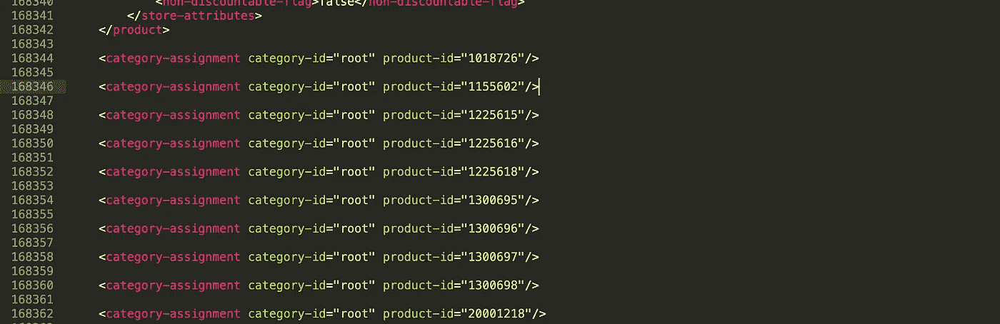
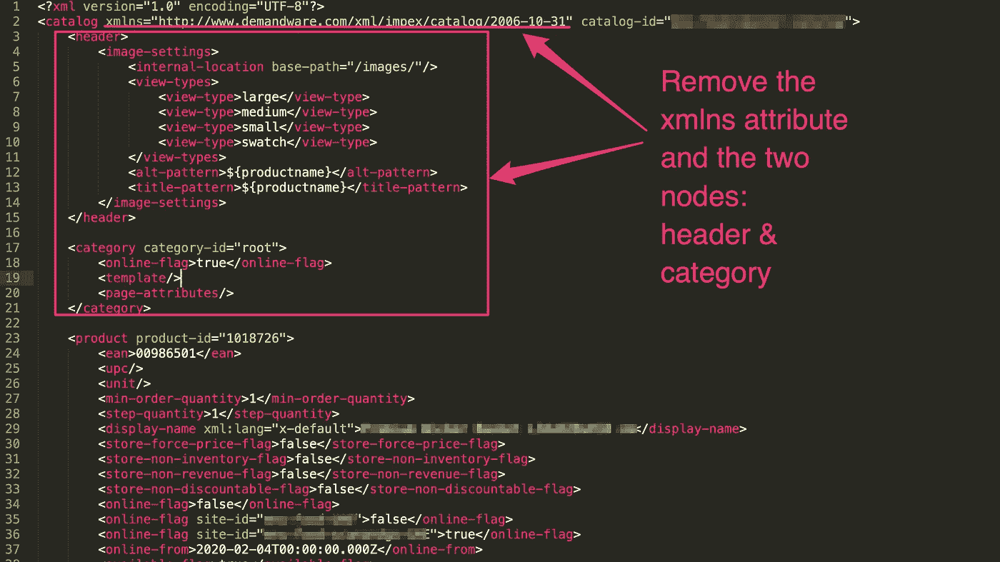
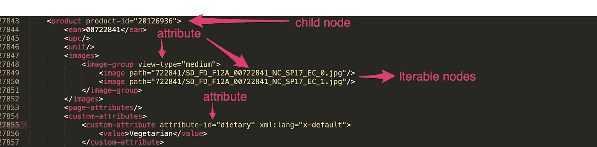

# 使用 Python 从 Salesforce Commerce Cloud 中的目录文件提取信息

> 原文：<https://medium.com/analytics-vidhya/extracting-information-from-catalog-files-in-salesforce-commerce-cloud-using-python-dd7537d29205?source=collection_archive---------16----------------------->



如果你使用过 Salesforce Commerce Cloud (SFCC)，你就会知道通过文件管理目录的痛苦。当然，系统的设计是为了减少人工干预，您可能在目录上看到的任何信息都应该可以在您的产品信息管理系统中找到。然而，有时你会冒险尝试直接使用 SFCC 目录(主目录和导航目录),可能是为了使用你的报告工具，也可能只是为了加深对目录的理解。

注意:我写这个是为了快速知道哪些产品有图片，哪些没有。在 SFCC 没有直接的方法知道。这需要 3-4 分钟，具体取决于目录的大小。此外，我与您分享的脚本可以用于任何 XML 文件。玩得开心！

# XML 文件

XML 文件格式是这样的:



SFCC 目录格式

它还以类别定义和分配结束:



我们可以编写复杂的代码来删除它，但只需在 Sublime Text 中打开文件(它可以在 4-5 秒内轻松通过 200 mb 的文件)。修剪文件以删除文件末尾的类别分配和顶部条目，如下所示:



# 代码

非常简单，下面是提取产品 id 和相关图像名称/位置作为 CSV 的代码。

```
import xml.etree.ElementTree as ETtree = ET.parse('file.xml')
root = tree.getroot()#print root.attrib ### establish where the root is...catalog = ""  ## needed for printing out the string for child in root:  ## can be replaced with root.iter("node")
                    ## where node is the XML node you want to 
                    ## iterate throughcatalog += child.attrib["product-id"]
 try: ### if some nodes do not have the thing you're looking for
  for node in child.iter("image"):
   catalog += "," + node.attrib["path"]
  catalog += "\n" except:
  catalog += "\n"print catalog
```

将该文件另存为 *parse.py*

打开终端并键入:

```
python parse.py | tee file.csv (where file.csv is the output file)
```

希望您已经安装了 Python。如果没有，在这里下载。

# 解释

*注意:我绝不是 Python 编码专家。我只知道在工作中利用它。有 100 种不同的方法可以做得更好。*

```
import xml.etree.ElementTree as ETtree = ET.parse('file.xml')
root = tree.getroot()
```

简单解释:获取文件，设置根目录。因为这个文件包含一个根(“Catalog”)，所以我们可以从现在开始处理这个文件。

```
#print root.attrib ### establish where the root is...catalog = ""  ## needed for printing out the string 
```

#为我们提供 Python 中的注释。您可以要求打印根属性，它应该返回一个对象:
{catalog-id: <您的目录的名称>

由于我们正在提取一个 CSV 文件，我们将创建一个字符串变量 *catalog* 来捕获值*。*

```
for child in root:  ## can be replaced with root.iter("node")
                    ## where node is the XML node you want to 
                    ## iterate throughcatalog += child.attrib["product-id"] 
```

所以我们沿着根子节点迭代——它们是产品节点。



XML 文件的各个部分

我们还用*child . attrib[" product-id "]*设置了 CSV 变量的第一列——在上面的示例中，它将返回 20126936。

```
try: ### if some nodes do not have the thing you're looking for
  for node in child.iter("image"):
   catalog += "," + node.attrib["path"]
  catalog += "\n" except:
  catalog += "\n" 
```

引入 Try-Except 块是为了避免节点不存在的错误。请记住，我们正在尝试寻找没有图片的产品。try 节点将评估它正在评估的块中是否有错误。如果出错，它将执行 Except 块。

在这个块中，我们使用 iter 方法进行迭代，该方法接受一个节点。请注意，我们可以在 XML 树中迭代到我们想要的深度——但是，最好尽可能靠近非扩展分支，以获得性能增益(我们不是在图像节点的整个根节点上迭代，而是在产品节点内迭代，它通常有 3-7 个图像节点。

如果需要更深入(获取图像组，然后进一步迭代)，可以对循环执行嵌套的*。*

仅此而已。为了结束它，我们在最后打印变量:

```
print catalog
```

注意，在终端中，我们用命令 *tee* 做了几件事——我们将输出推送到 *stdout* (你在终端中看到的)，并将输出通过管道传输到你指定的文件*。*

# *主要考虑事项*

Python 是管理 SFCC 复杂性的最简单的方法。在过去的 3 年里，我一直这样做(我用 node.js/C/bash 文件生成器将 CSV 文件转换成 SFCC XML 文件，用于定价/库存/目录)，我发现 Python 为管理复杂性提供了无与伦比的简单性。但是，有以下注意事项:

1.  Python 是一种强类型语言(阅读更多关于[比较](https://android.jlelse.eu/magic-lies-here-statically-typed-vs-dynamically-typed-languages-d151c7f95e2b))。对于一个门外汉来说——如果你很容易漏掉一个缩进或者一个冒号，保持你的代码简短。很容易在 30 行代码中发现缺失的缩进，然后在 200 行代码中发现。
2.  有些语法和概念有点疯狂，尤其是来自其他松散的语言，如 JS。但是，如果你能掌握它们，你就会成为一名巫师，哈利。


你在掌握了基本的 Python 之后。Python 是无法真正掌握的。

3.第一次运行时，您的代码会运行得很顺畅。这是 Python 唯一的让步。之后发生的事情取决于你的运气和血统。Python 不会原谅也不会忘记。

我相信具备基本的 Python/脚本语言技能是产品经理必备的。这让生活变得更加轻松，并且可以带来有趣的数据发现。此外，这让您对开发人员的工作量有了一个有趣的了解。如果你没有花两个小时在 Node.js 的 30 行代码中纠结 Async-Await/Callback promise hell，你永远不会知道一个程序员的挣扎。

感谢您的阅读。如果您想阅读有关 Salesforce 相关文章和快捷方式的更多信息，请发表评论！我很乐意写更多关于 Salesforce 和相关技术的文章！