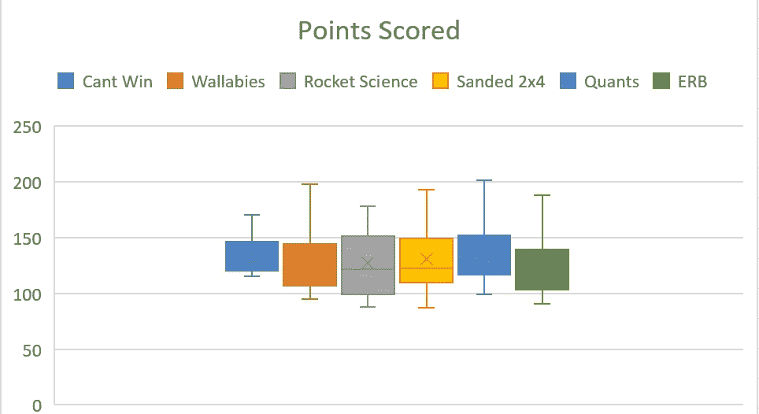
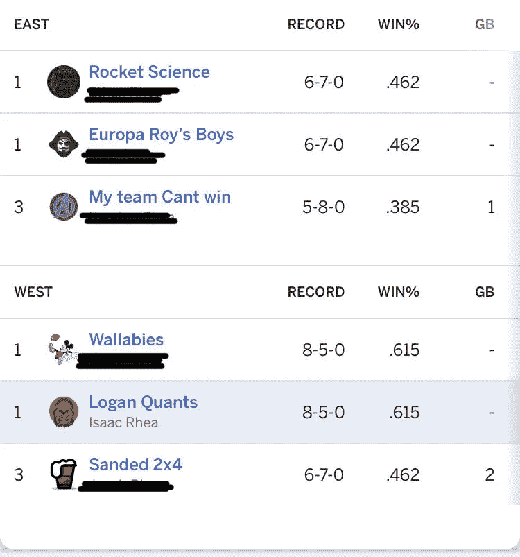
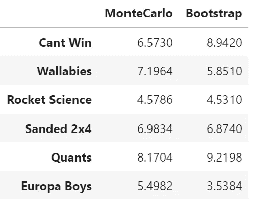

# 从随机结果中提取信息

> 原文：<https://medium.com/analytics-vidhya/extracting-information-from-random-outcomes-7bd7abc7f01b?source=collection_archive---------21----------------------->

## 用蒙特卡罗模拟和 Python 中的 Bootstrap 评估虚拟足球队

我家的梦幻足球联盟的季后赛今天开始了，我决定进行一次分析，看看有资格的 4 支球队是否真的是最好的球队。似乎有很多势均力敌的比赛是由一个玩家的幸运事件决定的。不用说，尽管只有吹牛的权利受到威胁，但好胜的兄弟之间还是有些不愉快。那么，13 场比赛的样本量是否太小，不足以让我们很好地估计谁组建了一支值得进入季后赛的球队？

我的分析从一些汇总统计数据开始。从下面的方框图来看，你认为谁是记录最好的队伍？

球队 Cant Win 比联盟中的其他球队更加稳定，但似乎缺乏能力来度过一个重要的一周并确保胜利。除了火箭科学队在表现上有很大差异之外，大多数球队得分分布相似。事实证明，Cant Win 队没有因为其稳定的表现而得到奖励，并以一场比赛的优势错过了季后赛席位。我对这个结果感到惊讶，并想知道 Cant Win 是否只是运气不好。

由于每周有如此多的随机事件决定谁赢，而只有 13 场比赛来评判团队，我决定采用两种重新采样技术，蒙特卡罗模拟和 Bootstrap，来进一步了解每个团队的表现。为此，我使用 Pandas、Numpy 和 Scipy 中的函数编写了一个相当简单的 Python 脚本。

蒙特卡洛模拟依靠伪随机数生成来产生重采样效果。我发现联盟中每支球队的得分都呈偏态正态分布，所以我使用 Scipy 包来估计偏态，并根据我们赛季中球队得分的均值和标准差从偏态正态分布中生成随机得分。

Bootstrap 方法通过从原始数据集重复采样(替换)来创建新数据集。然后计算结果统计，并在所有迭代中取平均值。因此，对于联盟中的每支球队，脚本将从该队的得分中抽取一组新的 13 分并取平均值。这个过程循环了 10000 次，这 10000 个分数的平均值和标准差就成了用来模拟幻想足球比赛的参数。

使用蒙特卡洛模拟和引导程序，我为每支球队模拟了 10，000 个梦幻足球赛季(13 场比赛)。模拟遵循以下逻辑:

1.为团队生成一个随机分数

2.随机选择一个对手

3.为对手生成一个随机分数

4.记录每个赛季的胜利

模拟的结果似乎证实了我的怀疑，即“赢不了”队运气不好。在 10，000 个模拟赛季的过程中，这支球队的表现远远超过了同组的两支球队(ERB 和火箭科学)，绝对值得进入季后赛。

模拟中每 13 场比赛的平均获胜场次

最终，我的团队 Quants 被模拟评为最高。Quants 模拟赛季的结果表明，我将在 13 场比赛中赢得 8 或 9 场比赛，这与我本赛季的实际记录相符。希望这预示着我在季后赛的好机会！

我认为 Bootstrap 和 Monte Carlo 模拟是具有广泛应用的统计学习的极好方法。我很乐意听到你的任何反馈或者你在工作中如何使用这些技巧的例子。感谢阅读！