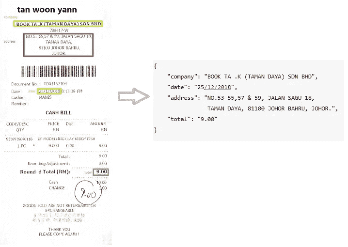
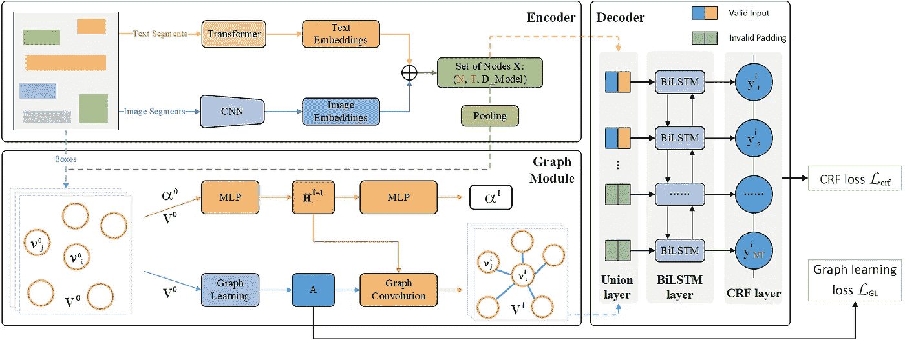

# 从发票中提取结构化数据

> 原文：<https://medium.com/analytics-vidhya/extracting-structured-data-from-invoice-96cf5e548e40?source=collection_archive---------1----------------------->



> 在这篇博客中，我们将了解如何处理 SROIE 数据集并训练 PICK-pytorch 从发票中获取关键信息。
> 
> 这里是 colab 笔记本[点击这里](https://colab.research.google.com/drive/1o8-Km-kVHtOcdEd7i9uPY6vXg7MyCN0B?usp=sharing)直接运行教程代码

## SROIE 数据集

> 对于发票数据集，我们在扫描收据 OCR 和信息提取竞争数据集上使用 ICDAR 2019 鲁棒读取挑战。
> 
> 参考:

*   [https://rrc.cvc.uab.es/?ch=13&com =简介](https://rrc.cvc.uab.es/?ch=13&com=introduction)
*   [https://github.com/zzzDavid/ICDAR-2019-SROIE](https://github.com/zzzDavid/ICDAR-2019-SROIE)

**文件夹结构**

```
data/
  img/
      000.jpg
      001.jpg    
  box/
      000.csv
      001.csv  
  key/
      000.json
      001.json
```

**图像示例**


**Csv 数据示例**

```
x1_1,y1_1,x2_1,y2_1,x3_1,y3_1,x4_1,y4_1,transcript_1

72,25,326,25,326,64,72,64,TAN WOON YANN
50,82,440,82,440,121,50,121,BOOK TA .K(TAMAN DAYA) SDN BND
205,121,285,121,285,139,205,139,789417-W
110,144,383,144,383,163,110,163,NO.53 55,57 & 59, JALAN SAGU 18,
192,169,299,169,299,187,192,187,TAMAN DAYA,
162,193,334,193,334,211,162,211,81100 JOHOR BAHRU,
....
```

**关键数据示例**

```
{
    "company": "BOOK TA .K (TAMAN DAYA) SDN BHD",
    "date": "25/12/2018",
    "address": "NO.53 55,57 & 59, JALAN SAGU 18, 
                TAMAN DAYA, 81100 JOHOR BAHRU, JOHOR.",
    "total": "9.00"
}
```

**下载数据集**

```
#dataset
!git clone [https://github.com/zzzDavid/ICDAR-2019-SROIE.git](https://github.com/zzzDavid/ICDAR-2019-SROIE.git)Cloning into 'ICDAR-2019-SROIE'...
remote: Enumerating objects: 94, done.[K
remote: Counting objects: 100% (94/94), done.[K
remote: Compressing objects: 100% (69/69), done.[K
remote: Total 2386 (delta 50), reused 65 (delta 22), pack-reused 2292[K
Receiving objects: 100% (2386/2386), 278.63 MiB | 23.17 MiB/s, done.
Resolving deltas: 100% (213/213), done.
Checking out files: 100% (1980/1980), done.
```

## 预处理数据集

我们将按照 PICK-pytorch 预处理数据集。
参考:[https://github . com/于文文/PICK-py torch/blob/master/data/readme . MD](https://github.com/wenwenyu/PICK-pytorch/blob/master/data/README.md)

为预处理数据集创建文件夹

```
!mkdir boxes_and_transcripts images entities
```

预处理数据集的脚本

```
import os
import pandas
import json
import csv
import shutil

## Input dataset
data_path = "ICDAR-2019-SROIE/data/"
box_path = data_path + "box/"
img_path = data_path + "img/"
key_path = data_path + "key/"

## Output dataset
out_boxes_and_transcripts = "/content/boxes_and_transcripts/"
out_images = "/content/images/"
out_entities  = "/content/entities/"

train_samples_list =  []
for file in os.listdir(data_path + "box/"):

  ## Reading csv
  with open(box_path +file, "r") as fp:
    reader = csv.reader(fp, delimiter=",")
    ## arranging dataframe index ,coordinates x1_1,y1_1,x2_1,y2_1,x3_1,y3_1,x4_1,y4_1, transcript
    rows = [[1] + x[:8] + [','.join(x[8:]).strip(',')] for x in reader] 
    df = pandas.DataFrame(rows)

  ## including ner label dataframe index ,coordinates x1_1,y1_1,x2_1,y2_1,x3_1,y3_1,x4_1,y4_1, transcript , ner tag
  df[10] = 'other'  

  ##saving file into new dataset folder
  jpg = file.replace(".csv",".jpg")
  entities = json.load(open(key_path+file.replace(".csv",".json")))
  for key,value in sorted(entities.items()):
    idx = df[df[9].str.contains('|'.join(map(str.strip, value.split(','))))].index
    df.loc[idx, 10] = key

  shutil.copy(img_path +jpg, out_images)
  with open(out_entities + file.replace(".csv",".txt"),"w") as j:  
    print(json.dumps(entities), file=j)

  df.to_csv(out_boxes_and_transcripts+file.replace(".csv",".tsv"),index=False,header=False, quotechar='',escapechar='\\',quoting=csv.QUOTE_NONE, )
  train_samples_list.append(['receipt',file.replace('.csv','')])
train_samples_list = pandas.DataFrame(train_samples_list)
train_samples_list.to_csv("train_samples_list.csv")
```

**预处理后的文件夹结构**

```
boxes_and_transcripts/
    000.tsv
    001.tsv
images/
    000.jpg
    001.jpg    
entities/
    000.txt
    001.txt
```

**预处理数据示例**
这里我们只在 tsv 文件中添加 ner 标签。

```
index ,x1_1,y1_1,x2_1,y2_1,x3_1,y3_1,x4_1,y4_1, transcript , ner tag
1,72,25,326,25,326,64,72,64,TAN WOON YANN,other
1,50,82,440,82,440,121,50,121,BOOK TA .K(TAMAN DAYA) SDN BND,address
1,205,121,285,121,285,139,205,139,789417-W,other
1,110,144,383,144,383,163,110,163,NO.53 55\,57 & 59\, JALAN SAGU 18,address
1,192,169,299,169,299,187,192,187,TAMAN DAYA,address
1,162,193,334,193,334,211,162,211,81100 JOHOR BAHRU,address
1,217,216,275,216,275,233,217,233,JOHOR.,address
1,50,342,279,342,279,359,50,359,DOCUMENT NO : TD01167104,other
1,50,372,96,372,96,390,50,390,DATE:,other
1,165,372,342,372,342,389,165,389,25/12/2018 8:13:39 PM,date## document_type, file_name
train_samples_list.head()
```


**将数据集分割成训练测试集**

```
from sklearn.model_selection import train_test_split
train_test = pandas.read_csv("train_samples_list.csv",dtype=str)
train, test= train_test_split(train_test,test_size=0.2,random_state = 42)
```

## 模型

> 对于深度学习模型，我们将使用 PICK-pytorch 模型。
> 
> PICK 是一个框架，它通过将图形学习与图形卷积运算相结合，在处理用于关键信息提取(KIE)的复杂文档布局方面是有效和健壮的，产生包含文本和视觉特征的更丰富的语义表示以及没有歧义的全局布局。



> 参考:[https://github.com/wenwenyu/PICK-pytorch](https://github.com/wenwenyu/PICK-pytorch)
> 
> `@inproceedings{Yu2020PICKPK,
> title={{PICK}: Processing Key Information Extraction from Documents using Improved Graph Learning-Convolutional Networks},
> author={Wenwen Yu and Ning Lu and Xianbiao Qi and Ping Gong and Rong Xiao}, booktitle={2020 25th International Conference on Pattern Recognition (ICPR)}, year={2020}
> }`

```
!git clone [https://github.com/wenwenyu/PICK-pytorch.git](https://github.com/wenwenyu/PICK-pytorch.git)Cloning into 'PICK-pytorch'...
remote: Enumerating objects: 4, done.[K
remote: Counting objects: 100% (4/4), done.[K
remote: Compressing objects: 100% (4/4), done.[K
remote: Total 218 (delta 1), reused 0 (delta 0), pack-reused 214[K
Receiving objects: 100% (218/218), 9.97 MiB | 8.62 MiB/s, done.
Resolving deltas: 100% (86/86), done.
```

**将列车数据复制到 PICK-pytorch 数据文件夹**

```
for index, row in train.iterrows():
  shutil.copy(out_boxes_and_transcripts+str(row[2])+".tsv",'/content/PICK-pytorch/data/data_examples_root/boxes_and_transcripts/')
    shutil.copy(out_images+str(row[2])+".jpg",'/content/PICK-pytorch/data/data_examples_root/images/')
    shutil.copy(out_entities +str(row[2])+".txt", '/content/PICK-pytorch/data/data_examples_root/entities/')train.drop(['Unnamed: 0'], axis = 1,inplace = True)
train.reset_index(inplace= True)
train.drop(['index'], axis = 1,inplace = True)
train.to_csv("/content/PICK-pytorch/data/data_examples_root/train_samples_list.csv",header = False)
```

**将测试数据复制到 PICK-pytorch 数据文件夹**

```
!mkdir '/content/PICK-pytorch/data/test_data_example/entities/'for index, row in test.iterrows():
  shutil.copy(out_boxes_and_transcripts+str(row[2])+".tsv",'/content/PICK-pytorch/data/test_data_example/boxes_and_transcripts/')
  shutil.copy(out_images+str(row[2])+".jpg",'/content/PICK-pytorch/data/test_data_example/images/')
  shutil.copy(out_entities +str(row[2])+".txt", '/content/PICK-pytorch/data/test_data_example/entities/')

test.drop(['Unnamed: 0'], axis = 1,inplace = True)
test.reset_index(inplace= True)
test.drop(['index'], axis = 1,inplace = True)
test.to_csv("/content/PICK-pytorch/data/test_data_example/test_samples_list.csv",header = False)## Removing data once it is copied into PICK-pytorch data folder
!rm /content/boxes_and_transcripts/*.tsv
!rm /content/images/*.jpg
!rm /content/entities/*.txt%cd PICK-pytorch/
```

根据 PICK-pytorch 指南修改配置文件。
[https://github . com/于文文/PICK-py torch # distributed-training-with-config-files](https://github.com/wenwenyu/PICK-pytorch#distributed-training-with-config-files)
注:您可以根据自己的文件夹结构修改 config.json 中的 train_dataset 和 validation_dataset 参数。

```
%%writefile config.json

{
    "name": "PICK_Default",
    "run_id":"test",

    "local_world_size":4,
    "local_rank":-1,
    "distributed":-1,

    "model_arch": {
        "type": "PICKModel",
        "args": {
            "embedding_kwargs":{
                "num_embeddings": -1,
                "embedding_dim": 512
            },
            "encoder_kwargs":{
                "char_embedding_dim":-1,
                "out_dim": 512,
                "nheaders": 4,
                "nlayers": 3,
                "feedforward_dim": 1024,
                "dropout": 0.1,
                "image_encoder": "resnet50",
                "roi_pooling_mode": "roi_align",
                "roi_pooling_size": [7,7]
            },
            "graph_kwargs":{
                "in_dim":-1,
                "out_dim":-1,
                "eta": 1,
                "gamma": 1,
                "learning_dim": 128,
                "num_layers": 2
            },
            "decoder_kwargs":{
                "bilstm_kwargs":{
                    "input_size": -1,
                     "hidden_size": 512,
                     "num_layers": 2,
                     "dropout": 0.1,
                     "bidirectional": true,
                     "batch_first": true

                },
                "mlp_kwargs":{
                     "in_dim": -1,
                     "out_dim": -1,
                    "dropout": 0.1
                },
                "crf_kwargs":{
                    "num_tags":-1
                }
            }
        }
    },

    "train_dataset": {
        "type": "PICKDataset",
        "args": {
            "files_name":"/content/PICK-pytorch/data/data_examples_root/train_samples_list.csv",
            "boxes_and_transcripts_folder":"/content/PICK-pytorch/data/data_examples_root/boxes_and_transcripts",
            "images_folder":"/content/PICK-pytorch/data/data_examples_root/images",
            "entities_folder":"/content/PICK-pytorch/data/data_examples_root/entities",
            "iob_tagging_type":"box_and_within_box_level",
            "resized_image_size": [480, 960],
            "ignore_error": false
        }
    },
    "validation_dataset": {
        "type": "PICKDataset",
        "args": {
            "files_name":"/content/PICK-pytorch/data/test_data_example/test_samples_list.csv",
            "boxes_and_transcripts_folder":"/content/PICK-pytorch/data/test_data_example/boxes_and_transcripts",
            "images_folder":"/content/PICK-pytorch/data/test_data_example/images",
            "entities_folder":"/content/PICK-pytorch/data/test_data_example/entities",
            "iob_tagging_type":"box_and_within_box_level",
            "resized_image_size": [480, 960],
            "ignore_error": false
        }
    },
    "train_data_loader": {
        "type": "DataLoader",
        "args":{
            "batch_size": 4,
            "shuffle": true,
            "drop_last": true,
            "num_workers": 8,
            "pin_memory":true
        }
    },
    "val_data_loader": {
          "type": "DataLoader",
          "args":{
              "batch_size": 4,
              "shuffle": false,
              "drop_last": false,
              "num_workers": 8,
              "pin_memory":true
          }
      },

    "optimizer": {
          "type": "Adam",
          "args":{
              "lr": 0.0001,
              "weight_decay": 0,
              "amsgrad": true
          }
    },
    "lr_scheduler": {
        "type": "StepLR",
        "args": {
            "step_size": 30,
            "gamma": 0.1
        }
    },

    "trainer": {
        "epochs": 100,
        "gl_loss_lambda": 0.01,
        "log_step_interval": 10,
        "val_step_interval": 50,

        "save_dir": "saved/",
        "save_period": 20,
        "log_verbosity": 2,

        "monitor": "max overall-mEF",
        "monitor_open": true,
        "early_stop": 40,

        "anomaly_detection": false,
        "tensorboard": false,

        "sync_batch_norm":true
    }
}Overwriting config.json
```

entities_list.py 包含实体类的名称。这里我们有 4 个实体

*   公司
*   地址
*   日期
*   总数

```
%%writefile utils/entities_list.py

Entities_list = [
    "company",
    "address",
    "date",
    "total"
]
```

**运行 PICK-pytorch 的安装要求。**

`!pip install -r requirements.txt
!pip install torch==1.5.1+cu101 torchvision==0.6.1+cu101 -f [https://download.pytorch.org/whl/torch_stable.html](https://download.pytorch.org/whl/torch_stable.html)`

## 培养

训练至少 100 个历元以获得更好结果。如果您有多个 gpu，您可以通过`-d`参数更改 gpu 设备列表。

参考:[https://github . com/于文文/PICK-py torch #带配置文件的分布式培训](https://github.com/wenwenyu/PICK-pytorch#distributed-training-with-config-files)

```
#!/bin/bash
!python -m torch.distributed.launch --nnode=1 --node_rank=0 --nproc_per_node=1 \
   train.py -c config.json -d 0 --local_world_size 1
  # --resume /content/PICK-pytorch/saved/models/PICK_Default/test_0917_074722/model_best.pth ##uncomment for resume training [2020-10-03 09:55:08,494 - trainer - INFO] - Train Epoch:[22/100] Step:[250/250] Total Loss: 45.489735 GL_Loss: 0.946765 CRF_Loss: 44.542969
[2020-10-03 09:55:41,285 - trainer - INFO] - [Step Validation] Epoch:[22/100] Step:[250/250]  
+---------+----------+----------+----------+----------+
| name    |      mEP |      mER |      mEF |      mEA |
+=========+==========+==========+==========+==========+
| address | 0.742765 | 0.55     | 0.632011 | 0.55     |
+---------+----------+----------+----------+----------+
| company | 0.54717  | 0.623656 | 0.582915 | 0.623656 |
+---------+----------+----------+----------+----------+
| total   | 0.591111 | 0.461806 | 0.518519 | 0.461806 |
+---------+----------+----------+----------+----------+
| date    | 0.820359 | 0.88961  | 0.853583 | 0.88961  |
+---------+----------+----------+----------+----------+
| overall | 0.690977 | 0.58534  | 0.633787 | 0.58534  |
+---------+----------+----------+----------+----------+
[2020-10-03 09:55:45,078 - trainer - INFO] - Saving current best: model_best.pth ...
[2020-10-03 09:56:18,330 - trainer - INFO] - [Epoch Validation] Epoch:[22/100] Total Loss: 73.259899 GL_Loss: 0.011341 CRF_Loss: 72.125789 
+---------+----------+----------+----------+----------+
| name    |      mEP |      mER |      mEF |      mEA |
+=========+==========+==========+==========+==========+
| address | 0.743506 | 0.545238 | 0.629121 | 0.545238 |
+---------+----------+----------+----------+----------+
| company | 0.566038 | 0.645161 | 0.603015 | 0.645161 |
+---------+----------+----------+----------+----------+
| total   | 0.570796 | 0.447917 | 0.501946 | 0.447917 |
+---------+----------+----------+----------+----------+
| date    | 0.788235 | 0.87013  | 0.82716  | 0.87013  |
+---------+----------+----------+----------+----------+
| overall | 0.681481 | 0.57801  | 0.625496 | 0.57801  |
+---------+----------+----------+----------+----------+
[2020-10-03 09:56:42,240 - trainer - INFO] - Train Epoch:[23/100] Step:[10/250] Total Loss: 31.438135 GL_Loss: 0.875147 CRF_Loss: 30.562988 
```

## 测试

混凝土试验文件夹

```
##creating testing folders
!mkdir /content/test_img /content/test_boxes_and_transcripts## copy one file from test sample
import os
import shutil
data_path = "data/test_data_example/boxes_and_transcripts/"
image_path = "data/test_data_example/images/"

out_img_path = "/content/test_img/"
out_box_path = "/content/test_boxes_and_transcripts/"

for file in os.listdir(data_path)[:10]:
  shutil.copy(data_path+file,out_box_path)
  shutil.copy(image_path+file.replace(".tsv",".jpg"),out_img_path)
```

预言；预测；预告

```
## change model_best.pth path
!python test.py --checkpoint saved/models/PICK_Default/test_1003_053713/model_best.pth \
                --boxes_transcripts {out_box_path} \
                --images_path {out_img_path} --output_folder /content/output/ \
                --gpu 0 --batch_size 22020-10-03 10:07:50.457224: I tensorflow/stream_executor/platform/default/dso_loader.cc:48] Successfully opened dynamic library libcudart.so.10.1
Loading checkpoint: saved/models/PICK_Default/test_1003_053713/model_best.pth 
with saved mEF 0.6338 ...
5it [00:02,  1.83it/s]
```

您可以在输出文件夹中看到预测。

它看起来会像这样

```
company	ADVANCO COMPANY,co
address	NO 1&3\, JALAN ANGSA DELIMA 12
address	WANGSA LINK\, WANGSA MAJU
address	53300 KUALA LUMPUR
date	23/03/2018
```

在 colab 笔记本中查找更好的缩进[单击此处](https://colab.research.google.com/drive/1o8-Km-kVHtOcdEd7i9uPY6vXg7MyCN0B?usp=sharing)

如果你喜欢这篇文章，点击给我买杯咖啡！感谢阅读。

[](https://www.payumoney.com/paybypayumoney/#/147695053B73CAB82672E715A52F9AA5)

你的每一个小小的贡献都会鼓励我创造更多这样的内容。