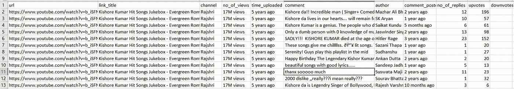

# 使用 Selenium 提取 YouTube 评论

> 原文：<https://medium.com/analytics-vidhya/extracting-youtube-comments-using-selenium-b29ee4f743ef?source=collection_archive---------2----------------------->


比方说，当你在 youtube 上搜索任何东西的时候，你想找出出现的前 10 个链接。与此同时，您还想为前 10 个链接中的每个链接收集前 50 条评论，并最终对收集到的数据进行情感分析。你当然不想手动做。

你会怎么做？

以下是你可以采取的步骤。

1.  **数据收集:**你可以用 Selenium 从 Youtube 网站做网页报废。请注意，注释本质上是递归的。当我说递归的时候，意思是人们可以在一个注释之上进行注释。你还需要决定你做分析所需要的所有数据点。以下是你可以从十大视频列表中提取的一些细节

视频标题文本
视频 URL
订阅频道
观看次数
发布日期链接

**2。数据清理:**这会耗费很多时间，因为人们可以用任何语言发表评论，可以使用笑脸、讽刺等。有许多 python 库可以帮助你清理数据。继续深入探讨这个问题。

**3。情感分析:**一旦你有了干净的数据，你就可以进行自然语言处理和情感分析，最后在此基础上进行可视化。

下面是代码的步骤。

步骤 1:导入所有必需的库

```
from selenium import webdriver
import time
import os
import csv
import pandas as pd
from math import ceil
```

步骤 2:打开文件，写入从 youtube 提取的数据

```
*# Creates a new .csv file that the data will be written to*

csv_file = open('c:**\\**ISB**\\**output_scraping.csv', 'w', encoding="UTF-8", newline="")
writer = csv.writer(csv_file)
```

步骤 3:在打开的 csv 文件中写入数据列标题

```
*# write header names*
writer.writerow(
    ['url', 'link_title', 'channel', 'no_of_views', 'time_uploaded', 'comment', 'author', 'comment_posted', 
     'no_of_replies','upvotes','downvotes'])
```

步骤 4:调用 webdriver 并启动 youtube 站点。

步骤 5:使用驱动程序动态搜索任何关键字，如下例所示，我搜索了“Kishore Kumar ”,然后睡了几秒钟，给浏览器加载页面的时间

步骤 6:对于每个前 10 个链接，提取以下元素并保存在各自的列表中

```
•   Video Title text
•   Video URL
•   Subcription Channel
•   No of Views
•   Date link posted
```

第 7 步:启动前十个提取链接的 url。对于每个 URL，向下滚动到所需位置以加载评论部分。-按顶部评论排序-向下滚动两次以加载至少 50 条评论-对于每条评论(50 条或更少)，提取下面的元素并将其放入 try catch 块中，以便在评论中没有特定元素时处理异常评论文本作者姓名发表评论的日期查看次数投票数/投票数

步骤 8:为从主链接和子链接中提取的元素创建字典，并写入打开的 csv 文件。

```
*# open chrome* 
youtube_pages = "https://www.youtube.com/"
locationOfWebdriver = "c:**\\**ISB**\\**chromedriver.exe"
driver = webdriver.Chrome(locationOfWebdriver)
driver.get(youtube_pages)
time.sleep(10)
**try**:
    print("=" * 40)  *# Shows in terminal when youtube summary page with search keyword is being scraped*
    print("Scraping " + youtube_pages)
    search = driver.find_element_by_id('search')
    search.send_keys("Kishore Kumar")    
    driver.find_element_by_id('search-icon-legacy').click()
    time.sleep(20)    
    vtitle = driver.find_elements_by_id('video-title')
    subscription = driver.find_elements_by_id('byline')
    views = driver.find_elements_by_xpath('//div[@id="metadata-line"]/span[1]')
    posted = driver.find_elements_by_xpath('//div[@id="metadata-line"]/span[2]')

    tcount = 0
    href = []
    title = []
    channel = []
    numview = []
    postdate = []

    **while** tcount < 10:
        href.append(vtitle[tcount].get_attribute('href'))
        channel.append(subscription[tcount].get_attribute('title'))
        title.append(vtitle[tcount].text)
        numview.append(views[tcount].text)
        postdate.append(posted[tcount].text)  
        tcount = tcount +1

    *# launch top ten extracted links and extract comment details*
    tcount = 0    
    **while** tcount < 10:  
        youtube_dict ={}
        *# extract comment section of top ten links*
        url = href[tcount]
        print (url)
        driver.get(url)
        time.sleep(5)

        **try**:
            print("+" * 40)  *# Shows in terminal when details of a new video is being scraped*
            print("Scraping child links ")
            *#scroll down to load comments*
            driver.execute_script('window.scrollTo(0,390);')
            time.sleep(15)
            *#sort by top comments*
            sort= driver.find_element_by_xpath("""//*[@id="icon-label"]""")
            sort.click()
            time.sleep(10)
            topcomments =driver.find_element_by_xpath("""//*[@id="menu"]/a[1]/paper-item/paper-item-body/div[1]""")
            topcomments.click()
            time.sleep(10)
            *# Loads 20 comments , scroll two times to load next set of 40 comments.* 
            **for** i **in** range(0,2):
                driver.execute_script("window.scrollTo(0,Math.max(document.documentElement.scrollHeight,document.body.scrollHeight,document.documentElement.clientHeight))")
                time.sleep(10)

            *#count total number of comments and set index to number of comments if less than 50 otherwise set as 50\.* 
            totalcomments= len(driver.find_elements_by_xpath("""//*[@id="content-text"]"""))

            **if** totalcomments < 50:
                index= totalcomments
            **else**:
                index= 50 

            ccount = 0
            **while** ccount < index: 
                **try**:
                    comment = driver.find_elements_by_xpath('//*[@id="content-text"]')[ccount].text
                **except**:
                    comment = ""
                **try**:
                    authors = driver.find_elements_by_xpath('//a[@id="author-text"]/span')[ccount].text
                **except**:
                    authors = ""
                **try**:
                    comment_posted = driver.find_elements_by_xpath('//*[@id="published-time-text"]/a')[ccount].text
                **except**:
                    comment_posted = ""
                **try**:
                    replies = driver.find_elements_by_xpath('//*[@id="more-text"]')[ccount].text                    
                    **if** replies =="View reply":
                        replies= 1
                    **else**:
                        replies =replies.replace("View ","")
                        replies =replies.replace(" replies","")
                **except**:
                    replies = ""
                **try**:
                    upvotes = driver.find_elements_by_xpath('//*[@id="vote-count-middle"]')[ccount].text
                **except**:
                    upvotes = ""

                youtube_dict['url'] = href[tcount]
                youtube_dict['link_title'] = title[tcount]
                youtube_dict['channel'] = channel[tcount]
                youtube_dict['no_of_views'] = numview[tcount]
                youtube_dict['time_uploaded'] =  postdate[tcount]
                youtube_dict['comment'] = comment
                youtube_dict['author'] = authors
                youtube_dict['comment_posted'] = comment_posted
                youtube_dict['no_of_replies'] = replies
                youtube_dict['upvotes'] = upvotes

                writer.writerow(youtube_dict.values())
                ccount = ccount +1

        **except** **Exception** **as** e:
            print(e)
            driver.close()
        tcount = tcount +1 
    print("Scrapping process Completed")   
    csv_file.close()    
**except** **Exception** **as** e:
    print(e)
    driver.close()
```

这里是输出控制台。

```
========================================
Scraping https://www.youtube.com/
https://www.youtube.com/watch?v=b_iSFNJmAhU
++++++++++++++++++++++++++++++++++++++++
Scraping child links 
https://www.youtube.com/watch?v=GSmXU2Q7TU8
++++++++++++++++++++++++++++++++++++++++
Scraping child links 
https://www.youtube.com/watch?v=uA67M0Lihz0
++++++++++++++++++++++++++++++++++++++++
Scraping child links 
https://www.youtube.com/watch?v=6vCbtPN9skk
++++++++++++++++++++++++++++++++++++++++
Scraping child links 
https://www.youtube.com/watch?v=aqBHgUkoZCE
++++++++++++++++++++++++++++++++++++++++
Scraping child links 
https://www.youtube.com/watch?v=duee3ROzuKg
++++++++++++++++++++++++++++++++++++++++
Scraping child links 
https://www.youtube.com/watch?v=nEnLt3pasxE
++++++++++++++++++++++++++++++++++++++++
Scraping child links 
https://www.youtube.com/watch?v=lKVIElw2IZM
++++++++++++++++++++++++++++++++++++++++
Scraping child links 
https://www.youtube.com/watch?v=AMuRRXCuy-4
++++++++++++++++++++++++++++++++++++++++
Scraping child links 
https://www.youtube.com/watch?v=MDXFi3avqo0
++++++++++++++++++++++++++++++++++++++++
Scraping child links 
Scrapping process Completed
```

这是从 csv 文件中提取的示例输出。



一旦获得 csv 文件中的数据，就可以使用各种 python 库做进一步的分析。

Selenium 是一个著名的使用 python 进行 web 抓取的库。继续使用这个库，从各种其他网站提取数据。但在此之前，请检查从他们的网站上抓取数据是否合法。我认为你可以将网络抓取用于学习目的，但不能用于商业用途。

如果你有任何问题，请随时联系我。