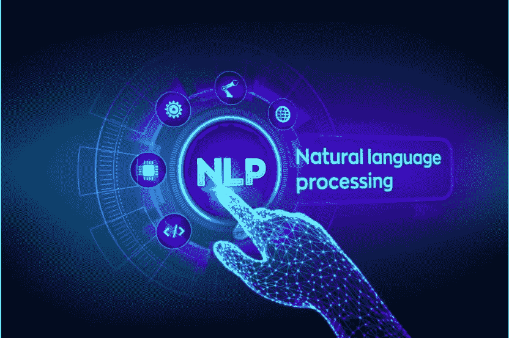

# 情绪驱动因素的回溯

> 原文：<https://medium.com/analytics-vidhya/extraction-of-sentiment-drivers-9803bb8fecaa?source=collection_archive---------14----------------------->

**NLP 中的司机回溯**

## 介绍

情绪是一种隐藏的情绪，思想和提供的整体背景。所有这些属性都是由客户以文本格式给出的。许多组织正在利用这种做法来处理文本分析，以便从中获得有意义的见解。