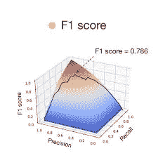
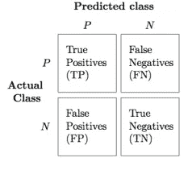

# F1 分数:评估模型性能的方法

> 原文：<https://medium.com/analytics-vidhya/f1-score-way-to-evaluate-the-models-performance-9f70ec2ed79?source=collection_archive---------7----------------------->


资料来源:联合国人类住区规划署

构建机器学习系统的挑战之一是，我们可以尝试的事情太多了，我们可以改变的事情太多了，例如调整超参数。无论我们是调整超参数，还是尝试学习算法的不同想法，或者只是尝试建立机器学习系统的不同选项。有一件事肯定会提高进度，那就是有一个单一的实数评估指标，让你快速判断你刚刚尝试的新事物比你上一个想法工作得更好还是更差。



来源:谷歌图片

评估分类器性能的一个合理方法是看它的精度和召回率。 **Precision** 是总预测阳性中正确阳性的比例。假设分类器 A 有 95%的精度，这意味着当分类器 A 说某样东西是一只狗时，它有 95%的可能真的是一只狗。**高精度与低假阳性率相关**。**回忆**是在所有真正是狗的图像的数据集中的总阳性中正确阳性的比例，分类器正确识别的百分比。



来源:谷歌图片

**Precision:** 在我们预测的 y = 1 的所有图像中，有狗的比例是多少？
精度=真阳性/预测阳性数= TP / (TP + FP)

**回想一下:**在所有实际上有狗的图像中，有多少能被正确识别？
召回率=真阳性/预测实际阳性数= TP / (TP + FN)

类似地，对于分类器 A，有 95%的机会在图像中有狗，并且有 90%的机会正确地检测到狗。而对于分类器 B，有 98%的机会在图像中有狗，并且有 85%的机会正确地检测到狗。
因此，**精度和召回率作为评估指标的问题是，如果分类器 A 在精度上做得更好，分类器 B 在召回率上做得更好，那么我们将不能确定哪个分类器是最好的。**在真实场景中，当我们有许多不同的想法和许多不同的超参数要尝试，并且有十几个分类器时，实际上不可能从中选择一个。
那么，我们推荐什么，而不是精度和召回这两个数字，来挑选一个分类器，**我们需要一个结合了精度和召回的单一评估指标，F1 得分**，通常 F1 得分是精度 P 和召回 r 的调和平均值。

**F1 得分** = 2 / (1/p + 1/r) = (2 × p × r) / (p + r)

下面是一个在 python 中使用 F1 分数的示例代码

```
# Import f1_score
from sklearn.metrics import f1_score# Instantiate the classifier
clf = RandomForestClassifier()# Fit to the training data
clf.fit(X_train, y_train)# Predict the labels of the test sety_pred = clf.predict(X_test)# Print the F1 score
print(f1_score(y_test, y_pred))
```

有时，单一评估指标不起作用。假设在一种情况下，我们必须关心分类器的准确性以及运行时间，那么在这些情况下，建立令人满意的以及优化的度量是很好的。

例如，在构建图像分类系统时，它要求运行时间应小于 100 毫秒，而在用不同的分类器进行检查时，我们看到分类器 A、B 和 C 分别给出 90%、93%和 96%的准确度，运行时间分别为 80 毫秒、95 毫秒和 500 毫秒。因此，我们可以说准确性是一个优化指标，因为我们希望最大限度地提高准确性，而运行时间是令人满意的指标。通过定义优化和满足度量，我们可以得出结论，在这种情况下，分类器 B 是最好的分类器。