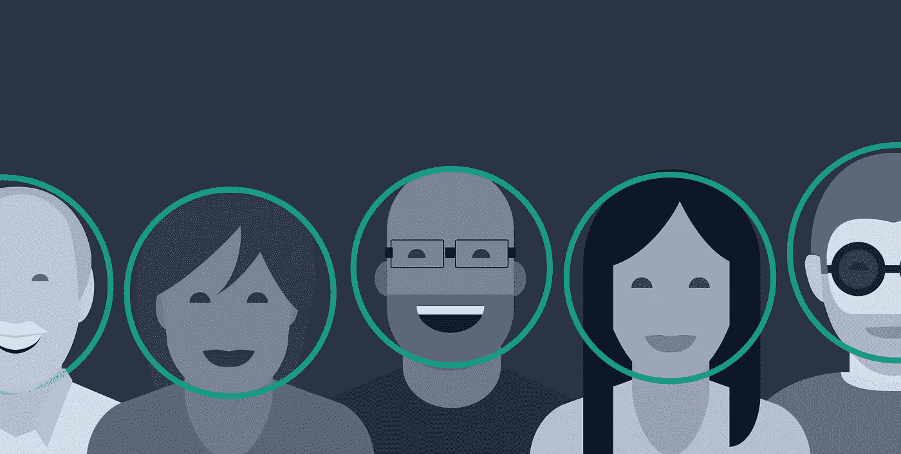
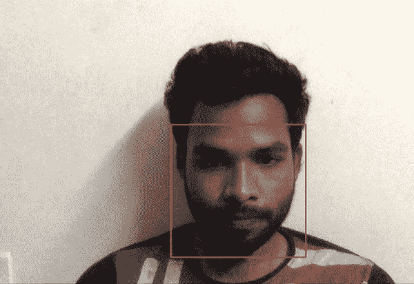

# 假人的人脸检测

> 原文：<https://medium.com/analytics-vidhya/face-detection-for-dummies-3b5927b8674c?source=collection_archive---------0----------------------->



人脸检测是一种在数字图像或视频流中识别人脸的方法。它已经在各种行业得到了大量的应用，如安全、监控、卫生部门、社交媒体、生物识别、执法、娱乐等。它被广泛用于相机中，以识别移动相机和 DSLR 相机的帧中的多个外观。脸书还使用人脸检测算法来检测图像中的人脸并进行识别。有许多方法可以做到这一点，从古老的图像处理技术如 Haar cascade 到新的深度学习技术如 R-CNN 和 YOLOs。在这篇文章中，我将展示一些快速且计算量小的方法。

> 显然，如果你打算从事计算机视觉方面的职业，知道如何做到这一点可以增加价值。

> 你能从这篇文章中期待什么？

这篇文章主要针对对 python 有一定了解的人工智能领域的初学者。这可能是一种很酷的方式来获得计算机视觉，特别是用最少的代码行进行人脸检测。

> 这篇文章没有提到什么？

我不打算解释人脸检测算法中的许多理论概念。

# 先决条件

***Dlib*** — Dlib 是一个现代的 C++工具包，包含机器学习算法和工具，用于用 C++创建复杂的软件来解决现实世界的问题。对于计算机视觉开发人员来说，这是一个非常方便的工具，可以快速构建计算机视觉原型。在这篇文章中，我们将使用 Dlib 的面部检测功能。

*对于 windows:*

```
pip install dlib
```

*在 Mac 或 Linux 上安装 Dlib:*

*   [如何在 macOS 或 Ubuntu 上从源码安装 dlib](https://gist.github.com/ageitgey/629d75c1baac34dfa5ca2a1928a7aeaf)

***OpenCV***—OpenCV(开源计算机视觉库)是一个开源的计算机视觉和机器学习软件库。OpenCV 旨在为计算机视觉应用提供一个公共基础设施，并加速机器感知在商业产品中的应用。对于一个步入计算机视觉领域的人来说，OpenCV 是一种“必须知道”的东西。我们将使用 OpenCV 的视频捕获功能从本地机器上使用网络摄像头来获取示例的视频提要。

```
pip install opencv-python
```

***Face _ Recognition***—利用世界上最简单的人脸识别库，从 Python 或命令行识别和操作人脸。它是使用 [dlib](http://dlib.net/) 最先进的深度学习人脸识别技术构建的。在我们的例子中，我们将使用这个库作为检测人脸的方法之一:

```
pip3 install face_recognition
```

让我们写一些在这篇文章中讨论的所有检测例子通用的代码。

导入所需的库:

```
import dlib
import cv2
import face_recognition
import sys
```

使用 cv 的视频捕捉启动网络摄像头:

```
# Start video capture for webcam -  Specifying 0 as an argument 
# fires up the webcam feed
video_capture = cv2.VideoCapture(0)
```

从 video_capture 对象中读取每一帧:

```
# Grab a single frame of video
ret, frame = video_capture.read()
```

通常，我们从任何典型的高清网络摄像头获得分辨率为 1280*720 的帧，这对于人脸检测操作来说是相当沉重的。因此，为了加快处理速度，我们将其大小调整了 1/4:

```
# Resize frame of video to 1/4 size for faster face detection   
small_frame = cv2.resize(frame, (0, 0), fx=0.25, fy=0.25)
```

当我们使用 CV 读取图像时，它是在 BGR 通道而不是传统的 RGB 通道(红、绿、蓝)中读取的。我们需要进行转换:

```
# Convert the image from BGR color (which OpenCV uses) to RGB color 
rgb_small_frame = small_frame[:, :, ::-1]
```

下一步是调用库函数，通过传递上面转换的图像来获得检测坐标。我将展示实现这一目标的三种方法。您可以使用任何一种更适合您的用例的方法。

# 使用人脸识别 API 进行人脸检测

使用 face_recognition 库，在上面转换的帧上调用 face_locations()来获得检测:

```
# Calling face_locations function on the converted frame.  
dets = face_recognition.face_locations(rgb_small_frame)
```

这里的 *dets* 是帧中所有面部位置的上、右、下、左坐标的元组列表。

在 *dets* 上循环以获得坐标并在面周围绘制矩形:

```
# Loop over the identified locations to draw a rectangle on the face
    for (top, right, bottom, left) in dets:

# Scale back up face locations since the frame we detected in was 
# scaled to 1/4 size
        top *= 4
        right *= 4
        bottom *= 4
        left *= 4# Draw a box around the face
        cv2.rectangle(frame, (left, top), (right, bottom), (0, 0, 255), 2)
```

一旦所有的矩形都绘制在框架上，使用 cv 内置的 imshow()函数显示框架:

```
# Display the resulting image
cv2.imshow('Face_recognition', frame)
```

将上述所有代码放入 while True 循环中，并添加以下退出条件代码:

```
# Hit 'q' on the keyboard to quit!
    if cv2.waitKey(1) & 0xFF == ord('q'):
        break
```

其次是:

```
video_capture.release()
cv2.destroyAllWindows()
```

# 使用 Dlib 人脸检测器进行人脸检测(基于 HOG)

使用 Dlib 库，实例化**get _ front _ face _ detector**类，并传递上面转换的图像来获得检测。这种检测方法是基于 H.O.G 的概念。你可以在我的帖子[中对 H.O.G 特性描述符](/@rehan_ahmad/a-take-on-h-o-g-feature-descriptor-e839ebba1e52)有一个大致的了解

```
# Creating dlib frontal face detector object
detector = dlib.get_frontal_face_detector()# Using the detecor object to get detections
dets = detector(rgb_small_frame)
```

这里的 *dets* 是具有**顶部、右侧、底部、左侧功能**的对象列表，这些功能给出了帧中所有面部位置的相应坐标。

在*细节*上循环以获得坐标，并在面周围绘制矩形:

```
# Loop over the identified locations to draw a rectangle on the face
    for det in dets:
# Scale back up face locations since the frame we detected in was 
# scaled to 1/4 size
        top = 4 * det.top()
        right = 4 * det.right()
        bottom = 4 * det.bottom()
        left = 4 * det.left()
        # Draw a box around the face
        cv2.rectangle(frame, (left, top), (right, bottom), (0, 0, 255), 2)
```

一旦所有的矩形都绘制在框架上，使用 cv 内置的 imshow()函数显示框架:

```
# Display the resulting image
cv2.imshow('Dlib_HOG', frame)
```

将所有代码保持在 while true 循环中，并满足以下中断条件:

```
# Hit 'q' on the keyboard to quit!
    if cv2.waitKey(1) & 0xFF == ord('q'):
        breakvideo_capture.release()
cv2.destroyAllWindows()
```

# 使用 Dlib 人脸检测器进行人脸检测(基于 CNN)

使用 Dlib 库，通过将预先训练的权重作为. dat 文件传递来实例化 **cnn_face_detection_v1** 类。你可以从[这里](http://dlib.net/files/mmod_human_face_detector.dat.bz2)下载文件。这是 Dlib 的检测功能的深度学习模型版本。事实证明，这是相当准确的，但与上述方法相比有点慢。

```
# Creating dlib cnn face detector object
cnn_face_detector = dlib.cnn_face_detection_model_v1('mmod_human_face_detector.dat')# Using the detecor object to get detections
dets = cnn_face_detector(rgb_small_frame, 1)
```

这里的 *dets* 是包含 **rect** 对象的对象列表，该对象包含 **top、right、bottom、left 函数**，这些函数给出了帧中所有面部位置的相应坐标。

在 *dets* 上循环以获得坐标并在面周围绘制矩形:

```
# Loop over the identified locations to draw a rectangle on the face
    for det in dets:
# Scale back up face locations since the frame we detected in was 
# scaled to 1/4 size
        top = 4 * det.rect.top()
        right = 4 * det.rect.right()
        bottom = 4 * det.rect.bottom()
        left = 4 * det.rect.left()
        # Draw a box around the face
        cv2.rectangle(frame, (left, top), (right, bottom), (0, 0, 255), 2)
```

一旦所有的矩形都绘制在框架上，使用 cv 内置的 imshow()函数显示框架:

```
# Display the resulting image
cv2.imshow('Dlib_CNN', frame)
```

将所有代码保持在 while 循环中，并满足以下中断条件:

```
# Hit 'q' on the keyboard to quit!
    if cv2.waitKey(1) & 0xFF == ord('q'):
        breakvideo_capture.release()
cv2.destroyAllWindows()
```

有了面部检测坐标，它的应用将会变得无止境。一个这样的应用可以是人脸识别，还有更多。你的创造力是唯一的限制。

终于有结果了！



这个功能是由[谷歌 Firebase](https://firebase.google.com/docs/ml-kit/detect-faces) 提供的，需要付费。借助 Google 的 ML Kit 的人脸检测 API，可以检测图像中的人脸，识别关键的面部特征，并获得检测到的人脸的轮廓。市场上还有其他一些玩家也做了同样的事情，但是通过上面的方法和一些自定义编码，你可以几乎免费地获得这些高级功能。

> 关于我

我是 [Wavelabs.ai](https://wavelabs.ai/) 的资深机器学习专家。我们 Wavelabs 帮助您利用人工智能(AI)来彻底改变用户体验并降低成本。我们使用人工智能独特地增强您的产品，以达到您的全部市场潜力。我们试图将尖端研究引入您的应用中。看看我们。

嗯，这些都在这个博客里。感谢阅读:)

保持好奇！

你可以在 [LinkedIn](https://www.linkedin.com/in/rehan-a-18675296) 联系我。