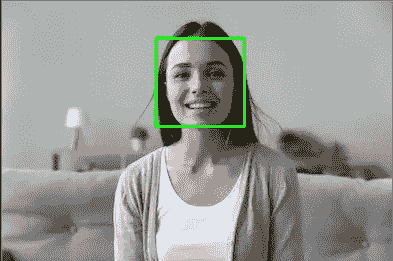

# 用 OpenCV 实现 Python 中的人脸检测

> 原文：<https://medium.com/analytics-vidhya/face-detection-in-python-by-open-cv-4b40cc2101e2?source=collection_archive---------19----------------------->

**你了解人脸检测吗？**


人脸检测是一种在各种应用中使用的技术，用于识别数字图像、流式摄像机或网络摄像头中的人脸。

在 Python 编程语言创建之前，我们必须使用 C++读取图像(打开 cv 图像库)进行人脸检测和其他图像处理，但使用 Python 语言，我们可以非常轻松地生成人脸检测应用程序。

首先，我们必须通过 pip 安装一些包:

pymongo:用于在 python 中使用 mongo 数据库。

opencv-python:用于在 python 中使用图像处理。

```
**pip install pymongo** **pip install opencv-python**
```

我们希望检测人脸并将日志写入数据库:

```
**import cv2** # for reading and scaling image**import datetime as dt****import pymongo****from time import sleep**
```

为日志初始化数据库:

```
**client = pymongo.MongoClient(“mongodb://localhost:27017/”)
face_database= client[“face_detection”] # select database
faces_collection = face_database[“faces”] # select collection**
```

初始化 cv2 点文件:

```
**cascPath = “data/haarcascades/haarcascade_frontalface_default.xml”**
```

cv2 中的点文件是 xml 点文件，用于检测任何东西，如人脸、汽车、颜色、微笑等。您可以从 github 中的 [*cv2 数据文件夹下载数据点文件。*](https://github.com/opencv/opencv/tree/master/data)

将 xml 点文件级联到 cv2:

```
**faceCascade = cv2.CascadeClassifier(cascPath)**
```

开始实时录制网络摄像机:

```
**video_capture = cv2.VideoCapture(0)**
```

现在，您必须从网络摄像头中一帧一帧地循环读取:

```
**while True:
    # Capture frame-by-frame
    ret, frame = video_capture.read()**
```


网络摄像头响应

然后将图像帧颜色从 RGB 转换为灰色:

```
 **gray = cv2.cvtColor(frame, cv2.COLOR_BGR2GRAY)**
```

现在你检测到灰度图像存在于级联点文件中:

```
 **faces = faceCascade.detectMultiScale(
     gray,
     scaleFactor=1.1,** # scale of check-in detection must > 1 **minNeighbors=5,** # minimum neighbor of each detected **minSize=(30, 30)** # minimum size of check rectangle **)** **print (“Found {0} faces!”.format(len(faces)))**
```

现在是将面数插入数据库的时候了:

```
 **faceDict = { “time”: dt.datetime.now(), “faceCount”:len(faces) }
    faces_collection.insert_one(faceDict)**
```

为线程增加 5 秒睡眠时间(可选):

```
 **sleep(5)**
```

在脸部周围创建一个矩形:

```
 **for (x, y, w, h) in faces:
      cv2.rectangle(image, (x, y), (x+w, y+h), (0, 255, 0), 2)**
```



在检测到图像中的女人后

现在你的程序可以通过一帧网络视频流来检测帧中的人脸。

您可以使用它进行 IOT，例如面部锁定、面部计数器进入您的商店等。

此处提供原始 Git:

向我发送您的评论:)