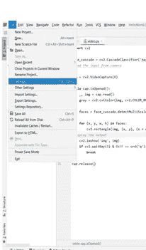
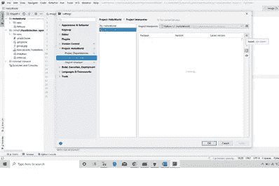
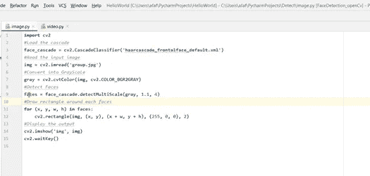
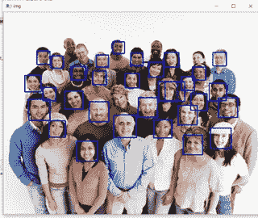
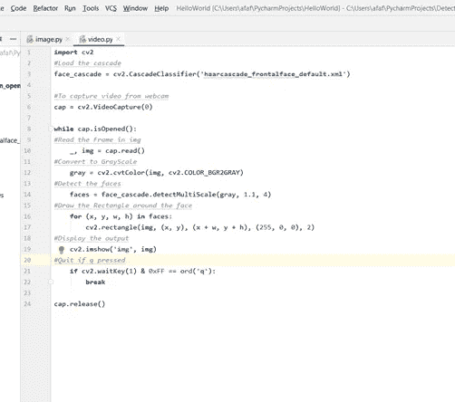

# 使用 OpenCV 和 Python 进行人脸检测

> 原文：<https://medium.com/analytics-vidhya/face-detection-using-opencv-python-f5f51dc30e6d?source=collection_archive---------21----------------------->

当你听到人脸识别的时候，你会想到视频监控，你被监视着。在过去的几十年里，人脸识别已经成为计算机视觉的一个热门领域。面部识别系统使用计算机算法来挑选出一个人面部的具体、独特的细节。

在这篇文章中，您将学习如何使用 OpenCV 和 Python 执行面部识别的基本实现。OpenCV 本质上代表**开源计算机视觉库。**到最后，你将学会在图像和视频中检测人脸。

**使用 OpenCV 实现人脸检测:**

1.安装 OpenCV，如果没有安装，则:

" pip 安装 **opencv-python"**

2.如果您使用 PyCharm，那么:

转到文件->设置

设置->项目解释器

然后点击项目解释器并点击“+”图标

点击对话框右上角的+图标，添加 opencv 并安装

在“+”后添加 **opencv-python** ，点击左下方的安装按钮。

人脸检测使用 haarcascade，这是一种机器学习方法，其中级联函数是用一些输入数据集训练的。Opencv 有一个预先训练好的人脸、眼睛等分类器。

首先，你需要下载一张图片和[训练好的分类器 XML 文件](https://raw.githubusercontent.com/opencv/opencv/master/data/haarcascades/haarcascade_frontalface_default.xml)(Haar cascode _ frontal face _ default . XML)，这个文件可以在 [OpenCV 的 GitHub 资源库](https://github.com/opencv/opencv/tree/master/data/haarcascades)中找到。

要检测图像中的人脸:

该计划的步骤:

1.导入 cv2

2.加载级联(第 3 行)

3.使用 **imread** 功能读取输入图像(第 5 行)

4.使用 **cvtColor** (第 7 行)将图像转换为灰度

5.检测人脸(第 9 行)

6.在面的周围画矩形(第 11 行到第 12 行)

7.显示输出(第 14 行到第 15 行)

## 要记住的几点:

将图像转换为灰度，因为检测仅适用于灰度**。**

**detectMultiScale** 功能用于检测人脸。它需要三个输入参数(输入图像、比例因子和 minNeighbours **)**

我们在图像中找到人脸的地方画出矩形。面包含矩形区域的坐标列表(检测面的位置)。

**图像中的面部检测的输出:**

# 同样，我们可以检测视频中的人脸。众所周知，视频是由帧组成的，帧是静止的图像。

**下面给出的是代码:**

该计划的步骤:

1.  导入 cv2
2.  加载级联(第 3 行)

3.使用 **VideoCapture** 从网络摄像头读取视频(第 5 行)

4.运行一个循环，从视频中读取图像，并将视频帧转换为灰度(第 12 行)

5.检测接受输入的人脸(第 14 行)

6.在面的周围画矩形，指定矩形的宽度和颜色(第 15-17 行)

7.运行检测你的脸作为输出(第 18 行-第 24 行)

视频中的人脸识别

图像和视频识别的唯一区别是视频中的每一帧都使用了无限循环。我们使用 cap.read()来读取每一帧，返回的初始值是一个标志，指示该帧是否被正确读取。返回的第二个值是我们将对其执行检测的静止帧。

**我希望这有所帮助！！**

更多帮助，可以访问我的 Github:-【https://github.com/Afaf-Athar/FaceDetection_openCv】T4