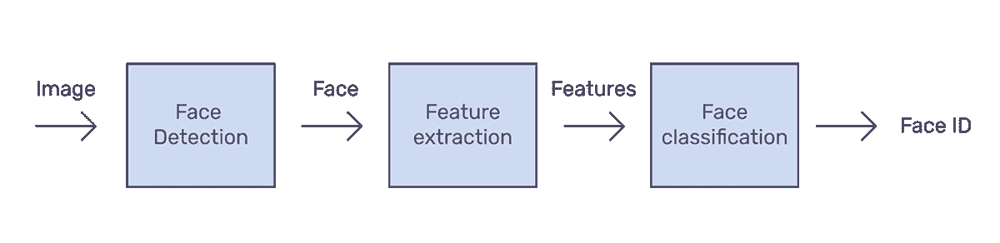
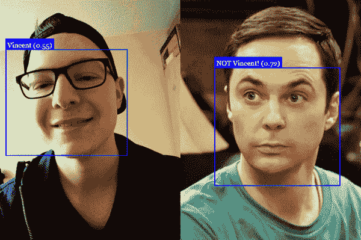
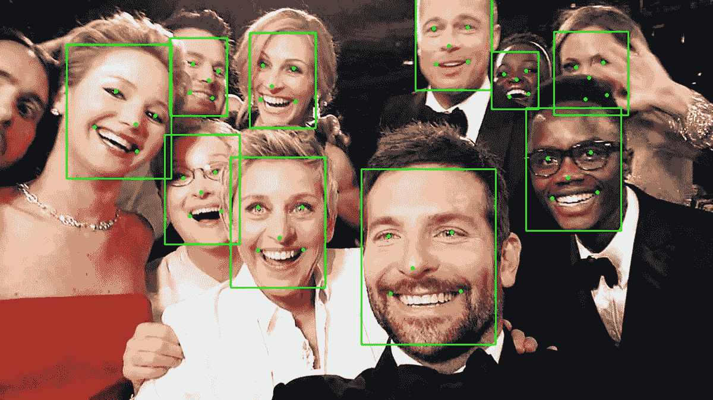
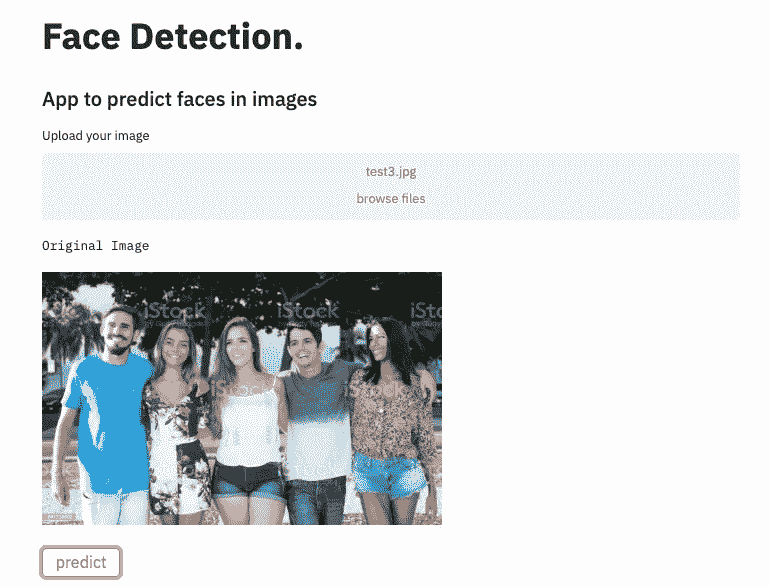
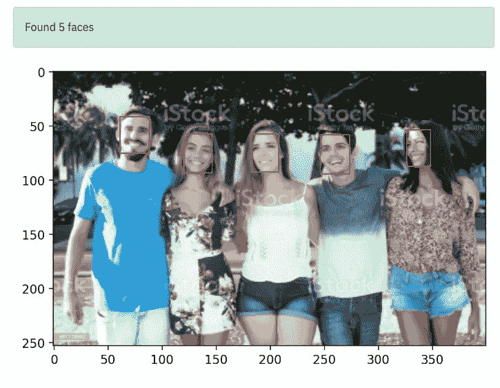

# 人脸检测 webApp

> 原文：<https://medium.com/analytics-vidhya/face-detection-webapp-5f947cffbfcb?source=collection_archive---------9----------------------->


在这篇快速的帖子中，我想分享一种非常流行的方法，使用 [Streamlit](https://www.streamlit.io/) 将您的模型部署为 webApp。超正析象管


**“人脸检测**是一种计算机技术，用于在数字图像中识别人脸。[【1】](https://en.wikipedia.org/wiki/Face_detection#cite_note-1)人脸检测也指人类在视觉场景中定位和注意人脸的心理过程—[https://en.wikipedia.org/wiki/Face_detection](https://en.wikipedia.org/wiki/Face_detection)



形式上，人脸识别被定义为*在图像中识别或验证人脸的问题*。我们到底是如何在图像中识别一张脸的？

人脸识别可以分为多个步骤。下图显示了人脸识别管道的示例。

1.  人脸检测—检测图像中的一张或多张人脸。
2.  特征提取——从人脸图像中提取最重要的特征。
3.  人脸分类—根据提取的特征对人脸进行分类。



样本人脸检测

有各种方法来实现人脸识别流水线中的每个步骤。在这篇文章中，我们将重点关注流行的深度学习方法，其中我们使用 MTCNN 进行人脸检测，使用 FaceNet 进行特征提取，使用 Softmax 进行分类。—[https://ars Futura . com/magazine/face-recognition-with-face net-and-mt CNN/](https://arsfutura.com/magazine/face-recognition-with-facenet-and-mtcnn/)

# MTCNN

Python3.4+中 Keras 的 MTCNN 人脸检测器的实现。它是从零开始写的，参考了大卫·桑德伯格的 MTCNN 的实现( [FaceNet 的 MTCNN](https://github.com/davidsandberg/facenet/tree/master/src/align) )。基于张，K 等(2016) [【张 2016】](https://pypi.org/project/mtcnn/#zhang2016)的论文*。*

来源=[https://pypi.org/project/mtcnn/](https://pypi.org/project/mtcnn/)

```
>>> from mtcnn import MTCNN
>>> import cv2
>>>
>>> img = cv2.cvtColor(cv2.imread("ivan.jpg"), cv2.COLOR_BGR2RGB)
>>> detector = MTCNN()
>>> detector.detect_faces(img)
[
    {
        'box': [277, 90, 48, 63],
        'keypoints':
        {
            'nose': (303, 131),
            'mouth_right': (313, 141),
            'right_eye': (314, 114),
            'left_eye': (291, 117),
            'mouth_left': (296, 143)
        },
        'confidence': 0.99851983785629272
    }
]
```



MTCNN 输出样本

# 部署 webApp

部署一个模型仅仅意味着进入一个现有的生产环境，它可以接受一个输入并返回一个输出，这个输出可以用于制定实际的业务决策。这就是 Streamlit 发挥作用的地方！

关注 webapp，随意测试；-)

在图像中书写矩形

## 关注 webapp，随意测试；-)

 [## 细流

### 编辑描述

webapp-facedetect.herokuapp.com](https://webapp-facedetect.herokuapp.com/) 

## Youtube 视频教程



示例 webapp



结果 webapp


那里见；-)

[https://twitter.com/bernardocalda10](https://twitter.com/bernardocalda10)

[](https://github.com/bernardcaldas) [## bernardcaldas -概述

### 一位数据科学爱好者 Arctic Code Vault 贡献者在 GitHub 上注册您自己的个人资料，这是最好的地方…

github.com](https://github.com/bernardcaldas)