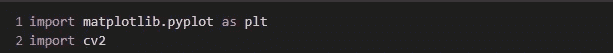
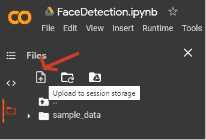
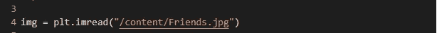
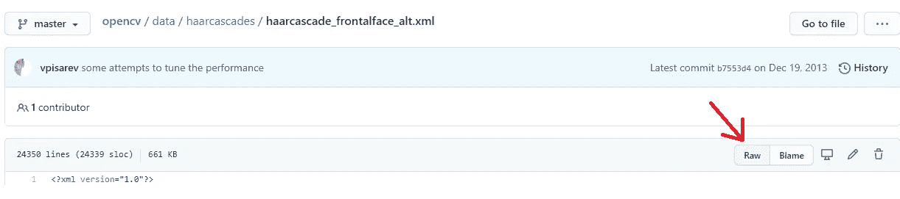
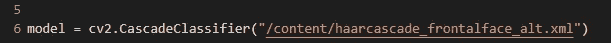
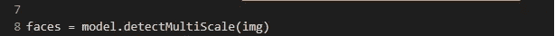
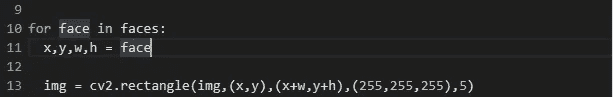
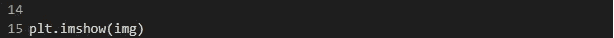
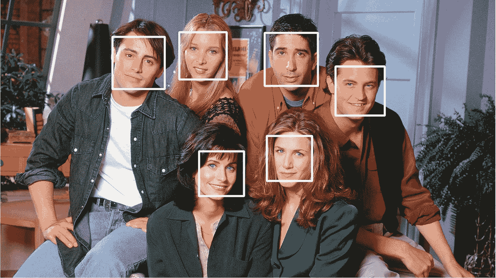
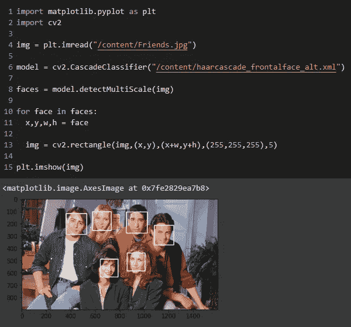

# 人脸检测:Python 中的 6 个简单步骤

> 原文：<https://medium.com/analytics-vidhya/face-detection-with-6-simple-steps-in-python-4e3958660dbe?source=collection_archive---------14----------------------->

## 本文旨在展示我们如何使用 OpenCV 库以最少的步骤检测给定图像中的人脸

我正在用一个 [Google Colab 笔记本](https://colab.research.google.com/)写我的 Python 程序。但是，你可以使用任何你选择的编辑器，比如 [VS Code](https://code.visualstudio.com/docs/languages/python) 、 [PyCharm](https://www.jetbrains.com/pycharm/) 等等。

> 我在这里所做的就是将一幅图像传递给 OpenCV 库，并用它来对照一个训练好的模型来检测人脸。

# 以下是步骤:

# 第一步

打开一个新的 Google Colab 笔记本，导入两个必备库 [matplotlib.pyplot](https://pypi.org/project/matplotlib/) 和 [cv2](https://pypi.org/project/opencv-python/)

> 我们使用 **matplotlib** 来访问给定图像的属性，使用***cv2****来访问经过训练的模型，并使用给定图像来检测人脸*

**

**如果你正在使用任何其他编辑器，你可以使用* [*pip 来安装软件包*](https://www.w3schools.com/python/python_pip.asp)*

# *第二步*

*上传有脸的图像。我更喜欢用集体照，但是你也可以用你选择的任何照片。你可以找到我这里用的图片。并上传到笔记本里。*

**

*这是我在节目中使用的图片(来自热门情景喜剧《老友记》)*

**

*您可以点击此图标上传图像*

*现在，你已经上传了图片，试着将它读入程序中一个名为 ***img*** 的变量。*

**

*您可以通过右键单击文件来复制路径*

*使用[***imread()***](https://matplotlib.org/api/_as_gen/matplotlib.pyplot.imread.html)将图像加载到变量中*

**

# *第三步*

*现在，是加载模型的时候了。为此，你需要从 [***哈尔喀***](https://github.com/opencv/opencv/tree/master/data/haarcascades) 下载其中一个 XML 文件，名为[***haarcascade _ frontal face _ alt . XML***](https://github.com/opencv/opencv/blob/master/data/haarcascades/haarcascade_frontalface_alt.xml)。你将不得不通过像这样切换到 Raw 模式来复制 XML 内容，或者你甚至可以在这里找到。*

**

> *[哈尔喀斯](https://github.com/opencv/opencv/tree/master/data/haarcascades)有那么多模型检测人体各个部位像检测眼睛、额脸、下半身、上半身、全身等等。但是我们现在只关注人脸。*

*现在，通过复制 [***cv2 中的文件路径，将模型加载到名为 ***model*** 的变量中。级联分类器()***](https://docs.opencv.org/3.4/db/d28/tutorial_cascade_classifier.html)*

**

# *第四步*

*现在使用 OpenCV [***的功能之一 detect scale()***](https://docs.opencv.org/3.4/d1/de5/classcv_1_1CascadeClassifier.html#aaf8181cb63968136476ec4204ffca498)，检测给定图像中的所有人脸，并将其存储在一个名为 ***faces*** 的变量中*

**

# *第五步*

*一旦我们有了 ***，*** 个面，我们就可以一个接一个地迭代它们，并标记它们分别绘制白色矩形*

**

*这个循环可能看起来很棘手，但它所做的只是*

1.  *得到坐标(x，y)和尺寸(w，h)来画一个矩形*
2.  *使用 [***设置颜色，RGB 格式***](https://www.w3schools.com/colors/colors_rgb.asp) 为矩形。我在这里用了白色(255，255，255)。*
3.  *设置矩形边框的粗细。我这里用了 5。*

*所有这些工作都是通过使用[***cv2 . rectangle()***](https://docs.opencv.org/master/d6/d6e/group__imgproc__draw.html#ga07d2f74cadcf8e305e810ce8eed13bc9)完成的*

# *最后一步*

*使用[***【imshow()***](https://matplotlib.org/api/_as_gen/matplotlib.pyplot.imshow.html#matplotlib.pyplot.imshow)显示检测到的人脸周围带有矩形标记的图像*

**

> *下面是运行最终代码后带有标记的图像的样子*

**

> *这是整个代码的样子*

**

*你可以在我的 Colab 笔记本[这里](https://colab.research.google.com/drive/1cndOr-YmXH8ZBc6_QvwvuEoczBVGpO6O)甚至在这个 [Github 库](https://github.com/pradeepradyumna/Face-Detection)里找到代码。*

> *我希望它是有用的！*