# 使用 OpenCV 的 Python 人脸检测

> 原文：<https://medium.com/analytics-vidhya/face-detection-with-python-using-opencv-fb563e51e3c0?source=collection_archive---------10----------------------->

本教程将向您介绍使用 OpenCV 库在 Python 中进行对象检测的概念，以及如何利用它来执行面部检测等任务。

# 介绍

人脸检测是一种计算机视觉技术，有助于在数字图像中定位/可视化人脸。该技术是[对象检测技术](https://en.wikipedia.org/wiki/Object_detection)的一个具体用例，该技术处理在数字图像和视频中检测某类语义对象(如人、建筑物或汽车)的实例。随着技术的发展，人脸检测变得越来越重要，尤其是在摄影、安全和营销等领域。

# 先决条件

在研究 OpenCV 的概念之前，Numpy 和 Matplotlib 的实践知识是必不可少的。在安装 OpenCV 之前，请确保您已经安装并运行了以下软件包。

*   [巨蟒](https://www.python.org/)
*   Numpy
*   Matplotlib

# 目录

1.  [OpenCV-Python](https://www.datacamp.com/community/tutorials/face-detection-python-opencv#opencv-python)

*   1.概观
*   2.装置

2.[图像作为数组](https://www.datacamp.com/community/tutorials/face-detection-python-opencv#images-as-arrays)

*   二进制映象
*   灰度图像
*   彩色图像

[3。图像和 OpenCV](https://www.datacamp.com/community/tutorials/face-detection-python-opencv#images-and-opencv)

*   在 OpenCV 中导入图像
*   储蓄图像
*   对图像的基本操作

[4。面部检测](https://www.datacamp.com/community/tutorials/face-detection-python-opencv#face-detection)

*   概观
*   基于 Haar 特征的级联分类器
*   基于 OpenCV-Python 的人脸检测

[5。结论](https://www.datacamp.com/community/tutorials/face-detection-python-opencv#conclusion)

# 1.OpenCV-Python

# 概观


[OpenCV](https://opencv.org/) 由 **Gary Bradsky** 于 1999 年在英特尔创立。第一次发布是在 2000 年稍晚的时候。OpenCV 本质上代表**开源计算机视觉库**。虽然它是用优化的 C/C++编写的，但是它有 Python 和 Java 以及 C++的接口。OpenCV 在全世界拥有活跃的用户群，由于计算机视觉应用的激增，其使用日益增加。

OpenCV-Python 是 OpenCV 的 Python API。你可以把它看作是 OpenCV 的 C++实现的 python 包装器。OpenCV-Python 不仅速度快(因为后台包含用 C/C++编写的代码)，而且易于编码和部署(因为前台有 Python 包装器)。这使得它成为执行计算密集型程序的最佳选择。

# 装置

OpenCV-Python 支持所有主流平台，如 Mac OS、Linux 和 Windows。它可以通过以下任一方式安装:

**1。从预构建的二进制文件和源代码**:

请参考详细文档[此处](https://docs.opencv.org/3.0-beta/doc/py_tutorials/py_setup/py_setup_in_windows/py_setup_in_windows.html)为 Windows，此处[为 Mac。](https://www.pyimagesearch.com/2016/12/19/install-opencv-3-on-macos-with-homebrew-the-easy-way/)

[**2。非官方**为 Python 预建的 OpenCV 包](https://pypi.org/project/opencv-python/)。

标准桌面环境的软件包(Windows，macOS，几乎所有的 GNU/Linux 发行版)

*   如果只需要主模块，运行`pip install opencv-python`
*   如果需要 main 和 contrib 模块，运行`pip install opencv-contrib-python`(查看 OpenCV 文档[中的额外模块列表](https://docs.opencv.org/master/)

您可以使用 Jupyter 笔记本或您选择的任何 Python IDE 来编写脚本。

# 2.图像作为数组

图像只不过是包含数据点像素的标准 Numpy 数组。图像的像素越多，分辨率就越高。你可以认为像素是以二维网格形式排列的微小信息块，像素的深度是指其中存在的颜色信息。为了被计算机处理，图像需要被转换成二进制形式。图像的颜色可以计算如下:

```
Number of colors/ shades = 2^bpp where bpp represents bits per pixel.
```

自然，位数/像素数越多，图像中可能的颜色就越多。下表更清楚地显示了这种关系。

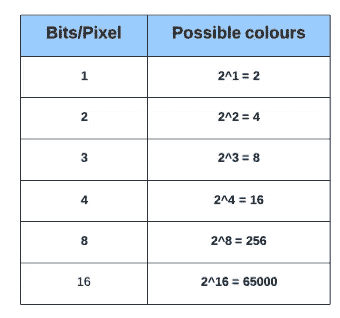

# 现在让我们看看不同种类的图像的表示:

# 1.二进制映象

二进制图像由 1 比特/像素组成，因此只能有两种可能的颜色，即黑色或白色。黑色由值 0 表示，而 1 表示白色。

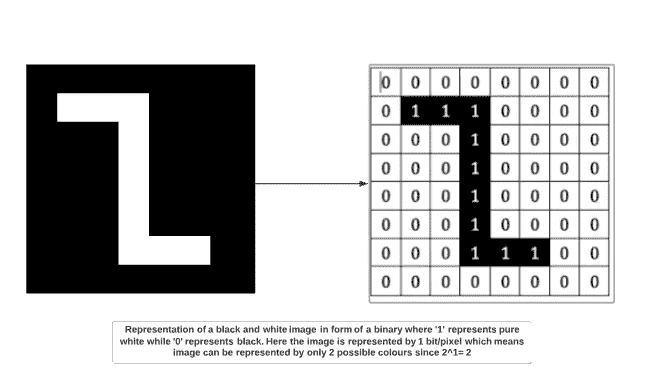

# 2.灰度图像

灰度图像由每像素 8 位组成。这意味着它可以有 256 种不同的色调，其中 0 像素代表黑色，而 255 代表白色。例如，下图显示了以数组形式表示的灰度图像。灰度图像只有一个通道，其中通道代表一个维度。

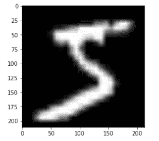

# 3.彩色图像

彩色图像由红色、蓝色和绿色组合而成，所有其他颜色都可以通过将这些原色以正确的比例混合来实现。

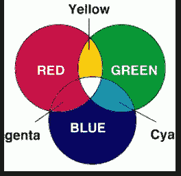

彩色图像也由每像素 8 位组成。因此，256 种不同色调的颜色可以用 0 表示黑色，255 表示白色来表示。让我们看看著名的山魈彩色图像，它在许多图像处理例子中被引用。

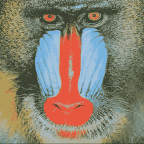

如果我们检查上图的形状，我们会得到:

```
Shape
(288, 288, 3)
288: Pixel width
288: Pixel height
3: color channel
```

这意味着我们可以用三维数组的形式来表示上面的图像。

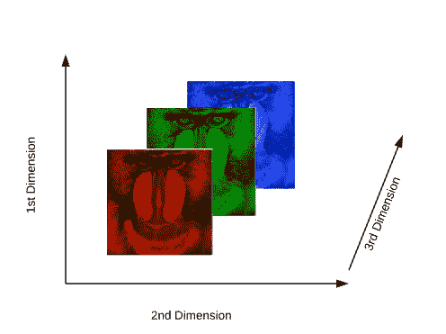

# 3.图像和 OpenCV

在我们进入人脸检测过程之前，让我们学习一些关于使用 OpenCV 的基础知识。在本节中，我们将使用 OpenCV 对图像执行简单的操作，如打开图像、在图像上绘制简单的形状，以及通过回调与图像进行交互。这是必要的，以创建一个基础，然后我们再走向高级的东西。

# 在 OpenCV 中导入图像

# 使用 Jupyter 笔记本

**步骤:**

*   **导入必要的库**

```
import numpy as np
import cv2
import matplotlib.pyplot as plt
%matplotlib inline
```

*   使用 **imread** 功能读入图像。我们将使用彩色的“山魈”图像进行演示。可以从[这里](https://github.com/parulnith/Face-Detection-in-Python-using-OpenCV/blob/master/opening%20images%20with%20opencv/mandrill_colour.png)下载

```
img_raw = cv2.imread('image.jpg')
```

*   **阵列的类型和形状。**

```
type(img_raw)
numpy.ndarrayimg_raw.shape
(1300, 1950, 3)
```

因此。png 图像被转换成一个形状为 1300x1950 的 NumPy 数组，有 3 个通道。

*   **查看图像**

```
plt.imshow(img_raw)
```

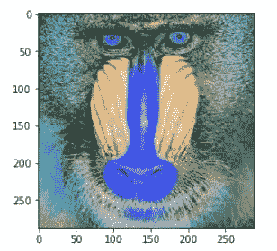

关于颜色，我们得到的输出有点不同。我们期望得到一个亮色的图像，但是我们得到的是一个略带蓝色的图像。这是因为 OpenCV 和 matplotlib 的原色顺序不同。OpenCV 读取 BGR 格式的图像，而 matplotlib 遵循 RGB 的顺序。因此，当我们通过 OpenCV 读取一个文件时，我们就好像它包含蓝色、绿色和红色的通道一样。然而，当我们使用 matplotlib 显示图像时，红色和蓝色通道被交换，从而得到蓝色色调。为了避免这个问题，我们将使用`cvtColor`函数将通道转换为 matplotlib 期望的方式。

```
img = cv2.cvtColor(img_raw, cv2.COLOR_BGR2RGB)
plt.imshow(img_rgb)
```


# 使用 Python 脚本

Jupyter 笔记本非常适合学习，但在处理复杂的图像和视频时，我们需要在自己单独的窗口中显示它们。在本节中，我们将把代码作为一个. py 文件来执行。您可以使用 Pycharm、Sublime 或您选择的任何 IDE 来运行下面的脚本。

```
import cv2
img = cv2.imread('image.jpg')
while True:
    cv2.imshow('mandrill',img) if cv2.waitKey(1) & 0xFF == 27:
        break cv2.destroyAllWindows()
```

在这段代码中，我们有一个条件，只有当条件为真时，才会显示图像。此外，要打破这个循环，我们需要满足两个条件:

*   [cv2.waitKey()](https://opencv-python-tutroals.readthedocs.io/en/latest/py_tutorials/py_gui/py_image_display/py_image_display.html) 是一个键盘绑定函数。它的参数是以毫秒为单位的时间。该函数为任何键盘事件等待指定的毫秒数。如果您在这段时间内按下任何键，程序将继续运行。
*   第二个条件与按下键盘上的 Escape 键有关。因此，如果已经过了 1 毫秒并按下了 escape 键，循环将会中断，程序将会停止。
*   [cv2.destroyAllWindows()](https://opencv-python-tutroals.readthedocs.io/en/latest/py_tutorials/py_gui/py_image_display/py_image_display.html) 干脆把我们创建的所有窗口都毁掉。如果您想要销毁任何特定的窗口，请使用函数 **cv2.destroyWindow()** ，在这里您可以将确切的窗口名称作为参数传递。

# 储蓄图像

图像可以保存在工作目录中，如下所示:

```
cv2.imwrite('final_image.png',img)
```

其中，最终图像是要保存的图像的名称。

# 对图像的基本操作

在这一节中，我们将学习如何在现有图像上绘制各种形状，以体验使用 OpenCV 的乐趣。

# 在图像上绘图

*   首先导入必要的库。

```
import numpy as np
import matplotlib.pyplot as plt
%matplotlib inline
import cv2
```

*   创建一个黑色图像作为模板。

```
image_blank = np.zeros(shape=(512,512,3),dtype=np.int16)
```

*   显示黑色图像。

```
plt.imshow(image_blank)
```

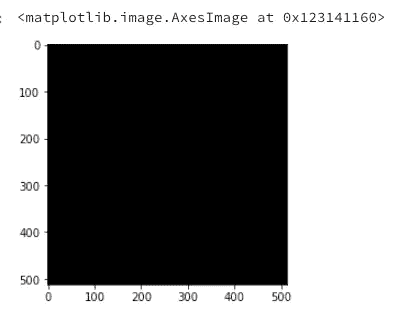

# 功能和属性

在图像上绘制形状的通用函数是:

```
cv2.shape(line, rectangle etc)(image,Pt1,Pt2,color,thickness)
```

在函数中传递一些常见的参数，以便在图像上绘制形状:

*   要在其上绘制形状的图像
*   要从 Pt1(左上)到 Pt2(右下)绘制的形状的坐标
*   **颜色**:要绘制的形状的颜色。它作为一个元组传递，例如:`(255,0,0)`。对于灰度，它将是亮度的标度。
*   几何图形的厚度。

## 1.直线

在图像上画一条直线需要指定直线要经过的点。

```
# Draw a diagonal red line with thickness of 5 px
line_red = cv2.line(img,(0,0),(511,511),(255,0,0),5)
plt.imshow(line_red)
```

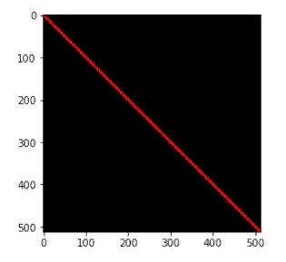

```
# Draw a diagonal green line with thickness of 5 px
line_green = cv2.line(img,(0,0),(511,511),(0,255,0),5)
plt.imshow(line_green)
```

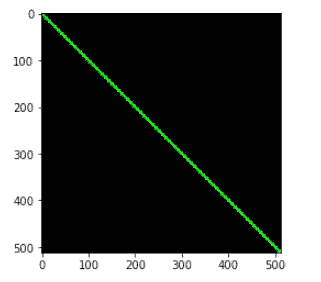

## 2.矩形

对于矩形，我们需要指定左上角和右下角的坐标。

```
#Draw a blue rectangle with a thickness of 5 pxrectangle= cv2.rectangle(img,(384,0),(510,128),(0,0,255),5)
plt.imshow(rectangle)
```

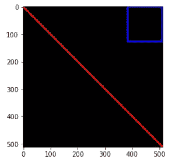

## 3.圆

对于一个圆，我们需要传递它的圆心坐标和半径值。让我们在上面画的矩形里面画一个圆

```
img = cv2.circle(img,(447,63), 63, (0,0,255), -1) # -1 corresponds to a filled circle
 plt.imshow(circle)
```

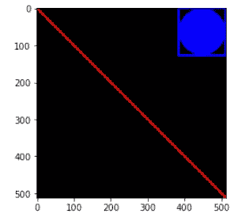

# 在图像上书写

向图像添加文本也类似于在图像上绘制形状。但是在这样做之前，您需要指定某些参数:

*   要编写的文本
*   文本的坐标。图像上的文本从左下方开始。
*   字体类型和比例。
*   其他属性，如颜色、粗细和线型。通常使用的线路类型是`lineType = cv2.LINE_AA`。

```
font = cv2.FONT_HERSHEY_SIMPLEX
text = cv2.putText(img,'OpenCV',(10,500), font, 4,(255,255,255),2,cv2.LINE_AA)
plt.imshow(text)
```

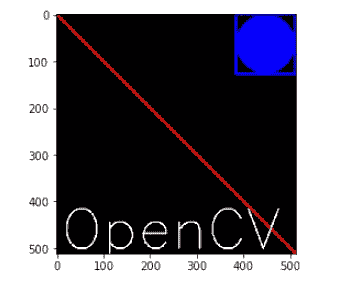

这些是可以使用 OpenCV 在图像上完成的小操作。请随意试验形状和文本。

# 4.人脸检测

# 概观

人脸检测是一种在数字图像中识别或定位人脸的技术。面部检测的一个典型例子发生在我们通过智能手机拍照时，它会立即检测到照片中的面部。人脸检测不同于人脸识别。面部检测仅仅检测图像中面部的存在，而面部识别包括识别这是谁的面部。在本文中，我们将只讨论前者。

通过使用分类器来执行面部检测。分类器本质上是一种算法，它决定给定的图像是正面的(人脸)还是负面的(不是人脸)。一个分类器需要在数以千计的有和没有人脸的图像上进行训练。幸运的是，OpenCV 已经有两个预训练的人脸检测分类器，可以很容易地在程序中使用。这两个分类器是:

*   哈尔分类器和
*   局部二元模式( [LBP](https://en.wikipedia.org/wiki/Local_binary_patterns) )分类器。

然而，在本文中，我们将只讨论 Haar 分类器。

# 基于 Haar 特征的级联分类器

[Haar-like 特征](https://en.wikipedia.org/wiki/Haar-like_feature)是用于物体识别的数字图像特征。它们的名字源于它们与 [Haar 小波](https://en.wikipedia.org/wiki/Haar_wavelet)的直觉相似性，并被用于第一个实时人脸检测器。 **Paul Viola** 和 **Michael Jones** 在他们题为[“使用简单特征增强级联的快速对象检测”](http://wearables.cc.gatech.edu/paper_of_week/viola01rapid.pdf)的论文中使用了基于 Haar 小波的 Haar 特征分类器的思想。这种分类器广泛用于计算机视觉行业中的人脸检测等任务。

Haar 级联分类器采用机器学习方法进行视觉对象检测，能够非常快速地处理图像并实现高检测率。这可以归结为三个主要的[原因](http://wearables.cc.gatech.edu/paper_of_week/viola01rapid.pdf):

*   Haar 分类器采用了 ***【积分图像】*** 概念，这使得检测器所使用的特征可以非常快速地计算出来。
*   学习算法基于[***AdaBoost***](https://en.wikipedia.org/wiki/AdaBoost)。它从大量的特征集中选择少量的重要特征，并给出高效的分类器。
*   更复杂的分类器被组合以形成“ ***级联*** ”，其丢弃图像中的任何非人脸区域，从而在有希望的物体状区域上花费更多的计算。

**现在让我们试着逐步理解该算法如何作用于图像:**

# 1.哈尔特征提取

在将大量的训练数据(以图像的形式)输入系统后，分类器开始从每幅图像中提取 Haar 特征。Haar 特征是一种卷积核，主要检测图像上是否存在合适的特征。以下是 Haar 特性的一些示例:

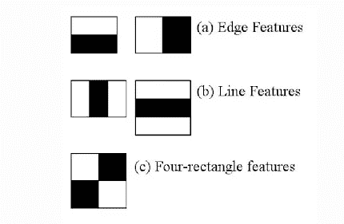

[来源](https://www.cs.cmu.edu/~efros/courses/LBMV07/Papers/viola-cvpr-01.pdf)

这些 Haar 特征就像窗口，被放置在图像上以计算单个特征。该特征本质上是通过减去白色区域下的像素和黑色区域下的像素的总和而获得的单个值。在下面的例子中可以很容易地看到这个过程。

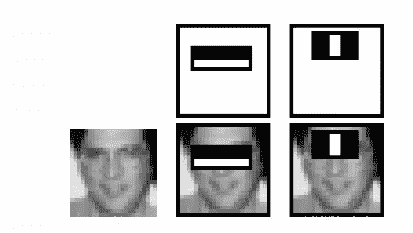

出于演示的目的，假设我们只提取两个特征，因此这里只有两个窗口。第一个特征依赖于眼睛区域比相邻的脸颊和鼻子区域暗这一点。第二个特点是眼睛比鼻梁更黑。因此，当特征窗口在眼睛上移动时，它将计算单个值。然后，将该值与某个阈值进行比较，如果该值超过阈值，则推断这里存在边缘或某些积极特征。

# 2.整体图像概念

Viola-Jones 提出的算法使用 24X24 的基本窗口大小，这将导致在该窗口中计算超过 180，000 个特征。想象一下计算所有特征的像素差异？为这一计算密集型过程设计的解决方案是采用**积分图像**概念。积分图像意味着要找到任何矩形下所有像素的总和，我们只需要四个角的值。

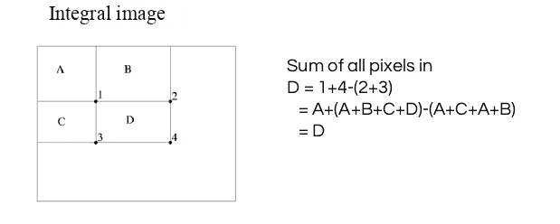

[来源](https://www.cs.cmu.edu/~efros/courses/LBMV07/Papers/viola-cvpr-01.pdf)

这意味着，要计算任何特征窗口中像素的总和，我们不需要单独对它们求和。我们所需要的是使用 4 个角值来计算积分图像。下面的例子将使这个过程变得透明。

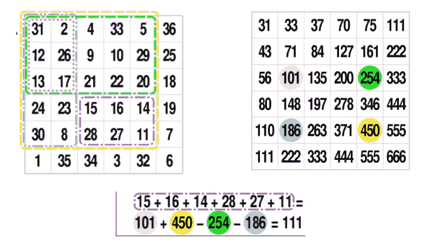

[来源](https://en.wikipedia.org/wiki/Summed-area_table)

# 3.“Adaboost”:提高分类器精度

如上所述，在 24X24 窗口内会产生超过 180，000 个特征值。然而，并不是所有的特征都对识别人脸有用。为了只从整个块中选择最好的特征，使用了一种叫做 **Adaboost** 的机器学习算法。它本质上做的是只选择那些有助于提高分类器精度的特征。它通过构建一个强分类器来实现，该强分类器是多个弱分类器的线性组合。这将功能的数量从大约 180，000 个急剧减少到大约 6000 个。

# 4.使用“分类器级联”

Viola-Jones 确保算法快速执行的另一种方式是采用分类器的**级联。级联分类器基本上由多个级组成，其中每个级由一个强分类器组成。这是有益的，因为它消除了在一个窗口上一次应用所有特征的需要。相反，它将特征分组到单独的子窗口中，并且每个阶段的分类器确定子窗口是否是人脸。如果不是，则该子窗口与该窗口中的特征一起被丢弃。如果子窗口移过分类器，则它继续到下一阶段，在该阶段应用第二阶段的特征。借助下图可以理解这一过程。**

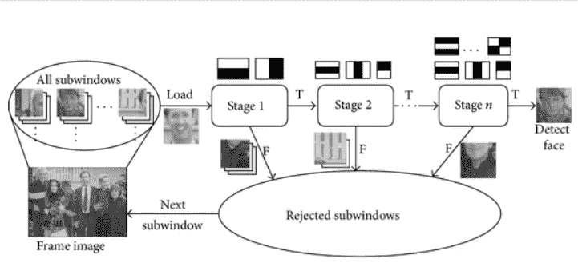

[哈尔分类器的级联结构。](https://www.researchgate.net/figure/Cascade-structure-for-Haar-classifiers_fig9_277929875)

# 保罗-维奥拉算法可以被形象化如下:

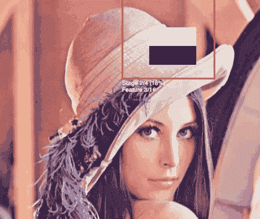

[来源](https://vimeo.com/12774628)

# 基于 OpenCV-Python 的人脸检测

现在我们对人脸识别背后的直觉和过程有了一个公平的想法。现在让我们使用 OpenCV 库来检测图像中的人脸。

# 加载必要的库

```
import numpy as np
import cv2
import matplotlib.pyplot as plt
%matplotlib inline
```

# 加载待测图像的灰度

我们将使用下图:

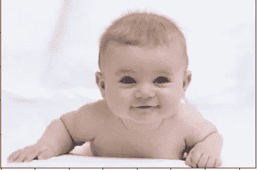

```
#Loading the image to be tested
test_image = cv2.imread('data/baby1.jpg')#Converting to grayscale
test_image_gray = cv2.cvtColor(test_image, cv2.COLOR_BGR2GRAY)# Displaying the grayscale image
plt.imshow(test_image_gray, cmap='gray')
Since we know that OpenCV loads an image in BGR format, so we need to convert it into RBG format to be able to display its true colors. Let us write a small function for that.
```

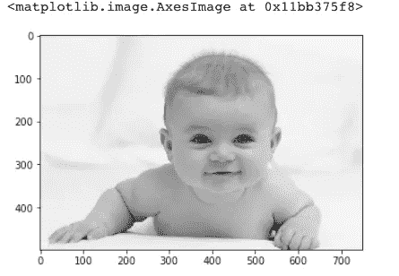

因为我们知道 OpenCV 以 BGR 格式加载图像，所以我们需要将它转换成 RBG 格式，以便能够显示它的真实颜色。让我们为此编写一个小函数。

```
def convertToRGB(image):
    return cv2.cvtColor(image, cv2.COLOR_BGR2RGB)
```

# 哈尔级联文件

OpenCV 附带了很多预先训练好的分类器。例如，有微笑、眼睛、脸等分类器。这些文件以 XML 文件的形式出现，位于`opencv/data/haarcascades/`文件夹中。然而，为了简单起见，您也可以从这里的[访问它们。下载 XML 文件，并将它们放在与 jupyter 笔记本相同的工作目录下的 data 文件夹中。](https://github.com/parulnith/Face-Detection-in-Python-using-OpenCV/tree/master/data/haarcascades)

# 加载正面人脸的分类器

```
haar_cascade_face = cv2.CascadeClassifier('data/haarcascade/haarcascade_frontalface_default.xml')
```

# 人脸检测

我们将使用分类器的**检测多尺度**模块。该函数将返回一个矩形，坐标为(x，y，w，h ),围绕检测到的人脸。该函数有两个重要参数，必须根据数据进行调整。

*   **比例因子**在集体照中，可能会有一些脸比其他人更靠近镜头。自然，这样的脸会比后面的脸显得更突出。这个因素弥补了这一点。
*   **邻居**该参数指定了一个矩形被称为一个面的邻居的数量。你可以在这里了解更多信息。

```
faces_rects = haar_cascade_face.detectMultiScale(test_image_gray, scaleFactor = 1.2, minNeighbors = 5);# Let us print the no. of faces found
print('Faces found: ', len(faces_rects))Faces found:  1
```

我们的下一步是循环遍历它返回的所有坐标，并使用 Open CV 在它们周围绘制矩形。我们将绘制一个厚度为 2 的绿色矩形

```
for (x,y,w,h) in faces_rects:
     cv2.rectangle(test_image, (x, y), (x+w, y+h), (0, 255, 0), 2)
```

最后，我们将显示彩色的原始图像，看看是否已经正确地检测到人脸。

```
#convert image to RGB and show imageplt.imshow(convertToRGB(test_image))
```

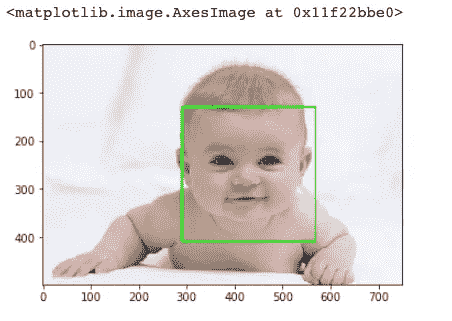

在这里。我们已经成功检测出照片中婴儿的脸部。现在让我们为整个人脸检测过程创建一个广义函数。

# 广义函数的人脸检测

```
def detect_faces(cascade, test_image, scaleFactor = 1.1):
    # create a copy of the image to prevent any changes to the original one.
    image_copy = test_image.copy() #convert the test image to gray scale as opencv face detector expects gray images
    gray_image = cv2.cvtColor(image_copy, cv2.COLOR_BGR2GRAY) # Applying the haar classifier to detect faces
    faces_rect = cascade.detectMultiScale(gray_image, scaleFactor=scaleFactor, minNeighbors=5) for (x, y, w, h) in faces_rect:
        cv2.rectangle(image_copy, (x, y), (x+w, y+h), (0, 255, 0), 15) return image_copy
```

# 在新图像上测试功能

这次的测试图像如下:

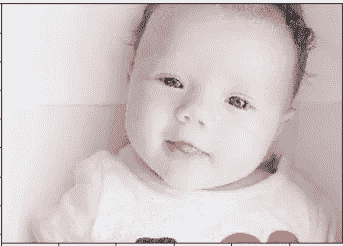

```
#loading image
  test_image2 = cv2.imread('baby2.jpg') # Converting to grayscale
  test_image_gray = cv2.cvtColor(test_image, cv2.COLOR_BGR2GRAY) # Displaying grayscale image
  plt.imshow(test_image_gray, cmap='gray')
```

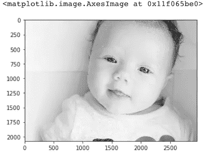

```
#call the function to detect faces
faces = detect_faces(haar_face_cascade, test_image2) #convert to RGB and display image
 plt.imshow(convertToRGB(faces))
```

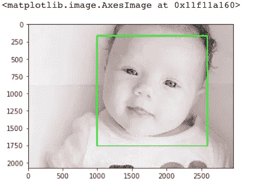

# 在组图像上测试功能

现在让我们看看这个函数在团体照片上是否工作良好。我们将使用下面的图片来达到我们的目的。

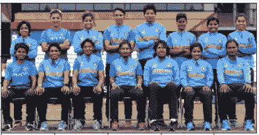

*图片:印度女子板球队。*

```
#loading image
test_image2 = cv2.imread('group.jpg')#call the function to detect faces
faces = detect_faces(haar_cascade_face, test_image2)#convert to RGB and display image
plt.imshow(convertToRGB(faces))
```

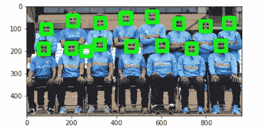

# 结论

在本教程中，我们学习了使用 Haar cascade 在 Python 中使用 Open CV 进行人脸检测的概念。除了人脸还有很多检测器，可以在库中找到。随意试验它们，为眼睛、车牌等创建探测器。