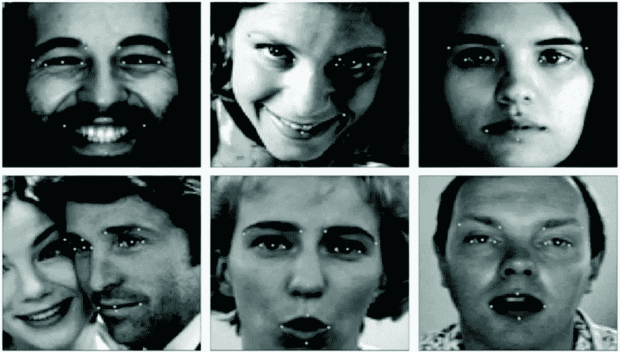
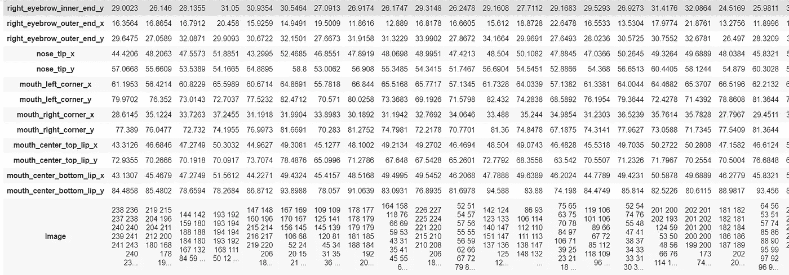
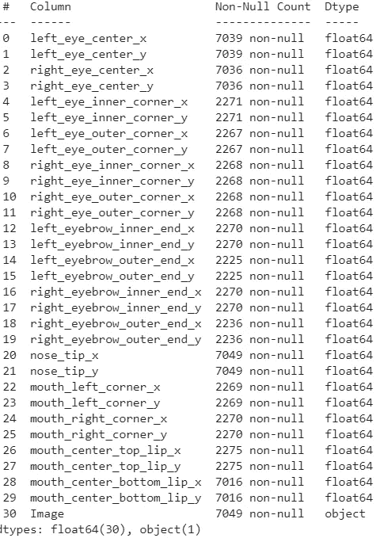
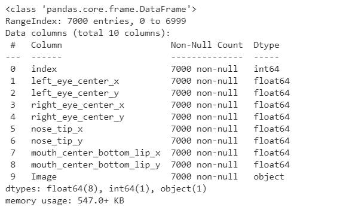
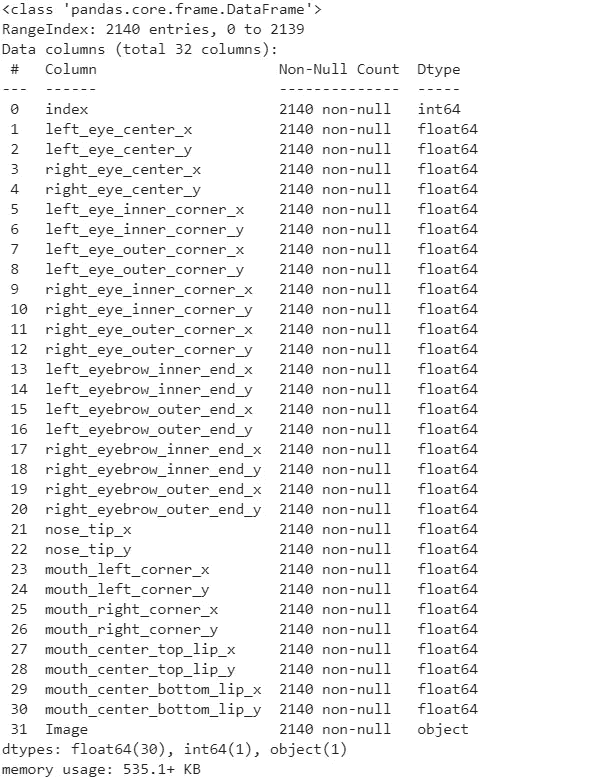
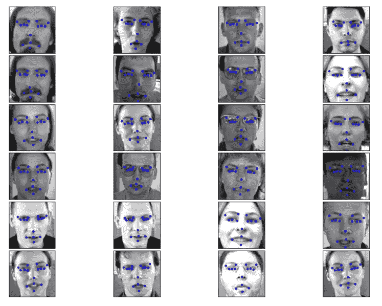
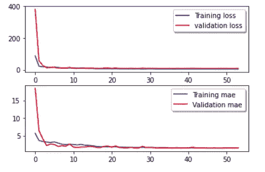
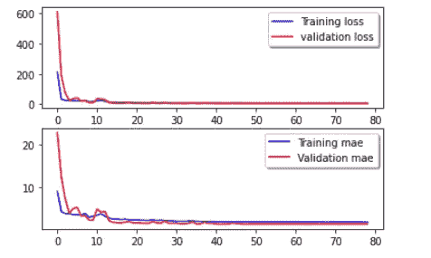
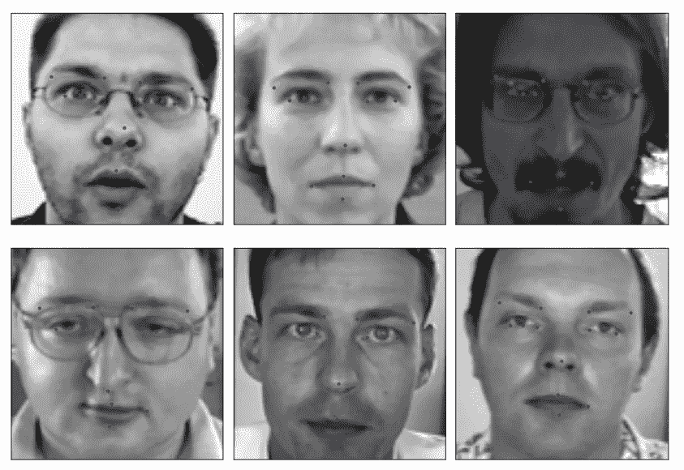

# 基于深度学习的人脸关键点检测

> 原文：<https://medium.com/analytics-vidhya/face-key-point-detection-using-deep-learning-f965ab673b93?source=collection_archive---------13----------------------->



# **1。简介**

这篇文章主要讲的是深度学习方法寻找面部关键点。在这项工作中，我们基本上找到了 15 个要点。这包括..

**眼睛**:左眼中心，右眼中心，左眼内眼角，左眼外眼角，右眼内眼角，右眼外眼角。

**眉毛**:左眉内、左眉外、右眉内、右眉外。

**鼻尖**:鼻尖。

**嘴**:嘴左角，嘴右角，嘴中上，嘴中下。

这可以用于许多应用，例如生物计量/面部识别、分析面部表情、跟踪图像和视频中的面部以及检测用于医疗诊断的面部体征。

# **2。数据集**

我们使用来自 kaggle 的[面部关键点检测](https://www.kaggle.com/c/facial-keypoints-detection/overview)数据集。训练数据中有 7094 幅图像。该数据集包含关键点的 x 和 y 坐标(30 个字段)，最后一个字段(图像)由空格分隔的整数像素(0–255)组成。这些图像是 96 x 96 像素。

让我们加载数据集..

首先 pip 安装 kaggle 直接加载数据。(这个项目我用的是 google colab)

```
# Install Kaggle API
!pip install -q kaggle
```

现在登录你的 kaggel 帐户并下载。包含 kaggle 用户名和密钥的 json 文件(只有当您想要将数据集直接下载到您的 colab 文件中或者只是直接下载和使用数据时，才使用这一步)

```
# fill in xxxxx, see your kaggle.jsonimport os
os.environ['KAGGLE_USERNAME'] = "xxxxx"
os.environ['KAGGLE_KEY'] = "xxxxx"# download data from Kaggle
!kaggle competitions download -c facial-keypoints-detection -p data
```

在这一步之后，我们将得到所有的数据集。他们中的两个进来了。zip 格式，我们需要首先解压缩数据。

```
# Unzip training and test datasets to data directory!unzip data/training.zip -d data
!unzip data/test.zip -d data
```

导入必要的包，然后查看训练数据集。

```
import keras
import tensorflow as tf
import numpy as np
import pandas as pd
import matplotlib.pyplot as plt
import matplotlib.image as mpimg
from tqdm import tqdm
%matplotlib inlinedata_dir = Path('./data')
train_data = pd.read_csv(data_dir / 'training.csv')
test_csv = pd.read_csv(data_dir / 'test.csv')
Id_table_path_csv = pd.read_csv(data_dir / 'IdLookupTable.csv')# View train data
train_data.T
```



训练数据集

这个数据集基本上是两个独立数据集的组合。第一个包含 7000+样本，具有 8 个特征，即 4 个关键点，第二个包含 2000+图像，实际上属于第一数据集，但具有 30 个特征和 15 个关键点。因此，数据集中存在许多 NaN 值。有许多方法可以处理这个问题。我们使用的方法是通过这两个数据集分别建立两个模型，并尝试在预测关键点时使用它们。



所有列名

# **3。数据预处理**

现在将数据集一分为二，一个有 4 个点(8 个值)，另一个有 15 个点(30 个值)。左眼、右眼、鼻尖和鼠标中心底部嘴唇功能几乎适用于所有图像，其余功能仅适用于 2140 张以上的图像。

```
feature_8 =['left_eye_center_x','left_eye_center_y','right_eye_center_x','right_eye_center_y','nose_tip_x','nose_tip_y','mouth_center_bottom_lip_x','mouth_center_bottom_lip_y', 'Image']#Create 2 different datasets.train_8_csv = train_csv[feature_8].dropna().reset_index()train_30_csv = train_csv.dropna().reset_index()
```

现在检查两个数据集的内容。

```
#7000 samples, 8 features.train_8_csv.info()
```



```
#2410 samples, 30 features.train_30_csv.info()
```



数据包含字符串形式的图像像素，每个元素都是一个长字符串(长度= 96*96 = 9216)。首先，我们必须将字符串像素值转换为 2D 数组。然后将所有数组堆叠成一个 3D 数组。下面的函数返回 shape (96，96，1)的 3D numpy 数组

```
def str_to_array(pd_series):
    data_size = len(pd_series)
    X = np.zeros(shape=(data_size,96,96,1), dtype=np.float32)
    for i in tqdm(range(data_size)):
       img_str = pd_series[i]
       img_list = img_str.split(' ')
       img_array = np.array(img_list, dtype=np.float32)
       img_array = img_array.reshape(96,96,1)
       X[i] = img_array return X
```

现在用上面的函数运行所有的图像数据(两个模型)。以便我们能进一步处理。

```
X_train_30 = str_to_array(train_30_csv['Image'])
labels_30 =  train_30_csv.drop(['index','Image'], axis=1)
y_train_30 = labels_30.to_numpy(dtype=np.float32)X_train_8 = str_to_array(train_8_csv['Image'])
labels_8 =  train_8_csv.drop(['index','Image'], axis=1)
y_train_8 = labels_8.to_numpy(dtype=np.float32)
```

# **4。显示训练图像及其关键点**

现在让我们看看训练图像中有什么。这里我们写了一个函数来显示 24 张带有关键点的图片。

```
def plot_face_pts(img, pts):
    plt.imshow(img[:,:,0], cmap='gray')
    for i in range(1,31,2):
       plt.plot(pts[i-1], pts[i], 'b.')fig = plt.figure(figsize=(10, 7))
fig.subplots_adjust(left=0, right=1, bottom=0, top=1, hspace=0.05, wspace=0.05)for i in range(24):
   ax = fig.add_subplot(6, 4, i + 1, xticks=[], yticks=[])
   plot_face_pts(X_train_30[i], y_train_30[i])
plt.show()
```



图片及其要点

# **5。创建神经网络(深度学习部分)**

```
def create_model(output_n = 30): model = keras.models.Sequential([ keras.layers.InputLayer(input_shape=[96,96,1]),
 keras.layers.Conv2D(filters=32, kernel_size=[5,5],padding='same', use_bias=False),
 keras.layers.LeakyReLU(alpha = .1),
 keras.layers.BatchNormalization(),
 keras.layers.Conv2D(filters=32, kernel_size=[5,5], padding='same', use_bias=False),
 keras.layers.LeakyReLU(alpha = .1),
 keras.layers.BatchNormalization(),
 keras.layers.MaxPool2D(pool_size=[2,2]), keras.layers.Conv2D(filters=64, kernel_size=[3,3], padding='same', use_bias=False),
 keras.layers.LeakyReLU(alpha = .1),
 keras.layers.BatchNormalization(),
 keras.layers.Conv2D(filters=64, kernel_size=[3,3], padding='same', use_bias=False),
 keras.layers.LeakyReLU(alpha = .1),
 keras.layers.BatchNormalization(),
 keras.layers.MaxPool2D(pool_size=[2,2]), keras.layers.Conv2D(filters=128, kernel_size=[3,3], padding='same', use_bias=False),
 keras.layers.LeakyReLU(alpha = .1),
 keras.layers.BatchNormalization(),
 keras.layers.Conv2D(filters=128, kernel_size=[3,3], padding='same', use_bias=False),
 keras.layers.LeakyReLU(alpha = .1),
 keras.layers.BatchNormalization(),
 keras.layers.MaxPool2D(pool_size=[2,2]), keras.layers.Conv2D(filters=256, kernel_size=[3,3], padding='same', use_bias=False),
 keras.layers.LeakyReLU(alpha = .1),
 keras.layers.BatchNormalization(),
 keras.layers.Conv2D(filters=256, kernel_size=[3,3], padding='same', use_bias=False),
 keras.layers.LeakyReLU(alpha = .1),
 keras.layers.BatchNormalization(),
 keras.layers.MaxPool2D(pool_size=[2,2]), keras.layers.Conv2D(filters=512, kernel_size=[3,3], padding='same', use_bias=False),
 keras.layers.LeakyReLU(alpha = .1),
 keras.layers.BatchNormalization(),
 keras.layers.Conv2D(filters=512, kernel_size=[3,3], padding='same', use_bias=False),
 keras.layers.LeakyReLU(alpha = .1),
 keras.layers.BatchNormalization(),
 keras.layers.Flatten(),
 keras.layers.Dense(units=512, activation='relu'),
 keras.layers.Dropout(.1),
 keras.layers.Dense(units=output_n),]) model.compile(optimizer = 'adam' , loss = "mean_squared_error",    metrics=["mae"]) return model
```

为我们创建的两个数据集创建两个模型，然后训练这两个模型。

```
model_30 = create_model(output_n=30)
model_8 = create_model(output_n=8)#Prepare callbacksLR_callback = keras.callbacks.ReduceLROnPlateau(monitor='val_loss', patience=4, verbose=10, factor=.4, min_lr=.00001)
EarlyStop_callback = keras.callbacks.EarlyStopping(patience=15, restore_best_weights=True)#Train the model with 30 features.history = model_30.fit(X_train_30, y_train_30, validation_split=.1, batch_size=64, epochs=100, callbacks [LR_callback,EarlyStop_callback])#Train the model with 8 features.history = model_8.fit(X_train_8, y_train_8, validation_split=.1, batch_size=64, epochs=100, callbacks=[LR_callback,EarlyStop_callback])
```

现在检查两个模型的训练损失和验证损失。

```
fig, ax = plt.subplots(2,1)
ax[0].plot(history.history['loss'], color='b', label="Training loss")
ax[0].plot(history.history['val_loss'], color='r', label="validation loss",axes =ax[0])
legend = ax[0].legend(loc='best', shadow=True)ax[1].plot(history.history['mae'], color='b', label="Training mae")
ax[1].plot(history.history['val_mae'],color='r',label="Validation mae")
legend = ax[1].legend(loc='best', shadow=True)
```



```
fig, ax = plt.subplots(2,1)
ax[0].plot(history.history['loss'], color='b', label="Training loss")
ax[0].plot(history.history['val_loss'], color='r', label="validation loss",axes =ax[0])
legend = ax[0].legend(loc='best', shadow=True)ax[1].plot(history.history['mae'], color='b', label="Training mae")
ax[1].plot(history.history['val_mae'], color='r',label="Validation mae")
legend = ax[1].legend(loc='best', shadow=True)
```



# **6。测试我们的模型**

在测试数据集中，正如我们在训练数据集中看到的，图像数据是字符串格式的，我们需要进行与训练数据集相同的预处理。在测试数据集中，必须预测关键点，并检查我们的模型有多准确。

```
#Wrap test images into 3d array.
X_test = str_to_array(test_csv['Image'])#Pridect points for each image using 2 different model.
y_hat_30 = model_30.predict(X_test)
y_hat_8 = model_8.predict(X_test)
```

因为具有 4 个关键点的模型(即 y_hat_8)比另一个具有更多的待训练数据。y_hat_8 的模型会比 y_hat_30 的模型更精确。因此，在 y_hat_30 模型中，替换来自 y_hat_8 模型的 8 个值，这将增加准确性。

```
feature_8_ind = [0, 1, 2, 3, 20, 21, 28, 29]
#Merge 2 prediction from y_hat_30 and y_hat_8.
for i in range(8):
   print('Copy "{}" feature column from y_hat_8 y_hat_30'.format(feature_8[i]))
y_hat_30[:,feature_8_ind[i]] = y_hat_8[:,i]
```

合并两个模型后，现在我们有了最终的值。让我们用测试图像进行测试，看看它的工作有多准确。

```
fig = plt.figure(figsize=(10, 7))
fig.subplots_adjust(
left=0, right=1, bottom=0, top=1, hspace=0.05, wspace=0.05)
for i, f in enumerate(range(10,16)):
  ax = fig.add_subplot(2, 3, i + 1, xticks=[], yticks=[])
  plot_face_pts(X_test[f], y_hat_30[f])
plt.show()
```



模型结果

# **7。结论**

作为一个较小的版本，我们的模型已经做了一个体面的工作。将来，我们可以通过以下方式使版本变得更好

a.增加更多的关键点。

b.识别实时数据的关键点。

没有人是完美的，如果任何人发现任何错误或建议，请在下面不吝赐教。

电子邮件 Id:jerryjohn1995@gmail.com