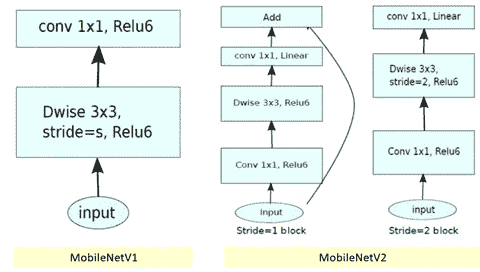
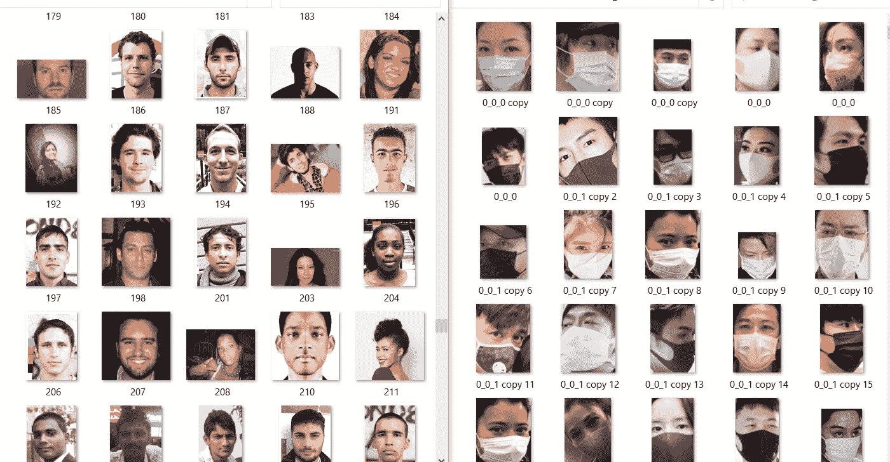
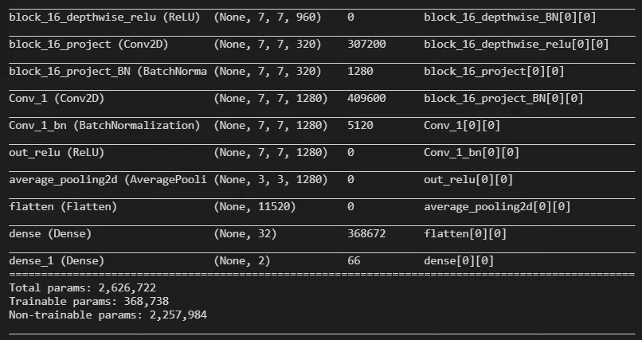
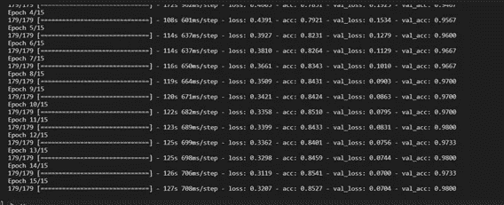
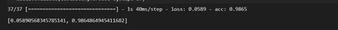
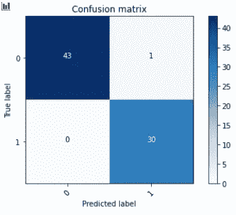

# 面罩检测

> 原文：<https://medium.com/analytics-vidhya/face-mask-detection-6dca534f7879?source=collection_archive---------8----------------------->

人脸面具检测是一个基于人工智能的项目。在这种情况下，我们检测戴面具或不戴面具的人。

在这个项目的制作过程中，我们分两个阶段。

*   使用卷积或任何检测图像中人脸遮罩的预训练模型来训练模型。
*   然后，检测视频或图像中的人脸，并从我们训练的模型中获得预测。

在这个项目中，我使用迁移学习来训练数据集上的模型，其中我使用了预训练的模型 MobileNetV2，现在的问题是 MobileNetv2 是什么？它的结构是什么？

# MobileNetV2

MobileNets 是小型、低延迟、低功耗的模型，其参数化可以满足各种用例的资源限制。与其他流行的大规模模型类似，MobileNetv2 可用于分类、检测、嵌入和分割，是对 MobileNetV1 的重大改进。MobileNetV1 和 V2 的结构如下。

移动网络

现在，来看代码和数据解释

# 资料组

在数据集中，我们有两种类型的图像，一种是戴面具的，另一种是没有面具的。

训练数据集由 4296 个图像组成，其中 2455 个图像具有带遮罩的标签，1841 个图像没有遮罩面部，验证数据集由 300 个组成。

# 导入:

首先，我导入所需的模块，如 tensorflow、keras、optimizer、层和预训练模型(MobileNetV2)

# 加载数据和增强图像:

现在，我使用 MobileNetv2“preprocess _ input”加载所有用于训练和预处理的图像，通过它，图像可以按照 MobileNetv2 的要求准备好。

我们也扩大我们的图像，通过它我们可以获得更多的数据和数据的多样性。我们增加了放大技术，如缩放、水平和垂直翻转、旋转。

在这一步之后，我们将训练和验证一批形状，mobilenetv2 需要这些形状作为输入。

# 加载预训练模型:

正如我以前写的，我使用 MobileNetV2。因此，我下载了模型的权重，并在冻结了预训练模型的层之后创建了一个 MobileNetV2 类型的对象，通过该对象，当我们的模型在训练时，层权重不能被修改。

# 向模型添加更多的层:

在模型的末端添加一些层，以获得良好的精度或避免模型过度拟合。

最后添加一个完全连接的层，它包含的神经元数量等于我们拥有的标签数量(在这种情况下，我们有 2 个标签屏蔽或没有屏蔽)。并在定义模型输入和输出层后。

现在我们的模型结构已经准备好了。

# 编译和培训:

现在是训练模型的时候了，但在训练之前，我们必须定义损失函数和优化器，即编译模型。

在参数超调之后，我发现学习率为 0.00001 的结果很好。所以，我用了学习率为 0.00001，损失函数为 binary_crossentropy 的 Adam 优化器。然后，在我用 15 个时期训练模型并在验证数据(包含 300 张图像)上验证它之后。

# 测试阶段:

现在，我们必须在测试数据上测试模型，通过测试数据，我们可以很好地了解模型是否适用于实时数据。因此，我们有 2 类 74 幅图像作为测试数据集，在测试数据集上进行评估后，我得到了很好的结果。

损耗:0.058

# 混淆矩阵:

混淆矩阵是一个表格，通常用于描述一个分类模型对一组真实值已知的测试数据的性能。

在绘制混淆矩阵后，我看到我的训练模型只预测了一个图像错误，其他所有图像都预测正确。因此，模型将实时工作良好。

因为我得到了很好的结果，所以现在是时候实现它与相机实时工作。所以，首先我们要保存训练好的模型。

在下一部分，我将讲述如何用 Opencv 实现它。

Github 回购链接:

 [## chauhanarpit 09/面罩-检测-

### 人脸面具检测是一个基于人工智能的项目。在这种情况下，我们检测戴面具或不戴面具的人。在…

github.com](https://github.com/chauhanarpit09/Face-Mask-Detection-)