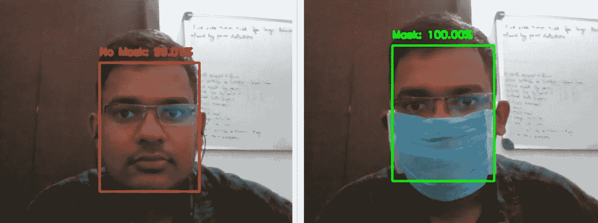
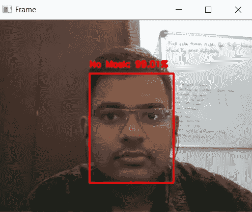
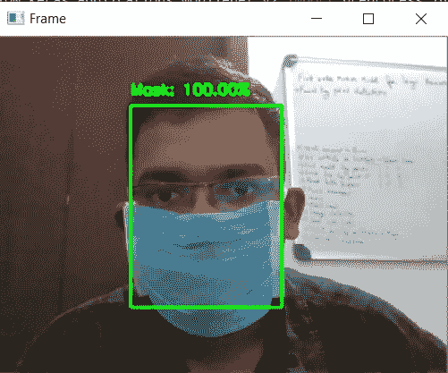

# 使用人工智能的面罩检测系统

> 原文：<https://medium.com/analytics-vidhya/face-mask-detection-system-using-artificial-intelligence-52afd27b0a4e?source=collection_archive---------9----------------------->

本文第一部分[“人脸检测模型创建”](/@jerryjohn1995/face-mask-detection-using-ai-model-creation-67f43dd2c3db)

参考自[https://www . pyimagesearch . com/FAQ/single-FAQ/how-do-I-reference-or-cite-one-of-your-blog-posts-books-or-courses](https://www.pyimagesearch.com/faqs/single-faq/how-do-i-reference-or-cite-one-of-your-blog-posts-books-or-courses)



# 1.介绍

随着新冠肺炎确诊病例的持续上升，使用面膜已经成为当今每个人都应该采取的最重要和最安全的措施之一。戴口罩会在很大程度上有助于防止病毒传播。

很快，面具将成为我们日常生活的一部分。公共场所、办公室等。会强制戴口罩。人工检查进入公共场所或办公室的每个人是否戴着面具是非常困难的。为了解决这个问题，我们正在创建一个机器学习模型，可以检测一个人是否穿着。

该项目可以与嵌入式系统集成，应用于学校、机场、火车站、办公室和公共场所，以确保遵守公共安全准则。

> 在这里，我们来看看如何使用网络摄像头在我们的系统上实现这个模型。

# **2。导入必要的包**

我们使用在上一篇文章中创建的掩码检测模型来检测掩码。我们还使用一些预构建模型来识别人脸(人脸检测模型)。对于相机操作，我们使用 OpenCV

```
# import the necessary packages
from tensorflow.keras.applications.mobilenet_v2 import preprocess_input
from tensorflow.keras.preprocessing.image import img_to_array
from tensorflow.keras.models import load_model
from imutils.video import VideoStream
import numpy as np
import imutils
import time
import cv2
import os
```

# **3。掩模检测程序**

下面给出的代码是一个带三个参数的函数，一个是从视频源获取的帧，另两个是我们的两个模型(一个用于面部识别，第二个用于面具识别)。

这个函数返回两个值，一个是人脸所在矩形的坐标，另一个是预测值，包含戴面具的人的准确度。

```
def detect_and_predict_mask(frame, faceNet, maskNet):
 # grab the dimensions of the frame and then construct a blob
 # from it
 (h, w) = frame.shape[:2]
 blob = cv2.dnn.blobFromImage(frame, 1.0, (224, 224),
  (104.0, 177.0, 123.0))# pass the blob through the network and obtain the face detections
 faceNet.setInput(blob)
 detections = faceNet.forward()
 print(detections.shape)# initialize our list of faces, their corresponding locations,
 # and the list of predictions from our face mask network
 faces = []
 locs = []
 preds = []# loop over the detections
 for i in range(0, detections.shape[2]):
  # extract the confidence (i.e., probability) associated with
  # the detection
  confidence = detections[0, 0, i, 2]# filter out weak detections by ensuring the confidence is
  # greater than the minimum confidence
  if confidence > 0.5:
   # compute the (x, y)-coordinates of the bounding box for
   # the object
   box = detections[0, 0, i, 3:7] * np.array([w, h, w, h])
   (startX, startY, endX, endY) = box.astype("int")# ensure the bounding boxes fall within the dimensions of
   # the frame
   (startX, startY) = (max(0, startX), max(0, startY))
   (endX, endY) = (min(w - 1, endX), min(h - 1, endY))# extract the face ROI, convert it from BGR to RGB channel
   # ordering, resize it to 224x224, and preprocess it
   face = frame[startY:endY, startX:endX]
   face = cv2.cvtColor(face, cv2.COLOR_BGR2RGB)
   face = cv2.resize(face, (224, 224))
   face = img_to_array(face)
   face = preprocess_input(face)# add the face and bounding boxes to their respective
   # lists
   faces.append(face)
   locs.append((startX, startY, endX, endY))# only make a predictions if at least one face was detected
 if len(faces) > 0:
  # for faster inference we'll make batch predictions on *all*
  # faces at the same time rather than one-by-one predictions
  # in the above `for` loop
  faces = np.array(faces, dtype="float32")
  preds = maskNet.predict(faces, batch_size=32)# return a 2-tuple of the face locations and their corresponding
 # locations
 return (locs, preds)
```

在这里，我们从磁盘加载我们的人脸检测器模型，以及我们在上一篇文章[中创建的面具检测器模型。](/@jerryjohn1995/face-mask-detection-using-ai-model-creation-67f43dd2c3db)

> dnn 代表深度神经网络。

```
# load our serialized face detector model from disk
prototxtPath = r"face_detector\deploy.prototxt"
weightsPath = r"face_detector\res10_300x300_ssd_iter_140000.caffemodel"
faceNet = cv2.dnn.readNet(prototxtPath, weightsPath)# load the face mask detector model from disk
maskNet = load_model("mask_detector.model")
```

现在我们开始视频流，为此我们使用“VideoStrem”。src=0 表示我们使用的主摄像头(对于笔记本电脑，它内置 we cam)。

在视频中，我们拍摄每一帧，每一帧都被视为图像，我们的人脸和面具检测模型在这些图像上运行。

检测到的人脸周围会显示一个矩形框。当脸部没有戴面具时，它的颜色是红色，当脸部戴面具时，它的颜色是绿色。预测百分比显示在框的顶部。

> 这里我们设置“q”键来停止程序。

```
# initialize the video stream
print("[INFO] starting video stream...")
vs = VideoStream(src=0).start()# loop over the frames from the video stream
while True:
 # grab the frame from the threaded video stream and resize it
 # to have a maximum width of 400 pixels
 frame = vs.read()
 frame = imutils.resize(frame, width=400)# detect faces in the frame and determine if they are wearing a
 # face mask or not
 (locs, preds) = detect_and_predict_mask(frame, faceNet, maskNet)# loop over the detected face locations and their corresponding
 # locations
 for (box, pred) in zip(locs, preds):
  # unpack the bounding box and predictions
  (startX, startY, endX, endY) = box
  (mask, withoutMask) = pred# determine the class label and color we'll use to draw
  # the bounding box and text
  label = "Mask" if mask > withoutMask else "No Mask"
  color = (0, 255, 0) if label == "Mask" else (0, 0, 255)# include the probability in the label
  label = "{}: {:.2f}%".format(label, max(mask, withoutMask) * 100)# display the label and bounding box rectangle on the output
  # frame
  cv2.putText(frame, label, (startX, startY - 10),
   cv2.FONT_HERSHEY_SIMPLEX, 0.45, color, 2)
  cv2.rectangle(frame, (startX, startY), (endX, endY), color, 2)# show the output frame
 cv2.imshow("Frame", frame)
 key = cv2.waitKey(1) & 0xFF# if the `q` key was pressed, break from the loop
 if key == ord("q"):
  break# do a bit of cleanup
cv2.destroyAllWindows()
vs.stop()
```



不带面具



带面具

# 4.结论

在这篇文章中，我们学习了如何建立一个面具检测模型。现在我们可以在实时应用程序中使用这个模型。在这里，我们使用 OpenCV 在我们的网络摄像头中实现该模型，该项目可以与嵌入式系统集成，应用于学校、机场、火车站、办公室和公共场所，以确保遵守公共安全准则。

因为**没有**人无完人，如果任何人发现任何错误或建议，请在下面不吝赐教。

电子邮件 Id:jerryjohn1995@gmail.com

insta gram:【https://www.instagram.com/jerry_john_7/?hl=en 

LinkedIn:linkedin.com/in/jerryjohn1995

脸谱:【https://www.facebook.com/jerry.john.583234/】T4