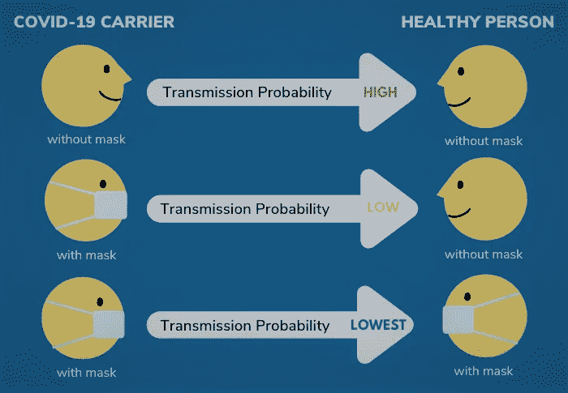
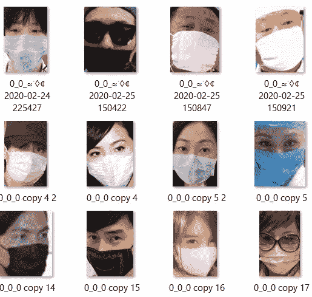
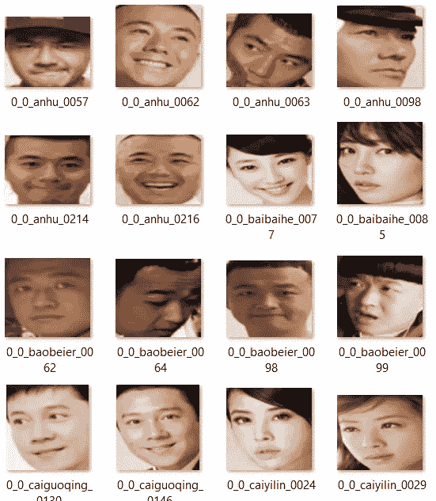
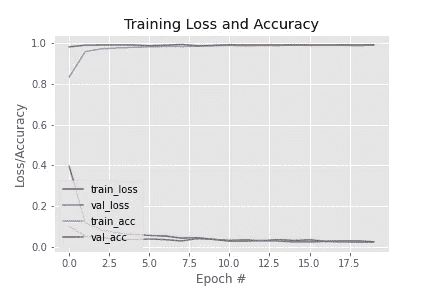

# 使用人工智能(模型创建)的人脸面具检测

> 原文：<https://medium.com/analytics-vidhya/face-mask-detection-using-ai-model-creation-67f43dd2c3db?source=collection_archive---------15----------------------->

引用自[https://www . pyimagesearch . com/FAQ/single-FAQ/how-do-I-reference-or-cite-one-of-your-blog-posts-books-or-courses](https://www.pyimagesearch.com/faqs/single-faq/how-do-i-reference-or-cite-one-of-your-blog-posts-books-or-courses)

# **1。简介**

随着新冠肺炎确诊病例的持续上升，使用口罩已经成为这些天每个人都应该采取的最重要的安全措施之一。戴口罩会在很大程度上有助于防止病毒传播。疾控中心建议每个人在公共场合外出时戴上布口罩。



很快，面具将成为我们生活的一部分。公共场所、办公室等。会强制戴口罩。很难人工检查进入公共场所或办公室的每个人是否戴着面具。为了解决这个问题，我们正在创建一个深度学习模型，它可以检测没有戴面具进入的人。

# **2。数据集**

为了创建一个人脸面具分类模型，我们需要两种类型的图像-有面具和没有面具的脸。为此，我们可以找到许多数据集。下面给出了其中的一些。

1.  https://www.kaggle.com/andrewmvd/face-mask-detection?选择=图像
2.  [https://arxiv.org/abs/2003.09093](https://arxiv.org/abs/2003.09093)



带遮罩的数据集图像



我们的数据集图像没有遮罩

# **3。导入必要的库**

现在让我们导入我们想要的库。我们可以使用 keras，tensorflow，matplotlib，umpy 等..

```
# import the necessary packages
from tensorflow.keras.preprocessing.image import ImageDataGenerator
from tensorflow.keras.applications import MobileNetV2
from tensorflow.keras.layers import AveragePooling2D
from tensorflow.keras.layers import Dropout
from tensorflow.keras.layers import Flatten
from tensorflow.keras.layers import Dense
from tensorflow.keras.layers import Input
from tensorflow.keras.models import Model
from tensorflow.keras.optimizers import Adam
from tensorflow.keras.applications.mobilenet_v2 import preprocess_input
from tensorflow.keras.preprocessing.image import img_to_array
from tensorflow.keras.preprocessing.image import load_img
from tensorflow.keras.utils import to_categorical
from sklearn.preprocessing import LabelBinarizer
from sklearn.model_selection import train_test_split
from sklearn.metrics import classification_report
from imutils import paths
import matplotlib.pyplot as plt
import numpy as np
import os
```

# **4。获取数据集**

下载上面提到的数据集并提供目录，这样我们就可以在我们的程序中使用它们。主要有两类一类带口罩，一类不带口罩。我们需要首先将图像转换成数组。每个图像被转换成统一的尺寸 224、224。这些数组中的每一个都存储为数据(列表),标签存储在标签(列表)下

```
DIRECTORY = r"C:\Users\jerry\project works ML\article to publish\face mask detetcion\dataset"
CATEGORIES = ["with_mask", "without_mask"]# grab the list of images in our dataset directory, then initialize
# the list of data (i.e., images) and class images
print("[INFO] loading images...")data = []
labels = []for category in CATEGORIES:
    path = os.path.join(DIRECTORY, category)
    for img in os.listdir(path):
     img_path = os.path.join(path, img)
     image = load_img(img_path, target_size=(224, 224))
     image = img_to_array(image)
     image = preprocess_input(image)data.append(image)
     labels.append(category)
```

# **5。对标签执行一键编码**

正如我们在上面看到的，标签是字符串格式的，我们需要将其转换为整数格式，因为我们的模型不接受字符串格式。为此，我们使用一个热编码器(例如，如果我们有两个标签 YES 和 NO，它可以转换为 0 和 1)。

```
# perform one-hot encoding on the labels
lb = LabelBinarizer()
labels = lb.fit_transform(labels)
labels = to_categorical(labels)data = np.array(data, dtype="float32")
labels = np.array(labels)
```

# **6。列车试运行**

现在我们需要分割数据集，这样我们就可以有一个新的数据集来测试我们的模型性能。这里，我们将 80%的数据用于训练目的，另外 20%用于测试目的。

```
(trainX, testX, trainY, testY) = train_test_split(data, labels,
 test_size=0.20, stratify=labels, random_state=5)
```

我们还使用“图像数据生成器”。图像数据生成器是 keras 提供的一个功能，用来增加我们必须训练的数据数量。在许多情况下，数据很少被训练。随着数据量的增加，准确度也随之提高。它通过添加各种属性，如翻转、旋转等，从一个图像创建许多图像..代码中给出了许多可以更改的属性。大部分都设置为默认。

```
# construct the training image generator for data augmentation
aug = ImageDataGenerator(
 rotation_range=20,
 zoom_range=0.15,
 width_shift_range=0.2,
 height_shift_range=0.2,
 shear_range=0.15,
 horizontal_flip=True,
 fill_mode="nearest")
```

# 7 .**。模型创建**

有一些预先训练好的图像模型，所以当我们使用“imagenet”时，这些权重将被初始化，这将给出一个更好的结果。输入张量是通过的图像的形状。

我们还初始化初始学习率、训练的时期数和批量大小。

> 我们*把我们的输出模型作为密集的(2，activation="softmax ")。2 是因为我们有两个带面具和不带面具的班级。输出层中使用的激活函数是 softmax(二元分类)。*

```
# initialize the initial learning rate, number of epochs to train for,
# and batch size
INIT_LR = 1e-4
EPOCHS = 20
BS = 32 # load the MobileNetV2 network, ensuring the head FC layer sets are
# left off
baseModel = MobileNetV2(weights="imagenet", include_top=False,
 input_tensor=Input(shape=(224, 224, 3)))# construct the head of the model that will be placed on top of the
# the base model
headModel = baseModel.output
headModel = AveragePooling2D(pool_size=(7, 7))(headModel)
headModel = Flatten(name="flatten")(headModel)
headModel = Dense(128, activation="relu")(headModel)
headModel = Dropout(0.5)(headModel)
headModel = Dense(2, activation="softmax")(headModel)# place the head FC model on top of the base model (this will become
# the actual model we will train)
model = Model(inputs=baseModel.input, outputs=headModel)# loop over all layers in the base model and freeze them so they will
# *not* be updated during the first training process
for layer in baseModel.layers:
 layer.trainable = False# compile our model
print("[INFO] compiling model...")
opt = Adam(lr=INIT_LR, decay=INIT_LR / EPOCHS)
model.compile(loss="binary_crossentropy", optimizer=opt,
 metrics=["accuracy"])# train the head of the network
print("[INFO] training head...")
H = model.fit(
 aug.flow(trainX, trainY, batch_size=BS),
 steps_per_epoch=len(trainX) // BS,
 validation_data=(testX, testY),
 validation_steps=len(testX) // BS,
 epochs=EPOCHS)# make predictions on the testing set
print("[INFO] evaluating network...")
predIdxs = model.predict(testX, batch_size=BS)# for each image in the testing set we need to find the index of the
# label with corresponding largest predicted probability
predIdxs = np.argmax(predIdxs, axis=1)# show a nicely formatted classification report
print(classification_report(testY.argmax(axis=1), predIdxs,
 target_names=lb.classes_))# serialize the model to disk
print("[INFO] saving mask detector model...")
model.save("mask_detector.model", save_format="h5")
```

最后将我们的模型保存为 mask_detector.model，以 h5 格式保存。我们将在以后使用这个模型。

# **8。训练损失和准确性**

我们使用 matplotlib 来绘制训练损失、val_loss、train_acc、val_accuracy。

```
# plot the training loss and accuracy
N = EPOCHS
plt.style.use("ggplot")
plt.figure()
plt.plot(np.arange(0, N), H.history["loss"], label="train_loss")
plt.plot(np.arange(0, N), H.history["val_loss"], label="val_loss")
plt.plot(np.arange(0, N), H.history["accuracy"], label="train_acc")
plt.plot(np.arange(0, N), H.history["val_accuracy"], label="val_acc")
plt.title("Training Loss and Accuracy")
plt.xlabel("Epoch #")
plt.ylabel("Loss/Accuracy")
plt.legend(loc="lower left")
plt.savefig("plot.png")
```



# **9。结论**

在这篇文章中，我们学习了如何建立一个面具检测模型。现在我们可以在实时应用程序中使用这个模型。在这里，我们使用 OpenCV 在我们的网络摄像头中实现该模型，该项目可以与嵌入式系统集成，应用于学校、机场、火车站、办公室和公共场所，以确保遵守公共安全准则。

实现这个模型的程序是[这里是](/@jerryjohn1995/face-mask-detection-system-using-artificial-intelligence-52afd27b0a4e)。

因为**没有**是完美的，如果任何人发现任何错误或建议，请随时在下面评论。

电子邮件 Id:jerryjohn1995@gmail.com

insta gram:https://www.instagram.com/jerry_john_7/?hl=en

LinkedIn:linkedin.com/in/jerryjohn1995

脸书:[https://www.facebook.com/jerry.john.583234/](https://www.facebook.com/jerry.john.583234/)