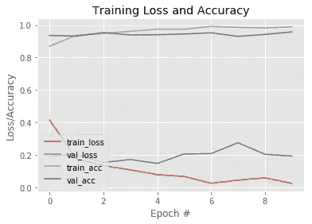

# 使用深度学习的人脸面具检测

> 原文：<https://medium.com/analytics-vidhya/face-mask-detection-using-deep-learning-83f927654f1e?source=collection_archive---------5----------------------->

新的新冠肺炎病毒迫使我们所有人重新思考我们如何在保证自己和他人安全的同时过好我们的日常生活。口罩已经成为减少病毒威胁的一种简单而有效的策略，并且口罩检测系统的应用现在在交通工具、人口密集区、住宅区、大型制造商和其他企业中需求很高，以确保安全。因此，今天文章的目标是利用深度学习开发一个人脸面具检测器。

# 目录

1.  关于数据集
2.  卷积神经网络(CNN)架构
3.  CNN 模型的训练和评估
4.  实验和结果
5.  下一步是什么？

# 关于数据集

数据集中使用的图像是戴面具的人的真实图像，即数据集不包含变形的面具图像。数据集由 3835 幅图像组成，分为两类:

*   with_mask: 1916 个图像
*   不带 _ 遮罩:1919 幅图像

这些图像是从以下来源收集的:

*   Bing 搜索 API ( [参见 Python 脚本](https://github.com/chandrikadeb7/Face-Mask-Detection/blob/master/search.py))
*   Kaggle 数据集
*   RMFD 数据集([见此](https://github.com/X-zhangyang/Real-World-Masked-Face-Dataset))

# CNN 架构

> 卷积神经网络(convnets)是深度学习领域的一个主要研究方向。CNN 是一种神经网络，广泛用于图像识别和分类。，它们主要用于识别图像中的模式。我们不把特征输入其中，它们自己识别特征。CNN 的主要操作是卷积、合并或子采样、非线性和分类。

CNN 架构

1.  **卷积:**卷积网的名字来源于卷积运算符。在卷积的情况下，卷积的主要目的是从输入图像中提取特征。卷积通过使用输入数据的小方块学习图像特征来保持像素之间的空间关系。
2.  **汇集:**汇集的主要目的是减少输入图像的大小，但保留重要信息。它可以以不同的类型完成，如最大值、总和、平均值等。在最大池的情况下，我们定义一个窗口并从中取最大的元素，我们也可以取平均值(平均池)，即该窗口内所有元素的总和(总和池)。
3.  **非线性:**激活函数是添加到神经网络中的函数，用于帮助网络学习数据中的复杂模式，即引入非线性。例如，激活函数 ReLU(整流线性单元)用于在 CNN 中引入非线性。它通过执行逐元素操作将图像中的所有负值像素替换为零。
4.  **全连接:**全连接层是传统的多层感知器，在输出层使用 softmax 激活函数(也可以使用其他分类器，如 SVM)。术语完全连接意味着前一层中的每个神经元都连接到下一层中的每个神经元。卷积层和池层的输出代表输入图像的高级特征。全连接图层的目的是使用这些特征根据训练数据集将输入影像分类到不同的类别中。

# CNN 模型的训练和评估

CNN 模型的训练需要以下步骤:

1.  **预处理:**对所有的原始输入图像进行预处理，将其转换成干净的版本，然后输入到神经网络机器学习模型中。输入图像的大小调整为 224 x 224 ( **第 8 行)**，并将输入图像传递给(**第 9 行)**中的**预处理 _ 输入**函数，这意味着使您的图像符合模型要求的格式(您保证您加载的图像与预处理 _ 输入兼容)。最后将数据和标签转换成 NumPy 数组，以便在(**第 14 行)**中进一步处理。对标签执行一次热编码，将分类数据转换为数字数据**(第 17–19 行)。**
2.  **模型创建:**CNN 模型**(第 23–33 行)**包括两个卷积层，后面是激活函数 ReLU(增加非线性)和 Max Pooling(减少特征图)。添加辍学是为了防止神经网络过度拟合。然后，在末尾添加完全连接的层。最后，我们将我们的模型编译成损失函数、优化器和指标**(第 36 行)。****损失函数**用于查找学习过程中的错误或偏差。Keras 在模型编译过程中需要损失函数。**优化**是通过比较预测和损失函数来优化输入权重的重要过程，而**指标**用于评估您的模型的性能。
3.  **模型训练:**在开始模型训练之前，我们需要将数据分割成训练测试数据。在我们的例子中，有 90%的训练数据和 10%的测试数据**(第 21 行)。**模型由 NumPy 数组使用 fit 函数训练**(第 41 行)**。这个拟合函数的主要目的是用来评估你的模型的训练。
4.  **模型预测:**这是最后一步，我们将通过预测测试数据标签**(第 44 行)**来评估模型的性能。

# 结果

1.  CNN 模型分析。

2.实现图像的面具检测器。

首先，从磁盘中加载输入图像，然后使用基于 **Caffe 的人脸检测器进行人脸检测。**Caffe 模型有 **prototxt** 文件，这些文件定义了*模型架构*(即层本身)

**Caffe 模型**文件，包含实际层的*权重*。最后，对输入图像进行预测，如图所示。

3.类似地，面罩检测器被应用于实时视频流。

# 下一步是什么？

在本文中，我们开发了基于 CNN 的面罩检测器，可用于公共医疗保健、机场和办公室，以确保安全。
我们还可以使用其他训练模型，如 VGGNet 和 MobileNet 作为基础模型，并使用 YOLO 和 darknet 来执行人脸检测。

# 参考

提供参考总是好的

1.  [数据集](https://github.com/chandrikadeb7/Face-Mask-Detection)
2.  [型号](https://github.com/vzhou842/cnn-from-scratch)

该代码可在[**github.com/Devashi-Choudhary/Face_Mask_Detection**](https://github.com/Devashi-Choudhary/Face_Mask_Detection)获得。如有任何问题或疑问，请直接联系我，电话:[**github.com/Devashi-Choudhary**。](https://github.com/Devashi-Choudhary)