# 使用 Google Colab 的人脸面具检测

> 原文：<https://medium.com/analytics-vidhya/face-mask-detection-using-google-colab-160f7b20cdea?source=collection_archive---------12----------------------->

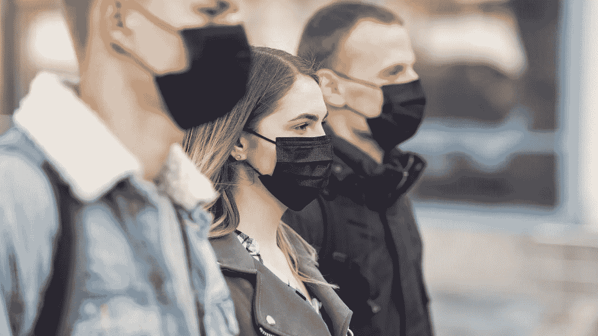

# 项目鸟瞰图:

1.  业务问题:关于业务问题的描述
2.  问题陈述:关于机器学习的问题描述。
3.  数据的来源。
4.  我对这个问题的看法。
5.  结论。
6.  参考文献。

# 业务问题:

在这个新时代，我们正在经历疫情，周围的人都被建议戴口罩，一些人不习惯，并避免戴口罩。这个项目背后的动机是，如果我们可以借助人工智能来检测公共场所戴口罩或不戴口罩的人，这将有助于提高我们的安全性。如果部署正确，面具探测器有可能被用来帮助确保我们的安全。

此外，生活在这个时期是非常令人沮丧的，目睹这个世界上发生的这么多事情，我决定为什么不做点什么，即把现实世界中我们人类外出必须戴口罩的问题转化为机器学习问题。

# 问题陈述:

这里的任务是给定一幅图像或一段视频，预测人们戴不戴面具。这是一个对象检测和分类问题，有两种不同的类别(有无遮罩)。

有许多方法来检测物体，但是，为此我决定使用 YOLO v3，因为它简单快速，是最准确的方法之一。

# 数据来源:

所以有多种数据来源可以用来解决这个问题。你可以从网上下载图片并对其进行注释，或者你可以简单地得到一个准备好的数据，可以很容易地用于训练。

我使用了 Kaggle 中现有的数据集。

链接:[https://www.kaggle.com/alexandralorenzo/maskdetection](https://www.kaggle.com/alexandralorenzo/maskdetection)

收集完数据后，将所有的图像及其注释放入 YOLO 格式，如下所示，并将文件夹命名为“ *obj* ”。

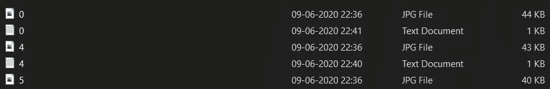

注释必须包含 YOLO 格式的类和盒子坐标。<class></class>

# YOLO v3:

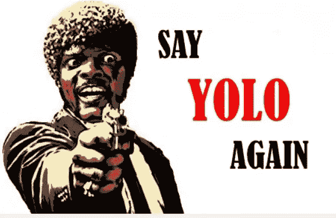

演职员表:[https://pjreddie.com/darknet/yolo/](https://pjreddie.com/darknet/yolo/)

YOLO v3 是 YOLO 系列(YOLO v1、YOLO v2)的一个物体探测网络部分。这是一个相当简单的对象检测方法，具有非常好的性能。它将图像作为输入，通过神经网络传递，并获得一个包围盒和类预测的向量作为输出。YOLO v3 使用 DarkNet-53 进行特征检测，然后是卷积层。Darknet-53 是一个在 ImageNet 上训练的 53 层卷积神经网络，主要由 3 × 3 和 1× 1 滤波器组成，像 ResNet 中的残差网络一样具有跳跃连接。

有关输入格式、输出格式或架构的更多信息，请访问[此链接](https://hackernoon.com/understanding-yolo-f5a74bbc7967)。

# **第一次切入方式:**

注意:如果你使用的是 Colab，那么连接你的 Google Drive，这样你就可以很容易地存储备份权重，也可以管理所有必要的文件。

1.  由于我已经使用了 YOLO v3，第一件事就是克隆 Darknet Github 库，因为我们将使用它来训练我们的模型。
2.  下载 YOLO v3 配置文件，并根据我们的数据集进行编辑。将 Yolo 块中的所有“类”值设置为 2，将“随机”值设置为 0。另外，将 Yolo 块正上方的卷积块中的【T4 过滤器】的值更改为(类别数+ 5)*3，在本例中为 21。

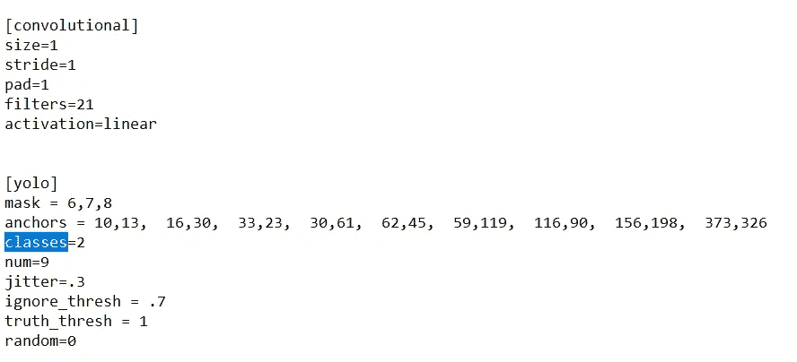

3.另外，将' *max_batches* '值更改为 2000 *类数，在我们的示例中为 4000，并将' *steps* '分别更改为' *max_batches* '值的 80%和 90%。您可以在我的 [Github 中获得配置文件的副本。](https://github.com/shibam-banerjee/Face_Mask_Detection)

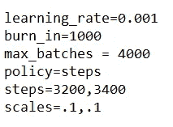

4.创建一个名为“ *obj.names* 的文件，该文件将包含数据标签的名称。在我们的例子中，我们有两个标签——屏蔽和不屏蔽。

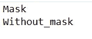

5.创建另一个名为' *obj.data* 的文件，该文件将包含以下信息。训练和有效是包含训练和验证图像的位置的文件。

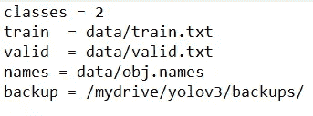

6.根据您的数据创建两个名为' *train* 和' *valid* 的 *txt* 文件，这些文件将包含图像的位置，并且必须如下图所示。

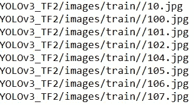

上面的代码可以用来创建 txt 文件。

7.之后，将文件和数据放在 **Darknet** 目录中，并执行培训。有关确切位置和命令的更多信息，请访问我的 [Github](https://github.com/shibam-banerjee/Face_Mask_Detection) 。

8.执行 1000+个时期的训练。低于 1 的损失值表现非常好。

9.一旦你达到了一个低损耗值，在一些图像或视频上测试它。

# 结果:

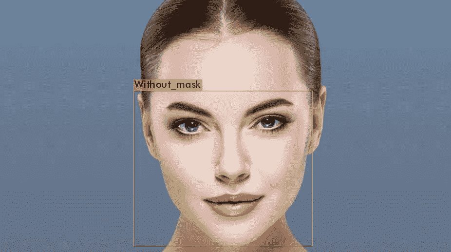

示例输出

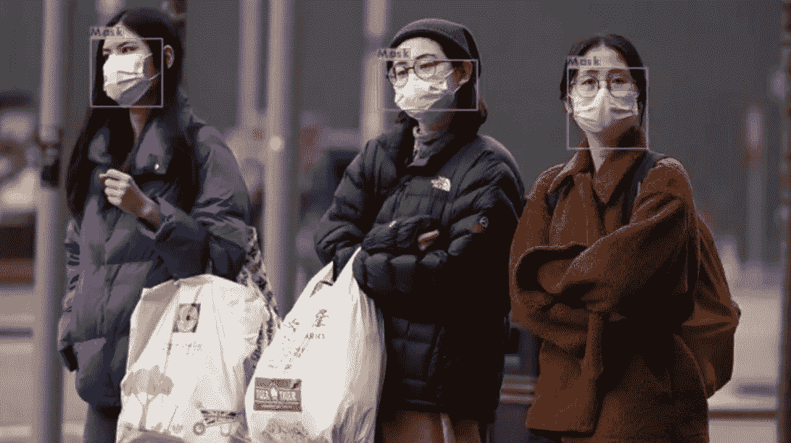

示例输出

可以在各种图像上试试。

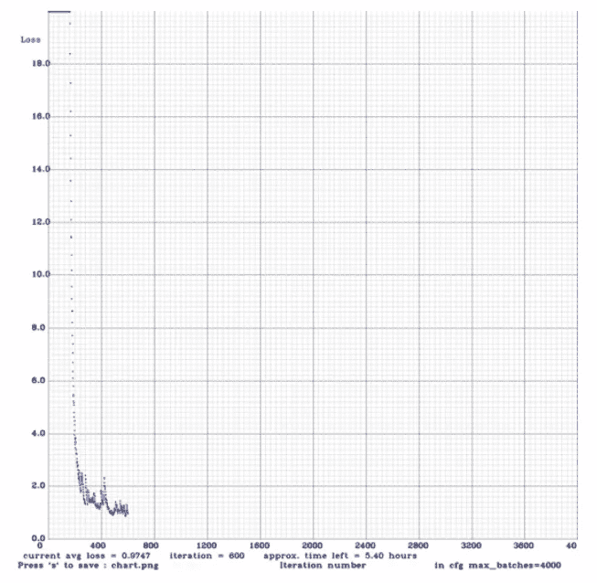

历元与损失图

我们可以看到，在大约 300+个时期后，损耗急剧下降。我已经训练了超过 1000 个周期，但是图显示了大约 700 个周期，因为我不得不使用我的备用重量重新训练。

# 结论:

1.  该模型在如此小的数据集和仅 1000 个时期的训练下表现相当好。
2.  该模型可以通过使用具有不同类型图像的更大数据集来改进。在这个实现中用于训练的数据集非常简单，并且大多数图像包含单个人。在生产场景中，图像中有变化的大型数据集是必须的。

希望你喜欢这篇文章！

# 参考资料:

1.  最新研究论文 [**蒙面人脸识别数据集及应用**](https://arxiv.org/pdf/2003.09093.pdf)
2.  YOLO v3: [暗网](https://pjreddie.com/darknet/yolo/)

3.使用 [Colab](https://colab.research.google.com/drive/1lTGZsfMaGUpBG4inDIQwIJVW476ibXk) 的 YOLO v3

我的 Github:[https://github.com/shibam-banerjee/Face_Mask_Detection](https://github.com/shibam-banerjee/Face_Mask_Detection)

领英:[https://www.linkedin.com/in/shibam-banerjee-b59727169/](https://www.linkedin.com/in/shibam-banerjee-b59727169/)