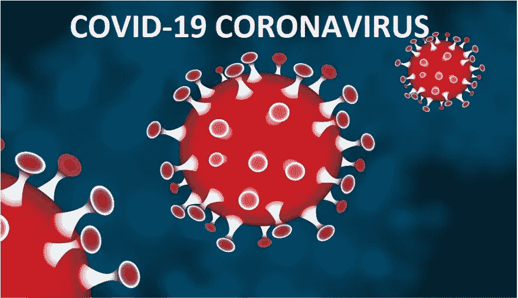
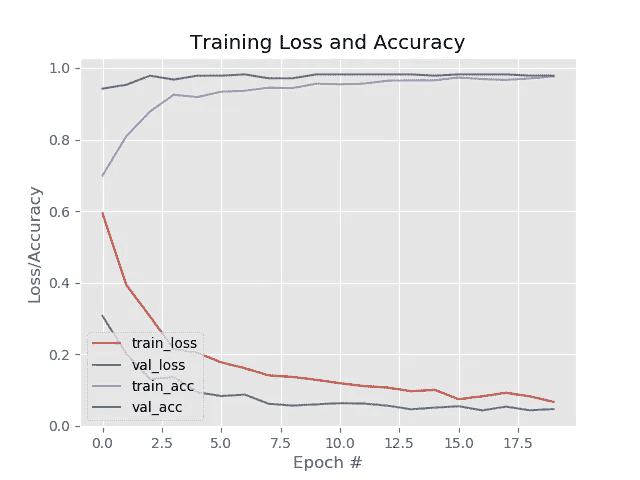
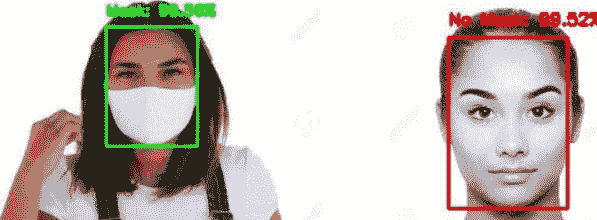

# 具有 OpenCV、Keras/Tensorflow 和深度学习的人脸面具检测器

> 原文：<https://medium.com/analytics-vidhya/face-mask-detector-with-opencv-keras-tensorflow-and-deep-learning-d2dcabdf5e2c?source=collection_archive---------10----------------------->

每个人都知道正在发生的新型冠状病毒疫情的情况。几乎每个国家都受到了毁灭性的冠状病毒(新冠肺炎)疾病的影响。疫情有可能逆转过去十年在全球卫生和人力资本方面来之不易的成果。强制隔离和社会隔离措施在很长一段时间内有效，这将有利于使传播曲线变平。人工智能可以在后 COVID 复苏中发挥重要作用，有助于提高生产率和培育新一代创新公司。虽然这种情况每天都在恶化，但为了保持安全，每个人都必须遵守一些规则，以免受到其后果的严重影响。

前线战士正在努力挽救许多生命，但更多的是个人的责任，打好自己的仗，不损害自己的健康。建议的几个方法是:定期洗手，保持社交距离，定期戴口罩，如果身体不适，保持隔离

在这里，我尝试使用 OpenCV、Keras/Tensorflow 库设计了一个定制的深度学习模型，用于检测个人是否戴着面罩并发出警报。

# 履行

这里，在两个不同的阶段中应用人脸面具检测。第一阶段构成人脸面具检测器的训练，第二阶段处理将人脸面具检测器模型应用于测试图像或实时视频流。在第一阶段，我们首先加载人脸面具数据集，然后使用 Keras 和 Tensorflow 库训练人脸面具分类器，最后将人脸面具分类器序列化到磁盘。在第二阶段，首先我们从磁盘上加载人脸面具分类器。我们用它来检测图像或视频流中的人脸，并提取每个人脸的感兴趣区域。然后对人脸的每个感兴趣区域应用人脸面具分类器来判断人是否戴了面具，最后显示结果。我们还发现在确定正确结果时获得的准确性。

数据集描述:这里用于训练模型的数据集是由 PyImageSearch 阅读器之一创建的。它由大约 1376 个图像组成，并且图像被分类为两个一组，即，具有包含 690 个图像的掩模和不具有包含 686 个图像的掩模。

我们对 [**MobileNet V2 架构**](https://arxiv.org/abs/1801.04381) 进行了微调，这是一种高效的架构，可应用于计算能力有限的嵌入式设备。将我们的面罩检测器部署到嵌入式设备将有助于降低制造这种面罩检测系统的成本，因此我们选择使用这种架构。

首先，我们导入实现所需的所有必要的库，其中一些是:

*   *tensorflow.keras* 用于数据扩充，加载 MobilNetV2 分类器，构建新的全连接(FC)头，预处理，加载图像数据，sklearn，imutils，matplotlib，numpy 等。
*   sklearn 用于二值化类别标签、分割数据集以及打印分类报告。
*   [*imutils*](https://github.com/jrosebr1/imutils/)**路径实现在我们的数据集中查找并列出图像。**
*   ***matplotlib* 绘制我们的训练曲线。**

**然后，我们构造参数解析器，解析运行代码时所需的命令行参数。然后，我们指定超参数常数，包括初始学习速率、训练时期数和批量大小。**

## ****第一阶段:培训****

****步骤 1:** 加载并预处理我们的训练数据，然后为数据扩充做准备，包括:**

*   **获取数据集目录中的图像列表，然后初始化数据(即图像)和类图像列表**
*   **预处理图像**
*   **将训练数据转换为 Numpy 数组格式**
*   **编码标签(一键编码)**
*   **使用 scikit-learn 库将数据集划分为训练集(80%)和测试集(20%)**

**准备 **MobileNetV2** 进行微调:**

*   **用预先训练好的 [**ImageNet**](http://www.image-net.org/) 权重加载 MobileNet，离开网络头部**
*   **构建一个新的 FC 头，并将其附加到基础上以代替旧的头**
*   **冻结网络的基础层。在反向传播过程中，这些基本层的权重不会被更新，而头部层的权重将被调整。**

****第二步:**编译和训练面罩检测器网络:**

*   **使用 Adam 优化器、学习率衰减计划和二进制交叉熵编译模型(因为只有 2 个类)**
*   **使用 model.fit 方法及其所需参数训练网络的头**

**通过在测试集上进行预测，抓取最高概率类标签索引，在测试集上评估结果模型。然后，我们打印一份分类报告供检查。**

****步骤 3:** 然后，我们将我们的面罩分类模型序列化到磁盘上。此外，我们还绘制了精度和损耗曲线。**

****

**在这里，我们可以观察到，我们的测试集几乎有 97%的准确率。**

# **实现图像的面罩检测器**

**我们导入 tensorflow 和 keras 库来加载 MaskNet 模型并对图像进行预处理。**

**OpenCV 用于读取、写入、显示图像和视频，并在其中进行一些操作。**

**命令行参数包括:**

*   **—图像:包含用于推断的面的输入图像的路径**
*   **— face:人脸检测器模型目录的路径(我们需要在分类之前定位人脸)**
*   **—模型:我们在本教程前面训练的面罩检测器模型的路径**
*   **—置信度:可选的概率阈值可以设置为覆盖 50%,以过滤弱面部检测**

## ****第二阶段:部署****

****步骤 1:** 我们加载人脸检测器和人脸面具分类器模型。下一步是加载和预处理输入图像。预处理由 **OpenCV 的 blobFromImage 函数处理。****

****步骤 2:** 然后，我们循环检查我们的检测，并提取置信度，以对照置信度阈值进行测量。**

****步骤 3:** 然后，我们计算特定人脸的边界框值，并确保该框落在图像的边界内。**

****步骤 4:** 接下来，我们将通过我们的 MaskNet 模型运行面部 ROI(通过 Numpy 切片提取)。**

****步骤 5:** 之后，我们基于掩模检测器模型返回的概率确定类别标签，并为注释分配相关联的颜色。此处的颜色将为“绿色”表示有 _mask，为“红色”表示无 _mask。然后，我们使用 OpenCV 绘图函数绘制标签文本(包括类别和概率)，以及人脸的边界框矩形。处理完所有检测后，将显示输出。**

# **输出**

****

**因此，我们看到，在上述样本图像中，人脸面具检测器模型以 96.56%的置信度正确地标记了“面具”，以 99.52%的置信度正确地标记了“无面具”。**

# **实时视频流中人脸检测器的实现**

**为了检测一个人是否戴着面具，我们需要处理视频中的每一帧。要做到这一点，我们只需要将 VideoStream 类导入到我们的代码中，其余的过程与我们对图像应用面具检测器模型的过程相同。**

**我们定义了一个函数来检测和预测人脸面具。该函数被传递了三个参数**

*   **帧:从实时网络摄像头流中捕获**
*   **faceNet:检测图像中人脸的训练模型**
*   **maskNet:人脸面具分类模型**

**我们从循环面部检测开始，并过滤掉小于最小置信度阈值的面部检测。之后，我们从图像中提取所需的边界框。然后，提取的 ROI 通过掩模预测器。首先，我们检查帧中是否至少有一个人脸，如果没有，我们直接从那里返回，但是如果我们在整批帧中找到人脸，我们预测它的位置，并了解遮罩是否存在。根据我们得到的预测，我们然后确定要在图像上打印的标签作为蒙版/无蒙版的标签，并且如果没有蒙版，边界框的颜色设置为红色，如果有蒙版，则设置为绿色。**

**我的 Github 资源库链接**中提供了完整的源代码供参考****

****希望这整个文档对所有致力于 OpenCV、深度学习和面具检测概念的人有用。****