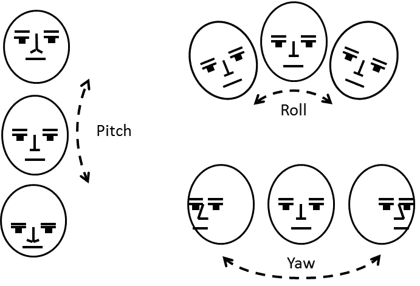
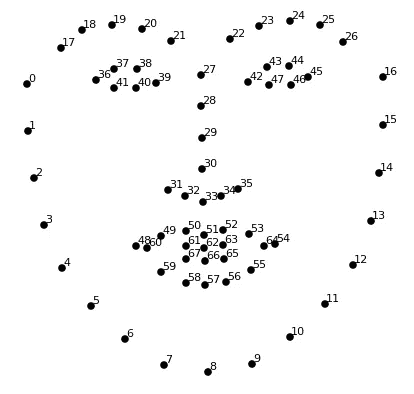
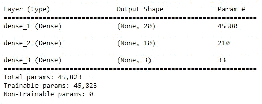
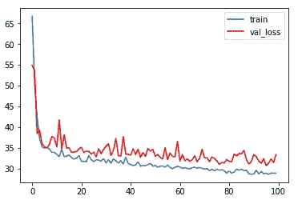
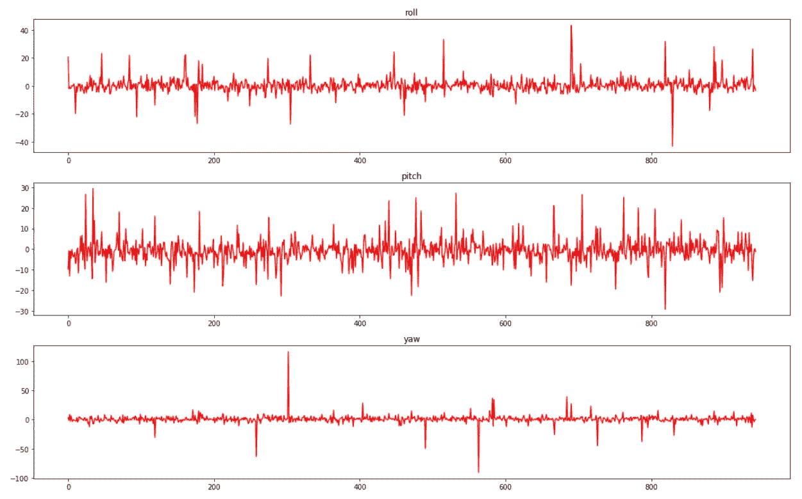

# 基于深度学习的实时人脸姿态估计

> 原文：<https://medium.com/analytics-vidhya/face-pose-estimation-with-deep-learning-eebd0e62dbaf?source=collection_archive---------0----------------------->

面部识别是深度学习的一个蓬勃发展的应用。从手机到机场摄像头，它在商业和研究领域都得到了广泛应用。当你把它和姿态估计结合起来，你会得到一个非常有力的匹配。

上周，我做了一个项目，预测一张脸在镜头前的姿态估计。在这篇文章中，我将开始介绍人脸姿态估计问题。稍后，你会发现我是如何训练一个深度学习模型来解决它的。最后，你还将有机会训练你的模型，并在你自己的形象上进行尝试。

# 问题是

由于人脸是一个 3D 物体，它可以绕着所有三个轴旋转——当然有一些限制。在面部姿态估计问题中，我们将这些运动称为**滚动、俯仰和偏航**，在下图中更直观:



估计这些姿态对于**活性检测系统**是有用的。例如，它可以要求用户执行一些预定义的随机移动(例如，“向右旋转你的脸”)来检查他的活跃度。你也可以用它来了解哪些**学生在关注老师**解释一个概念，估计**哪里有司机在看**，等等。

# 数据集

针对这个问题，我创建了一个[玩具数据库](https://drive.google.com/open?id=1lxwO-A-VBZCVuKKP1FgE_h0ZgfxUvlR4)，里面有来自不同人脸数据集的 6288 张图片。**对于每张图像，我用**[**Dlib**](http://dlib.net)**(68 个点，见下图)检测面部标志，并计算所有点之间的成对欧几里德距离**。因此，给定 68 分，我们最终得到(68 * 67)/2 =**2278 个特征**。每张脸的侧倾、俯仰、偏航都用[**亚马逊的人脸检测 API**](https://docs.aws.amazon.com/rekognition/latest/dg/faces-detect-images.html) **进行了标注。**



由 Dlib 库计算的面部标志。

# 训练模型

现在，是时候训练我们的模型了。这一步我用的是 Keras**。然而，我后来将它导出为 TensorFlow 格式，以便在 C++应用程序中使用。经过几次尝试，我最终得到了以下配置:**

*   **批量大小** : 32
*   **#历元** : 100
*   **优化器**:亚当
*   **提前停止**耐心= 25

这是最终的网络架构:



模型摘要

关于我的模型架构，我想强调几个细节:

*   **强正则化**:由于我们有很多特征(2278)，所以我的网络中呈现的正则化类型很少，以**防止过度拟合**并处理 [**维数灾难**](https://en.wikipedia.org/wiki/Curse_of_dimensionality) 。首先，**所有层都有 L2 正则化**，因为我们不希望模型对某些特征给予高度重视，尤其是在第一层。另外，模型的架构本身也是一种正则化。**它遵循** [**自动编码器**](https://en.wikipedia.org/wiki/Autoencoder) 的模式，其中每一层的神经元都比前一层少，以“迫使”网络学习相关信息并忽略不相关的信息。
*   **由于每层神经元数量较少，我没有使用 dropout** 。
*   我可以在第一层使用 **L1 正则化**来迫使网络忽略不必要的特征(因为这种正则化倾向于将与这种信息相关的权重设置为零)。然而，由于网络已经非常规范，我宁愿不这样做。在我的测试中，L2 正则化的效果也稍好一些。:)

你可以在这里查看完整的源代码。

# 结果

这是 100 个时期训练后的 train/val 损失图:



```
Train loss: 29.2128348724
  Val loss: 33.3887316318
 Test loss: 39.9278703463
```

正如我们所看到的，我们的模型甚至在测试集上也取得了很好的结果。该图也遵循训练深度学习模型时预期的模式。由于我们使用 MSE 作为损失函数，**我们可以估计我们的模型有 6 的误差。**

在下图中，我们可以看到测试集中每个点的实际角度和预测角度之间的差异。正如我们所观察到的，**偏航是最容易预测的**，其次分别是滚转和俯仰。然而，我们可以在所有的图中观察到一些异常值。我将在以后的文章中研究它们。



每个姿态(原始姿态、俯仰姿态和偏航姿态)的测试结果。图中的每个点代表测试集中每个点的实际角度和预测角度之间的差异。

# 最后的话

我上传了一个 [Jupyter 笔记本](https://github.com/arnaldog12/Deep-Learning/blob/master/problems/Regressor-Face%20Pose/Keras.ipynb)，你可以看到我解决这个问题的所有步骤。此外，您可以按照同一个存储库中的说明，使用我创建的玩具数据集进行试验，然后在您自己的图像上进行测试。试试吧！

对于未来的作品，我有几个想法:

*   试着找一个更好的模式。如果有，请告诉我！
*   检查测试集结果中的异常值
*   使用 TensorFlow 创建相同的教程
*   因为我的架构是一个自动编码器的开始，我可以复制和转置我的权重来使用它作为“解码器”。然后，**我会给我的网络滚转、俯仰和偏航作为输入，模型会输出 2278 个特征**。我可以尝试使用这些功能来绘制 68 个标志点，并可视化结果。那太棒了！

最后，看看在 CPU 上实时运行模型的视频: