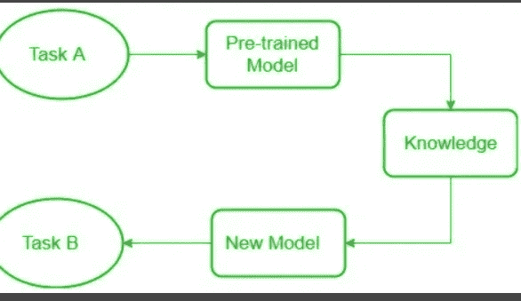
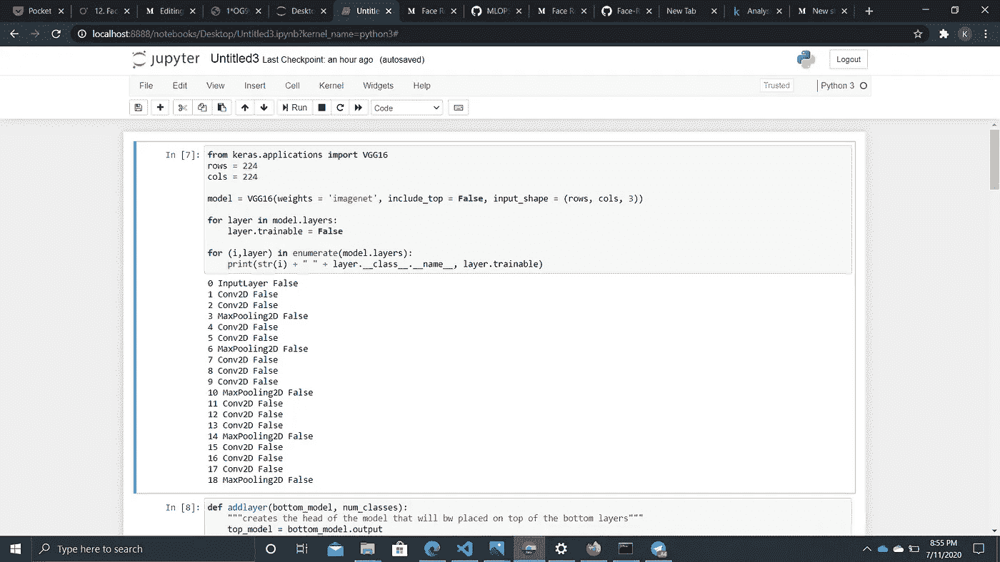
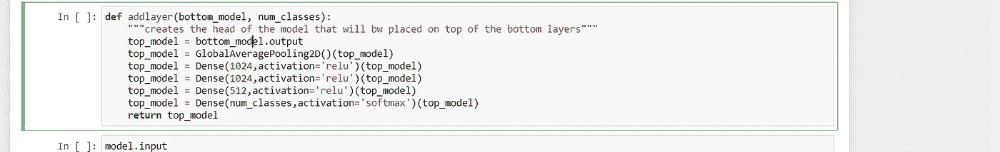
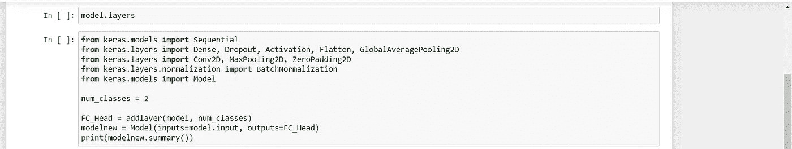
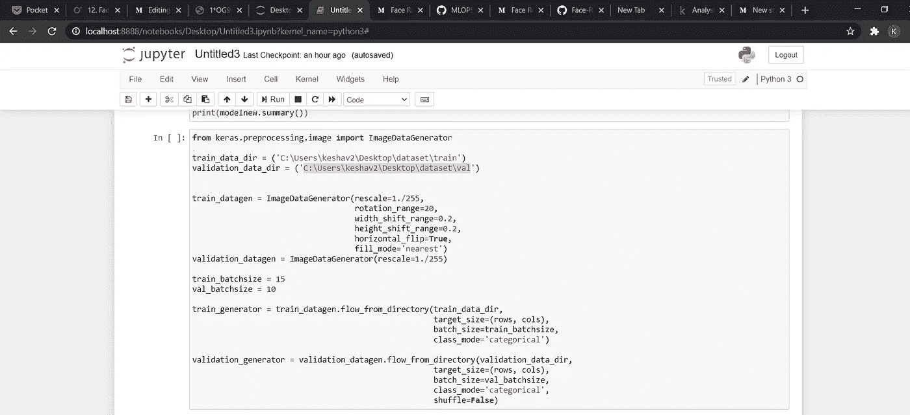
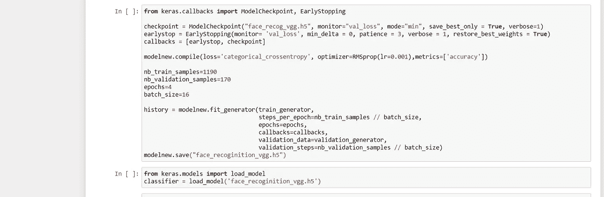
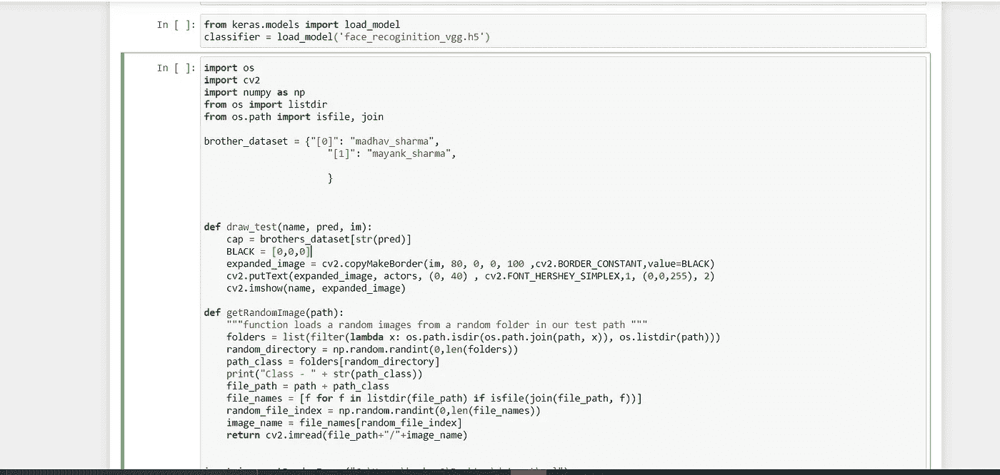
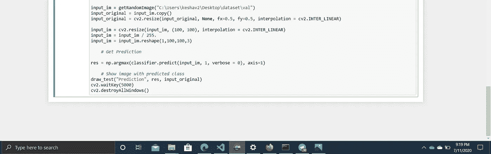

# 基于迁移学习的人脸识别

> 原文：<https://medium.com/analytics-vidhya/face-recoginition-using-transfer-learning-15c39b1d1618?source=collection_archive---------28----------------------->

# 迁移学习

*迁移学习*利用解决一个问题时获得的知识，并将其应用于另一个不同但相关的问题。我使用 Inception 模型，因为它能够从图像中提取有用的信息。

迁移学习

# 为什么要转学？

众所周知，卷积网络需要大量的数据和资源来训练。

使用迁移学习和微调(也就是说，将在以前的项目(如 ImageNet)中训练的网络权重转移到新的任务中)已经成为研究人员和实践者的规范。

您可以采取两种方法。

*   *迁移学习*:你可以拿一个已经在 ImageNet 上预训练好的 CNN，去掉最后一个全连接层，然后把 CNN 的剩余部分当做新数据集的特征提取器。一旦提取了所有图像的特征，就可以为新的数据集训练一个分类器。
*   *微调*:你可以替换和重新训练 CNN 上的分类器，也可以通过反向传播微调预训练网络的权重。

# 导入模块和冻结层

首先，我们导入所需的模块和库。Keras 是用于机器学习的 python 库之一。所以这里我们必须导入我们程序中需要的不同的子模块和函数。因为我们使用 VGG16 架构，所以我们导入了 VGG16 函数。然后我们冻结这些层。

现在，我们将创建一个名为 new 的函数，在该函数中，我们将定义要添加到现有模型中的新层。

现在，我们将定义培训和验证数据的呈现路径。

train_generator 将从目录中获取输入，并根据 VGG 调整它们的大小。类似地，validation_generator 也可以。

这里我们使用 PMSprop 作为优化器。

我们将使用模型检查点来保存模型。根据价值损失，只选择最佳模型。

然后我们编译并保存模型。

# 测试模型

现在我们处于最后一步，即测试我们的模型。在这一步，我们向我们的模型提供那些既不在训练集中也不在测试集中提供的图像，以便我们可以检查我们的模型预测是对还是错。因此，首先，我们将导入所需的模块，然后，我们加载之前训练的模型。最后，我们使用 predict()函数进行预测，并解码其输出。

