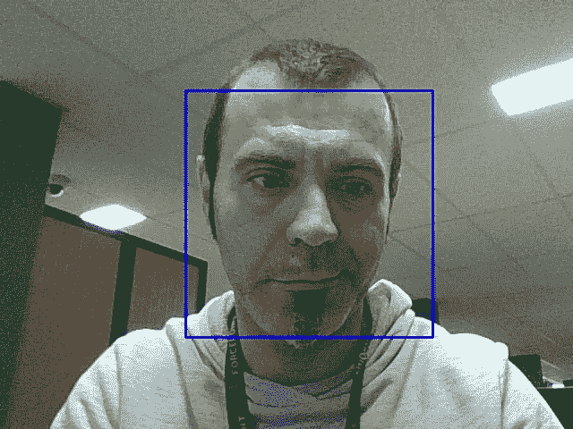

# 基于 OpenCV 和 AWS 的人脸识别和微表情识别

> 原文：<https://medium.com/analytics-vidhya/face-recognition-and-microespressions-with-opencv-and-aws-rekognition-2ea2bc83f7da?source=collection_archive---------14----------------------->

我在一辆公交车上，因为一场车祸，有很多交通堵塞，所以我在这里编码的东西。编码什么？我在练习一些机器学习，我想记下我正在做的事情，这是第一个演示，你肯定可以在网上找到，但我的更酷:-P

所以，让我们用 OpenCV 做一些 Python，看看如何进行。为了理解人脸识别是如何工作的，了解一些关于 Haar Cascade 的知识可能会很方便。从小波到级联，整个哈尔理论非常有趣。顺便说一句，谁对 Haar Cascade 感兴趣[这里有一篇有趣的文章](http://www.willberger.org/cascade-haar-explained/)。

让我们现在按一些键盘按钮。

首先确保你已经安装了 *python3* 确保你已经安装了 *opencv-python* libs 和…到目前为止一切顺利。

好吧，试试这段代码

```
**import** cv2cap = cv2.VideoCapture(0)
face_cascade = cv2.CascadeClassifier('haar/haarcascade_frontalface_default.xml')**while**(True): ret, frame = cap.read()
   gray = cv2.cvtColor(frame, cv2.COLOR_BGR2GRAY)
   faces = face_cascade.detectMultiScale(gray, 1.3, 5)
   **for** (x,y,w,h) **in** faces:
      cv2.rectangle(frame,(x,y),(x+w,y+h),(255,0,0),2) cv2.imshow('B&W',gray)
   cv2.imshow('Color',frame) **if** cv2.waitKey(1) & 0xFF == ord('q'):
      **break**
```

这应该足以让你的脸被认出来，你可以在这里找到哈尔瀑布。魔法是由函数 *detectMultiScale* 完成的，如果你想了解更多，请参考[文档](https://docs.opencv.org/2.4/modules/objdetect/doc/cascade_classification.html#cascadeclassifier-detectmultiscale)。

太棒了，不是吗？好了，现在安装一些其他的包……事实上我想你只需要另外一个包，这就是 *boto3。*还有 boto3 是什么？嗯…

> Boto 是 Python 的 Amazon Web Services (AWS) SDK。它使 Python 开发人员能够创建、配置和管理 AWS 服务，如 EC2 和 S3。Boto 提供了一个易于使用的、面向对象的 API，以及对 AWS 服务的底层访问。

那就装吧！

嗯，也许你知道，你应该有一个 AWS 帐户，通过使用高亚马逊巫术执行其他类型的魔法。如果你想创造它，看看条件就知道了，因为每样东西都有价格。

我想用 AWS 巫术分析面部微表情，我推荐使用 [*识别*](https://aws.amazon.com/rekognition/) 服务:

> Amazon Rekognition 使用成熟的、高度可扩展的深度学习技术，无需使用机器学习专业知识，就可以轻松地将图像和视频分析添加到您的应用程序中。

现在让我们介绍这个函数和连接到 AWS 的客户机:

```
rekog = boto3.client('rekognition',
                        region_name='eu-central-1',
                        aws_access_key_id='BlaBla',
                        aws_secret_access_key='BlaBlaXYZ'
                    )**def** send_to_rekognition(img, boto_client):
    cv2.imwrite('/tmp/face_recog.jpg', img)
    **with** open("/tmp/face_recog.jpg", "rb") as imageFile:
        f = imageFile.read()
        buf = bytearray(f) response = boto_client.detect_faces(
        Image={
            'Bytes': buf
        },
        Attributes=['ALL']
    )
    data = response["FaceDetails"]
    **for** d **in** data:
        **print**(d['Gender'])
        **for** e **in** d['Emotions']:
            **print**(e)
```

好吧，好吧，我知道这不是一个超级代码，但只是让你知道它是如何工作的。现在好些了吗？

然后主要部分会变成这样:

```
cap = cv2.VideoCapture(0)
face_cascade = cv2.CascadeClassifier('haar/haarcascade_frontalface_default.xml')
**while**(**True**):
    # Capture frame-by-frame
    ret, frame = cap.read()# Our operations on the frame come here gray = cv2.cvtColor(frame, cv2.COLOR_BGR2GRAY)
    faces = face_cascade.detectMultiScale(gray, 1.3, 5)
    **for** (x,y,w,h) **in** faces:
        cv2.rectangle(frame,(x,y),(x+w,y+h),(255,0,0),2)
        roi_gray = gray[y:y+h, x:x+w]
        roi_color = frame[y:y+h, x:x+w]
        **if** cv2.waitKey(1) & 0xFF == ord('a'):
            send_to_rekognition(frame,rekog)
    # Display the resulting frame
    cv2.imshow('B&W',gray)
    cv2.imshow('Color',frame)
    **if** cv2.waitKey(1) & 0xFF == ord('q'):
        **break**# When everything done, release the capture
cap.release()
cv2.destroyAllWindows()
```

当这段代码运行时



你的脸被认出来了只要按“a”，

```
{'Value': 'Male', 'Confidence': 99.81909942626953}
{'Type': 'SURPRISED', 'Confidence': 0.0363442562520504}
{'Type': 'CALM', 'Confidence': 86.3555679321289}
{'Type': 'DISGUSTED', 'Confidence': 0.03421016037464142}
{'Type': 'FEAR', 'Confidence': 0.020691828802227974}
{'Type': 'ANGRY', 'Confidence': 1.0062201023101807}
{'Type': 'SAD', 'Confidence': 10.729506492614746}
{'Type': 'HAPPY', 'Confidence': 0.04961089417338371}
{'Type': 'CONFUSED', 'Confidence': 1.7678450345993042}
```

以上是你将得到的！那么你能用这些数据做什么呢？事实上，这些数据是关于对微表情的研究。

> 微表情是瞬间发生的面部表情。这种不自觉的情绪泄露暴露了一个人的真实情绪。

让我们想象一下，你正处于这样一种情况，对感情的理解对决定是否雇佣某人做一份理想的工作、在一份亿万富翁的合同上签字、批准一笔豪华地产的贷款、理解一些谎言是否明显等等都是至关重要的

对微表情的研究可以决定是做一笔好交易还是有一个关键的欺骗，它可以帮助了解谁信任谁，了解微表情有助于我们识别欺骗和了解一个人的真实心理状态。用人眼识别微表情是一项极其困难的任务，但通过机器学习，这可以实时完成，延迟可以忽略不计，结果非常可信。