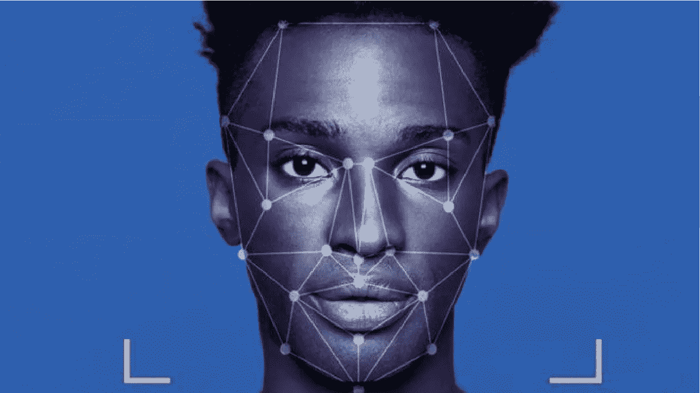

# 使用 Flutter 和 Tensorflow Lite 进行人脸识别认证

> 原文：<https://medium.com/analytics-vidhya/face-recognition-authentication-using-flutter-and-tensorflow-lite-2659d941d56e?source=collection_archive---------1----------------------->

*设备处理能力的增长和机器学习使我们能够创造出几年前无法实现的新解决方案。在这种情况下，我想展示一种有趣的方式，使用带有人脸识别的* ***Flutter*** *和****tensor flow Lite****进行认证。*

来源:[英国广播公司邮报](https://www.bbc.com/news/business-52989128)

# **简介**