# 基于人脸识别的图像分离器

> 原文：<https://medium.com/analytics-vidhya/face-recognition-based-image-separator-408681f2360d?source=collection_archive---------20----------------------->

这是一个有趣的小项目，它使用人脸识别技术将大型数据集中的图像分离成不同人的图像。

嘿，伙计们，这是我今天开始写的第一篇博客。写博客这个想法背后的主要原因是帮助年轻的程序员和爱好者利用编程来解决日常的小问题，并获得一些知识。在我的博客中，我将重点解释几乎任何人都可以做的人工智能的一些用例。我将主要做一些关于计算机视觉，自然语言处理或数据分析的小项目。有时我可能会讨论各种概念的一些基本原理，但那都是将来的事。

关于我？我是计算机科学工程专业的大四学生。目前，我在印度的一家初创公司担任全栈人工智能开发人员。在过去的几年里，我一直在用 Python 编写代码，从事关于机器学习、深度学习和数据分析的项目。

伙计们，我是计算机视觉技术的忠实粉丝。让一台设备像人类一样通过查看图片/摄像头来完成某项特定任务的想法实在是太棒了。我是漫威的超级粉丝，尤其是因为我们的托尼·斯塔克·❤.如果我说我做 AI 的最大原因之一是因为钢铁侠本人，我不会说谎。让人工智能变得足够强大和聪明，与人类一起工作的想法一直很有趣。我知道这仍然是超前的，但我们不要失去希望，因为每天都有重大发现。

好了，现在回到这个博客，正如标题所说，这个博客的目的是使用人脸识别从一个大数据集中分离出图像。如果你只是专注于代码部分，那么转到这个[链接](https://github.com/harshit-saraswat/Face-Recognition-based-Image-Separator)。

人脸识别是人工智能中计算机视觉的一个非常流行的用例。这也是几乎每个人工智能爱好者都应该参与的最有趣的项目之一。早期，为了进行人脸识别，人们习惯于为一个人的图像创建一个大型数据集，然后根据这些图像训练一个神经网络。我要说的是，这种方法非常强大，通过正确的参数和调整可以产生非常好的结果，但是它需要太多的工作。为神经网络生成一个足够好的数据集以获得巨大的准确度和精确度的想法似乎很庞大。除此之外，你还得花上几个小时来调整你的模型，以获得最好的结果。另外，当您需要向数据集中添加一个新的人时，会发生什么呢？你必须重复所有这些步骤。

由于基于神经网络的人脸识别的超负荷和低灵活性，人们已经转向其他方法。在这个领域，一种流行的方法叫做一次性学习。单次学习或单次学习是一种学习范式，其中神经网络学习识别只有 1 个或非常少样本的对象。为了做到这一点，人们一直在使用三重态丢失的连体网络。下图解释了三重态损失背后的基本思想。

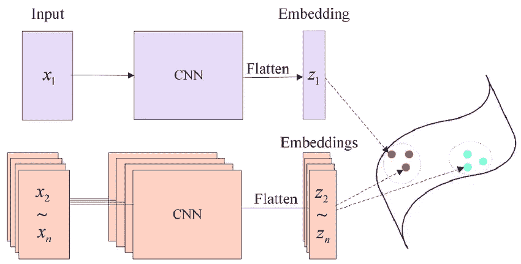

图片来源:—[https://www . research gate . net/figure/Siamese-network-for-embedding-the-feature-maps-into-a-constant-vector _ fig 2 _ 328376369](https://www.researchgate.net/figure/Siamese-network-for-embedding-the-feature-maps-into-a-constant-vector_fig2_328376369)

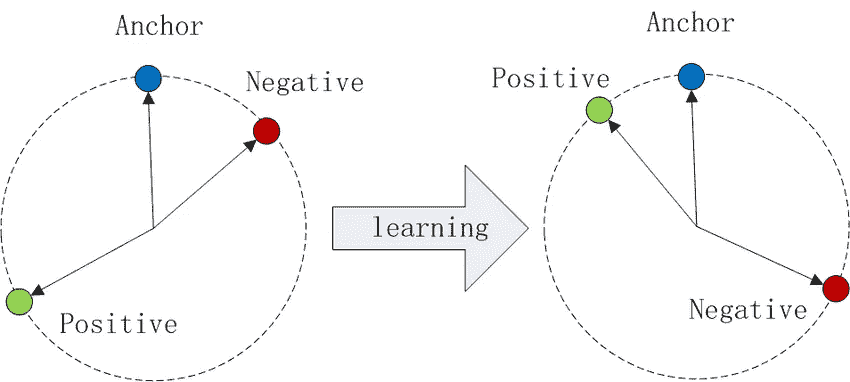

图片来源:——[https://www . research gate . net/figure/The-Triplet-loss-in-cosine-similarity _ fig 3 _ 316736728](https://www.researchgate.net/figure/The-Triplet-loss-in-cosine-similarity_fig3_316736728)

如您所见，在三重损失中，使用 3 个样本训练网络，其中 1 个是给定(锚)样本，1 个是正样本，最后一个是负样本。网络通过进行一些内部计算来对这些样本产生一些编码，以有效地理解正样本和负样本之间的差异。正如我们可以看到的，由于这个原因，阳性和锚定样本之间的距离小于阴性和锚定样本之间的距离。想了解更多关于一次性学习的信息，请点击以下链接

【https://www.cs.cmu.edu/~rsalakhu/papers/oneshot1.pdf】T5[T6](https://www.cs.cmu.edu/~rsalakhu/papers/oneshot1.pdf)

[**http://papers . nips . cc/paper/769-签名-验证-使用-暹罗-延时-神经网络. pdf**](http://papers.nips.cc/paper/769-signature-verification-using-a-siamese-time-delay-neural-network.pdf)

现在，回到我们的话题，我们都发现自己在聚会或郊游后有一大块图像，每个人都要求你继续发送他们的图像。当然，你可以把所有的图片发给每个人，或者把图片上传到一个公共频道，其他人可以从那里下载选中的图片，但这一点也不好玩。因此，为了完成浏览 100 张甚至 1000 张图像以选择每个人的图像这一具有挑战性的任务，我们将使用基于人脸识别的算法，该算法将能够记住你想要的人的脸，然后从目录中为每个人分离图像并分别存储它们。不仅如此，我们还可以分离群体图像(这里是包含 2 张以上人脸的图像)和未知人的图像(或者人脸识别失败的图像，因为面对现实吧，我还是个新手，所以我的代码不会像 facebook 的算法一样好)。是的，已经有一些工具，比如 Google Photos 或其他第三方工具，但是你可能需要将你的图片上传到他们的数据库中，自己创作比使用提供的资源有趣得多。不管怎样，废话少说，让我们开始吧:

项目的目录结构应该如下所示:

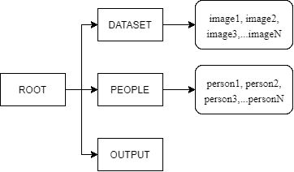

目录结构

数据集文件夹如下所示:

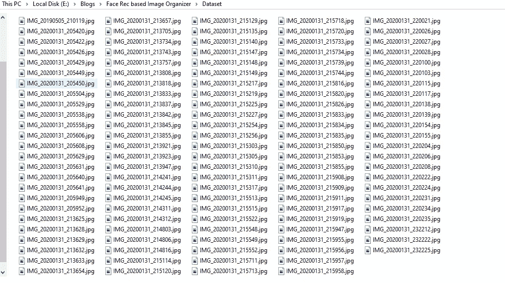

图像数据集

“人物”文件夹如下所示:

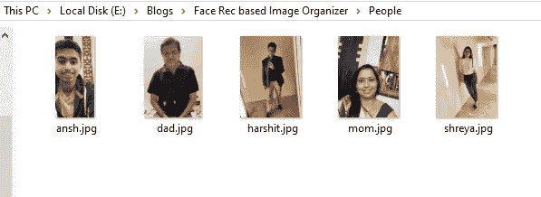

人民集

我们将使用 Python 3.7 和以下软件包:-

a.OS:用于基于 OS 的任务。

b. [OpenCV](https://opencv.org/) :读取图像并执行基本操作，如调整大小、查看等。

c.pickle:保存已经形成的面孔编码。

d.NumPy:用于较小的基于数组的操作。

e. [dlib](https://github.com/davisking/dlib) :基于图像任务的 ML 工具包

f.[人脸识别](https://github.com/ageitgey/face_recognition):用于查找人脸、创建编码和对比人脸。

face_recognition 是一个建立在 dlib 之上的非常强大的包，只用于人脸检测和基于识别的操作。我已经用这个库做了很多有趣的小项目，结果总是很棒。你可以去它的 [GitHub](https://github.com/ageitgey/face_recognition) 页面获取更多关于安装和使用的文档。

此外，该库使用基于一次性学习的模型。

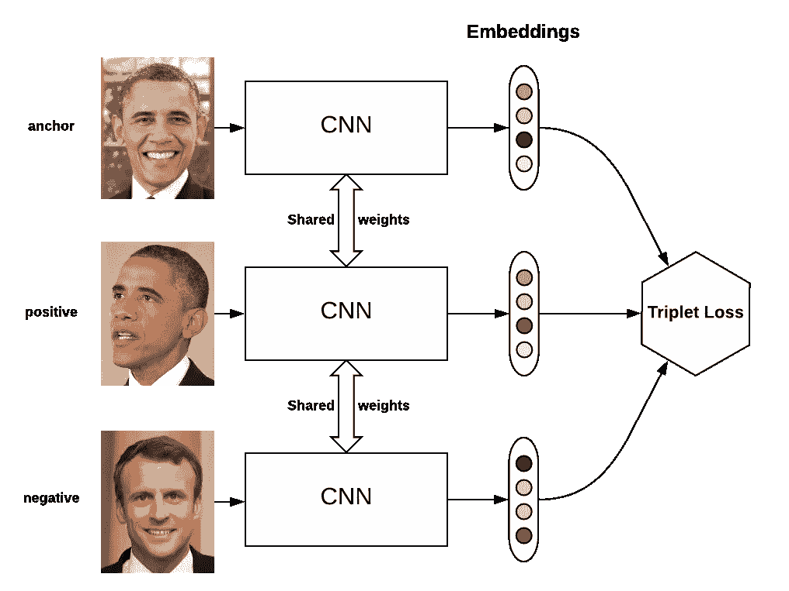

图片来源:——[https://omoindrot.github.io/triplet-loss](https://omoindrot.github.io/triplet-loss)

# **编码**

从代码开始，我们将从导入必要的包开始:

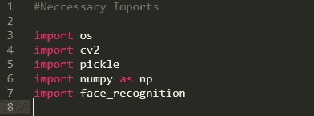

在此之后，我们将编写一些助手函数。这些函数都有适当的文档来解释，所以请仔细阅读。

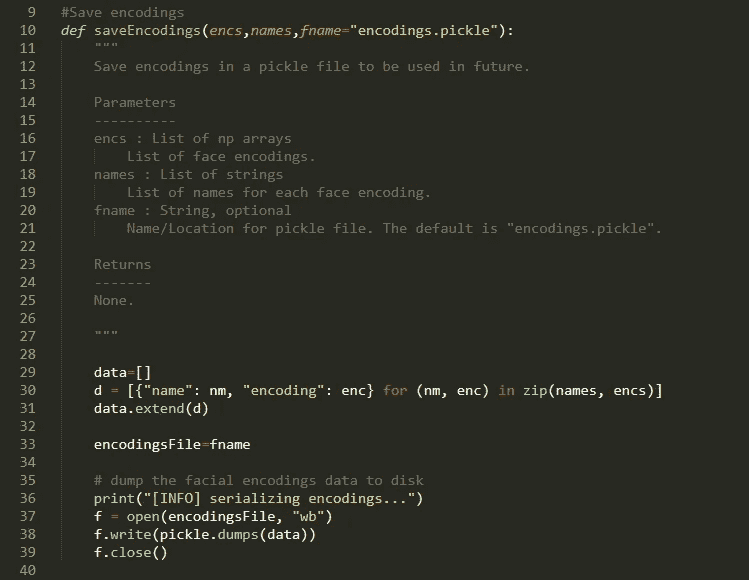

存储面孔编码

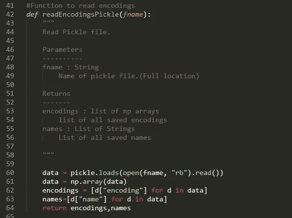

读取面孔编码

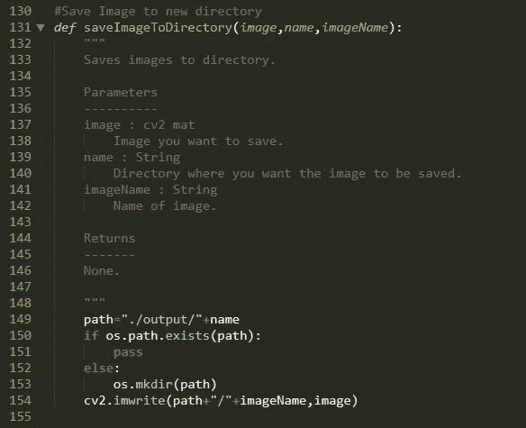

将图像保存到输出目录

现在，进入主要的面部识别部分。below 函数将用于为给定图像中的每个面部创建面部编码，并返回所有编码的列表和所有面部位置的列表(边框的顶部、左侧、右侧和底部位置)

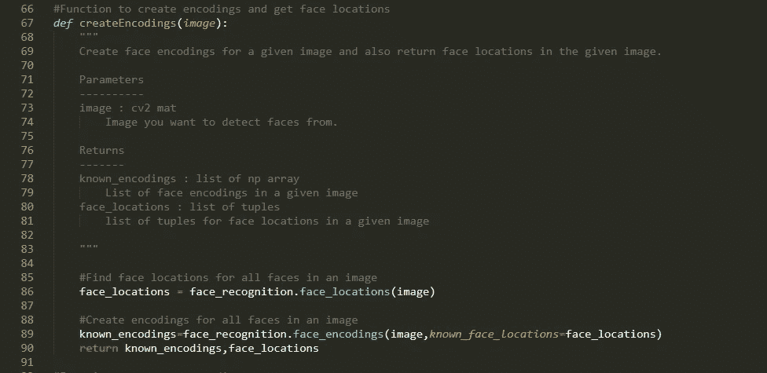

创建人脸编码并查找人脸位置

接下来，我们有一个比较面部编码的函数。它接受一个未知编码以及已知编码和名称的列表作为参数。该函数比较 known_encodings 中每个编码的未知编码，并返回 true 或 false 值。

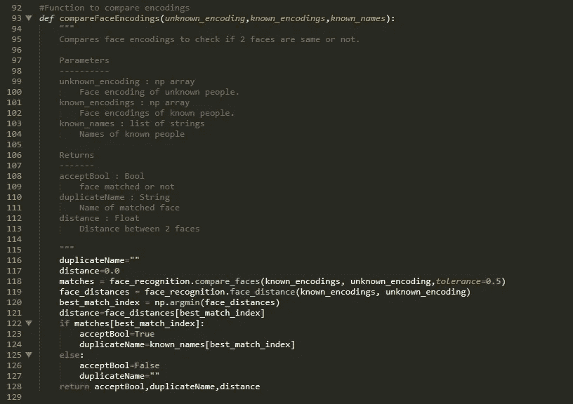

比较面孔编码

如上所述，compare_faces 函数返回了 known _ encodings 中每个面的布尔值列表。face_distance 返回两个面之间的距离。使用这些，我们找到最近的脸，并检查它是否匹配。正如所看到的，我们已经设置公差为 0.5。你可以随意使用这个数字，0.6 是默认值。值越低，算法越严格。

接下来，我们有两个重要的功能模块:

1.  processknownppeopleimages

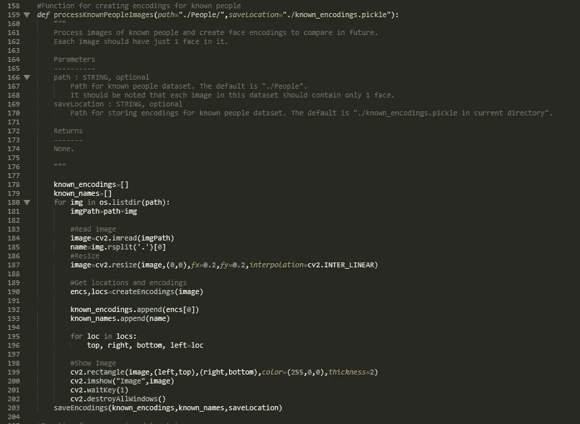

处理已知人物的图像，并创建和保存他们的面部编码

该函数读取每幅图像，并为每幅图像中的人脸创建一个人脸编码，然后保存起来以备将来使用。建议在此数据集的每个图像中只有一张人脸，因为此数据集用于记住您要识别其人脸的人，并为其分离图像。

2.processDatasetImages

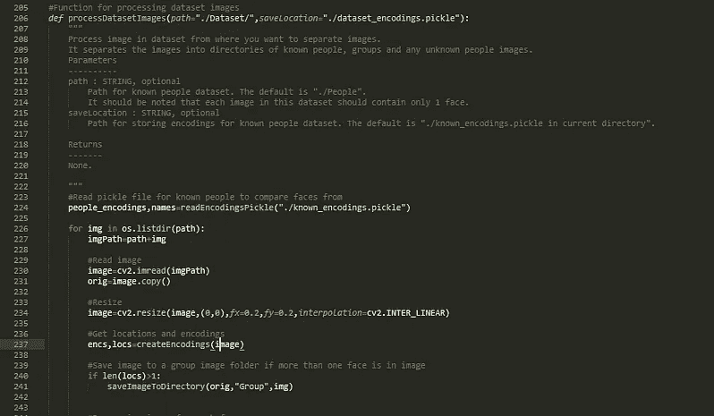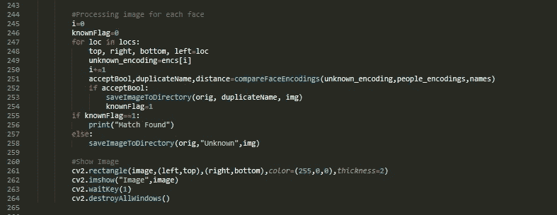

处理数据集图像，创建编码并与已知图像的编码进行比较，然后进行相应的分离

该函数读取每幅图像，并针对图像中的每张脸，将其与已知的人物编码进行比较，一旦找到匹配，就将该图像存储到相关名称的文件夹中。如果找到 1 张以上的人脸，图像将被视为一组图片，如果没有找到匹配或人脸识别失败(由于多种原因)，图像将被保存在“未知”文件夹中。

现在我们运行 bundle it all up 并运行 main()函数中的函数，看看结果。

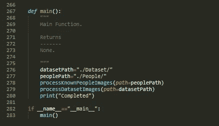

包裹

要运行该脚本，只需进入命令提示符并运行命令——python image _ segmentation . py

代码在支持 cuDNN 和 CUDA 的 NVIDIA GPU 上运行会更快，而在 CPU 上运行会相当慢。关于这方面的更多讨论，如果需要的话，我可能会再写一篇博客。

# 结果

代码完成后，您会在输出文件夹中获得以下设置:

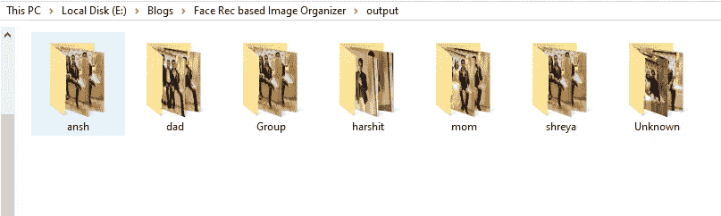

组类别的图像:

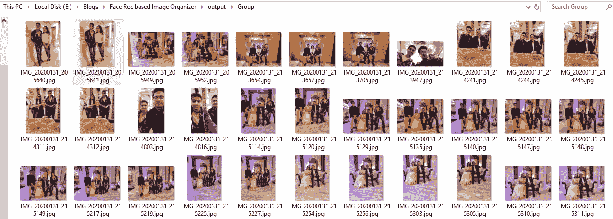

harshit 的图片:

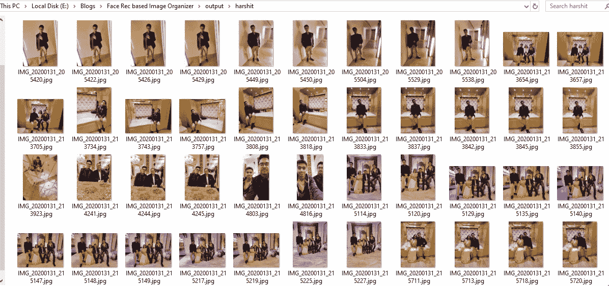

未知图像。这些实际上是小组中不认识的人的照片，最后一张是我的照片，没有一张清晰的脸:

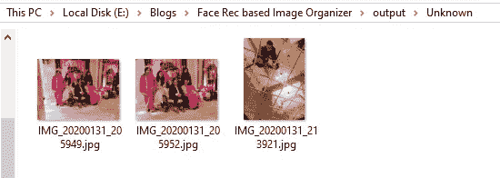

正如我们所见，代码运行得很好，结果也很好。在我的小数据集上没有大的错误，只有一张我的图像被错误分类为未知，但即使是那张图像也有相当差的质量。

# 结论

人脸识别是一个非常强大的工具，除了普通的基于人脸身份的锁之外，它还带来了众多的应用。这是一个这样的想法，将来我一定会提出新的更有趣的想法。

# 未来范围和改进

我们可以通过提高图像质量或使用更鲁棒的模型来提高精确度，从而改进该方法。这肯定不是一个行业级的解决方案，但对初级项目非常有帮助。

# 常见问题（frequently asked questions）

**Q1。为什么不能用图像哈希？**

**Ans** 。当您希望找到给定图像的所有实例时，图像散列技术是很好的，这些实例具有小的变化，如颜色、光强度等的变化。但是由于面部角度、面部附件等的变化，面部图像具有很大的变化。这导致了诸如 dhash、phash 等流行散列技术的失败。

**问题 2:这是人脸识别的行业级解决方案吗？**

**Ans** 。不，这不是面部识别的行业级解决方案。它可以用于小型有趣的项目和次要的用例，但不能用于成熟的人脸识别系统。

**Q.3 代码在我的电脑上运行缓慢，为什么？**

**Ans** 。与没有任何 GPU 的大型系统相比，DLIB 在使用 cuDNN 的 GPU 上编译时实际上非常快。在我使用 Nvidia 920m gpu 的 i3 第五代上，我大约在一分钟内获得结果，而在没有 gpu 的 i5 第五代上，我大约在 7-8 分钟内获得结果。还有 SSD，RAM 等。也是一些因变量。

**问题 4:我们可以使用大公司的适当解决方案，那么为什么要这样做呢？**

**Ans** 。我在这里的目标是向初学者展示如何从小项目开始，然后在实际的大项目中使用从中获得的一些知识和知识。当然，行业解决方案要好得多，但是尝试新的东西很有趣，即使它看起来很琐碎。我敢打赌，我们都尝试过编写自己的计算器，那么为什么不也这样做呢？

我真的希望你喜欢这个博客，并会在未来使用这项技术。该项目的全部代码都在我的 GitHub 上。如有任何疑问，请随时通过[contactharshitsaraswat@gmail.com](mailto:contactharshitsaraswat@gmail.com)联系我，或通过 [LinkedIn](https://www.linkedin.com/in/harshit-saraswat/) 联系我。

谢谢！晚上好！