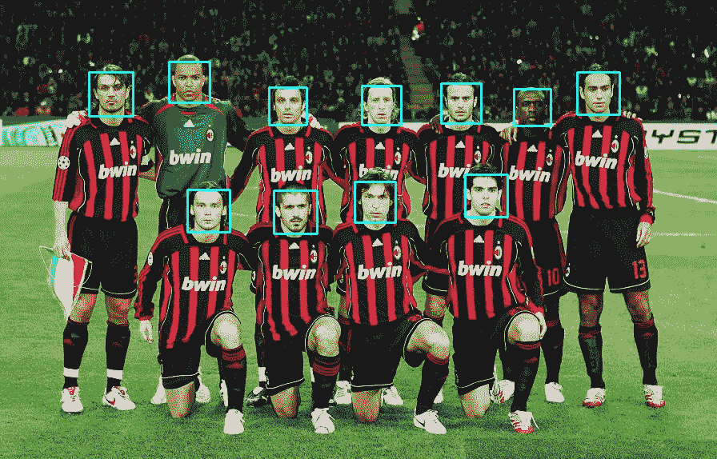
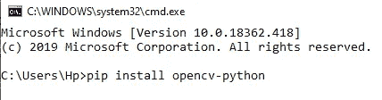
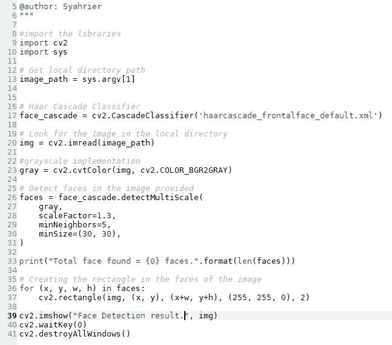
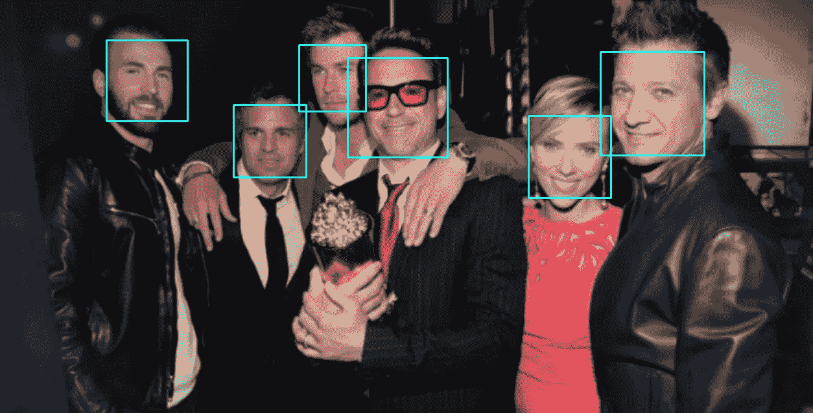
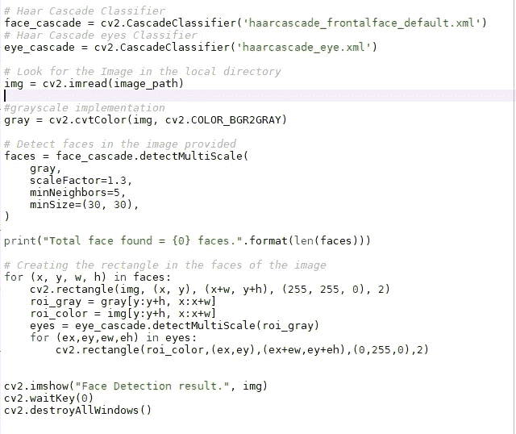
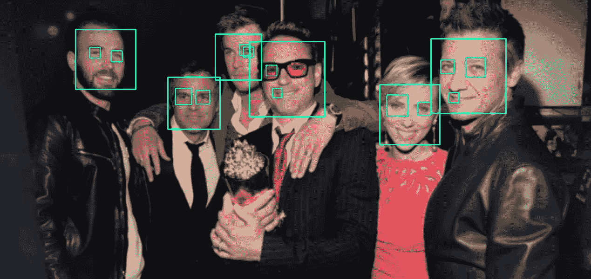

# 使用 Python 和开源计算机视觉库(OpenCV)实现人脸识别

> 原文：<https://medium.com/analytics-vidhya/face-recognition-implementation-using-python-with-open-source-computer-vision-library-opencv-8454c0aab926?source=collection_archive---------11----------------------->

图片来源太阳

> **什么是人脸识别？**

人脸识别是人工智能(AI)的一个新类别，它可以用数学方法绘制一个人的面部特征，并将他们的数据保存为人脸指纹。该软件使用算法系统来比较直接或数字图像捕捉，然后存储在人脸打印。这将有助于验证某人的身份。基本上，人脸识别与指纹匹配技术、视网膜扫描和语音识别是一样的，都是为了区分一个人和另一个人。所有这些系统都从陌生人那里获取数据，分析输入的数据，然后将其与数据库中的条目进行匹配。

人脸识别技术在这个时代已经不是什么舶来品了。这种技术几乎在任何地方都得到了应用。例如，苹果、三星和小米都在智能手机中安装了人脸识别技术，大多是他们用来解锁手机的。另一个例子，是脸书的自动标记功能。脸书可以自动识别照片中的人物。还有其他人脸识别实现，促进安全交易、ATM 人脸识别、机场检查人脸识别等等。

> **人脸识别是如何工作的？**

根据来自 ***The Conversation*** 的文章，人脸检测过程可以分为三个阶段:检测、人脸纹生成和验证或识别。当图像被捕捉时，计算机中的软件将对其进行分析，以识别人脸的位置。在面部被识别后，面部识别系统会更仔细地处理图像，然后以面部指纹的形式输入。像指纹一样，面纹是一种用于具体识别一个人面部的特征。但是，如果我们想将其扩展到细节，有几个步骤来检测一张脸。这是面部识别系统的流程。

1.  **检测**

拍摄人脸照片是通过数字扫描 2D 照片或使用视频拍摄 3D 人脸照片来完成的。

**2。对齐**

当成功检测到人脸时，软件将确定头部的位置、大小和姿态。头部的位置必须面向摄像机，角度至少为 35 度，最多为 90 度。

**3。测量**

然后，对捕获的面部图像进行缩放和旋转，以便将其存储并映射到数据库中的适当姿势和大小。

**4。标准化**

该系统通过确定关键特征来读取面部的几何形状，例如眼睛之间的距离、鼻子的形状、嘴唇的厚度、下巴和前额之间的距离等。注意到系统可以获得的密钥签名越多，系统识别人脸的能力就越强。

**5。表示法**

在形成面部签名之后，系统将其转换成唯一的代码。这种编码便于将新获取的面部数据与先前记录的面部数据的存储数据库进行更容易的计算比较。

**4。匹配**

如果已经表示的面部上的照片和数据库中面部照片的可用性都匹配，则识别过程可以立即完成。

> **介绍 OpenCV(开源计算机视觉库)**

计算机视觉是机器/计算机能够从图像中提取信息的能力。与计算机视觉相关的领域之一是图像处理或通常称为图像处理。OpenCV 是一个库(library ),用于处理图像和视频，以便我们能够提取其中的信息。OpenCV 中的 Open 一词意味着开源，即免费，不付费，任何人都可以下载。

虽然单词 OpenCV 中的 CV 是计算机视觉的缩写，但它意味着计算机用于处理由记录设备(如照相机或网络摄像头)捕获的图像，该记录设备将数据从模拟转换为数字，然后在计算机中用代码行进行处理。OpenCV 可以运行各种编程语言，如 C、C ++、Java、Python，也支持 Windows、Linux、Mac OS、iOS、Android 等各种平台。

> **Python 简介**

Python 是一种多用途的解释性编程语言，它使用了一种关注代码可读性的设计理念。作为一种编程语言，Python 结合了代码的功能、能力和语法以及高质量的库函数。

基本上，吉多·范·罗苏姆设计的编程语言实际上被非常广泛地用于创建公众经常使用的程序。称之为 GUI 程序(桌面)，智能手机应用程序，CLI 程序，物联网，游戏，网络，黑客程序等等。

Python 处理图像的能力非常有限，因为他需要从 OpenCV 导入库。这就是 OpenCV 和 Python 之间的联系。

> **利用 Python-OpenCV 实现人脸识别**

能够使用 Python 和 OpenCV 创建人脸识别。第一步是使用 pip install 在 Python 中安装 OpenCV 库:

对于这一步，我们将首先尝试实现人脸检测。以下是使用 Python OpenCV 的代码:

为了能够使用这些代码，我们必须在命令提示符下写下这一行:

**结果:**

图片来源 ABC 新闻

眼睛检测的另一个例子:

**结果:**

**眼睛的探测并不完美，尤其是在小罗伯特·唐尼的脸上自从他戴上眼镜后，克里斯·海姆斯沃斯也只探测到一只眼睛因为他正看着别处。*

**备注:**

上面的代码是 Python OpenCV 人脸识别的基本实现，也就是人脸检测。该代码成功地检测出照片中人脸。注意，这两个代码都有 xml 文件。它实际上是**级联分类器(Haar-Like 特征)。**没有 xml 文件，代码检测将无法工作，因此您必须首先从这里下载:

 [## rk 45825243/使用 Haar 级联分类器的人脸眼睛检测

### 这里我做了人脸和眼睛检测。

github.com](https://github.com/rk45825243/Face-eye-detection-using-Haar-Cascade-classifier) 

OpenCV 使用一种叫做 Haar-cascade 分类器的人脸检测器。类哈尔特征是目标检测中常用的一种方法。Haar 这个名字本身指的是 Haar 小波，这是一个箱形的数学函数，其原理类似于傅立叶函数。Haar-like 特征是矩形特征，其在图像上给出特定的指示。

Haar-like 特征的原理是基于特征的简单值而不是对象图像的像素值来识别对象。这种方法的优点是计算速度非常快，因为它只取决于正方形中的像素数量，而不是图像的每个像素值

Viola 和 Jones 提出的方法结合了四个主要键来检测对象(Viola，Paul 和 Jones，2001):

1.  简单的正方形特征，称为哈尔特征
2.  用于快速特征检测积分图像
3.  AdaBoost 机器学习方法
4.  级联分类器结合多种特征

Haar-like 特征处理盒子中的图像，其中一个盒子中有几个像素。然后对盒子进行处理，并获得指示暗区域和亮区域的差值(阈值)。这些值将被用作图像处理的基础。

****在下一篇文章中，我将详细描述 Haar 特性，并继续扩展代码，使其能够识别某些人的面部，而不仅仅是检测面部。***

**参考文献**

保罗·维奥拉和琼斯，M. (2001)。使用简单特征增强级联的快速目标检测。美国电气与电子工程师协会会议录。计算机视觉与模式识别。

[https://www . face first . com/blog/amazing-uses-for-face-recognition-face-recognition-use-cases/](https://www.facefirst.com/blog/amazing-uses-for-face-recognition-facial-recognition-use-cases/)

[https://the conversation . com/face-recognition-is-forced-common-but-how-it-work-61354](https://theconversation.com/facial-recognition-is-increasingly-common-but-how-does-it-work-61354)

[https://www . science ABC . com/innovation/face-recognition-works . html](https://www.scienceabc.com/innovation/facial-recognition-works.html)

https://opencv.org/

[https://opencv-python-tutro als . readthedocs . io/en/latest/py _ tutorials/py _ tutorials . html](https://opencv-python-tutroals.readthedocs.io/en/latest/py_tutorials/py_tutorials.html)