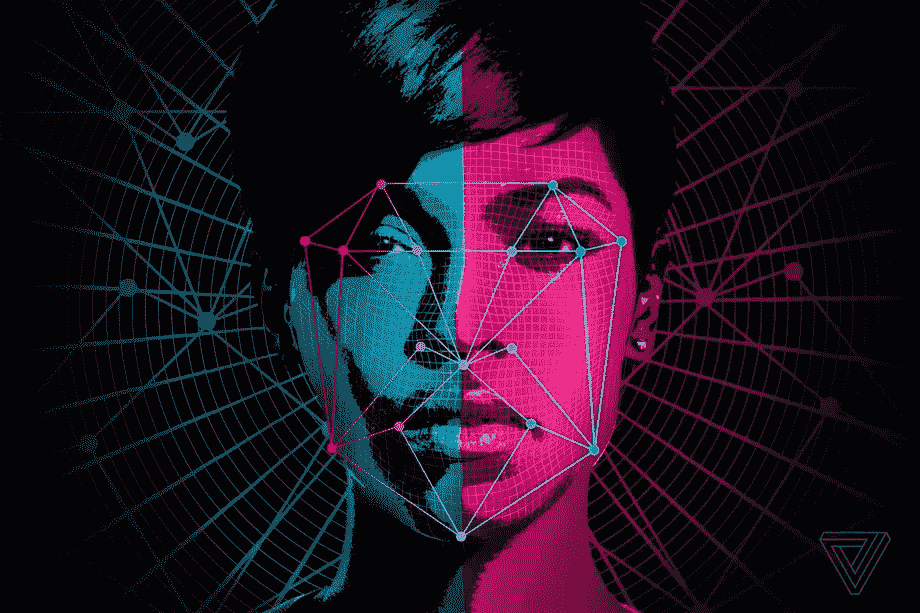
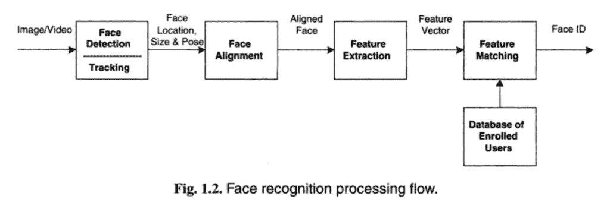
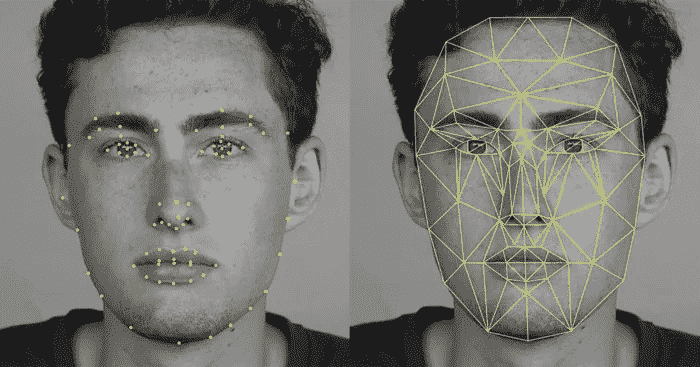

# 面部识别管道解释清楚

> 原文：<https://medium.com/analytics-vidhya/face-recognition-pipeline-clearly-explaine-415ebd7880ad?source=collection_archive---------23----------------------->

人脸识别流水线中的先进算法介绍。

[图像来源](https://www.theverge.com/2017/9/21/16332760/ai-sexuality-gaydar-photo-physiognomy)

**人脸识别**是一种利用视频或照片中的人脸来识别或验证个人身份的技术。这项计算机视觉任务根据人的面部细节捕捉、分析和比较模式。

名为“[人脸识别手册](https://www.amazon.com/Handbook-Face-Recognition-Stan-Z/dp/085729931X/ref=as_li_ss_tl?ie=UTF8&qid=1551046348&sr=8-1&keywords=Handbook+of+Face+Recognition&linkCode=sl1&tag=inspiredalgor-20&linkId=f7911d8d0a87a5449fb48071b1c5ad1a&language=en_US)”的 2011 年人脸识别书籍描述了人脸识别的两种主要模式，如:

> 人脸识别系统有望自动识别图像和视频中的人脸。它可以以两种模式中的一种或两种来操作:(1)面部验证(或认证)，以及(2)面部识别(或辨认)。

*   **人脸验证**。给定人脸与已知身份的一对一映射(例如*是这个人吗？*)。
*   **人脸识别**。给定人脸对已知人脸数据库的一对多映射(例如*这个人是谁？*)。

# 人脸识别技术的使用案例

这项技术被许多公司和组织使用，有些你可能知道，有些你可能不知道。下面是一些人脸识别技术的例子:

1.  **访问控制**:对个人电脑、家庭、汽车、办公室和其他场所的访问控制是使用面部识别的最明显的方法之一。而苹果的 iPhone X 就是一个利用 FRT 解锁智能手机的绝佳例子。
2.  网上购物:中国著名的电子商务公司阿里巴巴计划利用支付宝平台让用户在网上购物。作为第一步，支付宝已经在杭州的一家肯德基推出了“微笑支付”面部识别系统。该系统在两秒钟内识别人脸，然后通过发送手机警报来验证扫描结果。“微笑付款”还能识别化妆或戴假发的人。
3.  **帮助上瘾的赌徒**:人脸识别系统只是将玩老虎机的个人的脸与赌场里自称的问题赌徒的脸进行比较。当设备检测到匹配时，它会提醒安全团队，然后谨慎地接近赌徒并护送他们离开场所。
4.  追踪罪犯:这一次不会让人感到意外。面部识别是一种打击犯罪的技术，被执法部门和情报机构用于识别目标。例如，在 MORIS(移动罪犯识别和信息系统)的帮助下，官员只需拍一张照片，瞧，这是一种连接到智能手机的便携式生物识别设备。
5.  **整理照片**:使用这项技术最广泛的方式是由苹果、谷歌，甚至是脸书来完成的，通过他们自己的面部识别系统来区分肖像和风景，在相框中找到用户，并按类别对照片进行分类。每当我们上传一张照片并在上面标记我们的朋友时，我们都为面部识别算法提供了巨大的支持。
6.  **上学**:英国的学校为了上学使用首次登记税。这种情况在英国已经持续了一段时间，但肯定也会蔓延到其他国家。英国的学生和教师都喜欢这项用红外线扫描人脸并将其与存档图像进行匹配的新技术。

# 人脸识别管道

《人脸识别手册》，2011 年

人脸识别流程可以分为三个主要阶段:

1.  人脸检测
2.  面部对齐
3.  特征抽出
4.  特征匹配

在本文中，我不会解释我为每个主要阶段列出的每个算法的工作架构，但会让您了解它们的用例，您可以深入研究那些您认为适用于您的人脸识别项目的算法。

# 人脸检测

使用人脸检测方法来找到给定图像中存在的人脸，如果存在人脸，则提取人脸，并且仅裁剪人脸以创建压缩文件用于进一步的特征提取。在人脸检测/识别系统中，有多种算法选项来执行这项任务。

## 面部检测中使用的方法:

1.  **Haar cascade 人脸检测:**自 2001 年 Viola 和 Jones 在他们的论文“使用简单特征的增强级联进行快速对象检测[”中介绍基于 Haar cascade 的人脸检测器以来，它一直是人脸检测领域的尖端技术。近年来有了许多改进。这种方法有一个简单的体系结构，在 CPU 上近乎实时地工作。此外，它可以检测不同比例的图像。但是主要的缺点是它给出了错误的结果，而且它对非正面的图像不起作用。](https://www.researchgate.net/publication/3940582_Rapid_Object_Detection_using_a_Boosted_Cascade_of_Simple_Features)
2.  **Dlib (HOG)人脸检测:**这是一个广泛使用的人脸检测模型，基于 HOG 特征和 SVM 在 2005 年发表的论文《[面向梯度直方图的人脸检测](https://ieeexplore.ieee.org/document/1467360)》。HOG 或方向梯度直方图是一种特征描述符，通常用于从图像数据中提取特征。这是在 CPU 上最快的方法，可以处理正面和稍微没有正面的图像。但是它不能检测小图像和处理遮挡。此外，在检测时，它通常会排除下巴和前额的某些部分。
3.  **Dlib (CNN)人脸检测:**这种方法在 2016 年的论文“[使用 Dlib 的基于 CNN 的高效人脸识别技术](https://ieeexplore.ieee.org/document/7831628/references#references)中首次介绍，该方法使用具有基于 CNN 的特征的最大间隔对象检测器(MMOD)。这种方法的训练过程非常简单，并且不需要大量的数据来训练定制的对象检测器。它在 GPU 上运行速度非常快，能够处理图像中的各种人脸方向。它还可以处理遮挡。但主要的缺点是，它是在最小 80*80 的人脸尺寸上训练的，所以它不能检测图像中的小脸。在 CPU 上也很慢。
4.  **MTCNN 人脸检测:**多任务级联卷积网络(MTCNN)是作为人脸检测和人脸对齐的解决方案而开发的框架。2016 年，在一篇名为“使用多任务级联卷积网络的联合人脸检测和对齐”的论文中首次介绍了这种方法。这种方法在所有四种方法中给出了最准确的结果。它适用于图像中具有各种方向的人脸，并且可以检测各种尺度的人脸。它甚至可以处理遮挡。它本身没有任何大的缺点，但是比 HOG 和 Haar 级联方法相对较慢。

你可以参考[这个网站](https://www.learnopencv.com/face-detection-opencv-dlib-and-deep-learning-c-python/)来详细了解以上区别。

# 面部对齐

人脸对齐是现代人脸识别管道的早期阶段。谷歌报告称，人脸对齐将 FaceNet 人脸识别模型的准确率从 98.87%提高到 99.63%。这几乎提高了 1%的精确度。我们可以很容易地在 Python 的 OpenCV 中应用 2D 人脸对齐。OpenCV 中的 haar 级联配置具有正面人脸和眼睛检测模块。提取眼睛位置对于[对齐人脸](https://sefiks.com/2020/02/23/face-alignment-for-face-recognition-in-python-within-opencv/)非常重要。OpenCV 使用传统的 haar 级联方法找到眼睛位置。得到被检测人脸的眼睛位置后，你可以将图像旋转 1 度，直到双眼水平。这将增加解决方案的复杂性，因此您可以使用余弦规则根据两眼之间的角度对齐面部。MTCNN 还发现了一些面部标志，如眼睛、鼻子和嘴巴的位置。如果我们在人脸识别管道中使用 MTCNN，它会自动对检测到的人脸进行对齐。

# 特征抽出

特征提取是人脸识别最基本也是最重要的初始化步骤。它提取你脸上的生物成分。这些生物成分就是你的脸因人而异的特征。有各种方法提取特征的各种组合，通常称为节点。除了同卵双胞胎，没有两个人能拥有彼此相似的所有节点。

128 面嵌入

## 特征提取中使用的方法(深度方法):

2014 年和 2015 年有一系列关于人脸识别深度学习方法的研究和出版物。在标准人脸识别数据集上，能力很快达到接近人类水平的性能，然后在三年的时间里超过了人类水平的性能。所以这些进步是由人脸识别深度学习的四个里程碑系统推动的:DeepFace，DeepID 系列系统，VGGFace 和 FaceNet。

**vgg Face:**VGG 人脸 CNN 描述符是使用我们基于 VGG 甚深 16 CNN 架构的 CNN 实现来计算的，并在野外和 YouTube 人脸数据集的标记人脸上进行评估。VGG 使用各种架构，如 Keras 的 VGGFace1、VGGFace2。这些模型之间的基本区别是其架构中包含的层数因模型而异。这些模型具有相当好的精确度。

**FaceNet:** FaceNet 是由谷歌的研究人员在 2015 年开发的人脸识别系统，他们在 2015 年发表了题为“ [FaceNet:人脸识别和聚类的统一嵌入](https://arxiv.org/abs/1503.03832)”的论文，该论文在一系列人脸识别基准数据集上取得了当时最先进的结果，并提出了一项名为“*三重损失*的创新，允许将图像有效地编码为特征向量，允许通过距离计算进行快速相似性计算和匹配。由于模型的多个第三方开源实现和预训练模型的可用性，FaceNet 系统可以被广泛使用。FaceNet 系统可以用来从人脸中提取高质量的特征，称为人脸嵌入，然后可以用来训练人脸识别系统。

DeepFace: DeepFace 是一个基于深度卷积神经网络的系统。这在 2014 年题为“ [DeepFace:缩小人脸验证中人类水平性能的差距](https://ieeexplore.ieee.org/document/6909616)的论文中有所描述这可能是使用深度学习进行人脸识别的第一次重大飞跃，在标准基准数据集上实现了接近人类水平的性能。

**DeepID(深度隐藏身份特征):**DeepID 是一系列系统(如 DeepID、DeepID2 等。)，首先由孙一等人在他们 2014 年题为“[通过预测 10，000 个类别进行深度学习人脸表示](https://dl.acm.org/citation.cfm?id=2679769)”的论文中描述他们的系统最初被描述为很像 DeepFace，尽管在随后的出版物中被扩展为通过对比损失训练来支持识别和验证任务。DeepID 系统是首批在任务中实现优于人类表现的深度学习模型之一。

# 特征分类

人脸检测技术的最后一步是判断新样本的人脸特征是否与人脸数据库中的特征相匹配。使用各种统计方法，这些基于模板的分类是可能的。通常只需要几秒钟。

1.  **欧几里德距离**:这是一种基于距离的特征分类方法，计算面部节点之间的距离，这些距离值之间的差值最小的面部被认为是匹配的。但它适用于类别数量较少、特征维数较低的数据集。
2.  **余弦相似度:**在余弦相似度中，我们在计算一个角度的余弦后得到的解受到关注。在这里，我们将比较这些结果之间的差异。该值越接近 1，匹配的概率就越大。但是如果测试数据特征不完整，它可能给出错误的结果。
3.  **SVM(支持向量机)** : SVM 创建了一个最优超平面，根据人脸的不同特征对训练数据集的类别进行分类。超平面的维数比特征的数量少一个。如果需要，可以应用不同的核来查看分类器使用什么特征来移除特征。这有助于提高速度。
4.  **【KNN(K-最近邻)】** : KNN 就是邻居的数量，也就是 K 值。在 KNN，如果 k=3，那么我们检查数据接近哪 3 个数据点。此后，决定大多数最接近的数据点属于哪个类别。现在，预测测试数据属于这一类。KNN 有一个维数灾难问题，可以通过在使用 KNN 分类器之前应用 PCA 来解决。你可以更好地了解 KNN
5.  **ANN** **(人工神经网络)** : ANN 使用非常细致的算法进行人脸识别。它使用多层感知器对局部纹理进行分类，以进行人脸对齐。它使用基于几何特征的独立分量分析进行特征提取，使用多个人工神经网络进行特征匹配。

快乐学习。

**参考文献:**

**【1】**[https://www . learnopencv . com/face-detection-opencv-dlib-and-deep-learning-c-python/](https://www.learnopencv.com/face-detection-opencv-dlib-and-deep-learning-c-python/)

**【2】**[https://www . bay ometric . com/identificati on-verification-segmented-identificati on/](https://www.bayometric.com/identification-verification-segmented-identification/)

**【3】**[https://maelfabien . github . io/tutorials/face-detection/# 4-one-to-choose-](https://maelfabien.github.io/tutorials/face-detection/#4-which-one-to-choose-)

**【4】**[https://medium . com/clique-org/how-to-create-a-face-recognition-model-using-facenet-keras-FD 65 c0b 092 f 1](/clique-org/how-to-create-a-face-recognition-model-using-facenet-keras-fd65c0b092f1)

**【5】**[https://machinelingmastery . com/introduction-to-deep-learning-for-face-recognition/](https://machinelearningmastery.com/introduction-to-deep-learning-for-face-recognition/)

*原载于 2020 年 12 月 6 日***。**