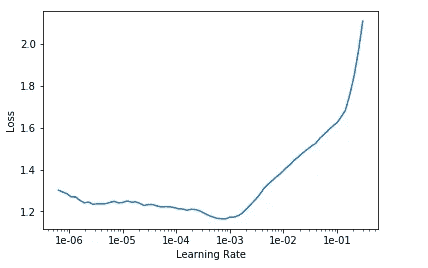

# 使用 fastai 的人脸识别—第 2 部分

> 原文：<https://medium.com/analytics-vidhya/face-recognition-using-fastai-part-2-44360f6471fb?source=collection_archive---------5----------------------->

今天，我们将了解如何下载任何图像来创建数据集并对其进行分析。我们将研究人类不同的情感。此外，我们将涵盖图像分类结果不佳背后的关键理论方面。我建议用户阅读本系列的第一部分来了解下面使用的方法。

# 收集每类图像的 URL

打开谷歌图片，运行下面的脚本，为不同类型的图片分类。取适量的图像。我将在谷歌上拍摄各种不同的人类表情，比如恐惧、悲伤、快乐、惊讶、厌恶和愤怒。剧本如下—

```
urls = Array.from(document.querySelectorAll('.rg_di .rg_meta')).map(el=>JSON.parse(el.textContent).ou);window.open('data:text/csv;charset=utf-8,' + escape(urls.join('\n')));
```

将下载的文件夹重命名为图像类型。

像下面一样导入 fastai 库。Fastai.vision 用于分类目的。

```
from fastai.vision import *
```

由于我使用的是 google colab，所以我会将文件上传到 colab 目录下的相应文件夹中。

*   文件夹:anger，文件名:urls_anger.txt
*   文件夹:快乐，文件名:urls_happy.txt

让我们从一种类型的文件夹开始。首先，我们将处理惊喜情绪(你们肯定会从 fastai 的简单性中得到这种情绪)。我们将使用震惊情绪进行预处理。运行下面的代码。

```
folder = 'surprise'
file = 'urls_surprise.csv'
```

现在，由于我们已经初始化了文件夹名和文件名，我们需要在目录中创建文件夹。您可以使用 **pwd** 命令获得您的根目录的路径。

```
path = Path('/data/expressions')
dest = path/folder
dest.mkdir(parents=True, exist_ok=True)path.ls()

 = [PosixPath('/content/data/expressions/surprise')]
```

在处理实际路径时，Path 对象比字符串更容易处理。

如果你专门使用 google colab 笔记本，那么创建的文件夹将如下所示。


上传表达式文件夹中的文件

创建文件夹后，包含图像 URL 的文本文件出现在 expressions 文件夹中，现在我们需要使用文本文件下载图像。我们将使用 fastai 提供的方法，*下载 _ 图片。*

❓什么是 [download_images](https://docs.fast.ai/vision.data.html#download_images)
下载文本文件中列出的图片 URL 到 path dest，最多 max_pics

```
download_images(**urls**:StrList, **dest**:PathOrStr, **max_pics**:int=***1000***, **max_workers**:int=***8***, **timeout**=***4***)download_images(path/file, dest, max_pics=200)
```

现在对其他类型的人类表情重复同样的过程。对于每一种情绪，按照下面的步骤循环。

> folder = ' anger '
> file = ' URLs _ anger '

```
dest = path/folder
dest.mkdir(parents=True, exist_ok=True)download_images(path/file, dest, max_pics=200)
```

> folder = ' sad '
> file = ' URLs _ sad '

```
dest = path/folder
dest.mkdir(parents=True, exist_ok=True)download_images(path/file, dest, max_pics=200)
```

> folder = ' happy '
> file = ' URLs _ happy '

```
dest = path/folder
dest.mkdir(parents=True, exist_ok=True)download_images(path/file, dest, max_pics=200)
If you face issue downloading, use max_workers=0 in the download_images()
```

过程如下。

在这之后，我们在各自的文件夹中有许多下载的图像。可以走了，❕

让我们声明一个包含所有表达式的类变量。

```
classes = [ 'fear', 'sad', 'happy', 'surprise', 'disgust', 'anger']
```

# 验证图像

在进一步创建图像数据组之前，请确保下载的所有图像都是图像，而不是损坏的图像文件，该文件不再是图像。用 fastai 也很容易。只需使用*验证 _ 图像。*

❓什么是 [verify_images](https://docs.fast.ai/vision.data.html#verify_images)
它会尝试这个文件夹中的每张图片是否都能打开。如果您提到 delete=true，它将删除损坏的图像。

```
verify_images(**path**:PathOrStr, **delete**:bool=***True***, **max_workers**:int=***4***, **max_size**:int=***None***, **recurse**:bool=***False***, **dest**:PathOrStr=***'.'***, **n_channels**:int=***3***, **interp**=***2***, **ext**:str=***None***, **img_format**:str=***None***, **resume**:bool=***None***, ********kwargs**)for c in classes:
    print(c)
    verify_images(path/c, delete=True, max_size=500)
```

# 创建 ImageDataBunch

目前，我们没有验证数据集。我们有一个文件夹，里面有所有不同类型的图片。在这种情况下，在创建数据束时，我们可以指示数据束为我们创建一个验证数据集，它可能是原始数据的 10%、20%甚至 30%。验证数据集对于了解我们的模型执行情况至关重要。

```
np.random.seed(42)
data = ImageDataBunch.from_folder(path, train=".", valid_pct=0.2,
        ds_tfms=get_transforms(), size=224, num_workers=4).normalize(imagenet_stats)
```

valid_pct —用于创建验证数据集
train= " . "—告知当前文件夹中存在训练数据集；否则，它将寻找火车文件夹。np.random.seeds(42) —它确保我们每次运行命令时都获得相同的验证数据集。

我们现在已经有了一个数据束，这样你就可以看到里面的`data.classes`，你会看到这些是我们创建的文件夹。所以它知道这些类别(我们所说的类别是指所有可能的标签)是恐惧、悲伤、快乐、惊讶、厌恶和愤怒。


现在，我们可以使用 show_batch 方法检查数据集。

```
data.show_batch(rows=5, figsize=(7,8))
```


# 火车模型

```
learn = cnn_learner(data, models.resnet34, metrics=error_rate)learn.fit_one_cycle(4)
```


让我们保存结果。

```
learn.save('stage-1')
```

# 解冻和学习

让我们看看解冻模型并用不同的学习率重新训练模型是否会提高我们的错误率，即是否会降低错误率。

```
learn.unfreeze()
learn.lr_find()
learn.recorder.plot()
```



```
learn.fit_one_cycle(2, max_lr=slice(1e-5,1e-3))
```


这次差错率少了。

坚持上面定义的学习速度。我们一会儿会了解它们。

```
learn.save(‘stage-2’)
```

# 结论

现在，满怀信心地预测你朋友的任何表情。上传根目录中的图像。下面使用的 root_path 变量告诉我图片的路径。

```
img = open_image(root_path/'image.jpeg')
*(image.jpg is any random image.)*img.show(figsize=(2, 1))
learn.predict(img)
```

[open_image](https://docs.fast.ai/vision.image.html#open_image) —将打开图像
[Image.show](https://docs.fast.ai/vision.image.html#Image.show) —将以所需尺寸显示图像
[learn.predict](https://docs.fast.ai/vision.learner.html#Learner.predict) —返回`item`的预测类、标签和概率。


被厌恶的可能性很高

# 解释

```
learn.load('stage-2');
interp = ClassificationInterpretation.from_learner(learn)interp.plot_confusion_matrix()
```


我们的模型在判断情绪时也是如此混乱😆

查看我的 [*上一篇*](/@PJrohan/image-classification-using-fastai-5ff5b374d414) 寻找更多解读方法。

# 可能出错的事情

首要的是要有一个唯一的精确的数据集。如果你的数据集没有噪音，你可能会做得更好。也许谷歌图片搜索并不能一直给你准确的图片。因此，要获得良好的结果，拥有一个差异化的数据集至关重要。除此之外，让我们看看可能影响模型性能的各种其他因素。

该问题可能是由于以下原因造成的:

*   你的学习率太高或太低
*   您的时代数太高或太低

## 学习率(LR)太高

如果你的学习率比默认的 1e-3 要高，那么你很可能会损失很多。


高损耗

所以，你可能需要降低学习速度。

## 学习率(LR)太低

如果你的学习率很浅，那么你的错误率会提高的很慢。否则你的损失会慢慢减少。如果出现这种情况，那么很有可能你需要提高学习率。

您可以记录您的验证和培训损失，如下所示:

```
learn = cnn_learner(data, models.resnet34, metrics=error_rate)
learn.fit_one_cycle(3, max_lr=1e-10)learn.recorder.plot_losses()
```


如果你的学习率很低，还有一件事会发生，那就是你的培训损失会高于你的验证损失。你永远不会想要一个训练损失高于验证损失的模型。这总是意味着你没有足够的拟合，这意味着要么你的学习率太低，要么你的纪元数量太少。所以如果你有一个那样的模型，多训练一些或者用更高的学习率来训练。


## 太少的时代

如果我们只训练一个时期呢？我们的错误率当然比随机好，5%。但是看看这个，训练损失和验证损失的区别，﹣，训练损失比验证损失高得多。因此，太少的时代和较低的学习率看起来非常相似。所以你可以试着运行更多的纪元，如果要花很长时间，你可以尝试更高的学习速率。如果你尝试更高的学习率，损失达到 100，000，000，000，000，然后把它放回到原来的位置，再尝试几个纪元。这就是平衡。99%的时间里你只关心这个。


## 太多的时代

太多的时代会产生所谓的“过度适应”如果你训练的时间太长，我们就会了解它，它会学习识别你特定的情绪图像，而不是一般的情绪。尽管你可能听说过在深度学习中过度拟合具有挑战性，但这不是真的，所以唯一告诉你你过度拟合的是错误率提高了一段时间，然后又开始变得更差。

🚄任何被正确训练的模型的训练损失总是低于验证损失。这并不是过度适应的迹象。

T 仅此而已。现在你有了人类情感分类器。尽情享受吧！！

# 参考资料:

*   Fast.ai